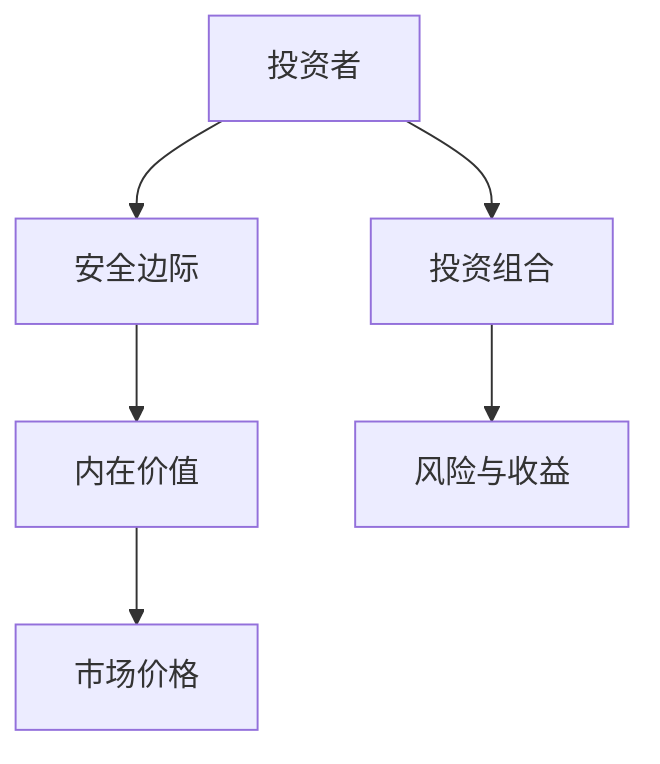
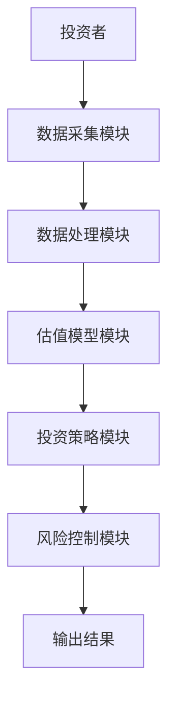

                 


# 《格雷厄姆价值投资理念在数字经济时代的新解读》

## 关键词：格雷厄姆价值投资、数字经济、价值评估、投资策略、数字资产、科技公司、内在价值

## 摘要：在数字经济时代，传统的格雷厄姆价值投资理念面临新的挑战和机遇。本文从背景介绍、核心概念与联系、算法原理、数学模型、系统分析、项目实战、最佳实践等方面，全面解读格雷厄姆价值投资理念在数字经济环境下的新发展，探讨如何将其与现代技术相结合，构建适应数字时代的投资策略和系统架构，为投资者提供新的思路和方法。

---

## 第一章: 数字经济时代的价值投资背景

### 1.1 数字经济的定义与特征
- 数字经济是以数字技术为核心驱动力的经济形态，包括大数据、人工智能、区块链等技术的应用。
- 数字经济的特征：数据驱动、实时性、去中心化、全球化。
- 数字经济对投资的影响：数据量爆炸式增长，投资标的多样化，投资决策更加依赖技术手段。

### 1.2 传统价值投资与数字时代的差异
- 传统价值投资的核心：寻找被市场低估的公司，长期持有。
- 数字经济时代的变化：
  - 投资标的多样化：数字资产、科技公司、平台型经济。
  - 数据的重要性：数据成为核心资产，影响企业价值评估。
  - 技术驱动：人工智能、大数据等技术改变了投资方式和决策过程。

### 1.3 格雷厄姆价值投资理念的核心思想
- 安全边际：买入价格低于内在价值，确保投资的安全性。
- 内在价值：企业未来现金流的现值，是评估企业价值的基础。
- 长期投资：通过长期持有优质资产，获得稳定的收益。

### 1.4 数字经济时代价值投资的新挑战
- 数字资产的波动性大，难以用传统方法评估。
- 科技公司的估值复杂，涉及高增长和不确定性。
- 数字经济中的信息不对称加剧，需要依赖技术手段获取数据支持。

### 1.5 本章小结
本章介绍了数字经济的定义和特征，分析了传统价值投资与数字时代的差异，阐述了格雷厄姆价值投资理念的核心思想，并提出了在数字时代面临的新挑战。

---

## 第二章: 格雷厄姆价值投资理念的核心概念与联系

### 2.1 核心概念的定义与属性
- 安全边际：买入价格与内在价值的差距，提供安全保障。
- 内在价值：企业未来现金流的现值，反映企业的实际价值。
- 投资组合：多种资产的组合，分散风险，优化收益。

### 2.2 核心概念的对比分析
| 对比维度 | 传统价值投资 | 数字经济时代 |
|----------|---------------|--------------|
| 投资标的 | 实体企业为主 | 数字资产、科技公司为主 |
| 数据依赖 | 较低 | 高度依赖大数据分析 |
| 估值方法 | 现金流折现法 | 结合大数据和AI的改进模型 |

### 2.3 核心概念的ER实体关系图


### 2.4 本章小结
本章通过定义和属性分析，探讨了格雷厄姆价值投资理念的核心概念，并通过对比分析和ER图展示了这些概念在数字经济时代的关系和变化。

---

## 第三章: 数字经济时代的价值评估模型

### 3.1 格雷厄姆价值评估模型的数字化重构
- 传统模型：$ V = \frac{E}{1 + r} $，其中$V$为内在价值，$E$为未来现金流，$r$为折现率。
- 数字化重构：引入大数据分析，动态调整折现率和未来现金流预测。

### 3.2 数字资产的价值评估模型
- 数字资产的特性：流动性高、价格波动大、数据驱动。
- 评估模型：结合市场情绪、交易量、链上数据等多因素进行评估。

### 3.3 科技公司的价值评估模型
- 科技公司的估值难点：高研发投入、不确定性大。
- 评估模型：结合DCF模型和市盈率、市销率等指标。

### 3.4 本章小结
本章通过对传统价值评估模型的数字化重构，提出了适用于数字经济时代的评估方法，特别是针对数字资产和科技公司的特殊性，设计了动态的评估模型。

---

## 第四章: 格雷厄姆投资策略的优化与创新

### 4.1 传统投资策略的局限性
- 传统策略依赖于历史数据，难以应对快速变化的市场。
- 传统策略的单一性，缺乏灵活性。

### 4.2 数字经济时代投资策略的优化方向
- 结合技术分析：利用K线图、成交量分析等技术手段辅助决策。
- 引入机器学习：通过算法预测市场趋势和资产价格。

### 4.3 多策略组合的设计
- 组合策略：将价值投资与技术分析相结合，构建多策略投资组合。
- 风险控制：通过动态调整持仓比例，降低整体风险。

### 4.4 本章小结
本章提出了在数字经济时代优化格雷厄姆投资策略的方向，强调了技术分析和机器学习的重要性，并设计了多策略组合以应对市场变化。

---

## 第五章: 系统架构与数字化工具

### 5.1 投资分析系统的构建
- 系统目标：提供实时数据分析、估值模型计算、投资策略模拟等功能。
- 系统功能设计：
  - 数据采集：收集市场数据、公司财报、新闻等。
  - 估值模型：内置多种估值算法，支持动态调整。
  - 投资策略模拟：模拟不同策略下的收益和风险。

### 5.2 系统架构设计


### 5.3 系统接口设计
- 数据接口：与第三方数据源对接，获取实时数据。
- 用户界面：友好的可视化界面，方便用户操作。

### 5.4 本章小结
本章设计了投资分析系统的架构，详细描述了各模块的功能和接口设计，为投资者提供了数字化工具支持。

---

## 第六章: 项目实战

### 6.1 数字资产投资案例
- 项目背景：选择比特币和以太坊作为投资标的。
- 数据分析：分析历史价格、交易量、市场情绪等。
- 投资策略：结合格雷厄姆理念和机器学习模型进行投资决策。

### 6.2 科技公司投资案例
- 项目背景：选择某科技公司作为投资标的。
- 财务分析：分析公司盈利能力、成长性等。
- 估值模型：使用改进的DCF模型进行估值。

### 6.3 代码实现
```python
import pandas as pd
import numpy as np

def calculate_intrinsic_value(FCF, discount_rate):
    return FCF / (1 + discount_rate)

# 示例数据
FCF = 1000000
discount_rate = 0.1

intrinsic_value = calculate_intrinsic_value(FCF, discount_rate)
print(f"内在价值：{intrinsic_value}")
```

### 6.4 案例分析
- 投资结果：通过案例分析验证模型的有效性。
- 经验总结：总结在数字经济时代应用格雷厄姆理念的经验和教训。

### 6.5 本章小结
本章通过实际案例展示了格雷厄姆价值投资理念在数字经济时代的应用，并提供了代码实现和案例分析，为读者提供了实践指导。

---

## 第七章: 未来展望

### 7.1 数字经济的发展趋势
- 人工智能、区块链等技术的进一步发展。
- 数字资产的主流化和规范化。

### 7.2 格雷厄姆理念的未来演变
- 随着技术进步，格雷厄姆理念将更加依赖数据和算法。
- 投资策略将更加个性化和智能化。

### 7.3 数字经济时代的价值投资机会
- 新兴行业的投资机会：人工智能、区块链、元宇宙等。
- 数字化转型中的投资机会：传统企业数字化转型带来的投资机会。

### 7.4 本章小结
本章展望了数字经济的发展趋势，探讨了格雷厄姆理念的未来演变，并分析了未来的价值投资机会。

---

## 第八章: 总结与展望

### 8.1 全书总结
- 格雷厄姆价值投资理念在数字经济时代依然具有重要价值。
- 数字化工具和新技术的应用，使其更具适应性和效率。

### 8.2 未来展望
- 继续探索格雷厄姆理念与新技术的结合。
- 关注新兴行业和数字资产的投资机会。

### 8.3 本章小结
本章总结了全书内容，并提出了未来的研究方向。

---

## 作者：AI天才研究院/AI Genius Institute & 禅与计算机程序设计艺术 /Zen And The Art of Computer Programming

---

希望这篇文章能满足您的需求！如果需要进一步修改或补充，请随时告诉我。

