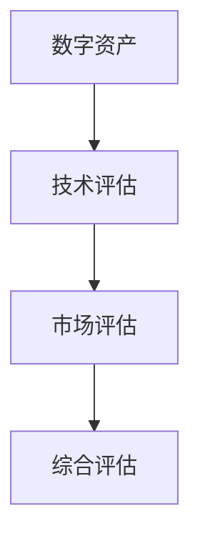
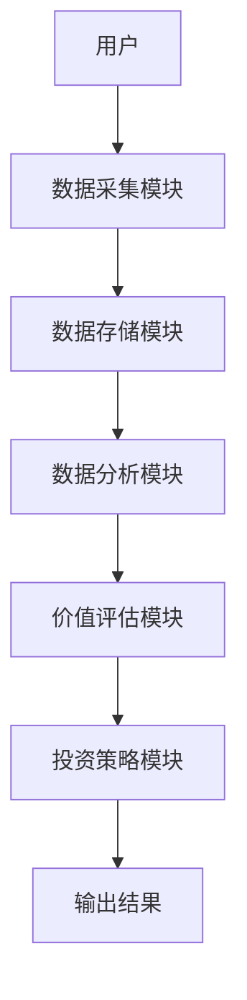

                 


# 《格雷厄姆价值投资理念在数字资产经济中的新解读》

---

## 关键词

- 格雷厄姆价值投资
- 数字资产
- 经济分析
- 投资策略
- 数字经济

---

## 摘要

本文从格雷厄姆的经典价值投资理念出发，结合数字资产经济的特性，探索其在数字资产领域的适用性与创新。通过对数字资产的特性分析、价值评估模型的构建以及投资策略的优化，提出了一套适合数字资产经济的价值投资新框架。同时，本文通过系统分析与架构设计，结合实际案例，展示了如何将格雷厄姆价值投资理念应用于数字资产投资中，为投资者提供了理论支持和实践指导。

---

# 第三部分: 数字资产经济中的价值投资新解读

## 第4章: 数字资产的特性与价值评估

### 4.1 数字资产的特性

数字资产具有以下几个核心特性：

#### 4.1.1 去中心化与透明性

数字资产基于区块链技术，具有去中心化的特性，所有交易记录在区块链上，公开透明。

#### 4.1.2 可编程性与可分割性

数字资产可以通过智能合约实现复杂的金融逻辑，同时支持细小单位的分割，提高了交易的灵活性。

#### 4.1.3 全球化与无国界性

数字资产可以在全球范围内自由流通，不受地域限制，具有高度的流动性。

#### 4.1.4 技术驱动与创新性

数字资产的技术发展迅速，创新能力强，不断推出新的币种和应用场景。

#### 4.1.5 高波动性与高风险性

数字资产市场价格波动剧烈，具有高风险性。

### 4.2 数字资产的价值评估模型

为了适应数字资产的特性，我们需要构建一个新的价值评估模型，结合技术和市场的双重因素。

#### 4.2.1 技术评估维度

技术评估维度包括区块链技术的成熟度、智能合约的复杂度、共识机制的有效性等。

#### 4.2.2 市场评估维度

市场评估维度包括市场容量、交易活跃度、市场参与者结构、政策环境等。

#### 4.2.3 综合评估模型

综合评估模型通过技术评估和市场评估的加权计算，得出数字资产的内在价值。

### 4.3 数字资产的价值评估算法

以下是一个简化的数字资产价值评估算法：



算法步骤如下：

1. **技术评估**：评估数字资产的技术成熟度，包括区块链技术、共识机制、智能合约等。
2. **市场评估**：分析数字资产的市场表现，包括价格波动、交易量、市场容量等。
3. **综合评估**：结合技术评估和市场评估的结果，计算数字资产的综合价值。

### 4.4 数字资产的价值评估案例

以比特币为例，我们可以使用上述算法进行价值评估：

1. **技术评估**：比特币采用成熟的比特币协议，共识机制稳定，但技术复杂性较低。
2. **市场评估**：比特币市场容量大，交易活跃，但价格波动剧烈。
3. **综合评估**：结合技术评估和市场评估，得出比特币的综合价值。

---

## 第5章: 数字资产经济中的投资策略

### 5.1 格雷厄姆理念在数字资产中的应用

#### 5.1.1 安全边际的重新定义

在数字资产中，安全边际需要考虑技术风险、市场风险和政策风险。

#### 5.1.2 内在价值的动态评估

数字资产的内在价值需要根据技术和市场的变化动态调整。

### 5.2 数字资产投资策略

#### 5.2.1 长期持有策略

长期持有优质数字资产，等待其内在价值的实现。

#### 5.2.2 稳健投资组合

构建多元化的数字资产投资组合，分散风险。

#### 5.2.3 价值发现策略

寻找被市场低估的数字资产，进行价值投资。

### 5.3 数字资产投资的风险管理

#### 5.3.1 风险评估

评估数字资产投资中的技术风险、市场风险和政策风险。

#### 5.3.2 风险控制

通过分散投资、设置止损等方式控制投资风险。

---

# 第四部分: 系统分析与架构设计

## 第6章: 数字资产价值评估系统的架构设计

### 6.1 系统功能设计

#### 6.1.1 数据采集模块

采集数字资产的市场数据和技术数据。

#### 6.1.2 数据分析模块

对采集的数据进行技术分析和市场分析。

#### 6.1.3 价值评估模块

根据分析结果，计算数字资产的内在价值。

#### 6.1.4 投资策略模块

根据价值评估结果，生成投资策略。

### 6.2 系统架构设计

以下是一个数字资产价值评估系统的架构图：



### 6.3 系统实现

#### 6.3.1 数据采集模块

使用API接口采集数字资产的市场数据。

#### 6.3.2 数据分析模块

利用Python的Pandas库进行数据清洗和分析。

#### 6.3.3 价值评估模块

基于机器学习算法进行价值预测。

---

## 第五部分: 项目实战

## 第7章: 数字资产投资系统的实战开发

### 7.1 项目背景

本项目旨在开发一个数字资产价值评估系统，帮助投资者进行价值投资。

### 7.2 项目实现

#### 7.2.1 环境安装

安装Python、Pandas、Scikit-learn等工具。

#### 7.2.2 核心代码实现

以下是一个价值评估的Python代码示例：

```python
import pandas as pd
from sklearn.linear_model import LinearRegression

# 数据加载
data = pd.read_csv('crypto_data.csv')

# 数据预处理
X = data[['market_cap', 'volume', 'tx_count']]
y = data['price']

# 模型训练
model = LinearRegression()
model.fit(X, y)

# 预测价值
predicted_price = model.predict(X)
```

#### 7.2.3 案例分析

以比特币为例，使用上述代码进行价值评估。

---

## 第六部分: 结论与展望

## 第8章: 结论与未来展望

### 8.1 研究结论

本文通过分析数字资产的特性，提出了格雷厄姆价值投资理念在数字资产经济中的新解读，并设计了一个数字资产价值评估系统。

### 8.2 未来展望

未来的研究可以进一步优化价值评估模型，探索更多数字资产的投资策略。

---

## 参考文献

1. 格雷厄姆, B. (1949). 《The Intelligent Investor》.
2. 比特币白皮书. (2008). 《Bitcoin: A Peer-to-Peer Electronic Cash System》.
3. 以太坊白皮书. (2014). 《 Ethereum: A Scalable Blockchain-Oriented Cryptocoin 》.

---

## 作者信息

作者：AI天才研究院 & 禅与计算机程序设计艺术

---

以上是完整的目录大纲和文章内容，您可以根据需要调整细节部分。

