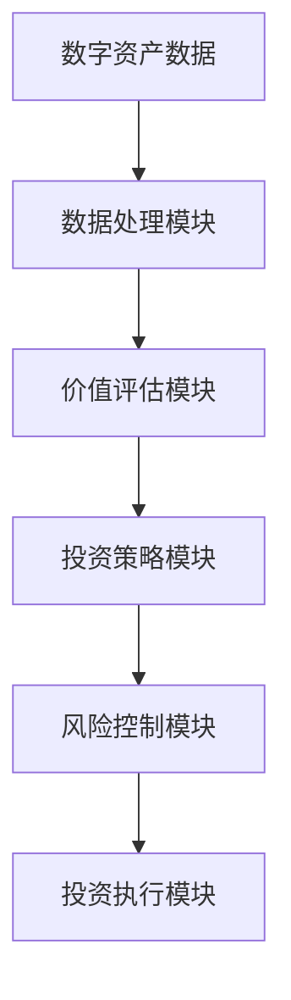

                 


# 格雷厄姆价值投资理念在数字资产经济中的重新定位

> 关键词：格雷厄姆价值投资理念，数字资产经济，价值投资，数字资产，区块链技术

> 摘要：本文探讨了格雷厄姆价值投资理念在数字资产经济中的应用，分析了数字资产经济的背景与发展，详细阐述了格雷厄姆价值投资理念的核心概念及其在数字资产中的重新定位，结合实际案例分析了数字资产投资策略，并提出了在数字资产经济中实践价值投资的最佳策略。

---

## 第一部分: 数字资产经济的背景与发展

### 第1章: 数字资产经济的起源与发展

#### 1.1 数字资产的定义与分类
数字资产是指以区块链技术为基础，通过加密算法和去中心化方式发行的虚拟资产。数字资产主要分为以下几类：
- 加密货币：如比特币（Bitcoin）、以太坊（Ethereum），用于价值转移和支付。
- 数字代币：如ERC-20代币，用于特定项目的资金筹集和价值分配。
- NFT（非同质化代币）：如数字艺术品、虚拟土地等，具有唯一性和不可分割性。

#### 1.2 区块链技术与数字资产的关系
区块链技术是数字资产的核心支撑技术，它通过去中心化、不可篡改和透明性等特点，为数字资产的安全性和价值提供了保障。数字资产的发行、交易和管理都依赖于区块链技术的支持。

#### 1.3 数字资产经济的现状与趋势
数字资产经济近年来发展迅速，市场规模不断扩大。根据CoinMarketCap数据，截至2023年，全球数字资产市值已超过3万亿美元。数字资产的应用场景也在不断扩展，从最初的支付手段扩展到DeFi（去中心化金融）、NFT艺术、智能合约等领域。

#### 1.4 传统金融投资与数字资产投资的差异
- **传统金融投资**：主要依赖于股票、债券、房地产等传统资产，投资行为受监管机构的严格规范，市场相对成熟稳定。
- **数字资产投资**：市场波动性大，去中心化特点使得监管相对宽松，但风险也更高。

### 第2章: 格雷厄姆价值投资理念的背景介绍

#### 2.1 格雷厄姆价值投资理念的核心要素
格雷厄姆的价值投资理念强调以低于内在价值的价格买入优质资产，长期持有，等待市场回归其合理价值。其核心概念包括：
- **安全边际**：买入价格与内在价值的差额，即“安全空间”。
- **内在价值**：资产在未来现金流的现值，需通过深入分析和计算得出。
- **市场先生**：市场波动性是投资机会的来源，投资者需理性应对市场的短期波动。

#### 2.2 格雷厄姆价值投资理念在传统金融中的应用
在传统金融中，格雷厄姆的理念被广泛应用于股票投资，强调对企业的深入分析和对安全边际的追求。例如，巴菲特作为格雷厄姆的学生，将价值投资理念发扬光大，取得了巨大的投资成功。

---

## 第二部分: 格雷厄姆价值投资理念在数字资产经济中的应用

### 第3章: 数字资产经济中的价值投资定位

#### 3.1 数字资产的内在价值评估
数字资产的内在价值需要从技术、市场、团队等多个维度进行综合评估：
- **技术评估**：评估区块链技术的成熟度、安全性、可扩展性。
- **市场评估**：分析项目的市场需求、用户基础和应用场景。
- **团队评估**：考察开发团队的经验、背景和过往项目表现。

#### 3.2 数字资产的安全边际计算
在数字资产投资中，安全边际的计算需要考虑市场波动性、项目风险和市场参与者的行为。例如，当数字资产的价格远低于其内在价值时，就是买入的好时机。

#### 3.3 数字资产市场的波动性与投资策略
数字资产市场的波动性远高于传统金融市场，因此在投资策略上需要更加谨慎。投资者应注重长期价值，避免被短期市场波动所左右。

### 第4章: 格雷厄姆价值投资理念的数学模型

#### 4.1 内在价值的数学公式
内在价值的计算可以简化为未来现金流的现值：
$$
\text{内在价值} = \sum_{t=1}^{n} \frac{CF_t}{(1 + r)^t}
$$
其中，$CF_t$ 是第 $t$ 年的现金流，$r$ 是折现率。

#### 4.2 安全边际的计算
安全边际可以通过以下公式计算：
$$
\text{安全边际} = \text{内在价值} - \text{市场价格}
$$
当安全边际为正时，表明资产价格低于其内在价值，是买入的好时机。

#### 4.3 市场波动性的数学分析
市场波动性可以用标准差来衡量：
$$
\sigma = \sqrt{\frac{1}{N} \sum_{i=1}^{N} (P_i - \bar{P})^2}
$$
其中，$P_i$ 是第 $i$ 天的价格，$\bar{P}$ 是平均价格，$N$ 是天数。

### 第5章: 数字资产投资的系统架构设计

#### 5.1 系统功能设计
- **数据采集**：收集数字资产的价格、交易量、市场情绪等数据。
- **价值评估**：通过算法计算数字资产的内在价值和安全边际。
- **投资策略**：根据评估结果制定买入、卖出或持有策略。
- **风险控制**：设定止损点和止盈点，控制投资风险。

#### 5.2 系统架构设计
以下是系统架构的mermaid图：



#### 5.3 接口设计与交互流程
- **接口设计**：
  - 数据接口：从区块链节点获取实时数据。
  - 用户接口：展示评估结果和投资建议。
- **交互流程**：
  1. 用户输入目标数字资产。
  2. 系统采集相关数据。
  3. 计算内在价值和安全边际。
  4. 根据结果生成投资建议。

---

## 第三部分: 项目实战与最佳实践

### 第6章: 数字资产投资的案例分析

#### 6.1 案例选择
以比特币为例，分析其内在价值和投资策略。

#### 6.2 环境安装
安装必要的工具和库：
- Python 3.8+
- Pandas、NumPy、Scikit-learn
- Blockchain API（如CoinMarketCap）

#### 6.3 核心代码实现
以下是一个计算内在价值的Python示例代码：

```python
import pandas as pd
import numpy as np

def calculate_intrinsic_value(cash_flows, discount_rate):
    pv = 0
    for t in range(len(cash_flows)):
        pv += cash_flows[t] / (1 + discount_rate)**t
    return pv

# 示例数据
cash_flows = [100, 200, 300, 400]
discount_rate = 0.08

iv = calculate_intrinsic_value(cash_flows, discount_rate)
print(f"内在价值为：{iv:.2f}")
```

#### 6.4 案例分析与结果解读
通过上述代码计算比特币的内在价值，结合市场价格和安全边际，得出是否买入的结论。

### 第7章: 最佳实践与总结

#### 7.1 最佳实践
- **长期投资**：避免频繁交易，降低交易成本和市场波动影响。
- **风险控制**：设置止损点，分散投资组合，降低风险。
- **持续学习**：数字资产市场变化快，需持续关注新技术和市场动态。

#### 7.2 总结
格雷厄姆价值投资理念在数字资产经济中仍然具有重要的指导意义。通过结合数字资产的特点，投资者可以在高波动性市场中找到长期价值投资的机会。

---

## 作者信息

作者：AI天才研究院/AI Genius Institute & 禅与计算机程序设计艺术 /Zen And The Art of Computer Programming

---

这篇文章通过详细的分析和实际案例，展示了格雷厄姆价值投资理念在数字资产经济中的应用，为投资者提供了理论支持和实践指导。希望这篇文章能为数字资产投资者提供有价值的参考。

