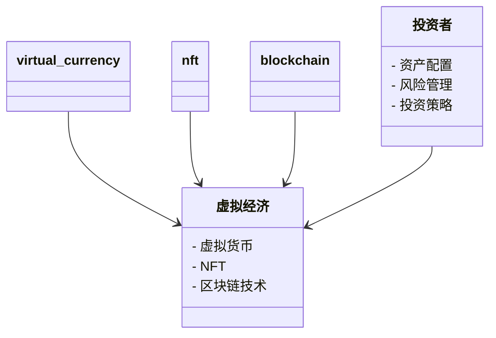

                 


# 格雷厄姆价值投资理念在虚拟经济时代的新解读

> 关键词：价值投资，虚拟经济，格雷厄姆，比特币，NFT，量化投资，区块链

> 摘要：本文从格雷厄姆的价值投资理念出发，结合虚拟经济时代的特点，探讨如何将传统价值投资理论应用于虚拟经济环境中的投资实践。通过分析虚拟经济中的投资机会、风险和挑战，提出新的解读和策略，帮助投资者在虚拟经济时代实现稳健的投资收益。

---

## 第一章: 背景介绍

### 1.1 格雷厄姆价值投资理念的核心概念

格雷厄姆是价值投资的鼻祖，他提出的核心理念是“以低于内在价值的价格购买优质的资产”。这一理念在传统金融市场上被广泛应用，但随着虚拟经济的兴起，其应用方式和策略也需要进行调整。

#### 1.1.1 安全边际的定义与计算

安全边际是格雷厄姆理论中的核心概念之一，它是指资产的实际价值与市场价格之间的差额。通过计算安全边际，投资者可以判断资产是否被低估，从而决定是否进行投资。

公式：$$ \text{安全边际} = \text{内在价值} - \text{市场价格} $$

#### 1.1.2 内在价值的评估

内在价值是资产在长期稳定运作下的实际价值，与市场价格波动无关。格雷厄姆强调，内在价值的计算需要考虑资产的盈利能力、成长性和财务状况等因素。

#### 1.1.3 价值投资的核心原则

1. **长期视角**：投资不是短期交易，而是长期持有的过程。
2. **安全边际**：买入价格低于内在价值。
3. **分散投资**：通过多样化降低风险。

---

### 1.2 虚拟经济时代的投资环境

#### 1.2.1 虚拟经济的特点

虚拟经济是以数字资产和虚拟货币为基础的经济体系，其特点是高波动性、去中心化和全球化。比特币和NFT等虚拟资产的兴起，为投资者提供了新的机会，但也带来了更大的风险。

#### 1.2.2 虚拟经济中的价值投资机会

在虚拟经济中，价值投资的机会主要体现在以下几个方面：
1. **比特币**：作为虚拟货币的代表，比特币的内在价值可以通过其网络效应和去中心化特性进行评估。
2. **NFT**：NFT的艺术价值和收藏价值可以通过其稀缺性和市场需求进行判断。
3. **区块链技术**：区块链技术的广泛应用为虚拟资产的价值评估提供了新的工具和方法。

---

## 第二章: 格雷厄姆价值投资理念的虚拟经济新解读

### 2.1 虚拟经济中的价值投资策略

#### 2.1.1 安全边际的重新定义

在虚拟经济中，安全边际的计算需要考虑虚拟资产的特殊性。例如，比特币的安全边际可以通过其网络价值和交易量进行评估。

#### 2.1.2 内在价值的重新评估

虚拟资产的内在价值评估需要结合技术特性和市场需求。例如，NFT的内在价值可以通过其独特性和市场热度进行判断。

#### 2.1.3 投资组合的优化

在虚拟经济中，投资组合的构建需要考虑虚拟资产的波动性和相关性。例如，通过将比特币和NFT组合在一起，可以降低整体投资的风险。

---

### 2.2 虚拟经济中的风险与挑战

#### 2.2.1 高波动性风险

虚拟资产的价格波动远高于传统资产，这使得价值投资的实施更加困难。

#### 2.2.2 监管不确定性

虚拟经济的监管政策尚不明确，这可能导致虚拟资产的价格波动和投资风险。

#### 2.2.3 技术风险

区块链技术和虚拟资产的安全性存在潜在风险，如黑客攻击和漏洞利用。

---

### 2.3 格雷厄姆理念在虚拟经济中的应用策略

#### 2.3.1 确定虚拟资产的内在价值

通过分析虚拟资产的技术特性和市场需求，确定其内在价值。

#### 2.3.2 计算安全边际

比较市场价格与内在价值，确定是否存在安全边际。

#### 2.3.3 构建投资组合

根据虚拟资产的特性和市场环境，构建多元化投资组合，降低风险。

---

## 第三章: 虚拟经济中的量化投资策略

### 3.1 量化投资的基本概念

量化投资是通过数学模型和算法进行投资决策的一种方式。其核心在于利用大数据和人工智能技术，发现市场中的投资机会。

#### 3.1.1 数据驱动的投资决策

通过分析虚拟资产的历史数据和市场趋势，量化投资者可以发现潜在的投资机会。

#### 3.1.2 算法交易的实现

算法交易是量化投资的重要组成部分，通过编写交易算法，投资者可以在毫秒级别完成交易决策。

---

### 3.2 虚拟经济中的量化分析方法

#### 3.2.1 基于区块链的量化分析

通过分析区块链上的交易数据，量化投资者可以发现虚拟资产的市场趋势和交易规律。

#### 3.2.2 基于机器学习的预测模型

利用机器学习技术，量化投资者可以预测虚拟资产的未来价格走势。

---

## 第四章: 系统分析与架构设计方案

### 4.1 系统功能设计

#### 4.1.1 领域模型

通过领域模型，我们可以清晰地理解虚拟经济中的各个要素及其关系。



#### 4.1.2 系统架构设计

通过系统架构设计，我们可以实现一个高效的虚拟经济投资系统。


---

## 第五章: 项目实战

### 5.1 比特币的估值与投资策略

#### 5.1.1 环境配置

通过Python和相关库，我们可以实现比特币的量化分析。

#### 5.1.2 核心代码实现

以下是一个比特币价格预测的Python代码示例：

```python
import pandas as pd
from sklearn.linear_model import LinearRegression

# 加载数据
data = pd.read_csv('bitcoin_price.csv')

# 训练模型
model = LinearRegression()
model.fit(data[['close']], data['close'])

# 预测价格
predicted_price = model.predict(data[['close']])
print(predicted_price)
```

---

## 第六章: 未来展望

### 6.1 虚拟经济中的投资机会

随着区块链技术和虚拟货币的不断发展，虚拟经济中的投资机会将更加多样化。

### 6.2 格雷厄姆理念的持续演变

格雷厄姆的价值投资理念将随着经济环境的变化而不断演变，以适应新的投资需求。

---

## 作者：AI天才研究院/AI Genius Institute & 禅与计算机程序设计艺术 /Zen And The Art of Computer Programming

---

这篇文章详细解读了格雷厄姆价值投资理念在虚拟经济时代的新应用，从理论到实践，为投资者提供了全新的视角和策略。通过结合虚拟经济的特点，本文为读者提供了一套适合虚拟经济环境的投资方法，帮助投资者在复杂多变的虚拟经济中实现稳健的投资收益。

