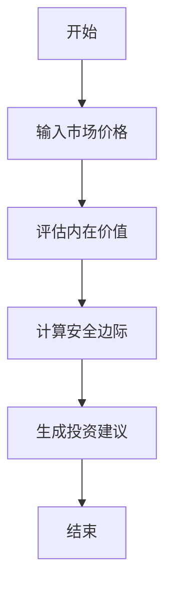
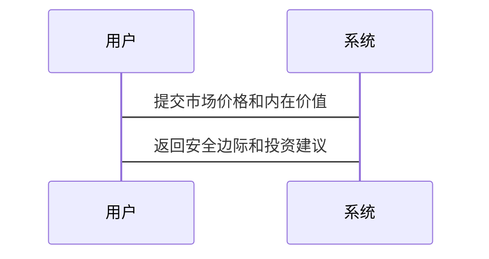

                 


# 格雷厄姆安全边际概念在加密货币市场中的应用

---

## 关键词

- 格雷厄姆安全边际
- 加密货币市场
- 投资策略
- 价值评估
- 风险管理

---

## 摘要

本文探讨了格雷厄姆的安全边际概念在加密货币市场中的应用。通过对传统投资理论的延伸，文章详细分析了如何将安全边际原则应用于加密货币的价值评估和投资决策中。结合数学模型和实际案例，文章展示了如何利用安全边际概念在加密货币市场中制定稳健的投资策略，降低投资风险，并实现长期收益。

---

## 第一部分：安全边际概念的背景与基础

### 第1章：安全边际概念的起源与基础

#### 1.1 格雷厄姆与安全边际概念的提出

- 1.1.1 格雷厄姆的生平与投资理念
  - Benjamin Graham 是价值投资的鼻祖，强调以低于内在价值的价格买入资产。
  - 格雷厄姆的“安全边际”概念是其投资理论的核心，旨在通过低估价格减少风险。

- 1.1.2 安全边际的定义与核心思想
  - 安全边际：资产的市场价格与其内在价值之间的差距，用于衡量投资的安全性。
  - 核心思想：以安全边际为依据，选择低估的资产进行投资，降低市场波动带来的风险。

- 1.1.3 安全边际在传统投资中的应用
  - 传统股票投资中的应用：通过计算市盈率、市净率等指标，寻找低估股票。
  - 安全边际的数学模型：内在价值 = 市场价格 + 安全边际。

#### 1.2 加密货币市场的特点与挑战

- 1.2.1 加密货币市场的波动性
  - 加密货币市场的高波动性使得价格偏离内在价值的情况更为频繁。
  - 市场参与者情绪化，导致价格泡沫和崩盘的风险增加。

- 1.2.2 加密货币市场的独特性
  - 去中心化、区块链技术特性使得加密货币的内在价值评估更具挑战性。
  - 市场参与者包括机构投资者和散户，市场结构复杂。

- 1.2.3 安全边际在加密货币中的重要性
  - 通过安全边际概念，投资者可以识别低估的加密货币，降低市场波动带来的风险。
  - 安全边际帮助投资者在高波动市场中做出更理性决策。

---

## 第二部分：安全边际在加密货币中的应用

### 第2章：内在价值评估与安全边际

#### 2.1 加密货币的内在价值评估

- 2.1.1 内在价值的定义
  - 内在价值：资产在长期稳定状态下的合理估值，基于其基本面因素。
  - 对于加密货币，内在价值可能基于技术特性、网络效用、社区支持等因素。

- 2.1.2 内在价值的评估方法
  - 使用现金流折现法（DCF）评估加密货币项目的未来收益。
  - 考虑技术发展、用户增长、网络效应等变量。

- 2.1.3 内在价值评估的挑战
  - 加密货币市场的不确定性高，技术发展和监管政策变化会影响内在价值。
  - 缺乏历史数据，评估模型需要不断调整。

#### 2.2 安全边际的应用

- 2.2.1 安全边际的计算公式
  $$ \text{安全边际} = \text{内在价值} - \text{市场价格} $$

- 2.2.2 确定安全边际的步骤
  - 选择目标加密货币。
  - 评估其内在价值。
  - 计算市场价格与内在价值的差异，确定安全边际。

- 2.2.3 安全边际的应用策略
  - 选择安全边际为正的加密货币进行投资。
  - 在市场下跌时，增加安全边际，降低风险。

#### 2.3 实际案例分析

- 案例1：比特币的安全边际评估
  - 假设比特币的内在价值为 $50,000，市场价格为 $40,000。
  - 安全边际为 $10,000，适合投资。

- 案例2：以太坊的安全边际评估
  - 内在价值为 $300，市场价格为 $250。
  - 安全边际为 $50，适合投资。

---

## 第三部分：算法与模型实现

### 第3章：基于安全边际的加密货币评估算法

#### 3.1 算法原理

- 算法目标：计算加密货币的安全边际，评估其投资价值。
- 输入：加密货币的市场价格、内在价值评估结果。
- 输出：安全边际值和投资建议。

#### 3.2 算法流程



#### 3.3 算法实现

- 使用Python代码实现安全边际评估算法：

```python
def calculate_margin_of_safety(intrinsic_value, market_price):
    margin = intrinsic_value - market_price
    if margin <= 0:
        return "不建议投资，安全边际为零或负数"
    else:
        return f"建议投资，安全边际为：{margin}"
```

- 示例：计算比特币的安全边际
  - 内在价值：$50,000
  - 市场价格：$40,000
  - 安全边际：$10,000
  - 输出：建议投资，安全边际为：$10,000

---

## 第四部分：系统分析与架构设计

### 第4章：基于安全边际的加密货币评估系统

#### 4.1 系统功能设计

- 用户输入：市场价格、内在价值评估结果。
- 系统处理：计算安全边际，生成投资建议。
- 输出：安全边际值和投资建议。

#### 4.2 系统架构设计


#### 4.3 接口设计

- 输入接口：API 接收市场价格和内在价值。
- 输出接口：API 返回安全边际和投资建议。

#### 4.4 交互设计



---

## 第五部分：项目实战

### 第5章：基于Python的安全边际评估系统实现

#### 5.1 环境安装

- 安装 Python 和必要的库（如 requests、pandas）。
- 安装 Jupyter Notebook 用于开发和测试。

#### 5.2 核心代码实现

```python
import requests

def get_btc_price():
    response = requests.get("https://api.coinmarketcap.com/v2/ticker/1/")
    if response.status_code == 200:
        data = response.json()
        return data['ticker']['price']['usd']
    return None

def calculate_margin_of_safety(intrinsic_value, market_price):
    margin = intrinsic_value - market_price
    if margin <= 0:
        return "不建议投资，安全边际为零或负数"
    else:
        return f"建议投资，安全边际为：{margin}"

# 示例
btc_price = get_btc_price()
if btc_price is not None:
    intrinsic_value = 50000  # 假设的内在价值
    print(calculate_margin_of_safety(intrinsic_value, btc_price))
```

#### 5.3 实际案例分析

- 案例：评估比特币的安全边际
  - 内在价值：$50,000
  - 市场价格：$40,000
  - 安全边际：$10,000
  - 投资建议：建议投资。

---

## 第六部分：总结与展望

### 第6章：总结与展望

#### 6.1 总结

- 本文详细探讨了格雷厄姆的安全边际概念在加密货币市场中的应用。
- 通过内在价值评估和安全边际计算，投资者可以制定更稳健的投资策略，降低风险。

#### 6.2 展望

- 结合人工智能和大数据技术，进一步优化安全边际评估模型。
- 开发更多的工具和平台，帮助投资者更好地应用安全边际概念。

---

## 作者信息

作者：AI天才研究院/AI Genius Institute & 禅与计算机程序设计艺术 /Zen And The Art of Computer Programming

---

**注**：本文旨在通过技术语言和专业分析，探讨格雷厄姆安全边际概念在加密货币市场中的应用，结合数学模型和实际案例，帮助投资者制定更稳健的投资策略。

