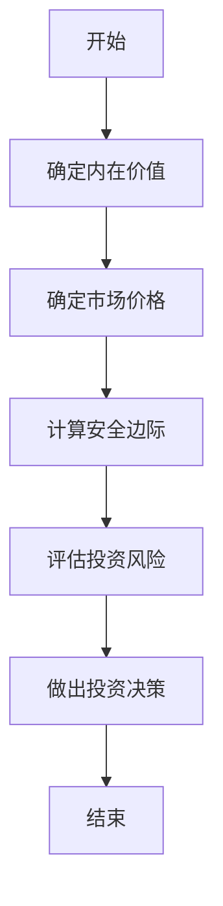
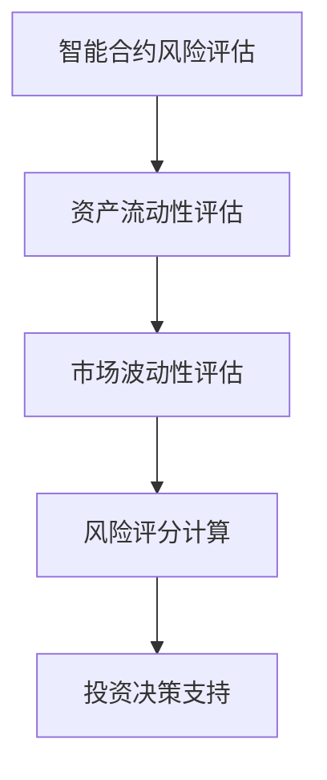
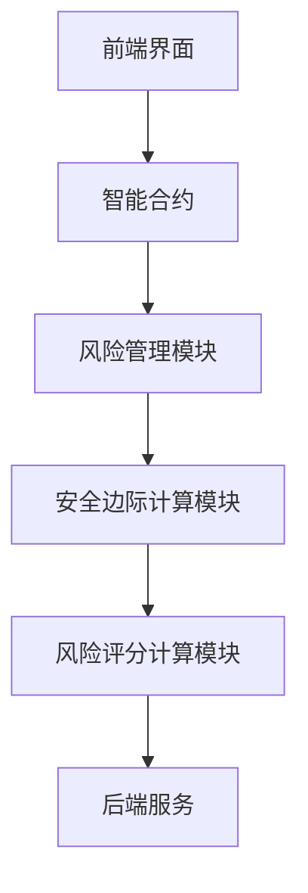

                 


# 格雷厄姆安全边际概念在去中心化金融(DeFi)中的应用

> 关键词：安全边际，DeFi，投资，风险管理，去中心化金融

> 摘要：本文探讨了格雷厄姆安全边际概念在去中心化金融(DeFi)中的应用，分析了DeFi的风险评估模型，结合安全边际的数学模型，提出了在DeFi中应用安全边际的概念，并通过具体案例展示了其实际应用。文章从背景介绍、核心概念与联系、算法原理与数学模型、系统分析与架构设计方案、项目实战等多方面进行了详细阐述，最后总结了安全边际在DeFi中的重要性及未来研究方向。

---

## 第一部分: 格雷厄姆安全边际概念与去中心化金融(DeFi)概述

### 第1章: 格雷厄姆安全边际概念的背景与基础

#### 1.1 安全边际的定义与核心理念

安全边际是投资学中的一个重要概念，由本杰明·格雷厄姆在其投资理论中提出。其核心理念是通过在资产价格与内在价值之间建立一个“安全空间”来降低投资风险。以下是安全边际的定义与核心理念的详细阐述：

- **1.1.1 安全边际的定义**  
  安全边际是指资产的市场价格低于其内在价值的部分。它衡量的是资产价格与内在价值之间的差距，这种差距越大，投资的安全性越高。

- **1.1.2 安全边际的核心理念与原则**  
  格雷厄姆的安全边际原则强调在投资时留有足够的安全空间，以应对市场的不确定性。他认为，投资者应该购买那些市场价格远低于内在价值的资产，以降低本金损失的风险。

- **1.1.3 安全边际在投资中的重要性**  
  安全边际是投资者在决策过程中考虑的重要因素，它帮助投资者识别低估资产，避免过度冒险，并在市场波动中保持稳定性。

---

#### 1.2 去中心化金融(DeFi)的定义与特点

DeFi（Decentralized Finance）是基于区块链技术的去中心化金融体系，与传统金融体系相比，具有以下几个显著特点：

- **1.2.1 DeFi的定义与基本特征**  
  DeFi是指一套基于区块链技术的金融工具和协议，旨在通过去中心化的方式实现传统金融系统的功能，如借贷、交易、支付等。

- **1.2.2 DeFi与传统金融的区别**  
  DeFi的核心特点在于去中心化，所有交易和协议通过智能合约自动执行，无需依赖传统的金融机构。这种去中心化的特性使得DeFi具有透明性、可追溯性和抗审查性。

- **1.2.3 DeFi的主要应用场景**  
  DeFi目前主要应用于以下几个领域：
  - **去中心化交易所（DEX）**：基于智能合约的去中心化交易平台。
  - **去中心化借贷平台**：通过智能合约实现无需信用评估的借贷服务。
  - **去中心化保险**：通过智能合约提供去中心化的保险服务。

---

#### 1.3 格雷厄姆安全边际与DeFi的结合

随着DeFi的快速发展，其潜在风险也在逐步显现。通过引入格雷厄姆的安全边际概念，可以帮助投资者和项目方更好地评估和管理风险，确保投资的稳健性。

- **1.3.1 DeFi中的风险与不确定性**  
  DeFi系统中存在多种风险，包括智能合约漏洞、流动性风险、市场波动性风险等。这些风险可能导致投资者的本金损失，甚至影响整个生态的稳定性。

- **1.3.2 安全边际在DeFi中的潜在应用**  
  安全边际的概念可以应用于DeFi的多个方面，如智能合约的设计、资产定价、风险管理等。通过引入安全边际，可以在一定程度上降低DeFi系统中的风险。

- **1.3.3 本书的核心研究问题**  
  本书的核心问题是：如何将格雷厄姆的安全边际概念引入DeFi，构建一个基于安全边际的DeFi风险评估和管理系统，从而提高DeFi系统的稳定性和安全性。

---

### 第2章: 格雷厄姆安全边际在DeFi中的核心概念与联系

#### 2.1 格雷厄姆安全边际的数学模型与公式

为了更好地理解安全边际在DeFi中的应用，我们需要首先建立其数学模型。以下是格雷厄姆安全边际的数学表达式及其相关公式：

- **2.1.1 安全边际的数学表达式**  
  格雷厄姆的安全边际（Safety Margin）可以通过以下公式计算：

  $$
  \text{安全边际} = \text{内在价值} - \text{市场价格}
  $$

  其中，内在价值是指资产的真正价值，市场价格是资产在市场上的交易价格。

- **2.1.2 安全边际与资产价值的关系**  
  安全边际与资产价值之间的关系可以通过以下图表表示：

  ```mermaid
  graph TD
      A[市场价格] --> B[内在价值]
      B --> C[安全边际]
  ```

- **2.1.3 安全边际的计算方法**  
  格雷厄姆的安全边际计算方法通常包括以下几个步骤：
  1. 确定资产的内在价值。
  2. 确定资产的市场价格。
  3. 计算安全边际：内在价值 - 市场价格。

---

#### 2.2 DeFi中的风险评估模型

在DeFi中，风险评估是确保系统稳定性和安全性的关键环节。以下是DeFi中的主要风险类型及其评估模型：

- **2.2.1 DeFi中的主要风险类型**  
  DeFi系统中的主要风险包括：
  - 智能合约风险：智能合约代码漏洞可能导致资金损失。
  - 涵盖风险：市场价格波动可能导致流动性不足。
  - 市场风险：市场波动可能导致资产价格大幅下跌。

- **2.2.2 风险评估的核心指标**  
  风险评估的核心指标包括：
  - 智能合约的安全性：通过代码审计和漏洞扫描评估智能合约的安全性。
  - 资产流动性：通过交易量、订单深度等指标评估资产的流动性。
  - 市场波动性：通过波动率、相关性等指标评估市场价格的波动性。

- **2.2.3 风险评估的数学模型**  
  DeFi风险评估的数学模型可以表示为：

  $$
  \text{风险评分} = \alpha \cdot \text{智能合约风险} + \beta \cdot \text{流动性风险} + \gamma \cdot \text{市场风险}
  $$

  其中，$\alpha$、$\beta$、$\gamma$是风险权重系数。

---

#### 2.3 格雷厄姆安全边际与DeFi风险评估的对比分析

为了更好地理解格雷厄姆安全边际在DeFi中的应用，我们需要将其与DeFi风险评估进行对比分析。

- **2.3.1 格雷厄姆安全边际的属性特征对比**  
  以下是格雷厄姆安全边际与DeFi风险评估的属性特征对比表：

  | 属性        | 格雷厄姆安全边际       | DeFi风险评估           |
  |-------------|-----------------------|-----------------------|
  | 定义         | 资产内在价值与市场价格的差额 | 系统风险的综合评估指标 |
  | 应用场景      | 传统投资领域           | 去中心化金融领域       |
  | 计算方法      | 内在价值 - 市场价格       | 多因素综合评估         |

- **2.3.2 DeFi风险评估的实体关系图**  
  DeFi风险评估的实体关系图如下：

  ```mermaid
  graph TD
      A[DeFi系统] --> B[智能合约]
      A --> C[资产]
      A --> D[市场]
      B --> E[风险漏洞]
      C --> F[流动性]
      D --> G[波动性]
  ```

- **2.3.3 格雷厄姆安全边际在DeFi中的应用流程图**  
  格雷厄姆安全边际在DeFi中的应用流程图如下：

  ```mermaid
  graph TD
      A[确定内在价值] --> B[确定市场价格]
      B --> C[计算安全边际]
      C --> D[评估投资风险]
      D --> E[做出投资决策]
  ```

---

### 第3章: 格雷厄姆安全边际在DeFi中的算法原理与数学模型

#### 3.1 格雷厄姆安全边际的算法原理

格雷厄姆安全边际的算法原理可以通过以下步骤实现：

1. **确定资产的内在价值**：通过基本面分析或其它方法确定资产的内在价值。
2. **确定资产的市场价格**：通过市场数据获取资产的当前市场价格。
3. **计算安全边际**：通过公式计算安全边际：内在价值 - 市场价格。
4. **评估投资风险**：根据安全边际的大小，评估投资风险。
5. **做出投资决策**：根据安全边际和风险评估结果，做出最终的投资决策。

以下是安全边际的算法流程图：



---

#### 3.2 DeFi中的风险评估模型与数学公式

DeFi中的风险评估模型可以通过以下数学公式实现：

$$
\text{风险评分} = \alpha \cdot \text{智能合约风险} + \beta \cdot \text{流动性风险} + \gamma \cdot \text{市场风险}
$$

其中，$\alpha$、$\beta$、$\gamma$是风险权重系数，具体值可以根据实际需求进行调整。

---

## 第二部分: 系统分析与架构设计方案

### 第4章: 格雷厄姆安全边际在DeFi中的系统分析与架构设计

#### 4.1 问题场景介绍

在DeFi系统中，智能合约的安全性和资产的流动性是两个重要的风险因素。通过引入格雷厄姆安全边际的概念，可以帮助我们更好地评估和管理这些风险。

#### 4.2 项目介绍

本节将介绍一个基于格雷厄姆安全边际的DeFi项目，旨在通过智能合约实现安全边际评估和风险管理。

---

### 第5章: 格雷厄姆安全边际在DeFi中的系统架构设计

#### 5.1 系统功能设计

以下是格雷厄姆安全边际在DeFi中的系统功能设计：

1. **智能合约风险评估**：通过分析智能合约的代码，识别潜在的安全漏洞。
2. **资产流动性评估**：通过交易数据评估资产的流动性。
3. **市场波动性评估**：通过市场价格数据评估市场的波动性。
4. **风险评分计算**：根据智能合约风险、资产流动性风险和市场波动性风险，计算风险评分。
5. **投资决策支持**：根据风险评分和安全边际，提供投资决策支持。

以下是系统功能设计的领域模型：



---

#### 5.2 系统架构设计

以下是格雷厄姆安全边际在DeFi中的系统架构设计：



---

## 第三部分: 项目实战

### 第6章: 格雷厄姆安全边际在DeFi中的项目实战

#### 6.1 环境配置

为了实现格雷厄姆安全边际在DeFi中的应用，我们需要配置以下环境：

1. **智能合约开发环境**：安装Solidity编译器和以太坊节点。
2. **风险管理模块开发环境**：安装Python和相关数据分析库。
3. **测试环境**：搭建一个本地测试网络，如Ganache。

#### 6.2 核心代码实现

以下是风险管理模块的核心代码实现：

```python
def calculate_margin_of_security(intrinsic_value, market_price):
    return intrinsic_value - market_price

def assess_risk(intrinsic_value, market_price):
    margin = calculate_margin_of_security(intrinsic_value, market_price)
    if margin > 0.2 * intrinsic_value:
        return "低风险"
    elif margin > 0.1 * intrinsic_value:
        return "中等风险"
    else:
        return "高风险"

# 示例用法
intrinsic_value = 100
market_price = 80
risk_assessment = assess_risk(intrinsic_value, market_price)
print(risk_assessment)  # 输出：低风险
```

#### 6.3 案例分析

以下是格雷厄姆安全边际在DeFi中的实际应用案例：

假设我们有一个DeFi项目，其内在价值为100美元，市场价格为80美元。根据我们的安全边际计算方法，安全边际为20美元，占内在价值的20%。因此，该项目的风险评分为“低风险”，适合进行投资。

---

## 第四部分: 总结与展望

### 第7章: 总结与展望

#### 7.1 本书总结

通过本书的阐述，我们可以看到，格雷厄姆安全边际的概念在DeFi中的应用具有重要的现实意义。它可以帮助投资者和项目方更好地评估和管理风险，提高DeFi系统的稳定性和安全性。

---

#### 7.2 未来研究方向

未来的研究可以进一步探索以下几个方向：

1. **安全边际的动态调整**：研究如何根据市场变化动态调整安全边际。
2. **DeFi风险评估的优化**：研究如何优化DeFi风险评估模型，提高其准确性和可靠性。
3. **安全边际与AI技术的结合**：研究如何利用人工智能技术进一步提升安全边际在DeFi中的应用效果。

---

## 作者：AI天才研究院/AI Genius Institute & 禅与计算机程序设计艺术 /Zen And The Art of Computer Programming

---

以上是《格雷厄姆安全边际概念在去中心化金融(DeFi)中的应用》的技术博客文章的详细目录结构和内容概要。希望这篇博客能够为读者提供清晰的思路和深入的见解，帮助大家更好地理解和应用格雷厄姆安全边际的概念在DeFi中的实际应用。

