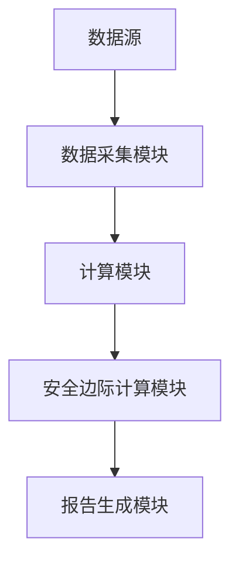
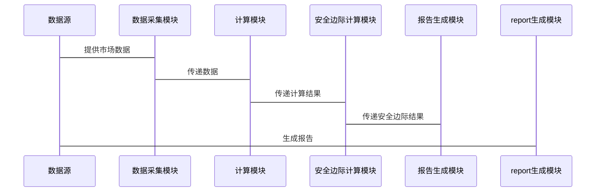
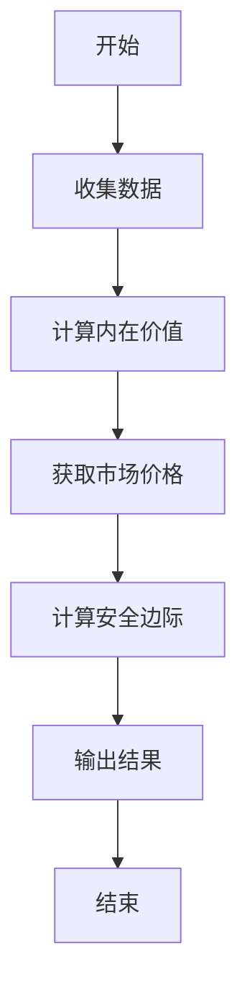

                 


# 格雷厄姆安全边际概念在市场剧烈波动中的应用

> 关键词：安全边际、价值投资、市场波动、内在价值、投资策略

> 摘要：本文详细探讨了格雷厄姆提出的安全边际概念在市场剧烈波动中的应用。通过分析安全边际的定义、数学模型、系统架构以及实际案例，本文为投资者提供了在市场波动中如何利用安全边际进行投资决策的深度见解。

---

# 第一部分: 格雷厄姆安全边际概念的背景与基础

## 第1章: 安全边际的定义与核心要素

### 1.1 格雷厄姆安全边际的定义

#### 1.1.1 安全边际的起源与背景
本杰明·格雷厄姆（Benjamin Graham）是价值投资的鼻祖，他提出了“安全边际”这一核心概念。安全边际是指在投资中，以低于资产内在价值的价格买入，从而在市场波动中降低风险并确保投资的安全性。

#### 1.1.2 安全边际的核心定义
安全边际 = 内在价值 - 市场价格

其中，内在价值是资产在未来现金流的现值，市场价格是当前市场交易价格。

#### 1.1.3 安全边际的边界与外延
安全边际不仅是一个数值，更是一种投资策略。它帮助投资者在市场波动中找到低估资产，避免过度依赖市场情绪做出决策。

### 1.2 安全边际的核心要素

#### 1.2.1 内在价值的计算公式
$$ V = \frac{E}{k} $$
其中，\( V \) 为内在价值，\( E \) 为企业的盈利，\( k \) 为资本成本率。

#### 1.2.2 市场价格波动的影响
市场价格受市场情绪、投资者心理等因素影响，波动性较高。安全边际通过量化内在价值与市场价格的差异，帮助投资者在波动中保持理性。

#### 1.2.3 安全边际的量化标准
安全边际的量化标准通常为内在价值的20%到50%，具体取决于市场环境和资产类型。

---

## 第2章: 格雷厄姆安全边际的数学模型与公式

### 2.1 安全边际的数学模型

#### 2.1.1 内在价值的计算公式
$$ V = \frac{E}{k} $$
其中，\( E \) 为企业的盈利，\( k \) 为资本成本率。

#### 2.1.2 安全边际的计算公式
$$ \text{安全边际} = V - P $$
其中，\( P \) 为市场价格。

#### 2.1.3 安全边际的动态调整公式
$$ \text{调整后安全边际} = V_{\text{调整}} - P_{\text{调整}} $$

### 2.2 安全边际与市场波动的关系

#### 2.2.1 市场波动对安全边际的影响
市场波动会导致市场价格偏离内在价值，从而影响安全边际的大小。当市场价格低于内在价值时，安全边际为正，投资具有安全性。

#### 2.2.2 安全边际的动态调整公式
$$ \text{调整后安全边际} = V_{\text{调整}} - P_{\text{调整}} $$

### 2.3 核心概念对比表格

| 概念 | 定义 | 特性 |
|------|------|------|
| 内在价值 | 企业未来现金流的现值 | 稳定性高，受市场波动影响小 |
| 市场价格 | 当前市场交易价格 | 易受情绪影响，波动性高 |
| 安全边际 | 内在价值与市场价格的差值 | 量化投资风险的重要指标 |

---

## 第3章: 格雷厄姆安全边际的系统架构与应用场景

### 3.1 系统架构设计

#### 3.1.1 系统功能模块
- 数据采集模块：收集市场数据
- 计算模块：计算内在价值和市场价格
- 安全边际计算模块：计算安全边际
- 报告生成模块：生成投资建议报告

#### 3.1.2 系统架构图


#### 3.1.3 系统接口设计
- 数据接口：API接口用于数据采集
- 计算接口：模块间通过函数调用传递数据
- 报告接口：生成报告并输出结果

#### 3.1.4 系统交互流程


---

## 第4章: 格雷厄姆安全边际的算法原理与项目实战

### 4.1 安全边际算法的原理

#### 4.1.1 算法步骤
1. 收集企业盈利数据
2. 计算内在价值
3. 获取市场价格
4. 计算安全边际
5. 输出结果

#### 4.1.2 算法流程图


### 4.2 项目实战

#### 4.2.1 环境安装
- Python 3.8+
- Pandas库
- Matplotlib库

#### 4.2.2 核心实现代码
```python
import pandas as pd
import matplotlib.pyplot as plt

def calculate_intrinsic_value(enterprise_value, cost_of_capital):
    return enterprise_value / cost_of_capital

def calculate_margin_of_safety(intrinsic_value, market_price):
    return intrinsic_value - market_price

# 示例数据
enterprise_value = 1000
cost_of_capital = 0.1
market_price = 800

# 计算内在价值
intrinsic_value = calculate_intrinsic_value(enterprise_value, cost_of_capital)

# 计算安全边际
margin_of_safety = calculate_margin_of_safety(intrinsic_value, market_price)

# 可视化
plt.bar(['市场价格', '内在价值', '安全边际'], [market_price, intrinsic_value, margin_of_safety])
plt.ylabel('数值')
plt.title('安全边际计算结果')
plt.show()
```

---

## 第5章: 最佳实践与总结

### 5.1 投资建议
在市场剧烈波动时，投资者应更加关注安全边际，避免盲目跟风。通过计算安全边际，投资者可以在市场底部找到低估资产，降低投资风险。

### 5.2 注意事项
- 安全边际的计算需要准确的内在价值评估
- 市场波动可能影响市场价格，需动态调整安全边际
- 结合其他投资策略，如分散投资，提高整体收益

### 5.3 未来展望
随着人工智能和大数据技术的发展，安全边际的计算将更加精准，为投资者提供更好的决策支持。

---

# 作者：AI天才研究院 & 禅与计算机程序设计艺术

