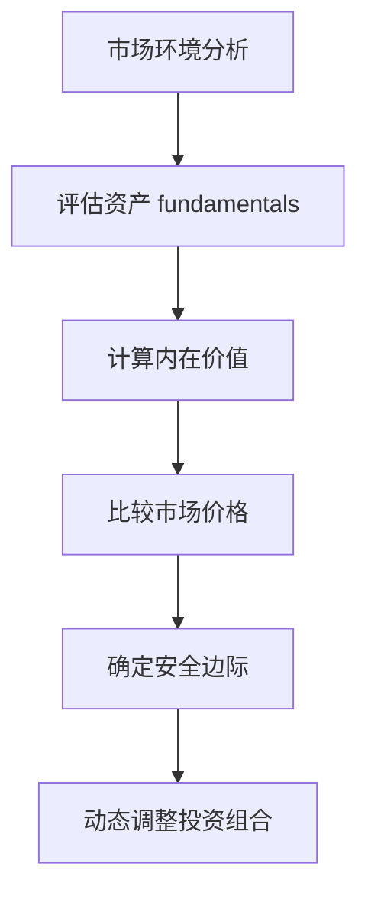

                 

# 格雷厄姆安全边际概念在极端市场事件中的应用

## 关键词：格雷厄姆，安全边际，极端市场，投资策略，风险管理

## 摘要：
本文深入探讨了格雷厄姆的安全边际概念在极端市场事件中的应用。通过分析安全边际的定义、计算方法及其在投资策略中的作用，本文旨在为投资者提供在极端市场条件下做出明智决策的指导。结合实际案例和系统分析，文章详细阐述了如何利用安全边际概念进行风险管理、资产配置和投资组合优化，以应对市场崩盘、金融危机等极端事件。

---

# 第一部分: 格雷厄姆安全边际概念的基本理论

## 第1章: 安全边际的定义与核心概念

### 1.1 格雷厄姆投资理论概述

#### 1.1.1 投资学派与格雷厄姆的贡献
 Benjamin Graham 是价值投资的奠基人，他提出的安全边际概念是投资理论中的核心思想。价值投资强调以低于内在价值的价格购买优质资产，而安全边际则是这一策略的关键工具。Graham 的理论为现代投资学奠定了基础，尤其是在风险管理方面，他的思想对后来的投资者产生了深远影响。

#### 1.1.2 安全边际的核心思想
 安全边际是指资产的市场价格与其内在价值之间的差距。Graham 认为，市场价格通常会波动，而内在价值是基于资产 fundamentals 的合理评估。安全边际越大，投资的风险越小，因为即使市场价格波动，内在价值提供了缓冲。

#### 1.1.3 安全边际与价值投资的联系
 安全边际是价值投资的核心原则。通过购买价格低于内在价值的资产，投资者可以降低市场波动带来的风险，并在长期获得超额收益。

### 1.2 安全边际的数学模型与公式

#### 1.2.1 安全边际的计算公式
 安全边际（Margin of Safety，MOS）可以表示为：
 $$ MOS = 内在价值 - 市场价格 $$
 其中，内在价值是基于资产 fundamentals 的合理评估，市场价格是当前市场上的交易价格。

#### 1.2.2 安全边际与资产价值的关系
 安全边际的大小与资产的风险和潜在回报成反比。较高的安全边际意味着较低的风险和较高的潜在回报，而较低的安全边际意味着较高的风险和较低的潜在回报。

#### 1.2.3 安全边际的动态调整模型
 安全边际并不是一成不变的，它需要根据市场条件和资产 fundamentals 的变化进行动态调整。Graham 提出的动态调整模型如下：

---

## 第2章: 安全边际在极端市场事件中的应用

### 2.1 极端市场事件的特征与挑战

#### 2.1.1 市场崩盘事件
 市场崩盘通常是由于投资者恐慌、市场流动性枯竭或经济基本面急剧恶化导致的。在这种情况下，安全边际的计算需要更加谨慎，因为市场价格可能大幅偏离内在价值。

#### 2.1.2 金融危机事件
 金融危机通常由系统性风险引发，如2008年全球金融危机。在这种情况下，安全边际需要考虑整个金融系统的风险，并采取分散投资策略。

#### 2.1.3 黑天鹅事件
 黑天鹅事件是不可预测的低概率事件，通常会对市场造成重大冲击。安全边际在这种情况下需要考虑尾部风险，并采取对冲策略。

### 2.2 安全边际在风险管理中的作用

#### 2.2.1 风险识别与安全边际的关系
 风险识别是风险管理的第一步。通过识别潜在风险，投资者可以更好地评估安全边际，并制定相应的风险管理策略。

#### 2.2.2 安全边际在投资组合中的应用
 在投资组合中，安全边际可以通过分散投资、资产配置和对冲策略来实现。例如，投资者可以将资金分配到不同资产类别中，以降低单一资产的风险。

#### 2.2.3 极端市场中的止损策略
 在极端市场中，止损策略是保护投资组合的重要工具。通过设定止损点，投资者可以在市场价格下跌到一定程度时及时退出，避免进一步损失。

### 2.3 安全边际在资产配置中的应用

#### 2.3.1 资产配置的基本原理
 资产配置是根据投资目标和风险承受能力，将资金分配到不同资产类别中。安全边际在资产配置中起到关键作用，因为它可以帮助投资者在不同市场条件下优化风险和收益。

#### 2.3.2 安全边际在不同资产类别中的应用
 不同资产类别的安全边际计算方法不同。例如，股票的安全边际基于市盈率和市净率，而债券的安全边际基于收益率和信用评级。

#### 2.3.3 极端市场中的防御性投资策略
 在极端市场中，防御性投资策略强调保护资本而非追求收益。例如，投资者可以增加现金头寸或投资于低风险资产，以降低投资组合的波动性。

---

## 第3章: 安全边际在极端市场中的策略应用

### 3.1 安全边际的动态调整策略

#### 3.1.1 市场波动中的安全边际调整
 在市场波动加剧时，安全边际需要频繁调整。例如，当市场价格大幅下跌时，内在价值可能保持不变，因此安全边际增加，投资者可以考虑增加仓位。

#### 3.1.2 不同市场阶段的安全边际策略
 在不同市场阶段，安全边际的策略也不同。例如，在牛市中，安全边际较低，投资者需要更加谨慎；在熊市中，安全边际较高，投资者可以寻找被低估的资产。

#### 3.1.3 极端市场中的防御性投资策略
 在极端市场中，防御性投资策略强调保护资本。例如，投资者可以增加现金头寸或投资于低风险资产，以降低投资组合的波动性。

### 3.2 安全边际在风险管理中的作用

#### 3.2.1 风险识别与安全边际的关系
 风险识别是风险管理的第一步。通过识别潜在风险，投资者可以更好地评估安全边际，并制定相应的风险管理策略。

#### 3.2.2 安全边际在投资组合中的应用
 在投资组合中，安全边际可以通过分散投资、资产配置和对冲策略来实现。例如，投资者可以将资金分配到不同资产类别中，以降低单一资产的风险。

#### 3.2.3 极端市场中的止损策略
 在极端市场中，止损策略是保护投资组合的重要工具。通过设定止损点，投资者可以在市场价格下跌到一定程度时及时退出，避免进一步损失。

---

## 第4章: 安全边际在资产配置中的应用

### 4.1 资产配置的基本原理

#### 4.1.1 资产配置的定义与分类
 资产配置是根据投资目标和风险承受能力，将资金分配到不同资产类别中。常见的资产类别包括股票、债券、房地产和现金等。

#### 4.1.2 资产配置与投资目标的关系
 资产配置需要根据投资目标进行调整。例如，长期投资目标可能更适合股票和房地产，而短期目标可能更适合债券和现金。

#### 4.1.3 资产配置中的风险与收益平衡
 资产配置需要在风险和收益之间找到平衡点。例如，高风险资产可能提供高收益，而低风险资产可能收益较低。

### 4.2 安全边际在资产配置中的具体应用

#### 4.2.1 不同资产类别中的安全边际计算
 不同资产类别的安全边际计算方法不同。例如，股票的安全边际基于市盈率和市净率，而债券的安全边际基于收益率和信用评级。

#### 4.2.2 跨资产配置中的安全边际策略
 在跨资产配置中，安全边际可以通过分散投资来降低风险。例如，投资者可以将资金分配到股票、债券和房地产中，以降低单一资产的风险。

#### 4.2.3 极端市场中的防御性投资策略
 在极端市场中，防御性投资策略强调保护资本。例如，投资者可以增加现金头寸或投资于低风险资产，以降低投资组合的波动性。

---

## 第5章: 安全边际的局限性与未来趋势

### 5.1 安全边际的局限性

#### 5.1.1 安全边际的计算难度
 安全边际的计算需要准确评估内在价值，而内在价值的评估依赖于资产 fundamentals 和市场环境，这使得安全边际的计算具有一定的主观性。

#### 5.1.2 市场波动的不可预测性
 市场波动通常是不可预测的，尤其是黑天鹅事件，这使得安全边际的动态调整具有挑战性。

#### 5.1.3 投资者心理的偏差
 投资者心理偏差（如过度自信和从众心理）可能会影响安全边际的应用，导致决策失误。

### 5.2 安全边际的未来趋势

#### 5.2.1 技术进步对安全边际的影响
 人工智能和大数据技术的进步可以帮助投资者更准确地评估内在价值和市场风险，从而提高安全边际的应用效果。

#### 5.2.2 安全边际的国际化与全球化
 随着全球经济的全球化，安全边际的应用也需要考虑全球市场和资产配置的多样性。

#### 5.2.3 安全边际的可持续性与社会责任
 未来的投资策略需要考虑可持续性和社会责任，这可能影响安全边际的评估和应用。

---

## 附录: 格雷厄姆安全边际概念的术语表

- **内在价值（Intrinsic Value）**：资产的真实价值，基于其 fundamentals 的合理评估。
- **市场价格（Market Price）**：资产在市场上的交易价格。
- **安全边际（Margin of Safety）**：市场价格与内在价值之间的差距，用于衡量投资风险。
- **价值投资（Value Investing）**：以低于内在价值的价格购买优质资产的投资策略。
- **风险管理（Risk Management）**：通过识别、评估和控制风险来保护投资组合的策略。

---

## 作者：AI天才研究院/AI Genius Institute & 禅与计算机程序设计艺术 /Zen And The Art of Computer Programming

---

这篇文章详细探讨了格雷厄姆安全边际概念在极端市场事件中的应用，从理论到实践，结合实际案例和系统分析，为投资者提供了宝贵的指导和建议。

