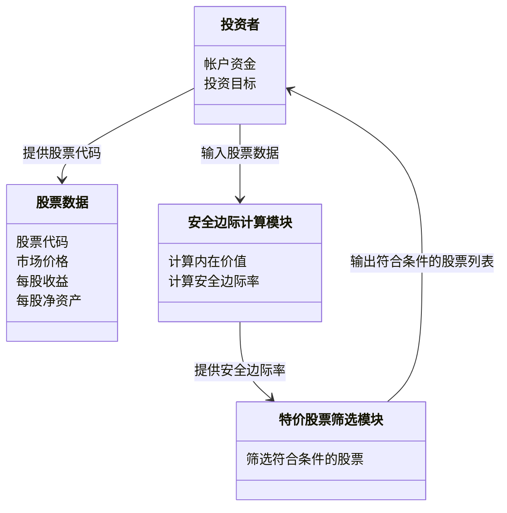
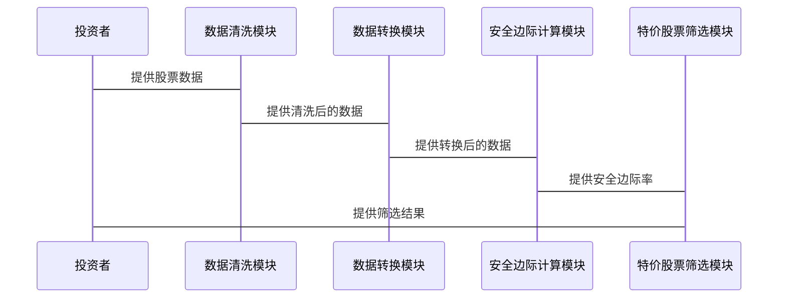

                 


# 格雷厄姆安全边际理念在特价股票中的应用

## 关键词：
安全边际理念、本杰明·格雷厄姆、特价股票、投资策略、价值投资、股票分析、投资风险管理

## 摘要：
本文探讨了本杰明·格雷厄姆的安全边际理念及其在特价股票投资中的应用。通过分析安全边际的计算方法，结合价值投资策略，本文展示了如何识别具有投资价值的特价股票，并通过系统架构设计和项目实战提供具体的实现方案。

---

# 引言

## 第1章：安全边际理念的背景与特价股票概述

### 1.1 安全边际理念的起源

#### 1.1.1 格雷厄姆投资哲学的简介
本杰明·格雷厄姆是价值投资的鼻祖，他提出的安全边际理念强调以低于内在价值的价格购买资产，从而降低投资风险。这种理念的核心在于通过基本面分析识别被市场低估的股票。

#### 1.1.2 安全边际理念的核心思想
安全边际理念认为，投资者应购买那些市场价格远低于其内在价值的股票，从而在市场波动中获得超额收益。这种策略尤其适用于特价股票，即那些价格被市场低估的股票。

#### 1.1.3 安全边际与投资风险的关系
通过计算安全边际，投资者可以评估股票的潜在风险。当安全边际较高时，投资风险较低，潜在回报较高。

### 1.2 特价股票的基本概念

#### 1.2.1 什么是特价股票
特价股票是指市场价格远低于其内在价值的股票。这类股票通常被市场忽视或低估，具有较大的增值潜力。

#### 1.2.2 特价股票的分类与特点
特价股票可以分为成长型、价值型和混合型。它们通常具有低市盈率、低市净率和高股息率的特点。

#### 1.2.3 安全边际理念与特价股票的联系
安全边际理念为识别特价股票提供了理论基础，通过计算安全边际率，投资者可以筛选出具有较高投资价值的特价股票。

---

## 第2章：安全边际的计算与应用

### 2.1 安全边际的计算方法

#### 2.1.1 内在价值的计算公式
内在价值是基于公司基本面分析得出的理论价值。常用的计算公式包括格雷厄姆的估值公式：
$$
\text{内在价值} = \frac{\text{每股收益} \times (8.5 + 2.7 \times \text{增长率})}{\text{折现率}}
$$

#### 2.1.2 安全边际率的计算公式
安全边际率计算公式为：
$$
\text{安全边际率} = \frac{\text{内在价值} - \text{市场价格}}{\text{内在价值}} \times 100\%
$$

#### 2.1.3 安全边际的动态调整
根据市场变化，定期调整内在价值和市场价格，确保安全边际率的准确性。

### 2.2 安全边际与其他投资策略的对比

#### 2.2.1 基本分析法与技术分析法的区别
基本分析法关注内在价值，而技术分析法关注价格走势。安全边际理念属于基本分析法，强调价格与价值的偏离。

#### 2.2.2 安全边际与价值投资的联系
价值投资的核心是购买被低估的股票，安全边际理念为价值投资提供了量化工具。

#### 2.2.3 安全边际与成长投资的差异
成长投资关注未来增长潜力，而安全边际理念更关注当前价格与价值的偏离。

---

## 第3章：特价股票分析方法

### 3.1 特价股票的识别标准

#### 3.1.1 市盈率法
市盈率（P/E）= 市场价格 / 每股收益。通常，市盈率低于行业平均水平的股票可能具有投资价值。

#### 3.1.2 市净率法
市净率（P/B）= 市场价格 / 每股净资产。市净率低于1的股票可能被低估。

#### 3.1.3 股息率法
股息率= 每股股息 / 市场价格。高股息率的股票可能具有吸引力。

### 3.2 计算安全边际的具体步骤

#### 3.2.1 确定股票的内在价值
通过基本面分析确定股票的内在价值，考虑公司的盈利能力、成长性和财务状况。

#### 3.2.2 计算安全边际率
使用上述公式计算安全边际率，评估股票的安全边际。

#### 3.2.3 评估投资风险
根据安全边际率的高低，评估投资风险，选择安全边际率高的股票。

---

## 第4章：安全边际算法实现

### 4.1 数据预处理

#### 4.1.1 数据收集与清洗
收集股票的历史数据，清洗异常值和缺失值。

#### 4.1.2 数据转换与特征提取
将数据转换为易于计算的格式，提取相关特征如市盈率、市净率等。

### 4.2 计算内在价值与安全边际率

#### 4.2.1 使用格雷厄姆公式计算内在价值
$$
\text{内在价值} = \frac{\text{每股收益} \times (8.5 + 2.7 \times \text{增长率})}{\text{折现率}}
$$

#### 4.2.2 计算安全边际率
$$
\text{安全边际率} = \frac{\text{内在价值} - \text{市场价格}}{\text{内在价值}} \times 100\%
$$

### 4.3 筛选特价股票

#### 4.3.1 设定安全边际率阈值
通常选择安全边际率大于20%的股票。

#### 4.3.2 筛选过程
遍历所有股票，计算安全边际率，筛选出符合条件的股票。

---

## 第5章：系统架构设计

### 5.1 问题场景介绍

#### 5.1.1 投资者面临的挑战
投资者需要高效的方法来筛选特价股票，降低投资风险。

### 5.2 系统功能设计

#### 5.2.1 领域模型Mermaid类图


### 5.3 系统架构设计Mermaid架构图


### 5.4 系统接口设计

#### 5.4.1 输入接口
- 股票代码列表
- 市场数据接口

#### 5.4.2 输出接口
- 符合条件的股票列表
- 安全边际率报告

### 5.5 系统交互Mermaid序列图



---

## 第6章：项目实战

### 6.1 环境安装

#### 6.1.1 安装必要的库
安装Python和相关库，如Pandas、NumPy、Matplotlib。

#### 6.1.2 设置数据源
使用Yahoo Finance获取股票数据。

### 6.2 系统核心实现

#### 6.2.1 安全边际计算模块的实现
编写Python代码，实现内在价值和安全边际率的计算。

#### 6.2.2 特价股票筛选模块的实现
编写代码，根据安全边际率筛选特价股票。

### 6.3 代码应用解读与分析

#### 6.3.1 代码片段
```python
import pandas as pd
import numpy as np

def calculate_intrinsic_value(eps, growth_rate, discount_rate):
    return (eps * (8.5 + 2.7 * growth_rate)) / discount_rate

def calculate_margin_of_safety(price, intrinsic_value):
    return ((intrinsic_value - price) / intrinsic_value) * 100

# 示例数据
data = {
    '股票代码': ['AAPL', 'MSFT', 'GOOGL'],
    '市场价格': [150, 300, 120],
    '每股收益': [10, 15, 12],
    '增长率': [0.1, 0.15, 0.12],
    '折现率': [0.1, 0.1, 0.1]
}

df = pd.DataFrame(data)

df['内在价值'] = df.apply(lambda x: calculate_intrinsic_value(x['每股收益'], x['增长率'], x['折现率']), axis=1)
df['安全边际率'] = df.apply(lambda x: calculate_margin_of_safety(x['市场价格'], x['内在价值']), axis=1)

print(df)
```

#### 6.3.2 代码分析
上述代码计算了每只股票的内在价值和安全边际率，筛选出安全边际率高于20%的股票。

### 6.4 实际案例分析

#### 6.4.1 案例选择
选择几只股票，应用上述算法进行分析。

#### 6.4.2 结果展示
展示筛选结果，解释哪些股票符合特价股票的条件。

### 6.5 项目小结

#### 6.5.1 成果总结
通过项目实战，验证了安全边际理念的有效性，展示了如何利用Python代码实现特价股票的筛选。

#### 6.5.2 经验分享
强调数据质量和模型选择的重要性，建议定期更新数据和重新计算安全边际率。

---

## 第7章：最佳实践与小结

### 7.1 小结

#### 7.1.1 核心内容回顾
回顾本文的核心内容，强调安全边际理念的重要性及其在特价股票中的应用。

### 7.2 注意事项

#### 7.2.1 数据质量的重要性
确保数据的准确性和完整性，避免因数据错误导致的决策失误。

#### 7.2.2 模型的适用性
根据市场变化调整模型参数，保持模型的有效性。

#### 7.2.3 投资风险的管理
分散投资，定期评估投资组合，降低整体风险。

### 7.3 拓展阅读

#### 7.3.1 推荐书籍
- 《投资的智慧》
- 《股票作手回忆录》

#### 7.3.2 相关博客
- 价值投资论坛
- 格雷厄姆投资策略博客

---

## 作者信息

作者：AI天才研究院/AI Genius Institute & 禅与计算机程序设计艺术/Zen And The Art of Computer Programming

---

通过本文的详细讲解和项目实战，读者可以深入了解格雷厄姆的安全边际理念，并将其应用于特价股票的投资中，从而做出更明智的投资决策。

