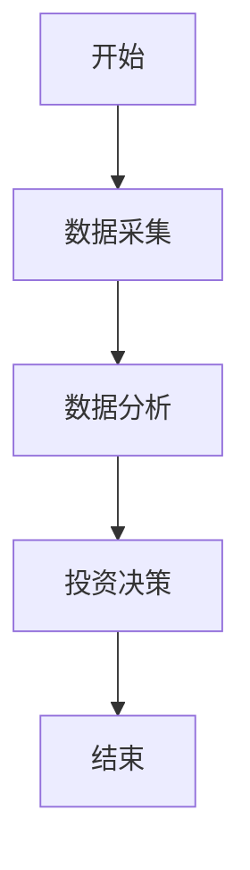
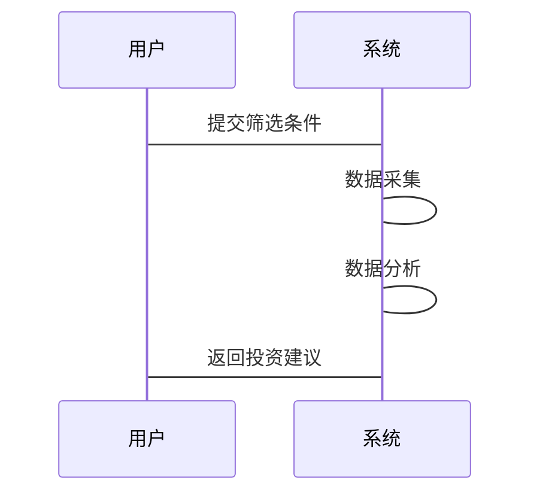

                 

# 格雷厄姆特价股票投资策略解析

> 关键词：格雷厄姆投资理论，特价股票，价值投资，安全边际，股票筛选，投资策略

> 摘要：本文深入解析了格雷厄姆的价值投资理论，重点探讨了特价股票的投资策略。通过数学模型、算法原理和系统架构的分析，详细阐述了如何利用格雷厄姆的理论进行股票筛选、投资决策和风险管理。文章结合实例分析，提供了从理论到实践的完整解决方案。

---

## 第1章: 格雷厄姆投资理念与特价股票概述

### 1.1 格雷厄姆投资理论基础

#### 1.1.1 投资的定义与核心要素
投资是指通过购买资产（如股票、债券等）以期获得未来收益的行为。其核心要素包括：
- **本金**：初始投资的资金。
- **收益**：投资带来的回报，包括股息、利息和资本增值。
- **风险**：投资可能面临的损失或收益波动。
- **时间**：投资的长期性与复利效应。

#### 1.1.2 格雷厄姆的价值投资理念
本杰明·格雷厄姆是价值投资的鼻祖，他强调以低于内在价值的价格购买优质资产。其核心理念包括：
- **安全边际**：买入价格低于内在价值，以降低风险。
- **长期视角**：投资不是投机，而是基于公司基本面的长期持有。
- **逆市场思维**：在市场恐慌时寻找机会，避免追涨杀跌。

#### 1.1.3 格雷厄姆投资方法的现代意义
格雷厄姆的理论为现代投资组合管理、风险管理提供了重要基础，尤其在量化投资领域，其方法被广泛应用于算法交易和因子投资。

### 1.2 特价股票的定义与特点

#### 1.2.1 特价股票的定义
特价股票是指市场价格低于其内在价值的股票，通常具有较高的安全边际。

#### 1.2.2 特价股票的市场特征
- **低估值**：市盈率、市净率等估值指标低于行业平均水平。
- **高股息率**：公司愿意支付较高的股息，表明其盈利能力较强。
- **市场情绪低落**：通常出现在市场低迷或恐慌时期。

#### 1.2.3 特价股票与普通股票的区别
| 特性 | 特价股票 | 普通股票 |
|------|----------|----------|
| 价格 | 低于内在价值 | 接近或高于内在价值 |
| 风险 | 较低 | 较高 |
| 收益 | 高潜力 | 中等潜力 |

### 1.3 格雷厄姆特价股票投资策略的核心思想

#### 1.3.1 安全边际的概念
安全边际是买入价格与内在价值之间的差额，用于缓冲市场波动带来的风险。公式为：
$$ 安全边际 = 内在价值 - 市场价格 $$

#### 1.3.2 价值投资的长期视角
格雷厄姆强调长期投资，避免短期市场波动的干扰。他认为市场先生（市场情绪）是投资者的朋友，而非敌人。

#### 1.3.3 风险管理的重要性
通过分散投资、严格筛选股票等方式，降低投资组合的整体风险。

## 1.4 本章小结
本章介绍了格雷厄姆的价值投资理论及其在特价股票中的应用，强调了安全边际、长期视角和风险管理的重要性。

---

## 第2章: 格雷厄姆投资理论的数学模型与公式

### 2.1 格雷厄姆投资理论的数学基础

#### 2.1.1 投资回报的计算公式
投资回报率（ROI）计算公式为：
$$ ROI = \frac{最终价值 - 初始价值}{初始价值} \times 100\% $$

#### 2.1.2 投资风险的量化模型
风险可以用标准差衡量，公式为：
$$ \sigma = \sqrt{\sum_{i=1}^{n} (x_i - \mu)^2 / n} $$
其中，$x_i$为每期的收益率，$\mu$为平均收益率，$n$为总期数。

#### 2.1.3 价值评估的数学公式
内在价值公式：
$$ V = \sum_{t=1}^{n} \frac{CF_t}{(1 + r)^t} $$
其中，$CF_t$为第$t$期的现金流，$r$为折现率。

### 2.2 格雷厄姆安全边际的计算方法

#### 2.2.1 安全边际的定义公式
如前所述：
$$ 安全边际 = V - P $$
其中，$V$为内在价值，$P$为市场价格。

#### 2.2.2 安全边际与股价波动的关系
安全边际越大，抗跌能力越强，投资风险越小。

#### 2.2.3 安全边际的计算实例
假设某股票内在价值为$50/股，市场价格为$40/股，则安全边际为$10/股。

### 2.3 价值评估的数学模型

#### 2.3.1 股票内在价值的计算公式
使用格雷厄姆的简化模型：
$$ V = \frac{E}{(1 - g)} $$
其中，$E$为公司收益，$g$为预期增长率。

#### 2.3.2 股票市盈率与市净率的比较
市盈率（P/E）和市净率（P/B）分别为：
$$ P/E = \frac{P}{E} $$
$$ P/B = \frac{P}{B} $$
其中，$P$为股价，$E$为每股收益，$B$为每股净资产。

#### 2.3.3 价值低估的数学判定标准
当$P < V$时，股票被低估。

## 2.4 本章小结
本章通过数学公式详细解释了格雷厄姆投资理论的核心内容，包括投资回报、风险量化和价值评估。

---

## 第3章: 特价股票筛选标准与方法

### 3.1 特价股票的基本筛选标准

#### 3.1.1 财务指标分析
关键财务指标包括：
- **ROE**（净资产收益率）：$$ ROE = \frac{净利润}{净资产} $$
- **负债率**：$$ 负债率 = \frac{总负债}{总资产} $$
- **现金流**：$$ 现金流 = 营业收入 - 成本 - 费用 $$

#### 3.1.2 市盈率与市净率的比较
如前所述，通过比较P/E和P/B，选择低估股票。

#### 3.1.3 股息率的计算与分析
股息率公式：
$$ 股息率 = \frac{每股股息}{股价} \times 100\% $$

### 3.2 格雷厄姆特色筛选方法

#### 3.2.1 股票筛选的五步法
1. 确定行业：选择具有竞争优势的行业。
2. 评估财务健康：分析ROE、负债率等指标。
3. 计算内在价值：使用简化模型估算。
4. 比较市场价格：判断是否低于内在价值。
5. 确定安全边际：计算安全边际是否足够。

#### 3.2.2 股票内在价值的估算公式
如前所述。

#### 3.2.3 股票安全边际的计算实例
假设某股票V=60，P=50，则安全边际=10。

### 3.3 实例分析: 格雷厄姆筛选法的实际应用

#### 3.3.1 某行业实例分析
以某制造业公司为例，假设其ROE为15%，P/E为10，P/B为2，每股收益为5元，股价为40元。

#### 3.3.2 数据分析与结果解读
计算内在价值：
$$ V = \frac{5}{(1 - 0.15)} = 5.88 $$

比较P和V，发现P < V，安全边际为：
$$ 安全边际 = 5.88 - 40 = 4.88 $$

#### 3.3.3 筛选结果的总结与优化
该股票具有较高的安全边际，适合投资。

## 3.4 本章小结
本章详细介绍了特价股票的筛选标准和方法，并通过实例分析展示了格雷厄姆筛选法的应用。

---

## 第4章: 格雷厄姆特价股票投资策略的系统分析

### 4.1 投资策略的系统架构

#### 4.1.1 系统功能模块划分
- 数据采集模块：收集股票数据。
- 数据分析模块：计算内在价值、安全边际等指标。
- 投资决策模块：根据筛选结果做出投资决策。

#### 4.1.2 系统功能流程图

#### 4.1.3 系统架构的优缺点分析
优点：模块化设计，易于扩展。缺点：数据依赖性强，需实时更新。

### 4.2 系统功能设计

#### 4.2.1 数据采集模块
负责从金融数据库中获取股票数据，包括股价、收益等。

#### 4.2.2 数据分析模块
计算内在价值、安全边际等指标，判断股票是否符合筛选标准。

#### 4.2.3 投资决策模块
根据分析结果，生成投资建议。

### 4.3 系统接口设计

#### 4.3.1 数据接口
与金融数据库对接，获取实时数据。

#### 4.3.2 用户接口
提供友好的用户界面，展示筛选结果和投资建议。

### 4.4 系统交互序列图

## 4.5 本章小结
本章通过系统架构和功能设计，展示了如何将格雷厄姆策略应用于实际投资中。

---

## 第5章: 格雷厄姆特价股票投资策略的实战案例分析

### 5.1 实战案例背景

#### 5.1.1 投资目标
选择低估股票，构建投资组合。

#### 5.1.2 数据来源
使用历史数据和实时数据结合。

#### 5.1.3 投资组合构建
通过筛选，选择3-5只符合条件的股票，分散投资。

### 5.2 实战案例分析

#### 5.2.1 数据分析与筛选
以某行业为例，筛选出符合条件的股票。

#### 5.2.2 投资组合构建
根据筛选结果，构建投资组合，并计算整体安全边际。

#### 5.2.3 投资效果评估
定期评估组合表现，调整投资策略。

### 5.3 实战案例总结

#### 5.3.1 投资收益分析
计算投资组合的收益率和风险。

#### 5.3.2 投资策略优化
根据市场变化，优化筛选标准。

#### 5.3.3 投资风险控制
通过分散投资和动态调整，降低风险。

## 5.4 本章小结
本章通过实战案例，展示了格雷厄姆策略在实际投资中的应用效果。

---

## 第6章: 格雷厄姆特价股票投资策略的总结与展望

### 6.1 总结

#### 6.1.1 核心观点回顾
- 格雷厄姆的价值投资理论强调安全边际和长期视角。
- 特价股票的筛选需要结合财务指标和估值指标。

#### 6.1.2 投资策略的有效性
通过实例分析，验证了该策略的有效性。

### 6.2 展望

#### 6.2.1 理论发展
结合现代金融理论，进一步优化筛选模型。

#### 6.2.2 实际应用
将格雷厄姆策略应用于量化投资和算法交易。

#### 6.2.3 持续学习与优化
根据市场变化，不断优化投资策略。

## 6.3 本章小结
本章总结了格雷厄姆特价股票投资策略的核心观点，并展望了其未来的发展方向。

---

## 作者：AI天才研究院/AI Genius Institute & 禅与计算机程序设计艺术 /Zen And The Art of Computer Programming

---

这篇文章从格雷厄姆的价值投资理论出发，详细解析了特价股票的投资策略，结合数学模型、系统设计和实战案例，为投资者提供了从理论到实践的完整解决方案。

