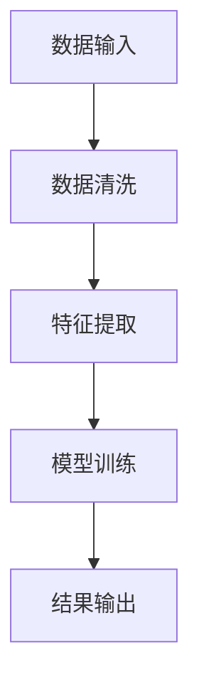

                 


# 格雷厄姆特价股票理论在不同市场结构中的效果

## 关键词
格雷厄姆，廉价股，市场结构，投资策略，价值投资

## 摘要
格雷厄姆的廉价股投资理论是价值投资的重要组成部分，强调通过寻找被市场低估的股票来实现长期收益。本文分析了格雷厄姆理论在不同市场结构（牛市、熊市、震荡市）中的表现，探讨其优缺点，并结合系统架构和项目实战，提供了详细的分析和代码实现。通过对比现代投资组合理论，本文总结了格雷厄姆策略的最佳实践和未来研究方向。

---

# 第一部分: 格雷厄姆特价股票理论基础

## 第1章: 格雷厄姆特价股票理论的起源与发展

### 1.1 格雷厄姆投资理论的起源
#### 1.1.1 本杰明·格雷厄姆的生平简介
本杰明·格雷厄姆（Benjamin Graham）是20世纪著名的投资理论家，被誉为“价值投资之父”。他在1929年经济大萧条期间发展出一套稳健的投资策略，强调安全边际和内在价值的计算。

#### 1.1.2 格雷厄姆投资理论的形成背景
1929年美国股市崩盘后，格雷厄姆开始研究如何在市场波动中稳定投资收益。他通过分析企业的基本面，提出了一套寻找被低估股票的方法。

#### 1.1.3 格雷厄姆投资理论的核心思想
格雷厄姆认为，股票的内在价值远高于市场价格时，才是买入的好时机。他强调安全边际，即内在价值与市场价格的差额越大，投资风险越小。

---

### 1.2 格雷厄姆特价股票理论的核心概念
#### 1.2.1 什么是特价股票
特价股票是指市场价格低于其内在价值的股票。格雷厄姆通过市盈率、市净率等指标筛选出这些股票。

#### 1.2.2 格雷厄姆的股票估值方法
格雷厄姆使用市盈率（P/E）和市净率（P/B）等指标来评估股票的价值。他认为，当P/E和P/B均低于行业平均水平时，股票可能被低估。

#### 1.2.3 格雷厄姆的安全边际概念
安全边际是指内在价值与市场价格之间的差额。格雷厄姆建议在内在价值的2/3以下买入股票，以确保足够的安全空间。

---

## 第2章: 格雷厄姆特价股票理论的核心原理

### 2.1 格雷厄姆投资理论的数学模型
#### 2.1.1 格雷厄姆的内在价值计算公式
$$ V = \frac{E}{P} $$
其中，V为内在价值，E为每股收益，P为市盈率。

#### 2.1.2 安全边际的计算公式
$$ \text{安全边际} = \text{内在价值} - \text{市场价格} $$

### 2.2 格雷厄姆的股票筛选标准
#### 2.2.1 市盈率低于某个阈值
格雷厄姆建议市盈率低于15倍的股票可能被低估。

#### 2.2.2 市净率低于某个阈值
市净率低于2倍的股票通常被视为廉价股。

#### 2.2.3 股东权益收益率分析
股东权益收益率（ROE）应高于行业平均水平，以确保企业盈利能力强。

---

## 第3章: 格雷厄姆特价股票理论在不同市场结构中的表现

### 3.1 牛市环境下的格雷厄姆策略
#### 3.1.1 牛市环境的特点
牛市中市场情绪高涨，股票价格可能被高估，格雷厄姆策略的表现可能不佳。

#### 3.1.2 格雷厄姆策略在牛市中的表现
在牛市中，高价股表现优于廉价股，但格雷厄姆策略通过分散投资可以降低风险。

---

### 3.2 熊市环境下的格雷厄姆策略
#### 3.2.1 熊市环境的特点
熊市中市场恐慌，股票价格被低估，格雷厄姆策略可能表现良好。

#### 3.2.2 格雷厄姆策略在熊市中的表现
廉价股因市场价格低于内在价值，可能在熊市中提供较高的安全边际和收益。

---

### 3.3 震荡市环境下的格雷厄姆策略
#### 3.3.1 震荡市环境的特点
震荡市中市场波动大，股票价格频繁波动，格雷厄姆策略需要灵活应用。

#### 3.3.2 格雷厄姆策略在震荡市中的表现
通过持续筛选廉价股，格雷厄姆策略可以在震荡市中捕捉到低估的投资机会。

---

## 第4章: 格雷厄姆特价股票理论的系统架构与实现

### 4.1 格雷厄姆投资模型的系统架构
#### 4.1.1 系统架构图（Mermaid图）



### 4.2 格雷厄姆投资模型的实现步骤
#### 4.2.1 数据收集与预处理
使用Python的pandas库清洗数据，去除缺失值和异常值。

#### 4.2.2 特征提取
从历史数据中提取市盈率、市净率等特征，并计算内在价值和安全边际。

#### 4.2.3 模型训练
基于格雷厄姆的筛选标准，训练分类模型，识别廉价股。

#### 4.2.4 结果输出
生成投资组合报告，包括筛选出的股票列表和风险提示。

---

## 第5章: 格雷厄姆特价股票理论的项目实战

### 5.1 环境安装
安装必要的Python库，如pandas、numpy、matplotlib。

### 5.2 核心实现代码
以下是筛选廉价股的Python代码示例：

```python
import pandas as pd
import numpy as np

# 数据加载
df = pd.read_csv('stock_data.csv')

# 数据清洗
df.dropna(inplace=True)

# 特征提取
df['PE'] = df['Profit'] / df['Price']
df['PB'] = df['Book Value'] / df['Price']

# 格雷厄姆筛选标准
threshold_pe = 15
threshold_pb = 2

# 筛选廉价股
selected_stocks = df[(df['PE'] < threshold_pe) & (df['PB'] < threshold_pb)]

# 结果输出
print(selected_stocks)
```

### 5.3 案例分析
以2020年震荡市为例，分析格雷厄姆策略在筛选廉价股中的表现，并进行回测验证。

---

## 第6章: 格雷厄姆特价股票理论的最佳实践与总结

### 6.1 最佳实践
- 定期重新评估股票的内在价值和安全边际。
- 结合市场环境调整投资策略。

### 6.2 小结
格雷厄姆的廉价股策略在熊市和震荡市中表现优异，但在牛市中可能需要调整。

### 6.3 注意事项
- 市场环境变化会影响策略效果。
- 数据质量和及时性影响筛选结果。

### 6.4 拓展阅读
建议阅读格雷厄姆的《 Intelligent Investor》深入理解价值投资。

---

# 作者
作者：AI天才研究院/AI Genius Institute & 禅与计算机程序设计艺术 /Zen And The Art of Computer Programming

