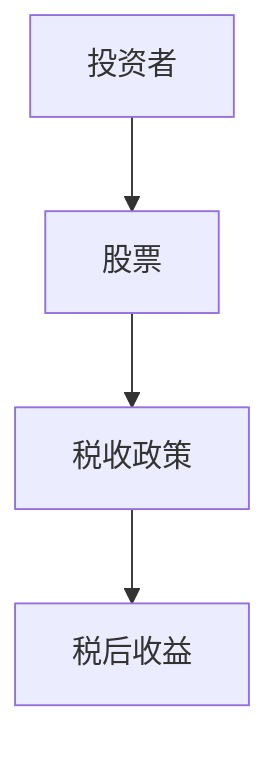
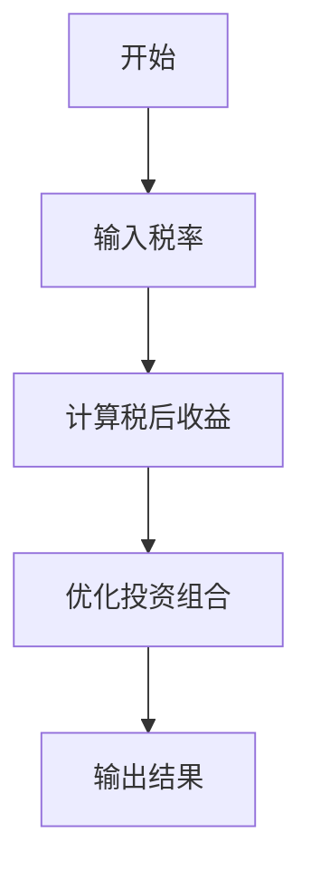
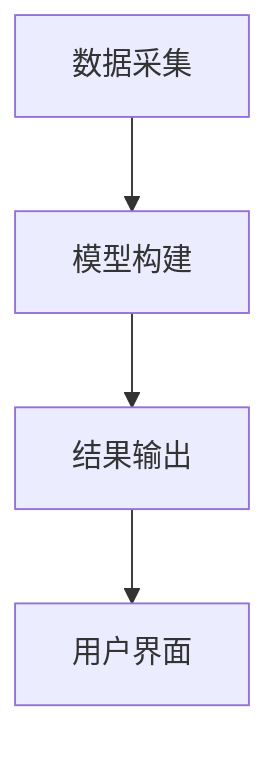

                 


# 格雷厄姆特价股票理论在不同税收环境下的调整

> **关键词**：价值投资、税收环境、股票估值、投资策略、税后收益  
> **摘要**：本文探讨了格雷厄姆特价股票理论在不同税收环境下的调整策略。通过分析税收政策对股票投资的影响，结合数学模型和实际案例，提出了在不同税率环境下的优化投资策略，并提供了具体的算法实现和系统设计。

---

## 第一部分: 格雷厄姆特价股票理论与税收环境的背景

### 第1章: 格雷厄姆特价股票理论概述

#### 1.1 格雷厄姆特价股票理论的核心概念
格雷厄姆特价股票理论是价值投资的基石，强调以低于内在价值的价格购买优质股票。核心在于识别市场低估的股票，并长期持有，等待价值回归。

**问题背景**：传统格雷厄姆策略假设税收不影响投资决策，但在实际中，税收对投资收益有显著影响。不同国家和地区的税率差异要求投资者调整策略以优化税后收益。

**问题解决**：本文旨在探讨如何根据不同的税收政策调整格雷厄姆策略，以最大化税后收益。

**边界与外延**：本文仅考虑资本利得税和股息税，不涉及其他税费。适用于成熟市场，新兴市场需结合其他因素。

**核心要素**：
1. 股票内在价值评估。
2. 市场价格与内在价值的差异。
3. 税收对投资收益的侵蚀效应。

#### 1.2 税收环境对投资的影响
税收通过影响投资成本和收益，改变投资决策。资本利得税和股息税直接侵蚀投资收益，需在策略中考虑。

---

### 第2章: 格雷厄姆理论与税收环境的关联

#### 2.1 格雷厄姆理论在不同税收环境下的适用性
税收政策影响股票估值模型。高税率环境下，投资者需调整选股标准，选择税后收益更高的标的。

#### 2.2 税收对股票投资收益的具体影响
税收通过降低收益，改变投资的性价比。高税率环境下，投资者倾向于选择税后收益更高的投资标的。

---

## 第二部分: 核心概念与联系

### 第3章: 核心概念与联系

#### 3.1 核心概念原理
格雷厄姆理论的数学模型如下：

$$
\text{内在价值} = \frac{\text{股息}}{\text{折现率}}
$$

税收环境下的调整公式：

$$
\text{税后收益} = \text{收益} \times (1 - \text{税率})
$$

#### 3.2 核心概念对比表格

| 税率环境 | 核心变量 | 影响关系 |
|----------|-----------|----------|
| 高税率   | 内在价值  | 降低     |
| 低税率   | 税后收益  | 提高     |

#### 3.3 实体关系图



---

## 第三部分: 算法原理讲解

### 第4章: 算法原理

#### 4.1 优化模型设计
基于格雷厄姆理论的优化模型：

$$
\text{优化目标} = \max \sum (\text{收益} \times (1 - \text{税率}))
$$

#### 4.2 算法实现



#### 4.3 Python代码实现

```python
def calculate_tax_adjusted_returns(tax_rate, returns):
    return returns * (1 - tax_rate)

def optimize_portfolio(tax_rates, returns):
    optimized_returns = []
    for rate in tax_rates:
        tax_adj_returns = calculate_tax_adjusted_returns(rate, returns)
        optimized_returns.append(tax_adj_returns)
    return optimized_returns

# 示例
tax_rates = [0.15, 0.20, 0.25]
returns = [0.1, 0.15, 0.2]
optimized_returns = optimize_portfolio(tax_rates, returns)
print(optimized_returns)
```

---

## 第四部分: 系统分析与架构设计

### 第5章: 系统分析

#### 5.1 领域模型


#### 5.2 系统架构



---

## 第五部分: 项目实战

### 第6章: 项目实战

#### 6.1 环境安装
安装必要的库：

```bash
pip install numpy pandas matplotlib
```

#### 6.2 核心实现

```python
import numpy as np
import pandas as pd

def main():
    # 示例数据
    tax_rates = np.array([0.1, 0.15, 0.2])
    returns = np.array([0.05, 0.1, 0.15])
    
    # 计算税后收益
    tax_adjusted = returns * (1 - tax_rates)
    
    # 输出结果
    print("Tax-Adjusted Returns:\n", tax_adjusted)

if __name__ == "__main__":
    main()
```

#### 6.3 案例分析
以美国和中国为例，分析不同税率下的投资策略。

---

## 第六部分: 总结与展望

### 第7章: 总结与展望

#### 7.1 最佳实践
- 根据税率调整选股标准。
- 定期评估税收政策变化。

#### 7.2 小结
本文详细探讨了格雷厄姆理论在不同税收环境下的调整策略，通过数学模型和算法实现，为投资者提供了优化投资组合的方法。

#### 7.3 注意事项
- 税率变化需及时调整策略。
- 考虑其他影响投资的因素。

#### 7.4 拓展阅读
推荐阅读《证券分析》和《投资学》相关书籍。

---

**作者：AI天才研究院/AI Genius Institute & 禅与计算机程序设计艺术 /Zen And The Art of Computer Programming**

