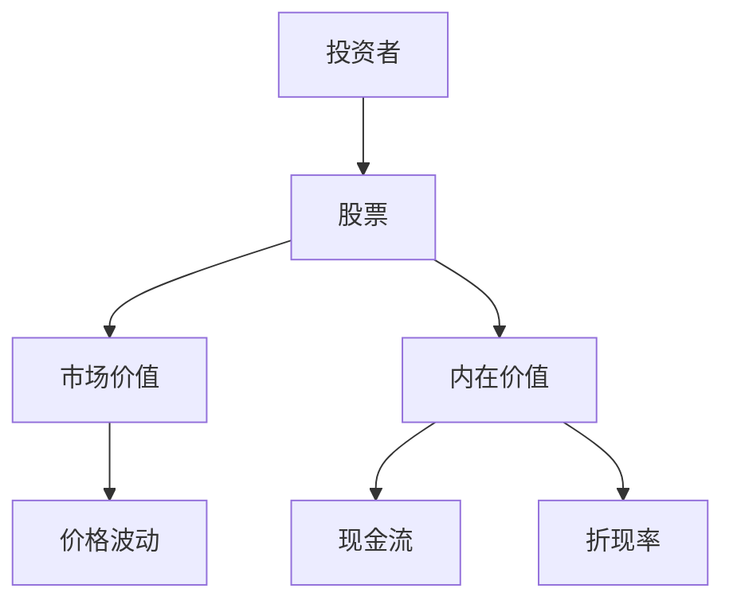
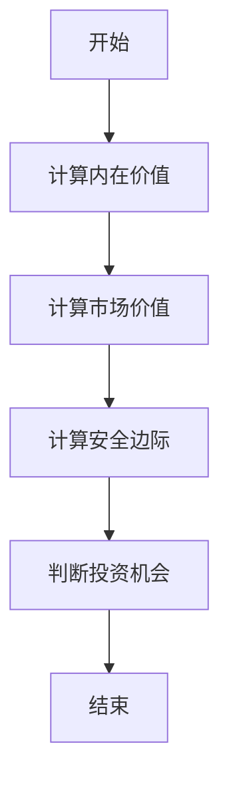
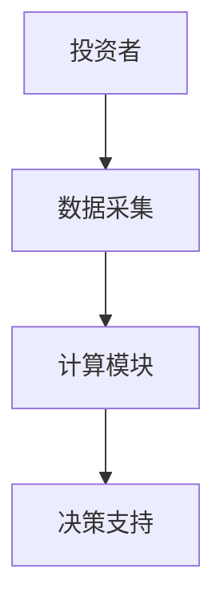

                 


# 格雷厄姆特价股票理论在不同规模经济体中的表现

## 关键词：格雷厄姆特价股票理论，价值投资，内在价值，安全边际，不同规模经济体，股票市场分析

## 摘要：
本文系统地探讨了格雷厄姆特价股票理论在不同规模经济体中的表现。通过分析理论的核心概念，如内在价值和安全边际，结合数学模型和实际案例，深入研究了该理论在发达国家和发展中国家的应用差异。文章还提供了系统架构和代码实现，帮助读者更好地理解和应用这一理论。

---

# 第1章 引言

## 1.1 背景介绍

格雷厄姆特价股票理论是价值投资的重要基石，强调以低于内在价值的价格买入股票。随着全球经济一体化，不同规模的经济体市场差异显著，这为理论的应用带来了挑战和机遇。

## 1.2 核心概念与问题

本文探讨的核心问题：格雷厄姆理论在不同经济体制中的适用性和表现。通过分析内在价值和安全边际，结合数学模型，研究其在不同市场中的表现。

## 1.3 研究意义

研究有助于投资者更好地理解和应用格雷厄姆理论，优化投资策略，尤其在不同经济体制下的应用。

---

# 第2章 格雷厄姆特价股票理论的核心概念

## 2.1 核心概念

### 内在价值

股票的内在价值是其未来现金流的现值，计算公式为：
$$ V = \sum_{t=1}^n \frac{CF_t}{(1+r)^t} $$

### 市场价值

市场价值由供需决定，可能高于或低于内在价值。

### 安全边际

安全边际=内在价值 - 市场价值，确保投资的安全性。

## 2.2 核心概念对比

| 概念         | 内在价值 | 市场价值 | 安全边际 |
|--------------|----------|----------|----------|
| 定义         | 现金流现值 | 市场价格 | 投资缓冲 |
| 计算公式     | $$ V = \sum \frac{CF_t}{(1+r)^t} $$ | 市场价格 | $$ S = V - P $$ |
| 作用         | 确定价值 | 反映市场情绪 | 提供安全垫 |

## 2.3 ER实体关系图



---

# 第3章 算法原理与数学模型

## 3.1 算法流程



## 3.2 数学模型

### 内在价值计算

$$ V = \frac{C}{r - g} $$

### 市盈率与市净率

$$ PE = \frac{P}{E} $$
$$ PB = \frac{P}{B} $$

### 安全边际

$$ S = V - P $$

---

# 第4章 系统架构设计

## 4.1 领域模型


## 4.2 系统架构



---

# 第5章 项目实战

## 5.1 环境安装

安装Python和必要的库（pandas, numpy, matplotlib）。

## 5.2 代码实现

```python
import pandas as pd
import numpy as np

def calculate_intrinsic_value(earnings, growth_rate, discount_rate):
    return earnings / (discount_rate - growth_rate)

def calculate_pe(stock_price, earnings):
    return stock_price / earnings

# 示例数据
earnings = 10
growth_rate = 0.05
discount_rate = 0.10
stock_price = 50

iv = calculate_intrinsic_value(earnings, growth_rate, discount_rate)
pe = calculate_pe(stock_price, earnings)
margin = iv - stock_price

print(f"内 在 价 值: {iv}")
print(f"市盈率: {pe}")
print(f"安全边际: {margin}")
```

## 5.3 实例分析

假设某股票的收益为$10，增长率5%，折现率10%，市场价格$50：

$$ V = 10 / (0.10 - 0.05) = 200 $$
$$ PE = 50 / 10 = 5 $$
$$ S = 200 - 50 = 150 $$

---

# 第6章 总结与展望

## 6.1 总结

格雷厄姆理论在不同经济体制中的表现因市场结构和效率而异，但仍为价值投资提供了重要指导。

## 6.2 展望

未来研究可结合机器学习优化模型，或动态调整安全边际，以适应不同市场环境。

---

# 作者：AI天才研究院 & 禅与计算机程序设计艺术

---

# END

