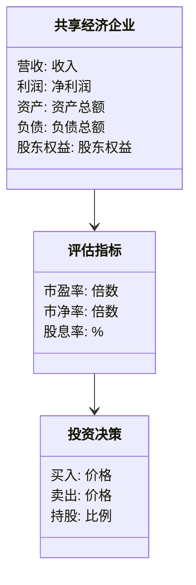
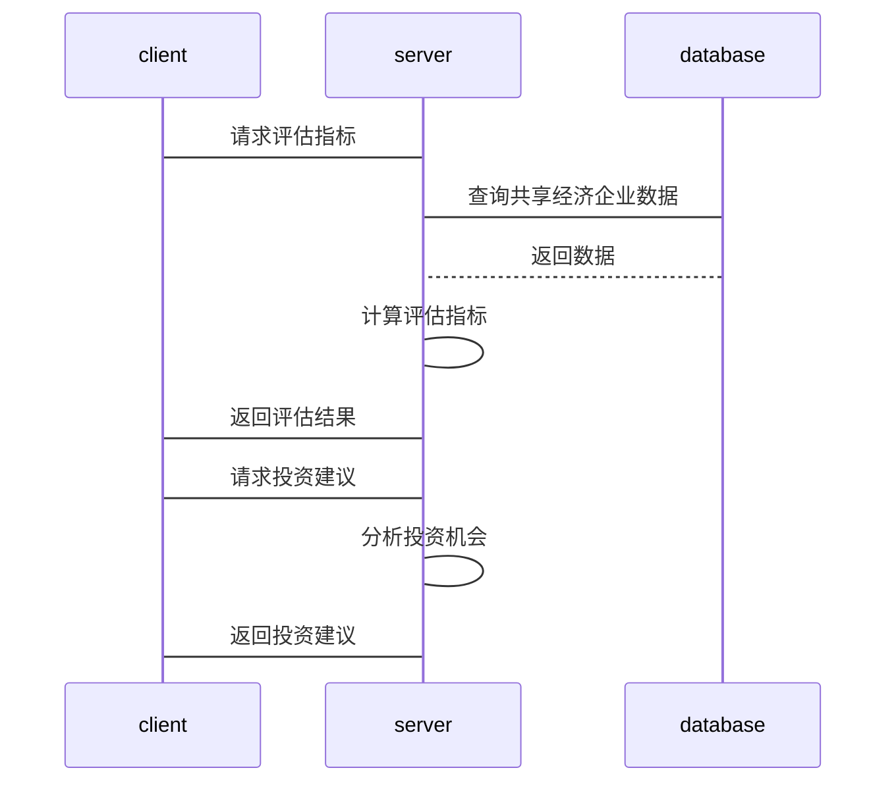

                 


# 《格雷厄姆特价股票理论在共享经济产业中的应用》

---

## 关键词：
- 格雷厄姆特价股票理论
- 共享经济
- 价值投资
- 投资策略
- 财务分析
- 内在价值

---

## 摘要：
本文探讨格雷厄姆特价股票理论在共享经济产业中的应用，通过分析共享经济的商业模式和财务指标，结合价值投资的核心理念，为投资者提供寻找被低估投资机会的方法。文章从理论基础到实际案例，详细阐述如何将格雷厄姆的分析方法应用于共享经济企业，构建系统化的投资框架。

---

## 第1章: 背景介绍

### 1.1 格雷厄姆特价股票理论概述

#### 1.1.1 格雷厄姆特价股票理论的定义
格雷厄姆特价股票理论是价值投资的基石，强调以低于内在价值的价格购买优质股票。其核心在于识别市场低估的股票，长期持有以实现超额收益。

#### 1.1.2 格雷厄姆特价股票理论的核心概念
- **安全边际**：买入价格低于内在价值的差额，确保投资的安全性。
- **内在价值**：企业未来现金流的现值，计算公式为：
  $$
  V = \sum_{t=1}^{n} \frac{CF_t}{(1 + r)^t}
  $$
  其中，$CF_t$ 为第 t 年的现金流，$r$ 为折现率。

- **价值评估方法**：通过市盈率（P/E）、市净率（P/B）和股息率等指标评估股票的吸引力。

#### 1.1.3 格雷厄姆特价股票理论的适用范围
适用于寻找被市场低估的企业，尤其是那些具有稳定现金流和良好管理的公司。

### 1.2 共享经济产业概述

#### 1.2.1 共享经济的定义与特点
共享经济通过技术平台实现资源的共享与优化配置，具有高效、灵活和低成本的特点。

#### 1.2.2 共享经济的主要模式
- 资源分享型：如滴滴出行、Airbnb。
- 服务分享型：如TaskRabbit、滴滴司机。

#### 1.2.3 共享经济的现状与发展
全球共享经济市场规模庞大，但存在竞争激烈、盈利能力不稳定等问题。

### 1.3 格雷厄姆特价股票理论在共享经济中的应用背景

#### 1.3.1 共享经济产业中的投资机会
共享经济企业具有高增长潜力，但市场波动大，存在低估的机会。

#### 1.3.2 格雷厄姆特价股票理论在共享经济中的适用性
适用于分析共享经济企业的财务健康状况和市场定位。

#### 1.3.3 理论与实践的结合意义
通过理论指导，帮助投资者在共享经济中发现价值，实现稳健收益。

---

## 第2章: 格雷厄姆特价股票理论的核心概念

### 2.1 安全边际

#### 2.1.1 安全边际的定义
安全边际是买入价格与内在价值的差额，提供投资的缓冲空间。

#### 2.1.2 安全边际的计算方法
$$
\text{安全边际} = \text{内在价值} - \text{买入价格}
$$

#### 2.1.3 安全边际在投资中的作用
确保投资的安全性，降低市场波动带来的风险。

### 2.2 内在价值

#### 2.2.1 内在价值的定义
内在价值是企业未来现金流的现值，反映其真实的经营价值。

#### 2.2.2 内在价值的计算公式
$$
V = \sum_{t=1}^{n} \frac{CF_t}{(1 + r)^t}
$$

#### 2.2.3 内在价值与市场价格的关系
市场价格围绕内在价值波动，长期回归内在价值。

### 2.3 价值评估方法

#### 2.3.1 格雷厄姆的估值方法
通过低市盈率和低市净率寻找低估股票。

#### 2.3.2 市盈率与市净率分析
$$
\text{市盈率} = \frac{\text{股价}}{\text{每股收益}}
$$
$$
\text{市净率} = \frac{\text{股价}}{\text{每股净资产}}
$$

#### 2.3.3 股息率与投资回报
$$
\text{股息率} = \frac{\text{每股股息}}{\text{股价}} \times 100\%
$$

---

## 第3章: 格雷厄姆特价股票理论在共享经济中的应用框架

### 3.1 共享经济产业中的价值评估

#### 3.1.1 共享经济企业的核心价值
通过资源高效利用和降低交易成本创造价值。

#### 3.1.2 共享经济企业的财务指标分析
- 营业收入增长率
- 净利润率
- 资产负债率

#### 3.1.3 共享经济企业的市场定位
分析企业在市场中的竞争优势和潜在风险。

### 3.2 共享经济中的投资机会分析

#### 3.2.1 共享经济产业的市场潜力
评估市场规模和增长空间。

#### 3.2.2 共享经济企业的竞争优势
比较企业的商业模式、成本结构和技术能力。

#### 3.2.3 共享经济企业的风险因素
包括政策风险、市场竞争和财务风险。

---

## 第4章: 系统分析与架构设计方案

### 4.1 问题场景介绍
共享经济企业的价值评估需要综合考虑财务、市场和技术因素。

### 4.2 系统功能设计

#### 4.2.1 领域模型（mermaid 类图）


### 4.3 系统架构设计（mermaid 架构图）


### 4.4 系统接口设计
- 输入接口：共享经济企业的财务数据和市场数据。
- 输出接口：评估指标和投资决策建议。

### 4.5 系统交互（mermaid 序列图）


---

## 第5章: 项目实战

### 5.1 环境安装
安装Python和必要的库（pandas、numpy、matplotlib）用于数据分析。

### 5.2 核心实现源代码

```python
import pandas as pd
import numpy as np

def calculate_intrinsic_value(enterprise, r):
    # 计算未来现金流的现值
    cf = enterprise['现金流']
    n = len(cf)
    iv = 0
    for t in range(n):
        iv += cf[t] / (1 + r) ** t
    return iv

def calculate_pe_ratio(price, eps):
    # 计算市盈率
    return price / eps

def calculate_pb_ratio(price, bvps):
    # 计算市净率
    return price / bvps

# 示例数据
enterprise_data = {
    '现金流': [100, 150, 200, 250],
    '折现率': 0.08,
    '股价': 50,
    '每股收益': 10,
    '每股净资产': 20
}

# 计算内在价值
iv = calculate_intrinsic_value(enterprise_data['现金流'], enterprise_data['折现率'])
print(f"内在价值: {iv}")

# 计算市盈率和市净率
pe = calculate_pe_ratio(enterprise_data['股价'], enterprise_data['每股收益'])
pb = calculate_pb_ratio(enterprise_data['股价'], enterprise_data['每股净资产'])
print(f"市盈率: {pe}, 市净率: {pb}")
```

### 5.3 代码应用解读与分析
通过Python代码计算共享经济企业的内在价值和估值指标，帮助投资者识别低估机会。

### 5.4 实际案例分析
以滴滴出行为例，分析其市盈率和市净率，评估投资价值。

### 5.5 项目小结
通过系统化的分析框架和工具，投资者能够更有效地识别共享经济中的投资机会。

---

## 第6章: 结论与展望

### 6.1 结论
格雷厄姆特价股票理论为共享经济投资提供了有效的分析工具，帮助投资者发现低估机会。

### 6.2 未来研究方向
进一步研究共享经济企业的动态变化，优化评估模型，结合大数据分析提升准确性。

### 6.3 投资建议
投资者应关注企业的基本面，结合市场环境和财务指标，做出理性决策。

---

## 作者：
AI天才研究院/AI Genius Institute  
禅与计算机程序设计艺术/Zen And The Art of Computer Programming

