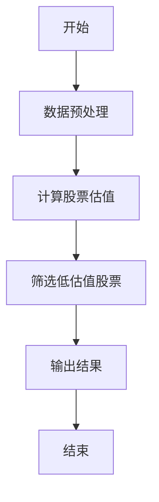
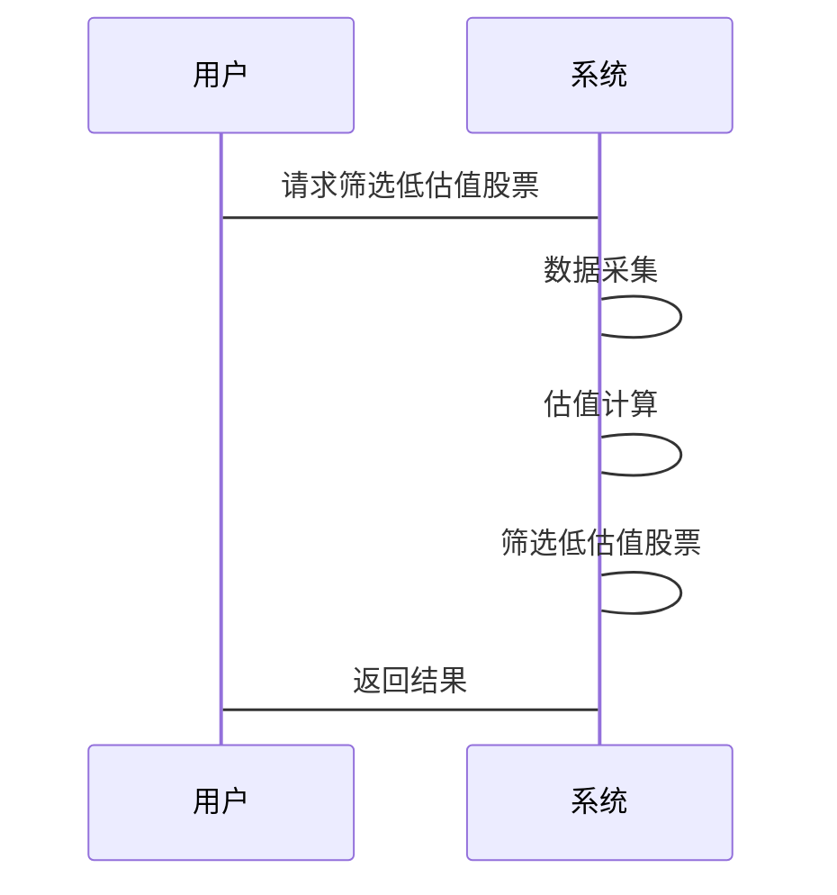

                 


# 《格雷厄姆特价股票理论在再生金融中的应用》

> 关键词：格雷厄姆投资理论, 再生金融, 价值投资, 低估值股票, 数学模型

> 摘要：本文探讨了格雷厄姆的价值投资理论在再生金融领域中的应用，通过分析低估值股票的筛选方法，结合数学模型和算法实现，展示了如何在再生金融中应用这些理论。文章详细介绍了再生金融的定义、特点，以及格雷厄姆理论的核心概念，并通过实际案例和代码实现，展示了再生金融中的价值投资策略。

---

## 第一部分: 格雷厄姆特价股票理论与再生金融概述

### 第1章: 格雷厄姆投资理论的核心思想

#### 1.1 格雷厄姆投资理论的起源与核心思想
格雷厄姆是价值投资的鼻祖，他的理论强调以低于内在价值的价格购买股票。其核心思想是通过分析企业的基本面，寻找被市场低估的股票，从而实现长期稳定的收益。格雷厄姆理论的核心在于“安全边际”，即购买价格与内在价值之间的差距，这种差距越大，投资的安全性越高。

#### 1.2 格雷厄姆价值投资的核心思想
1. **安全边际**：购买价格低于内在价值，确保投资的安全性。
2. **低估值股票**：关注市盈率（P/E）和市净率（P/B）等指标，寻找被市场低估的股票。
3. **长期投资**：价值投资注重长期持有的策略，避免短期市场波动的干扰。

### 第2章: 再生金融的定义与特点

#### 2.1 再生金融的定义
再生金融是一种新兴的金融模式，结合了区块链、人工智能等技术，旨在通过技术创新优化金融市场的运作效率。再生金融的核心在于利用分布式账本技术（DLT）和智能合约，实现透明、高效和去中心化的金融服务。

#### 2.2 再生金融的特点
1. **去中心化**：通过区块链技术实现去中心化的金融服务。
2. **透明性**：所有交易记录在区块链上，具有高度的透明性。
3. **高效性**：利用智能合约自动执行交易，减少中间环节，提高效率。
4. **创新性**：结合人工智能和大数据分析，优化金融产品和服务。

### 第3章: 格雷厄姆特价股票理论在再生金融中的应用背景

#### 3.1 再生金融中的价值投资机会
再生金融市场的快速发展带来了大量的投资机会，尤其是那些具有低估值的股票。通过格雷厄姆理论，投资者可以在再生金融市场中找到那些被低估的企业，进行长期投资。

#### 3.2 格雷厄姆理论在再生金融中的适用性
格雷厄姆理论强调低估值和安全边际，这在再生金融市场中尤为重要。由于再生金融市场的波动性较大，低估值股票的投资机会更为显著。

#### 3.3 再生金融市场的特点与挑战
再生金融市场虽然具有创新性，但也面临监管不完善、市场波动性大等挑战。格雷厄姆理论可以帮助投资者在这样的市场中找到稳定的投资机会。

---

## 第二部分: 格雷厄姆特价股票理论的核心概念与分析

### 第4章: 格雷厄姆特价股票理论的核心概念

#### 4.1 企业内在价值
企业内在价值是企业未来现金流的现值，是衡量股票是否被低估的重要指标。格雷厄姆认为，内在价值是决定股票价格的唯一标准。

#### 4.2 市盈率与市净率
- **市盈率（P/E）**：股票价格与每股收益的比率。P/E低的股票通常被认为是低估的。
- **市净率（P/B）**：股票价格与每股净资产的比率。P/B低的股票通常被认为是低估的。

#### 4.3 低估值股票的定义
低估值股票是指那些市盈率、市净率等指标低于行业平均水平的股票。这些股票通常具有较大的安全边际，是价值投资者的首选。

### 第5章: 再生金融中的价值评估模型

#### 5.1 基于格雷厄姆理论的再生金融价值评估模型
结合再生金融的特点，我们可以构建一个基于格雷厄姆理论的价值评估模型，用于筛选低估值股票。

#### 5.2 模型的优缺点分析
- **优点**：模型简单易懂，适用于再生金融市场的低估值股票筛选。
- **缺点**：模型忽略了市场的波动性和其他复杂因素。

---

## 第三部分: 格雷厄姆特价股票理论的数学模型与算法实现

### 第6章: 格雷厄姆特价股票理论的数学模型

#### 6.1 内在价值的数学公式
$$V = \frac{E}{k}$$
其中，$V$ 是内在价值，$E$ 是企业未来现金流的总和，$k$ 是折现率。

#### 6.2 市盈率与市净率的计算公式
- $$P/E = \frac{P}{E}$$
- $$P/B = \frac{P}{B}$$

### 第7章: 基于再生金融的股票筛选算法

#### 7.1 算法流程图


#### 7.2 算法实现代码
```python
def calculate_intrinsic_value(enterprise_value, earnings):
    return enterprise_value / earnings

def screen_cheap_stocks(stocks, threshold):
    cheap_stocks = []
    for stock in stocks:
        if stock['P/E'] < threshold:
            cheap_stocks.append(stock['股票名称'])
    return cheap_stocks

# 示例数据
stocks = [
    {'股票名称': 'A', 'P/E': 10, 'P/B': 2},
    {'股票名称': 'B', 'P/E': 12, 'P/B': 3},
    {'股票名称': 'C', 'P/E': 8, 'P/B': 1.5}
]

threshold = 10
result = screen_cheap_stocks(stocks, threshold)
print("低估值股票:", result)
```

#### 7.3 数学模型与公式
- 内在价值公式：$$V = \frac{E}{k}$$
- 市盈率公式：$$P/E = \frac{P}{E}$$
- 市净率公式：$$P/B = \frac{P}{B}$$

---

## 第四部分: 再生金融系统的分析与架构设计

### 第8章: 再生金融系统的分析与架构设计

#### 8.1 系统功能设计
- 数据采集：从区块链中获取股票数据。
- 估值计算：使用格雷厄姆理论计算股票的内在价值。
- 筛选低估值股票：基于P/E和P/B指标筛选股票。
- 结果输出：输出低估值股票列表。

#### 8.2 系统架构设计


#### 8.3 系统接口设计
- 数据接口：与区块链节点交互，获取股票数据。
- 估值接口：计算股票的内在价值。
- 筛选接口：筛选低估值股票。

#### 8.4 系统交互流程图


---

## 第五部分: 项目实战与案例分析

### 第9章: 项目实战

#### 9.1 环境搭建
- 安装Python和相关库（如pandas、numpy）。
- 配置区块链节点。

#### 9.2 核心代码实现
```python
import pandas as pd
import numpy as np

def calculate_intrinsic_value(df):
    df['内在价值'] = df['企业价值'] / df['折现率']
    return df

# 示例数据
data = {
    '股票名称': ['A', 'B', 'C'],
    '企业价值': [100, 150, 200],
    '折现率': [0.1, 0.1, 0.1]
}

df = pd.DataFrame(data)
result = calculate_intrinsic_value(df)
print(result)
```

#### 9.3 案例分析
以某再生金融平台为例，分析如何通过格雷厄姆理论筛选低估值股票，并计算其内在价值。

---

## 第六部分: 总结与展望

### 第10章: 总结

#### 10.1 核心内容回顾
- 格雷厄姆价值投资理论的核心思想。
- 再生金融的定义与特点。
- 格雷厄姆理论在再生金融中的应用。

#### 10.2 最佳实践 tips
- 在再生金融中应用格雷厄姆理论时，需结合市场特点和实际情况。
- 注意市场的波动性和监管政策的变化。

#### 10.3 注意事项
- 低估值股票的筛选需结合多因素分析。
- 模型的应用需考虑市场的变化。

#### 10.4 拓展阅读
推荐阅读格雷厄姆的《证券分析》和《聪明的投资者》，以及相关再生金融的研究文献。

---

## 作者：AI天才研究院/AI Genius Institute & 禅与计算机程序设计艺术 /Zen And The Art of Computer Programming

---

这篇文章详细介绍了格雷厄姆价值投资理论在再生金融中的应用，通过理论分析、算法实现和实际案例，展示了如何在再生金融市场中寻找低估值股票。文章内容丰富，结构清晰，适合技术人员和投资者阅读。

