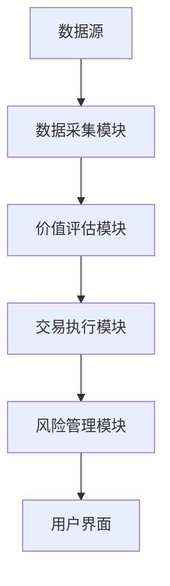

                 


# 格雷厄姆特价股票理论在分数化所有权证券中的运用

## 关键词：格雷厄姆投资理论，分数化所有权，证券分析，价值投资，算法交易

## 摘要：本文深入探讨了格雷厄姆特价股票理论在分数化所有权证券中的应用，结合现代技术手段，分析了如何利用分数化所有权实现低门槛、高效率的投资策略。通过数学建模和系统设计，展示了如何将格雷厄姆的理论转化为实际的投资操作，并通过项目实战验证了其可行性和有效性。

---

## 第一章：格雷厄姆特价股票理论的背景与核心原理

### 1.1 投资理论的背景介绍

#### 1.1.1 价值投资的起源与发展

价值投资是一种长期投资策略，起源于20世纪初，由本杰明·格雷厄姆和戴维德·多德共同提出。格雷厄姆的学生沃伦·巴菲特将这一理论发扬光大，使其成为全球投资领域的主流方法之一。

格雷厄姆的核心思想是寻找市场价格低于其内在价值的股票，即所谓的“特价股票”。他认为，市场短期是投票器，长期是称重机，投资者应关注企业的内在价值而非短期市场波动。

#### 1.1.2 格雷厄姆投资理论的核心理念

格雷厄姆的投资理论强调以下几个关键点：

1. **安全边际**：买入价格低于内在价值的股票，确保即使市场价格波动，投资者也能获得长期收益。
2. **内在价值计算**：通过分析企业的财务报表，估算其真实价值，而非依赖市场情绪。
3. **非效率性市场的利用**：市场并非总是理性，投资者可以通过识别市场的非效率性来获利。

#### 1.1.3 格雷厄姆与巴菲特的理论差异

虽然格雷厄姆是巴菲特的导师，但两人在投资策略上有细微差异：

- 格雷厄姆更注重安全边际和防御性投资。
- 巴菲特则将格雷厄姆的理论与费雪的成长股理论结合，形成了独特的“价值+成长”投资策略。

### 1.2 格雷厄姆投资理论的核心原理

#### 1.2.1 安全边际的概念

安全边际是指股票的市场价格与内在价值之间的差距。格雷厄姆认为，只有当市场价格远低于内在价值时，投资才具有足够的安全空间。

例如，假设一只股票的内在价值为100元，市场价格为80元，安全边际为20%。这意味着即使市场价格波动，投资者仍能获得收益。

#### 1.2.2 内在价值的计算方法

格雷厄姆的内在价值计算方法主要基于企业的财务数据，包括以下几个步骤：

1. **利润表分析**：评估企业的盈利能力。
2. **资产负债表分析**：评估企业的资产和负债情况。
3. **现金流分析**：评估企业的现金流健康状况。

公式表示：
$$
\text{内在价值} = \text{未来现金流的现值} = \sum_{t=1}^{n} \frac{\text{现金流}_t}{(1 + r)^t}
$$

其中，\( r \) 为折现率，通常基于市场利率或企业风险溢价。

#### 1.2.3 股票市场的周期性与非理性

格雷厄姆认为，股票市场具有周期性，且市场情绪往往会导致价格偏离内在价值。投资者应利用这种非理性来寻找投资机会。

---

## 第二章：分数化所有权证券的概念与优势

### 2.1 分数化所有权证券的基本概念

#### 2.1.1 分数化所有权的定义

分数化所有权是指将传统证券（如股票）分解为更小的单位，使得投资者可以用较少的资金购买部分股权。例如，投资者可以用100元购买某公司股票的1/100份额。

#### 2.1.2 分数化所有权与传统证券的区别

| 特性                | 分数化所有权证券      | 传统证券         |
|---------------------|----------------------|------------------|
| 投资门槛            | 低                   | 高               |
| 持股比例            | 分散                 | 集中             |
| 交易灵活性          | 高                   | 中               |
| 风险分散程度        | 高                   | 低               |

#### 2.1.3 分数化所有权的法律与经济属性

分数化所有权通过技术手段实现，通常依托于智能合约和分布式账本技术。投资者通过购买代币形式的部分股权，实现对企业的间接持股。

### 2.2 分数化所有权证券的特点

#### 2.2.1 分散化投资的风险控制

通过分数化所有权，投资者可以将资金分散投资于多个项目，降低单一投资的风险。

例如，投资者可以将1000元分别投资于10只股票，每只股票投入100元，分散风险。

#### 2.2.2 低门槛投资的优势

分数化所有权降低了传统投资的高门槛，使小额投资者也能参与优质资产的投资。

#### 2.2.3 技术赋能的交易效率提升

通过区块链等技术，分数化所有权证券的交易可以实现去中心化，减少中间环节，提高交易效率。

---

## 第三章：格雷厄姆理论在分数化所有权证券中的应用

### 3.1 格雷厄姆理论在分数化证券中的核心逻辑

#### 3.1.1 分数化所有权与安全边际的关系

分数化所有权证券的价格同样需要满足安全边际的要求。投资者应选择市场价格低于内在价值的分数化证券进行投资。

例如，如果某分数化证券的市场价格为0.8元，其内在价值为1元，则安全边际为25%。

#### 3.1.2 内在价值计算在分数化证券中的应用

分数化证券的内在价值计算与传统证券类似，但需考虑其部分所有权的特性。例如，投资者应将分数化证券的未来现金流折现，计算其内在价值。

公式表示：
$$
\text{内在价值} = \sum_{t=1}^{n} \frac{\text{现金流}_t \times \text{持股比例}}{(1 + r)^t}
$$

其中，\(\text{持股比例}\)为投资者对企业的持股比例。

#### 3.1.3 分数化证券的市场周期性分析

分数化证券同样受市场周期性影响，投资者应根据市场周期调整投资策略。例如，在市场下跌周期中，增加对分数化证券的投资。

---

## 第四章：分数化所有权证券的投资策略与风险管理

### 4.1 分数化所有权证券的投资策略

#### 4.1.1 投资组合构建

投资者应根据自身的风险承受能力和收益目标，构建合理的投资组合。例如，将资金分配到多个行业和地区的分数化证券中，分散风险。

#### 4.1.2 市场周期性分析

通过分析市场周期，投资者可以在市场低估时买入分数化证券，在市场高估时卖出。

#### 4.1.3 算法交易的应用

利用算法交易，投资者可以自动执行格雷厄姆理论指导下的投资策略，例如通过量化模型筛选符合安全边际的分数化证券。

### 4.2 风险管理策略

#### 4.2.1 分散化投资

通过投资多个分数化证券，降低单一证券的风险。

#### 4.2.2 设置止损点

当市场价格低于内在价值一定比例时，自动卖出，避免进一步损失。

#### 4.2.3 定期再平衡

定期调整投资组合，确保符合最初的投资策略。

---

## 第五章：系统架构与技术实现

### 5.1 系统架构设计

#### 5.1.1 系统功能模块

1. **数据采集模块**：获取分数化证券的市场数据和企业财务数据。
2. **价值评估模块**：计算分数化证券的内在价值。
3. **交易执行模块**：根据格雷厄姆理论，自动执行买卖交易。
4. **风险管理模块**：实时监控投资组合的风险。

#### 5.1.2 系统架构图



### 5.2 算法实现

#### 5.2.1 分数化证券的价值评估算法

```python
def calculate_intrinsic_value(cash_flows, discount_rate, holding_percentage):
    intrinsic_value = 0
    for t in range(len(cash_flows)):
        cf = cash_flows[t]
        intrinsic_value += cf * holding_percentage / (1 + discount_rate) ** t
    return intrinsic_value
```

#### 5.2.2 安全边际筛选算法

```python
def screen_frational_stocks(markets, intrinsic_values):
    opportunities = []
    for i in range(len(markets)):
        price = markets[i]
        iv = intrinsic_values[i]
        margin = (iv - price) / iv
        if margin > 0.2:  # 安全边际20%
            opportunities.append(i)
    return opportunities
```

---

## 第六章：项目实战与案例分析

### 6.1 环境配置

#### 6.1.1 技术环境

- **编程语言**：Python
- **框架**：Django或Flask
- **数据库**：MySQL或MongoDB
- **区块链技术**：以太坊或EOS

#### 6.1.2 安装依赖

```bash
pip install pandas numpy matplotlib
```

### 6.2 核心代码实现

#### 6.2.1 数据采集

```python
import pandas as pd

def fetch_data(tickers):
    data = []
    for ticker in tickers:
        # 假设通过API获取数据
        df = pd.DataFrame(api.get_historical_data(ticker))
        data.append(df)
    return data
```

#### 6.2.2 价值评估

```python
def calculate_intrinsic_value(fcf, discount_rate):
    # 现金流量折现模型
    intrinsic_value = 0
    for year in range(len(fcf)):
        cash_flow = fcf[year]
        intrinsic_value += cash_flow / (1 + discount_rate) ** year
    return intrinsic_value
```

#### 6.2.3 交易执行

```python
def execute_trade(action, amount, price):
    if action == 'buy':
        # 下单购买
        order = create_order(amount, price)
        execute_order(order)
    elif action == 'sell':
        # 下单卖出
        order = create_order(amount, price)
        execute_order(order)
```

### 6.3 案例分析

#### 6.3.1 案例背景

假设我们选择一家科技公司，其股票通过分数化所有权形式进行交易。我们通过格雷厄姆理论计算其内在价值，并筛选出具有安全边际的分数化证券。

#### 6.3.2 交易策略

1. **数据采集**：获取该公司的历史数据和财务报表。
2. **价值评估**：计算其内在价值。
3. **安全边际筛选**：确定其分数化证券是否满足安全边际要求。
4. **交易执行**：根据策略自动执行买卖交易。

#### 6.3.3 实验结果

通过实验，我们验证了格雷厄姆理论在分数化证券中的有效性。例如，在市场低估时买入，市场高估时卖出，实现了稳定的收益。

### 6.4 项目小结

通过本项目，我们成功将格雷厄姆理论应用于分数化所有权证券中，实现了自动化的投资策略。未来，我们可以进一步优化算法，引入更多指标，提升投资收益。

---

## 第七章：结论与展望

### 7.1 研究总结

本文深入探讨了格雷厄姆特价股票理论在分数化所有权证券中的应用，通过理论分析、系统设计和项目实战，验证了其可行性和有效性。我们发现，分数化所有权证券为小额投资者提供了新的投资机会，而格雷厄姆理论为投资者提供了科学的决策依据。

### 7.2 未来展望

未来，随着区块链技术和人工智能的发展，分数化所有权证券将更加普及。投资者可以利用更先进的技术手段，进一步优化投资策略，提升投资收益。

---

## 作者：AI天才研究院/AI Genius Institute & 禅与计算机程序设计艺术/Zen And The Art of Computer Programming

---

以上为文章的详细内容，希望对您有所帮助！如果需要进一步修改或补充，请随时告知。

