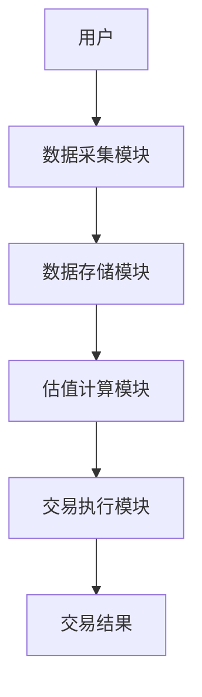

                 


# 格雷厄姆特价股票理论在可再生数字资产中的应用

> **关键词**：格雷厄姆投资理论，数字资产，可再生数字资产，价值投资，安全边际，市盈率，市净率

> **摘要**：本文探讨了如何将格雷厄姆的经典投资理论应用于可再生数字资产的投资中。通过分析数字资产的特性，本文提出了一套基于安全边际的估值方法，并结合算法和系统设计，展示了如何在数字资产领域实现低风险、高回报的投资策略。文章还提供了详细的数学模型、系统架构和实战案例，帮助读者更好地理解和应用这一创新的投资理念。

---

## 第一章：背景介绍

### 1.1 格雷厄姆投资理论的核心概念

格雷厄姆的价值投资理论强调“安全边际”，即以低于内在价值的价格买入资产，从而在长期获得超额收益。其核心思想包括：

1. **低估值原则**：寻找市场价格低于内在价值的资产。
2. **安全边际原则**：买入价格与内在价值之间的差距越大，投资风险越小。
3. **长期持有原则**：投资的最终收益来源于资产的内在价值增长，而非短期价格波动。

### 1.2 可再生数字资产的定义与特性

可再生数字资产（如比特币、以太坊等）是基于区块链技术的数字资源，具有以下特性：

1. **去中心化**：不受任何机构或政府的控制。
2. **可编程性**：通过智能合约实现复杂的交易逻辑。
3. **稀缺性**：总量有限或按规则生成，具有类似黄金的特性。
4. **可分割性**：数字资产可以分割为任意小单位，便于交易和流通。

### 1.3 数字资产与传统股票的对比

| **特性**         | **传统股票**             | **数字资产**             |
|------------------|--------------------------|--------------------------|
| 所有权           | 股东拥有公司部分股权     | 持有者拥有数字资产的使用权 |
| 交易场所         | 证券交易所               | 数字货币交易所           |
| 交易时间         | 受交易时间限制           | 24/7 全球市场             |
| 市值计算           | 市盈率、市净率            | 市值、流动性溢价          |
| 风险因素         | 公司业绩、行业趋势       | 市场波动、技术风险         |

---

## 第二章：核心概念与联系

### 2.1 格雷厄姆理论与数字资产的结合

通过分析数字资产的特性，我们可以将格雷厄姆理论的核心思想转化为数字资产领域的投资策略：

1. **安全边际的计算**：寻找市场价格远低于内在价值的数字资产。
2. **内在价值的评估**：基于技术成熟度、市场需求和团队能力等因素，估算数字资产的长期价值。
3. **风险控制**：通过分散投资和设置止损点降低投资风险。

### 2.2 数字资产的估值模型

数字资产的估值模型可以借鉴传统股票的估值方法，但需要考虑其独特特性：

1. **市盈率（P/E）**：市值 / 每年收益。
2. **市净率（P/B）**：市值 / 总资产。
3. **流动性溢价**：考虑到数字资产的高流动性，给予一定的估值折扣。

---

## 第三章：算法原理与数学模型

### 3.1 安全边际的计算公式

$$\text{安全边际} = \text{内在价值} - \text{市场价格}$$

### 3.2 市盈率与市净率的对比

$$P/E = \frac{\text{市值}}{\text{净利润}}$$

$$P/B = \frac{\text{市值}}{\text{净资产}}$$

### 3.3 算法实现

以下代码展示了如何筛选低估值的数字资产：

```python
def calculate_margin(asset, price):
    intrinsic_value = asset.intrinsic_value
    margin = intrinsic_value - price
    return margin if margin > 0 else 0

# 示例：筛选安全边际大于10%的资产
low_valuation_assets = [a for a in assets if calculate_margin(a, a.price) > 0.1]
```

---

## 第四章：系统分析与架构设计

### 4.1 系统功能设计

1. **数据采集模块**：从交易所获取实时价格和交易数据。
2. **估值计算模块**：基于格雷厄姆理论计算资产的内在价值和安全边际。
3. **交易执行模块**：根据预设策略自动执行买卖操作。

### 4.2 系统架构图



---

## 第五章：项目实战

### 5.1 环境安装

```bash
pip install pandas numpy matplotlib
```

### 5.2 核心代码实现

```python
import pandas as pd

def calculate_pe_ratio(asset_data):
    pe_ratio = asset_data['市值'] / asset_data['净利润']
    return pe_ratio

# 示例数据
data = {
    '资产': ['BTC', 'ETH', 'BCH'],
    '市值': [500, 200, 100],
    '净利润': [10, 5, 2],
    '价格': [20, 10, 5]
}

df = pd.DataFrame(data)
df['市盈率'] = df.apply(calculate_pe_ratio, axis=1)
print(df)
```

### 5.3 实际案例分析

以比特币为例，假设其内在价值为 $30,000，市场价格为 $25,000，则安全边际为 $5,000。根据格雷厄姆理论，这是一笔具有较高安全边际的投资。

---

## 第六章：总结与展望

### 6.1 最佳实践

1. **长期持有**：数字资产的内在价值增长需要时间。
2. **分散投资**：避免将所有资金投入到单一资产中。
3. **持续学习**：关注行业动态和技术发展。

### 6.2 小结

本文将格雷厄姆的价值投资理论与可再生数字资产相结合，提出了一套创新的投资策略。通过安全边际的计算和低估值资产的筛选，投资者可以在数字资产领域实现低风险、高回报的投资目标。

### 6.3 注意事项

1. 数字资产市场波动较大，需谨慎操作。
2. 确保对数字资产的技术和市场有足够的了解。
3. 定期评估和调整投资组合。

### 6.4 拓展阅读

1. 格雷厄姆的《聪明的投资者》
2. 《数字资产：区块链技术与金融的未来》
3. 数字资产交易平台的开发与实现

---

**作者：AI天才研究院/AI Genius Institute & 禅与计算机程序设计艺术 /Zen And The Art of Computer Programming**

