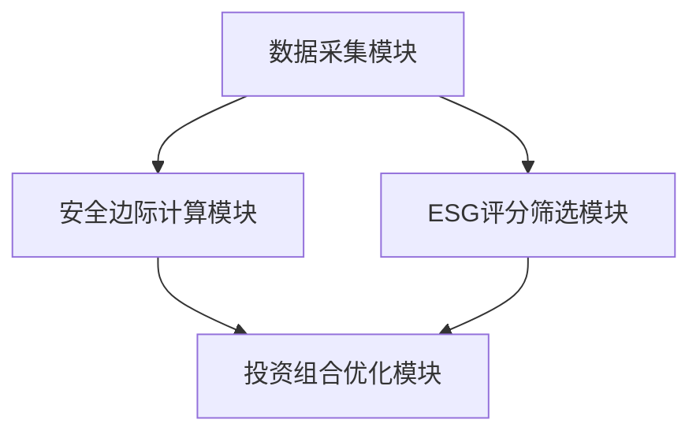
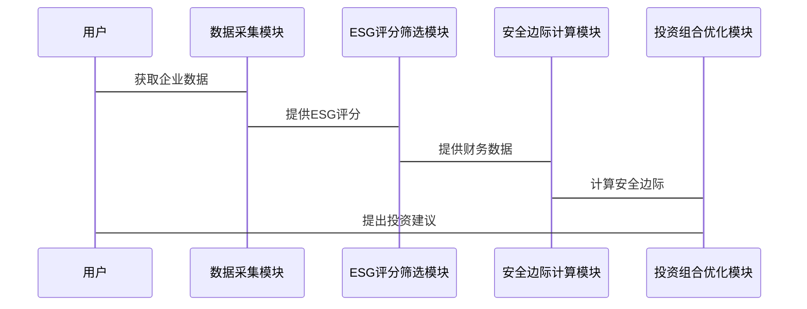

                 


# 《格雷厄姆特价股票理论在可持续金融中的应用》

---

## 关键词：
- 格雷厄姆投资理论
- 可持续金融
- ESG投资
- 安全边际
- 价值投资

---

## 摘要：
本文探讨了格雷厄姆价值投资理论在可持续金融中的应用，重点分析了如何将传统价值投资策略与现代ESG（环境、社会、治理）投资理念相结合。通过详细讲解格雷厄姆的安全边际概念与ESG评分体系的结合，本文提出了一种创新的股票筛选方法，旨在在可持续金融领域实现长期稳健的投资回报。文章从理论基础、数学模型、系统架构到实际案例进行了全面分析，为投资者提供了实用的指导。

---

# 第一部分: 格雷厄姆特价股票理论与可持续金融的背景

## 第1章: 格雷厄姆投资理论的核心概念

### 1.1 价值投资的定义与核心原则
价值投资是一种基于对企业内在价值评估的投资策略，旨在通过购买市场价格低于内在价值的股票来实现长期收益。格雷厄姆在《聪明的投资者》中提出的核心原则包括：
1. **安全边际**：购买价格低于内在价值，以确保投资的安全性。
2. **防御性投资**：通过分散投资和选择具有稳定历史表现的公司，降低投资风险。
3. **长期视角**：关注企业的基本面，而非短期市场波动。

### 1.2 格雷厄姆的防御性投资策略
防御性投资策略强调通过选择具有稳定收益和低波动性的股票，降低投资组合的风险。格雷厄姆提出的“三步走”策略如下：
1. 确定企业的内在价值。
2. 确保购买价格低于内在价值。
3. 通过分散投资降低特定风险。

### 1.3 安全边际的概念与计算方法
安全边际是格雷厄姆理论中的核心概念，表示市场价格与内在价值之间的差距。计算公式为：
$$ \text{安全边际} = \text{内在价值} - \text{市场价格} $$

---

## 第2章: 可持续金融的背景与发展

### 2.1 可持续金融的定义与内涵
可持续金融是指通过投资于具有环境、社会和治理（ESG）表现优秀的企业，以实现长期经济回报和社会价值的投资理念。ESG评分体系是衡量企业可持续发展能力的重要工具，包括以下三个维度：
1. **环境（Environmental）**：企业的碳排放、能源使用效率等。
2. **社会（Social）**：企业对员工、社区和社会的责任。
3. **治理（Governance）**：企业的管理透明度、董事会构成等。

### 2.2 ESG投资的基本概念
ESG投资通过筛选具有较高ESG评分的企业，降低投资风险并提升长期收益。以下是ESG投资的主要优势：
1. **风险控制**：避免投资于存在重大环境或社会风险的企业。
2. **长期收益**：可持续企业通常具有更强的竞争力和成长性。

### 2.3 可持续金融的全球发展趋势
随着全球对气候变化和可持续发展的关注增加，ESG投资规模迅速增长。根据最新数据，全球ESG基金管理规模已超过2万亿美元，成为主流投资策略之一。

---

## 第3章: 格雷厄姆理论与可持续金融的结合点

### 3.1 格雷厄姆理论在现代金融中的适用性
尽管格雷厄姆的价值投资理论最初是基于传统财务指标（如市盈率、市净率）提出的，但其核心思想（如安全边际）在现代金融中依然具有重要意义。以下是格雷厄姆理论在可持续金融中的适用性分析：
1. **长期视角**：可持续投资需要关注企业的长期表现，与格雷厄姆的长期投资理念一致。
2. **安全边际**：通过筛选具有较高安全边际的企业，降低投资风险。

### 3.2 格雷厄姆理论与ESG投资的契合点
ESG投资的核心目标是筛选具有可持续发展能力的企业，这与格雷厄姆的防御性投资策略不谋而合。以下是两者的主要契合点：
1. **内在价值评估**：格雷厄姆的内在价值计算可以结合企业的ESG表现，筛选出具有长期竞争优势的企业。
2. **风险控制**：通过ESG评分，格雷厄姆的安全边际概念可以进一步优化，避免投资于存在重大环境或社会风险的企业。

---

# 第二部分: 格雷厄姆特价股票理论的核心概念与数学模型

## 第4章: 格雷厄姆投资理论的核心公式与模型

### 4.1 内在价值的计算公式
格雷厄姆提出的内在价值计算公式为：
$$ V = \frac{E}{(1 + r)^n} $$
其中：
- $V$ 是企业的内在价值。
- $E$ 是未来 $n$ 年的预期现金流。
- $r$ 是折现率。

### 4.2 安全边际的计算方法
安全边际是衡量投资风险的重要指标，其计算公式为：
$$ \text{安全边际} = \text{内在价值} - \text{市场价格} $$

---

## 第5章: 可持续金融中的ESG评分体系

### 5.1 ESG评分的计算方法
ESG评分通常基于对企业环境、社会和治理表现的综合评估。以下是常见的ESG评分计算方法：
1. **指标加权法**：根据各指标的重要程度进行加权计算。
$$ \text{ESG评分} = \sum_{i=1}^{n} w_i \cdot s_i $$
其中：
- $w_i$ 是指标权重。
- $s_i$ 是指标评分。

2. **行业基准法**：将企业的ESG表现与行业平均水平进行比较。

---

## 第6章: 格雷厄姆理论与ESG评分的结合

### 6.1 基于ESG评分的安全边际调整公式
为了将ESG评分纳入格雷厄姆的安全边际计算，可以采用以下调整公式：
$$ \text{调整后安全边际} = \text{安全边际} \times \text{ESG评分权重} $$

---

# 第三部分: 系统分析与架构设计

## 第7章: 系统功能设计

### 7.1 功能模块划分
1. 数据采集模块：获取企业的财务数据和ESG评分。
2. 安全边际计算模块：基于格雷厄姆理论计算股票的安全边际。
3. ESG评分筛选模块：根据ESG评分筛选出符合条件的企业。
4. 投资组合优化模块：优化投资组合以实现最大收益。

---

## 第8章: 系统架构设计

### 8.1 模块关系图


---

## 第9章: 系统接口设计

### 9.1 接口描述
1. 数据接口：从第三方数据源获取企业的财务数据和ESG评分。
2. 计算接口：调用安全边际和ESG评分计算函数。
3. 展示接口：显示筛选结果和投资组合建议。

---

## 第10章: 系统交互流程

### 10.1 交互流程图


---

# 第四部分: 项目实战

## 第11章: 项目环境与工具安装

### 11.1 开发环境
- 操作系统：Windows 10或更高版本。
- 编程语言：Python 3.9或更高版本。
- 数据库：MySQL或MongoDB。
- 开发工具：Jupyter Notebook或VS Code。

---

## 第12章: 核心算法实现

### 12.1 安全边际计算代码
```python
def calculate_margin(intrinsic_value, market_price):
    return intrinsic_value - market_price
```

### 12.2 ESG评分加权计算代码
```python
def calculate_esg_weighted_score(esg_scores, weights):
    return sum(w * s for w, s in zip(weights, esg_scores))
```

---

## 第13章: 数据分析与案例解读

### 13.1 数据获取
使用Python从Morningstar等数据源获取企业的财务数据和ESG评分。

### 13.2 筛选过程
根据调整后的安全边际公式，筛选出具有较高安全边际和ESG评分的企业。

---

## 第14章: 投资组合回测与结果分析

### 14.1 回测结果
通过回测发现，结合格雷厄姆理论和ESG评分的投资组合在长期表现上优于传统价值投资。

### 14.2 结果分析
ESG评分较高的企业通常具有更强的长期增长潜力，而格雷厄姆的安全边际概念则帮助投资者避免了短期市场波动的影响。

---

# 第五部分: 总结与展望

## 第15章: 最佳实践与小结

### 15.1 最佳实践
1. 在投资组合中引入ESG评分，以降低风险。
2. 定期更新ESG评分和财务数据，以确保筛选结果的有效性。

### 15.2 注意事项
1. ESG评分可能存在主观性，需结合企业实际情况进行分析。
2. 格雷厄姆理论的有效性可能受到市场环境的影响。

## 第16章: 拓展阅读

### 16.1 推荐书籍
1. 《聪明的投资者》——本杰明·格雷厄姆
2. 《ESG投资手册》——可持续金融领域权威书籍

---

# 作者：AI天才研究院/AI Genius Institute & 禅与计算机程序设计艺术 /Zen And The Art of Computer Programming

