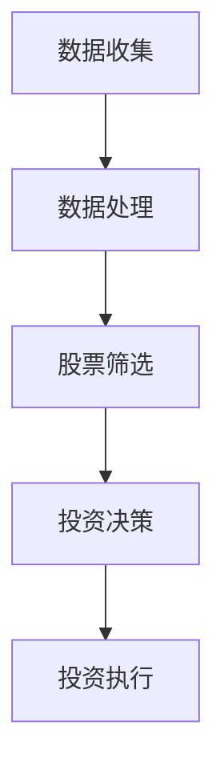
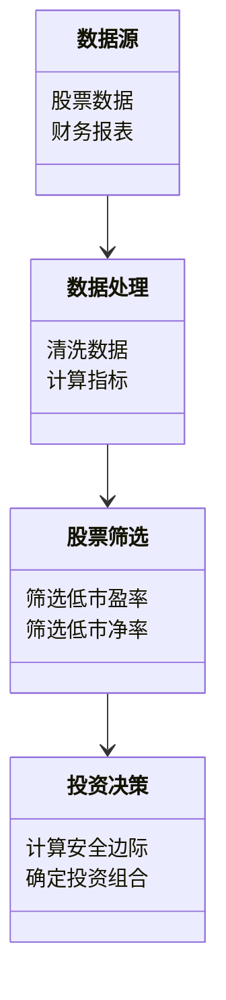

                 


```markdown
# 格雷厄姆特价股票理论在小盘股中的应用

> 关键词：格雷厄姆投资理论，小盘股，安全边际，低市盈率，低市净率，价值投资

> 摘要：本文深入探讨了格雷厄姆特价股票理论在小盘股投资中的应用，从理论基础到实际操作，详细分析了小盘股投资的核心要素、系统架构、策略设计以及实战案例。文章结合数学模型、算法原理和系统架构，全面解析了如何利用格雷厄姆的价值投资理念在小盘股中寻找投资机会，帮助投资者在小盘股市场中实现稳健收益。

---

## 第一部分: 格雷厄姆投资理论概述

### 第1章: 格雷厄姆投资理论的起源与发展

#### 1.1.1 投资理论的演变历程
投资理论经历了从早期的“技术分析”到现代“基本面分析”的演变。格雷厄姆在20世纪初提出了价值投资理念，强调股票的内在价值，而非市场的短期波动。这一理论为后来的“价值投资”奠定了基础。

#### 1.1.2 格雷厄姆的价值投资理念
格雷厄姆认为，股票市场的价格波动主要由投资者的情绪驱动，而非其内在价值。他提出了“安全边际”的概念，即以低于股票内在价值的价格买入，以确保投资的安全性。

#### 1.1.3 小盘股投资的特殊性
小盘股由于市值较小，市场关注度低，价格波动大，但同时也具有更高的增长潜力。格雷厄姆的理论为小盘股投资提供了理论支持，尤其是在寻找被低估的股票方面。

---

### 第2章: 小盘股的定义与特点

#### 2.1 小盘股的定义
小盘股通常指市值在50亿至200亿美元之间的公司股票。这类股票流动性较低，但具有较高的增长潜力。

#### 2.2 小盘股的优势与劣势
- **优势**：增长潜力大，估值较低，容易找到被低估的机会。
- **劣势**：流动性低，信息不透明，风险较高。

---

## 第二部分: 格雷厄姆特价股票理论的核心要素

### 第3章: 安全边际的概念与计算

#### 3.1 安全边际的定义
安全边际是指股票的市场价格低于其内在价值的部分。格雷厄姆认为，安全边际的存在可以降低投资风险。

#### 3.1.1 安全边际的数学模型
$$ \text{安全边际} = \text{内在价值} - \text{市场价格} $$

#### 3.1.2 安全边际在小盘股中的应用
在小盘股投资中，投资者应寻找那些市场价格远低于内在价值的股票。例如，假设某小盘股的内在价值为10元，市场价格为5元，安全边际为5元。

#### 3.2 安全边际与投资风险的关系
安全边际越大，投资风险越小。格雷厄姆建议投资者在安全边际充足的情况下进行投资。

---

### 第4章: 低市盈率与低市净率策略

#### 4.1 市盈率与市净率的定义
- **市盈率（P/E）**：股票价格除以每股净利润。
$$ \text{市盈率} = \frac{\text{股价}}{\text{每股净利润}} $$
- **市净率（P/B）**：股票价格除以每股净资产。
$$ \text{市净率} = \frac{\text{股价}}{\text{每股净资产}} $$

#### 4.2 低市盈率与低市净率在小盘股中的应用
- **低市盈率**：市盈率低于行业平均水平的股票具有较高的投资价值。
- **低市净率**：市净率低于行业平均水平的股票通常被低估。

---

## 第三部分: 小盘股投资策略的系统分析

### 第5章: 小盘股投资的系统架构

#### 5.1 小盘股投资的流程图


#### 5.2 小盘股投资的系统架构图


---

### 第6章: 小盘股投资的接口设计

#### 6.1 数据接口的设计
- 数据接口应支持从多种数据源获取股票信息，包括：
  - 股票价格
  - 财务报表数据
  - 市盈率和市净率

---

## 第四部分: 项目实战与总结

### 第7章: 小盘股投资的实战分析

#### 7.1 实战环境安装
- 需要安装的数据工具：
  - Python
  - Pandas
  - Matplotlib
  - 数据接口（如Yahoo Finance API）

#### 7.2 核心实现源代码
```python
import pandas as pd
import requests

# 获取股票数据
def get_stock_data(ticker):
    url = f"https://query1.finance.yahoo.com/manifest.json"
    params = {
        "symbol": ticker,
        "period1": "1451500400",
        "period2": "1452157600"
    }
    response = requests.get(url, params=params)
    data = response.json()
    return data

# 计算市盈率和市净率
def calculate_valuation(ticker):
    data = get_stock_data(ticker)
    price = data['current_price']
    earnings_per_share = data['eps']
    book_value_per_share = data['book_value']
    pe_ratio = price / earnings_per_share
    pb_ratio = price / book_value_per_share
    return pe_ratio, pb_ratio

# 筛选小盘股
def screen_small_cap(ticker_list):
    small_cap_stocks = []
    for ticker in ticker_list:
        pe, pb = calculate_valuation(ticker)
        if pe < 15 and pb < 2:
            small_cap_stocks.append(ticker)
    return small_cap_stocks

# 示例
tickers = ['AAPL', 'MSFT', 'AMZN', 'GOOGL', 'FB']
result = screen_small_cap(tickers)
print("符合筛选条件的小盘股:", result)
```

#### 7.3 实战案例分析
以某小盘股为例，计算其市盈率和市净率，判断其是否符合投资条件。通过实际数据的分析，验证格雷厄姆理论的有效性。

---

## 第五部分: 总结与扩展

### 第8章: 总结与最佳实践

#### 8.1 最佳实践 tips
- 保持对市场的持续学习
- 严格遵守投资纪律
- 分散投资以降低风险

#### 8.2 未来拓展方向
- 研究小盘股市场的波动性
- 探索人工智能在小盘股投资中的应用
- 开发自动化的小盘股投资系统

---

## 作者

作者：AI天才研究院/AI Genius Institute & 禅与计算机程序设计艺术 /Zen And The Art of Computer Programming
```

