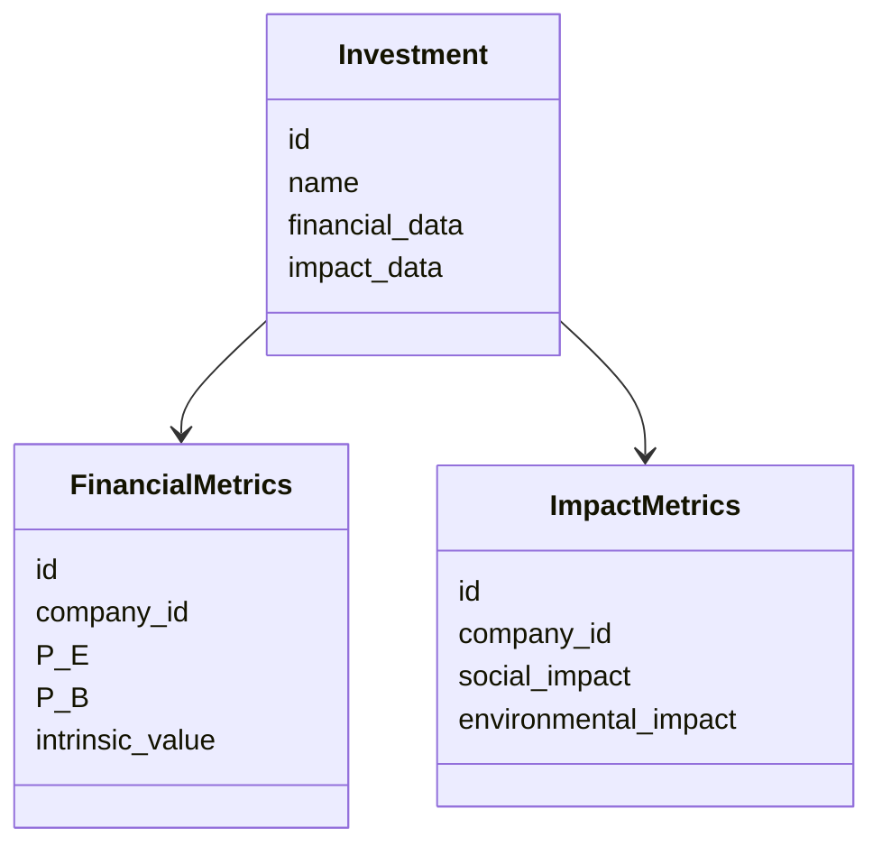
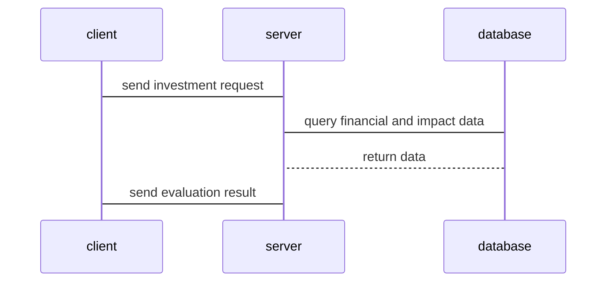

                 


# 格雷厄姆特价股票理论在影响力投资中的应用

> 关键词：价值投资，影响力投资，格雷厄姆，数学模型，股票筛选，影响力评估

> 摘要：本文探讨了格雷厄姆的价值投资理论在影响力投资中的应用，结合数学模型和系统设计，提出了一种将财务价值与社会影响力相结合的投资策略。通过详细分析和实际案例，展示了如何在追求财务回报的同时，实现社会和环境的积极影响。

---

## 第一章：背景介绍

### 1.1 格雷厄姆投资理论的核心概念

#### 1.1.1 价值投资的基本原理
价值投资是一种以低于内在价值的价格购买优质股票的投资策略。格雷厄姆提出的核心思想是寻找市场低估的股票，通过分析企业的财务状况和内在价值来判断投资机会。

#### 1.1.2 特价股票的定义与特征
特价股票是指市场价格低于其内在价值的股票。其特征包括低市盈率（P/E）、低市净率（P/B）和高股息率等。

#### 1.1.3 格雷厄姆的投资策略与方法
格雷厄姆的投资策略注重安全边际和长期持有。他建议投资者关注企业的盈利能力、财务稳定性以及市场估值。

### 1.2 影响力投资的背景与目标

#### 1.2.1 影响力投资的定义
影响力投资是指通过投资实现财务回报的同时，对社会和环境产生积极影响的投资方式。

#### 1.2.2 影响力投资的目标
影响力投资的目标是实现财务回报和社会价值的双重目标，关注企业在环境保护、社会责任和治理结构等方面的表现。

#### 1.2.3 影响力投资的边界与外延
影响力投资不仅限于环保行业，还包括教育、医疗、能源等领域。其外延广泛，涵盖企业的整个生命周期。

### 1.3 格雷厄姆理论与影响力投资的结合
将格雷厄姆的价值投资理论应用于影响力投资，可以结合企业的财务表现和社会影响力，筛选出具有双重优势的股票。

---

## 第二章：格雷厄姆特价股票理论的核心概念

### 2.1 核心概念术语说明

| 核心概念       | 定义                                   |
|----------------|--------------------------------------|
| 内在价值       | 企业未来现金流的现值                 |
| 市盈率（P/E）  | 市场价格与每股收益的比率             |
| 市净率（P/B）  | 市场价格与每股净资产的比率           |
| 安全边际       | 市场价格低于内在价值的部分           |

### 2.2 格雷厄姆理论的数学模型

#### 2.2.1 内在价值计算公式
$$ Intrinsic\ Value = \frac{Earnings}{Growth\ Rate} $$

#### 2.2.2 市盈率与市净率的计算公式
$$ P/E = \frac{Price}{Earnings} $$
$$ P/B = \frac{Price}{Book\ Value} $$

### 2.3 核心概念的联系与对比

#### 2.3.1 核心概念属性对比

| 属性       | 内在价值       | 市盈率（P/E） | 市净率（P/B） |
|------------|---------------|--------------|--------------|
| 计算方式   | 未来现金流现值 | 收益倍数       | 资产倍数       |
| 适用场景   | 评估企业价值   | 评估盈利能力   | 评估资产效率   |

#### 2.3.2 实体关系图（ER图）
```mermaid
erDiagram
    customer o-|{ invests } company
    company o-|{ has } financial_metrics
    financial_metrics o-|{ includes } intrinsic_value
    financial_metrics o-|{ includes } P_E
    financial_metrics o-|{ includes } P_B
```

---

## 第三章：影响力投资的核心概念与框架

### 3.1 影响力投资的定义与目标

#### 3.1.1 影响力投资的定义
影响力投资是指通过投资实现财务回报的同时，对社会和环境产生积极影响的投资方式。

#### 3.1.2 影响力投资的目标
影响力投资的目标是实现财务回报和社会价值的双重目标，关注企业在环境保护、社会责任和治理结构等方面的表现。

### 3.2 影响力投资的评估标准与方法

#### 3.2.1 影响力评估的三大维度
1. 环境影响：企业的环保措施和资源利用效率。
2. 社会影响：企业在社会责任、员工福利等方面的实践。
3. 治理结构：企业治理的透明度和道德标准。

#### 3.2.2 影响力投资的评分体系
影响力投资的评分体系通常包括定量指标和定性指标。定量指标如碳排放、能源消耗，定性指标如社会责任报告的透明度。

### 3.3 影响力投资的数学模型

#### 3.3.1 影响力价值的计算公式
$$ Impact\ Value = \frac{Social\ Impact + Environmental\ Impact}{Financial\ Value} $$

#### 3.3.2 影响力投资的回报率计算
$$ ROI = \frac{Net\ Profit}{Investment} $$

### 3.4 核心概念的联系与对比

#### 3.4.1 影响力投资与传统投资的对比
| 方面       | 传统投资               | 影响力投资             |
|------------|------------------------|------------------------|
| 投资目标   | 财务回报               | 财务回报 + 社会影响     |
| 评估标准   | 财务指标               | 财务指标 + 社会环境指标 |
| 风险考量   | 财务风险               | 财务风险 + 社会风险     |

---

## 第四章：格雷厄姆特价股票理论在影响力投资中的应用框架

### 4.1 格雷厄姆理论与影响力投资的结合点

#### 4.1.1 价值投资与社会价值的结合
通过格雷厄姆的价值投资方法，筛选出具有社会价值的企业，实现财务回报与社会影响力的双重目标。

#### 4.1.2 特价股票筛选与影响力评估的结合
在筛选特价股票时，同时评估企业的社会影响力，确保投资不仅具有财务价值，还具有社会价值。

#### 4.1.3 长期投资策略与社会影响力的结合
格雷厄姆的长期投资策略与影响力投资的长期社会目标相契合，通过长期持有优质股票，实现社会和财务的双重积累。

### 4.2 影响力投资中的股票筛选标准

#### 4.2.1 低市盈率与高社会价值的结合
选择市盈率低于行业平均水平，同时具有较高的社会价值的企业。

#### 4.2.2 低市净率与高环境价值的结合
选择市净率低于行业平均水平，同时具有较高的环境价值的企业。

#### 4.2.3 高股息率与高社会责任的结合
选择股息率高，同时在社会责任方面表现优异的企业。

### 4.3 影响力投资中的股票评估流程

#### 4.3.1 确定投资目标与影响力标准
明确投资目标，包括财务回报和社会影响力的双重目标。

#### 4.3.2 数据收集与初步筛选
收集企业的财务数据和影响力数据，初步筛选出符合标准的股票。

#### 4.3.3 深入分析与最终评估
对筛选出的股票进行深入分析，评估其财务和影响力表现，最终确定投资组合。

---

## 第五章：系统分析与架构设计方案

### 5.1 问题场景介绍
在影响力投资中，需要整合企业的财务数据和社会影响力数据，构建一个综合评估系统。

### 5.2 系统功能设计

#### 5.2.1 领域模型（Mermaid 类图）


#### 5.2.2 系统架构设计（Mermaid 架构图）


#### 5.2.3 系统接口设计
系统接口包括数据输入接口、数据处理接口和结果输出接口。

#### 5.2.4 系统交互（Mermaid 序列图）


---

## 第六章：项目实战

### 6.1 环境安装
安装必要的软件和工具，包括数据分析工具、编程语言和可视化工具。

### 6.2 系统核心实现源代码

#### 6.2.1 数据收集与处理
```python
import pandas as pd

# 数据收集
data = pd.read_csv('stock_data.csv')

# 数据处理
data['impact_score'] = data['social_impact'] + data['environmental_impact']
data['value_score'] = data['P_E'] + data['P_B']
```

#### 6.2.2 模型实现
```python
def calculate_intrinsic_value(company):
    return company['Earnings'] / company['Growth Rate']

def calculate_impact_value(company):
    return (company['Social Impact'] + company['Environmental Impact']) / company['Financial Value']

companies = [...]  # 公司列表
for company in companies:
    iv = calculate_intrinsic_value(company)
    impact = calculate_impact_value(company)
    if company.Price < iv and impact > 0.8:
        print(f"{company.Name} 是一个有吸引力的投资目标")
```

### 6.3 案例分析与详细解读
通过具体案例分析，展示如何应用格雷厄姆理论和影响力投资策略筛选出具有双重优势的股票。

---

## 第七章：最佳实践、小结与注意事项

### 7.1 最佳实践 tips
1. 结合财务数据和社会影响力数据，制定综合评估标准。
2. 定期评估投资组合的表现，及时调整策略。
3. 选择具有长期发展潜力的企业，实现财务和影响力的双重目标。

### 7.2 小结
通过将格雷厄姆的价值投资理论与影响力投资相结合，投资者可以在追求财务回报的同时，实现社会和环境的积极影响。

### 7.3 注意事项
1. 投资者需要具备一定的财务和影响力评估知识。
2. 投资过程中需密切关注企业的财务状况和社会责任表现。
3. 需要定期评估投资组合的财务和影响力表现，及时调整策略。

---

## 附录

### A.1 参考文献
1. 格雷厄姆《投资学原理》
2. 现代影响力投资的相关文献

### A.2 工具资源
1. 数据分析工具：Python、Pandas、Matplotlib
2. 可视化工具：Tableau、Power BI
3. 代码示例：GitHub仓库链接

---

**作者：AI天才研究院/AI Genius Institute & 禅与计算机程序设计艺术 /Zen And The Art of Computer Programming**

