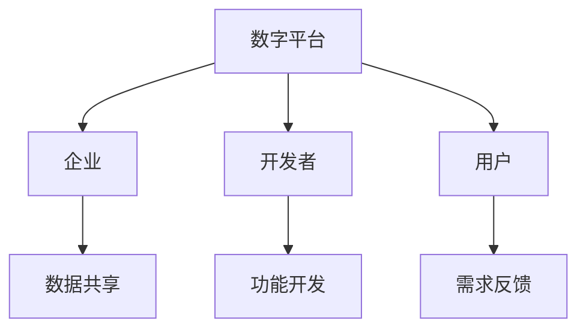

                 


# 《格雷厄姆特价股票理论在数字平台协同创新产业中的应用》

> **关键词**：格雷厄姆特价股票、数字平台、协同创新、投资理论、产业应用

> **摘要**：本文探讨了格雷厄姆价值投资理论在数字平台协同创新产业中的应用，结合数字平台的特点，分析了如何通过协同创新机制优化投资策略，实现价值最大化。通过实际案例和系统设计，展示了如何将格雷厄姆理论与数字技术相结合，为投资者提供新的视角和方法。

---

## 第1章 格雷厄姆特价股票理论与数字平台协同创新产业概述

### 1.1 格雷厄姆特价股票理论的核心概念

#### 1.1.1 价值投资的定义与核心原则

价值投资是一种以低于其内在价值的价格购买优质资产的投资策略，其核心在于寻找市场中的“特价股票”。格雷厄姆提出的“安全边际”概念强调，投资者应以低于其内在价值的价格买入资产，以降低投资风险。

#### 1.1.2 格雷厄姆投资策略的关键要素

- **内在价值**：资产在未来现金流的现值。
- **安全边际**：买入价格与内在价值的差异，提供缓冲空间。
- **长期视角**：关注企业的长期价值，而非短期波动。

#### 1.1.3 特价股票的识别与评估方法

识别特价股票的关键在于对企业基本面的深入分析，包括财务指标（如市盈率、市净率）、盈利能力、行业地位等。格雷厄姆提出了“筛选法”，通过设定一系列财务指标来筛选具有投资价值的股票。

---

### 1.2 数字平台协同创新产业的背景与特点

#### 1.2.1 数字化转型与协同创新的兴起

随着互联网和信息技术的发展，企业之间的协同创新已成为推动产业升级的重要手段。数字平台通过整合资源、优化流程，为企业提供了高效协同的环境。

#### 1.2.2 数字平台在协同创新中的作用

- **资源协同**：整合企业、开发者、用户的资源，形成多方协作的生态系统。
- **数据协同**：通过数据共享和分析，提升协同效率。
- **价值协同**：通过协同创新创造新的商业价值。

#### 1.2.3 协同创新产业的典型应用场景

- **电子商务**：平台整合供应链、物流、支付等资源，提升交易效率。
- **软件开发**：通过开源平台实现代码协作和功能共享。
- **知识共享**：通过在线社区和知识平台促进知识传播与创新。

---

### 1.3 格雷厄姆理论与数字平台协同创新的结合点

#### 1.3.1 价值投资与数字平台的契合点

数字平台的协同创新模式为价值投资提供了新的机会。通过分析平台的协同效率和资源优化能力，投资者可以发现具有潜在价值的企业。

#### 1.3.2 协同创新产业中的投资机会

- **技术创新企业**：具备自主研发能力的科技企业。
- **协同平台运营商**：提供协同工具和服务的平台型企业。
- **数据驱动企业**：通过数据优化业务流程的企业。

#### 1.3.3 数字平台如何赋能格雷厄姆理论

数字平台通过数据共享、资源协同和价值共创，降低了投资成本，提高了投资效率，为格雷厄姆理论的实践提供了技术支持。

---

## 第2章 格雷厄姆特价股票理论的核心原理

### 2.1 格雷厄姆投资理论的数学模型

#### 2.1.1 现值计算公式

$$ PV = \frac{C}{r} $$

其中，PV为现值，C为未来现金流，r为折现率。

#### 2.1.2 内在价值计算公式

$$ IV = \sum_{t=1}^{n} \frac{CF_t}{(1+r)^t} $$

其中，IV为内在价值，CF_t为第t年的现金流，r为折现率，n为现金流的期限。

---

### 2.2 格雷厄姆安全边际的概念

#### 2.2.1 安全边际的定义

安全边际是指买入价格与内在价值的差额，用于缓冲市场波动带来的风险。

#### 2.2.2 安全边际的计算方法

$$ \text{安全边际} = \text{内在价值} - \text{买入价格} $$

#### 2.2.3 安全边际与投资风险的关系

安全边际越高，投资风险越低。格雷厄姆建议投资者选择安全边际至少为25%的股票。

---

### 2.3 格雷厄姆投资策略的优缺点分析

#### 2.3.1 优点

- **风险可控**：通过安全边际降低投资风险。
- **长期收益**：注重长期价值，适合稳健投资者。

#### 2.3.2 缺点

- **灵活性差**：不适用于短期投资。
- **依赖基本面分析**：需要对企业基本面有深入理解。

#### 2.3.3 适用场景

- **成熟市场**：适用于市场波动较小的成熟市场。
- **价值型企业**：适用于基本面良好、估值较低的企业。

---

## 第3章 数字平台协同创新产业的系统分析

### 3.1 协同创新产业的系统架构

#### 3.1.1 系统架构图（Mermaid）



---

### 3.2 协同创新的协同机制

#### 3.2.1 数据协同

通过数据共享和分析，提升决策效率。

#### 3.2.2 资源协同

整合企业内外部资源，优化资源配置。

#### 3.2.3 价值协同

通过协同创新创造新的商业价值。

---

### 3.3 协同创新产业的数学模型

#### 3.3.1 协同效率公式

$$ E = \frac{I}{T} $$

其中，E为协同效率，I为协同投入，T为时间。

#### 3.3.2 协同价值公式

$$ V = \sum_{i=1}^{n} \frac{v_i}{(1+r)^i} $$

其中，V为协同价值，v_i为第i年的协同收益，r为折现率，n为协同周期。

---

### 3.4 本章小结

通过分析数字平台的协同机制和数学模型，我们可以更好地理解协同创新的本质及其在产业中的应用。

---

## 第4章 格雷厄姆理论在数字平台协同创新产业中的应用

### 4.1 格雷厄姆理论在数字平台中的应用策略

#### 4.1.1 价值评估模型

通过分析数字平台的协同效率和资源优化能力，评估其内在价值。

#### 4.1.2 投资组合优化

根据协同创新的潜力，优化投资组合，降低风险。

#### 4.1.3 风险控制策略

通过分散投资和设定安全边际，控制投资风险。

---

### 4.2 协同创新产业中的投资机会分析

#### 4.2.1 数字平台企业的估值方法

通过分析平台的用户规模、收入增长和协同效率，评估其估值。

#### 4.2.2 投资组合优化

通过投资具有协同创新潜力的企业，优化投资组合。

---

### 4.3 本章小结

通过将格雷厄姆理论与数字平台协同创新相结合，我们可以发现新的投资机会，并优化投资策略。

---

## 第5章 项目实战：基于格雷厄姆理论的数字平台投资分析

### 5.1 环境配置

需要安装Python、Pandas、NumPy等工具。

### 5.2 核心实现

#### 5.2.1 协同效率计算

```python
import pandas as pd

def calculate_efficiency(inputs, time):
    return sum(inputs / (1 + 0.1)**i for i in range(time))
```

#### 5.2.2 内在价值计算

```python
def calculate_intrinsic_value(cash_flows, discount_rate):
    return sum(cf / (1 + discount_rate)**i for i, cf in enumerate(cash_flows))
```

### 5.3 案例分析

以某协同平台为例，分析其协同效率和内在价值，评估其投资价值。

---

## 第6章 总结与展望

### 6.1 总结

通过本文的分析，我们可以看到格雷厄姆理论在数字平台协同创新产业中的广泛应用和巨大潜力。

### 6.2 注意事项

投资者应结合市场环境和企业基本面，谨慎选择投资标的。

### 6.3 未来展望

随着技术的发展，协同创新将成为价值投资的重要方向，值得进一步研究和探索。

---

## 作者

**作者**：AI天才研究院/AI Genius Institute & 禅与计算机程序设计艺术/Zen And The Art of Computer Programming

---

以上是文章的完整内容，希望对您有所帮助！

