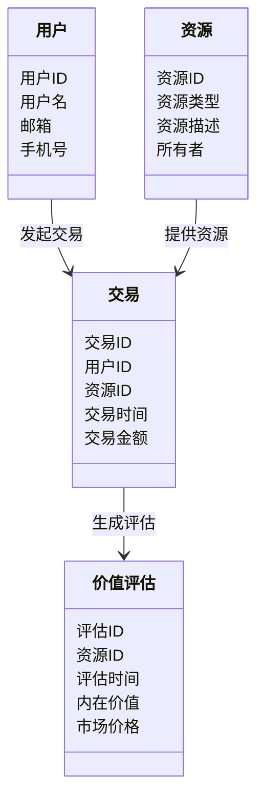
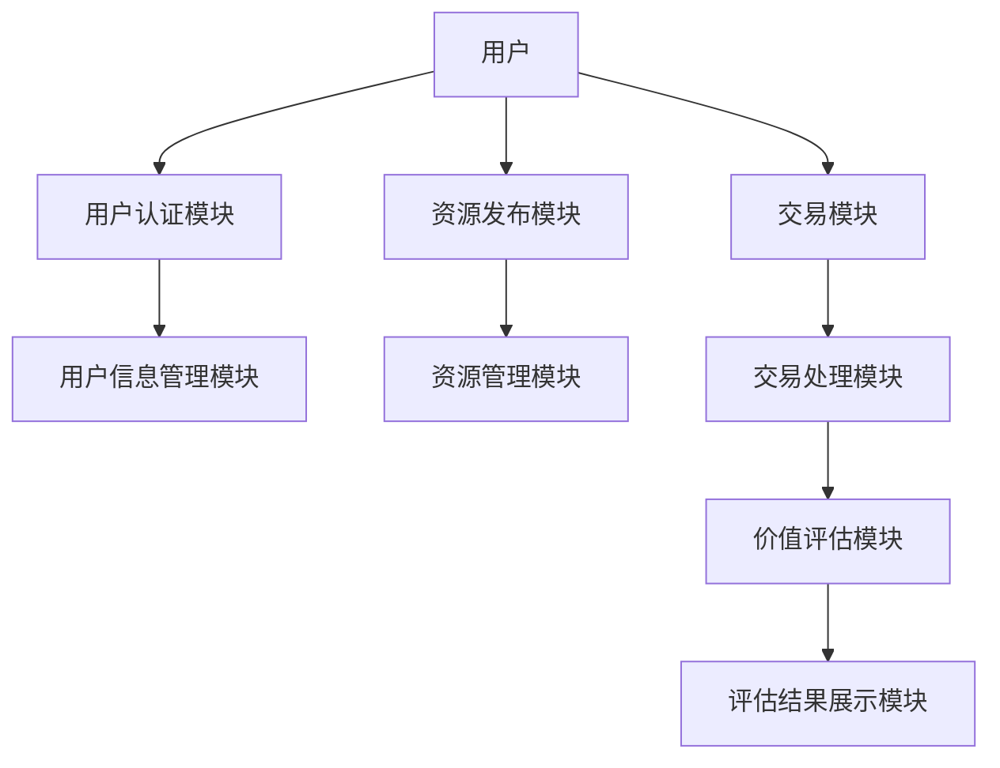
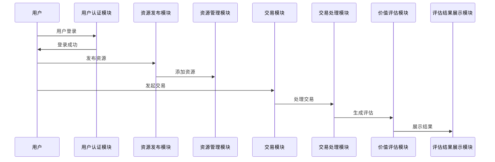

                 


```markdown
# 格雷厄姆特价股票理论在数字平台协同经济产业中的应用

> 关键词：格雷厄姆特价股票理论，数字平台，协同经济，价值评估，投资策略，算法模型

> 摘要：本文深入探讨了格雷厄姆特价股票理论在数字平台协同经济中的应用。首先，介绍了协同经济的定义、特点及其与数字平台的关系。接着，详细分析了格雷厄姆理论的核心观点，并探讨其在数字平台价值评估中的适用性。通过构建数学模型和算法，本文展示了如何将格雷厄姆理论应用于协同经济产业，包括数据预处理、模型构建、评估与优化。最后，通过实际案例分析和项目实战，验证了该方法的有效性，并提出了未来研究的方向。

---

# 第一部分：协同经济产业与格雷厄姆特价股票理论的背景介绍

## 第1章：协同经济产业概述
### 1.1 协同经济的定义与特点
#### 1.1.1 协同经济的基本概念
协同经济（Collaborative Economy）是指通过数字平台将闲置资源与需求方连接起来，实现资源共享和价值创造的经济模式。其核心在于通过技术手段优化资源配置，降低交易成本，提高效率。

#### 1.1.2 协同经济的模式与应用场景
协同经济主要涵盖共享住宿、共享出行、共享办公、共享服务等多个领域。例如，Airbnb和滴滴出行都是典型的协同经济平台，通过数字技术将分散的需求与供给方匹配。

#### 1.1.3 数字平台在协同经济中的作用
数字平台是协同经济的核心载体，通过算法匹配供需双方，优化资源配置。例如，平台通过用户行为数据分析，推荐最优服务方案，提高用户满意度和平台收益。

### 1.2 格雷厄姆特价股票理论的起源与发展
#### 1.2.1 格雷厄姆投资理论的核心观点
格雷厄姆（Benjamin Graham）是价值投资理论的创始人，他认为股票的内在价值是其未来现金流的现值，投资者应以低于内在价值的价格买入股票。

#### 1.2.2 特价股票的定义与特征
特价股票是指市场价格低于其内在价值的股票，是长期投资的理想选择。格雷厄姆强调安全边际的重要性，即市场价格与内在价值的差距越大，投资风险越小。

#### 1.2.3 格雷厄姆理论在现代投资中的应用
格雷厄姆理论不仅是价值投资的基石，还衍生出多种投资策略。例如，指数基金、红利投资等都借鉴了其核心思想。

## 第2章：格雷厄姆特价股票理论在数字平台协同经济中的应用背景
### 2.1 协同经济产业中的价值评估问题
#### 2.1.1 协同经济平台的价值构成
协同经济平台的价值主要来源于用户规模、资源池规模、平台效率和用户满意度。例如，用户规模越大，平台的资源匹配效率越高，整体价值越大。

#### 2.1.2 平台企业的定价策略与成本分析
协同经济平台的定价策略直接影响其收益。格雷厄姆理论可以帮助平台制定合理的定价策略，确保价格低于其内在价值，吸引更多用户。

#### 2.1.3 用户行为与平台价值的关系
用户行为是影响平台价值的重要因素。通过分析用户行为数据，可以优化平台运营策略，提高用户留存率和平台收益。

### 2.2 格雷厄姆理论在协同经济中的适用性分析
#### 2.2.1 协同经济中的价值评估需求
协同经济平台需要准确评估其内在价值，以制定合理的定价策略和投资决策。格雷厄姆理论提供了科学的内在价值评估方法。

#### 2.2.2 格雷厄姆理论与协同经济的契合点
格雷厄姆理论强调安全边际和长期投资，这与协同经济平台的长期发展需求一致。通过分析平台的内在价值，投资者可以找到具有安全边际的投资机会。

#### 2.2.3 应用格雷厄姆理论的潜在挑战
协同经济平台的动态性和不确定性增加了价值评估的难度。此外，平台的多边市场特征也使得内在价值的计算复杂化。

---

# 第二部分：协同经济中的价值评估模型

## 第3章：协同经济中的价值评估模型构建
### 3.1 协同经济平台的价值评估框架
#### 3.1.1 平台价值的核心要素
协同经济平台的价值由用户规模、资源池规模、平台效率和用户满意度四个核心要素构成。

#### 3.1.2 平台价值的评估指标
常用的评估指标包括用户增长率、资源利用率、平台收入增长率和用户满意度指数。

#### 3.1.3 价值评估模型的构建逻辑
基于格雷厄姆理论，构建协同经济平台的内在价值模型，综合考虑各项核心要素和市场因素。

### 3.2 格雷厄姆理论在价值评估中的应用
#### 3.2.1 格雷厄姆理论的数学模型
格雷厄姆理论的核心公式为：
$$
\text{内在价值} = \sum_{t=1}^{\infty} \frac{\text{未来现金流}}{(1 + r)^t}
$$
其中，r为折现率，r = WACC（加权平均资本成本）。

#### 3.2.2 平台企业的内在价值计算
以某协同经济平台为例，计算其未来现金流，折现至现值，得出其内在价值。

#### 3.2.3 市场价格与内在价值的对比分析
通过比较市场价格与内在价值，判断平台是否处于低估状态，寻找投资机会。

## 第4章：协同经济中的价值评估模型优化
### 4.1 数据预处理与特征选择
#### 4.1.1 数据来源与清洗方法
数据来源包括平台公开数据、用户行为数据和市场数据。清洗步骤包括去重、填充缺失值和异常值处理。

#### 4.1.2 特征选择的策略与方法
采用主成分分析（PCA）和逐步回归（Stepwise Regression）方法，筛选影响平台价值的核心特征。

#### 4.1.3 数据标准化与归一化处理
使用标准化（Z-score）或归一化（Min-Max）方法，确保各特征在模型中的权重合理。

### 4.2 模型构建与训练
#### 4.2.1 算法选择与实现
采用多元线性回归（Multiple Linear Regression）模型，基于特征数据，训练平台价值预测模型。

#### 4.2.2 模型训练与调优
通过交叉验证（Cross-Validation）调整模型参数，优化模型拟合度和泛化能力。

#### 4.2.3 模型评估与验证
使用均方误差（MSE）、R²和调整R²指标评估模型性能，确保模型具有较高的预测精度。

## 第5章：协同经济中的价值评估模型应用
### 5.1 案例分析
#### 5.1.1 某协同经济平台的价值评估
以某共享办公平台为例，收集用户数据和市场数据，计算其内在价值，判断其市场价格是否低估。

#### 5.1.2 模型预测与实际值对比
通过模型预测平台未来价值，与实际市场表现进行对比，验证模型的有效性。

#### 5.1.3 投资策略的制定
基于模型评估结果，制定投资策略，寻找具有安全边际的平台，进行长期投资。

---

# 第三部分：系统分析与架构设计

## 第6章：系统分析与架构设计
### 6.1 问题场景介绍
#### 6.1.1 问题描述
协同经济平台的价值评估涉及多方面数据和复杂算法，需要构建高效的系统架构。

#### 6.1.2 项目介绍
本项目旨在开发一个协同经济平台价值评估系统，基于格雷厄姆理论，提供自动化评估和投资建议。

### 6.2 系统功能设计
#### 6.2.1 领域模型设计
使用Mermaid绘制领域模型类图，展示平台用户、资源、交易和价值评估的关系。



#### 6.2.2 系统架构设计
使用Mermaid绘制系统架构图，展示系统的模块划分和交互流程。



#### 6.2.3 系统接口设计
定义系统接口，包括用户认证、资源发布、交易处理和价值评估模块的API接口。

#### 6.2.4 系统交互设计
使用Mermaid绘制系统交互序列图，展示用户与平台的交互流程。



---

# 第四部分：项目实战

## 第7章：项目实战
### 7.1 环境安装与配置
#### 7.1.1 Python环境安装
安装Python 3.8及以上版本，并配置虚拟环境。

#### 7.1.2 依赖库安装
安装必要的库，如Pandas、Scikit-learn、Matplotlib和Seaborn。

### 7.2 系统核心实现
#### 7.2.1 数据预处理代码
```python
import pandas as pd
import numpy as np

# 加载数据
df = pd.read_csv('platform_data.csv')

# 数据清洗
df.drop_duplicates(inplace=True)
df['price'].fillna(df['price'].mean(), inplace=True)
df.dropna(inplace=True)

# 特征选择
selected_features = ['feature1', 'feature2', 'feature3']
df = df[selected_features]
```

#### 7.2.2 模型训练代码
```python
from sklearn.linear_model import LinearRegression
from sklearn.metrics import mean_squared_error

# 训练模型
model = LinearRegression()
model.fit(X_train, y_train)

# 模型预测
y_pred = model.predict(X_test)
print('均方误差:', mean_squared_error(y_test, y_pred))
```

#### 7.2.3 价值评估代码
```python
def calculate_intrinsic_value(revenue, cost, discount_rate):
    return revenue - cost * (1 / (1 + discount_rate))
```

### 7.3 案例分析与解读
#### 7.3.1 数据来源与分析
分析某共享办公平台的历史数据，提取用户行为和市场表现数据。

#### 7.3.2 模型应用与结果展示
通过模型预测平台的内在价值，与实际市场价格对比，判断其是否低估。

#### 7.3.3 投资策略制定
基于模型结果，制定投资策略，寻找具有安全边际的平台进行长期投资。

---

# 第五部分：总结与展望

## 第8章：总结与展望
### 8.1 核心内容总结
本文详细探讨了格雷厄姆特价股票理论在数字平台协同经济中的应用，构建了价值评估模型，并通过案例分析验证了其有效性。

### 8.2 未来研究方向
未来可以进一步研究协同经济的动态性对价值评估的影响，探索更复杂的模型和算法，提高评估精度。

### 8.3 最佳实践 Tips
- 在实际应用中，需结合平台的实际情况调整模型参数。
- 定期更新数据和模型，确保评估结果的准确性。
- 注意市场波动和政策变化，及时调整投资策略。

---

作者：AI天才研究院/AI Genius Institute & 禅与计算机程序设计艺术 /Zen And The Art of Computer Programming
```

