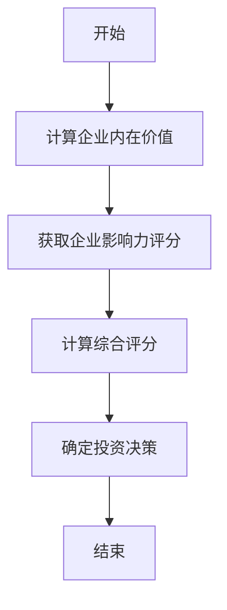

                 


# 格雷厄姆特价股票理论在数字社会影响力投资中的新应用

> **关键词**：格雷厄姆特价股票理论、影响力投资、价值投资、数字社会、可持续发展、投资策略、影响力评估  
> **摘要**：本文探讨了如何将格雷厄姆的特价股票理论应用于数字社会下的影响力投资，结合价值投资与社会影响力，构建数学模型，设计系统架构，并通过案例分析展示了其在实际中的应用。

---

## 引言

### 1.1 问题背景
- **格雷厄姆特价股票理论的起源与核心思想**：格雷厄姆是价值投资之父，强调以低于内在价值的价格买入优质股票。
- **数字社会下影响力投资的兴起**：投资者关注企业对社会的影响，如环保、教育等。
- **传统投资理论与数字社会需求的冲突**：传统理论忽视企业社会责任，无法满足数字社会的需求。

### 1.2 问题描述
- **格雷厄姆理论的应用局限**：仅关注财务指标，忽视社会因素。
- **影响力投资的定义**：投资于对社会有积极影响的企业。
- **理论与实践的结合**：如何将格雷厄姆理论与影响力投资结合，提升投资收益和社会价值。

### 1.3 问题解决
- **理论的潜在价值**：格雷厄姆理论可帮助评估企业的真实价值。
- **数字技术的赋能**：利用大数据分析企业影响力。
- **理论创新的方向**：扩展传统模型，融入社会影响力因素。

### 1.4 理论边界与外延
- **适用范围**：适用于企业价值评估。
- **边界条件**：企业影响力数据的准确性。
- **创新方向**：结合财务和影响力指标，构建综合评估模型。

---

## 核心概念与分析框架

### 2.1 核心概念原理
- **格雷厄姆理论的核心要素**：内在价值、安全边际。
- **影响力投资的关键属性**：环境、社会、治理（ESG）因素。
- **两者的关联**：通过影响力评估，优化投资组合。

### 2.2 概念属性对比
| **属性**       | **格雷厄姆理论**                     | **影响力投资**                      |
|----------------|-------------------------------------|--------------------------------------|
| 核心目标       | 寻找被低估的股票                   | 投资对社会有积极影响的企业          |
| 关注点         | 财务指标、内在价值                 | ESG因素、社会影响力                |
| 评估方法       | 现价与内在价值的比较               | 影响力评分、社会责任报告            |
| 决策依据       | 安全边际、长期回报                 | 综合影响力与财务表现                |

### 2.3 实体关系图（ER图）
```mermaid
erDiagram
    投资者 [投资者ID, 名称, 投资策略] {
        <关联> 投资目标
    }
    投资目标 [目标ID, 名称, 内在价值] {
        <关联> 企业
    }
    企业 [企业ID, 名称, 企业价值, 企业影响力] {
        <关联> 影响力评估机构
    }
    影响力评估机构 [机构ID, 名称, 评估报告] {
        <关联> 投资者
    }
```

---

## 数字社会影响力投资的理论框架与数学模型

### 3.1 理论框架
- **格雷厄姆理论的适用性**：在数字社会中，数据驱动的方法可以更准确地评估企业价值。
- **数学模型构建**：结合财务指标和影响力指标，构建综合评估模型。

### 3.2 算法原理


### 3.3 数学模型
综合评分公式：
$$
综合评分 = \alpha \times 内在价值 + (1-\alpha) \times 影响力评分
$$
其中，$$0 < \alpha < 1$$ 为权重系数。

### 3.4 Python代码实现
```python
def calculate综合评分(内在价值, 影响力评分, alpha=0.5):
    return alpha * 内在价值 + (1 - alpha) * 影响力评分

# 示例
内在价值 = 50
影响力评分 = 0.8
alpha = 0.6
综合评分 = calculate综合评分(内在价值, 影响力评分, alpha)
print(综合评分)
```

---

## 系统分析与架构设计

### 4.1 系统功能设计
- **功能模块**：数据采集、影响力评估、投资决策。
- **系统架构图**


### 4.2 接口设计
- **输入接口**：企业数据、影响力数据。
- **输出接口**：综合评分、投资建议。

---

## 项目实战

### 5.1 环境安装
- **工具**：Python、数据分析库（Pandas、NumPy）。

### 5.2 核心代码实现
```python
import pandas as pd

# 数据加载
data = pd.read_csv('企业数据.csv')

# 计算综合评分
alpha = 0.7
data['综合评分'] = alpha * data['内在价值'] + (1 - alpha) * data['影响力评分']

# 显示结果
print(data.head())
```

### 5.3 实际案例分析
分析一家环保企业的数据，计算其综合评分，得出投资建议。

---

## 总结与展望

### 6.1 理论创新与应用价值
- **理论创新**：将格雷厄姆理论扩展到影响力投资。
- **应用价值**：实现财务回报与社会价值的统一。

### 6.2 未来展望
- **技术进步**：更精确的数据分析。
- **领域扩展**：应用到更多社会问题中。

---

## 附录

### A.1 工具与数据源
- 工具：Python、Pandas。
- 数据：企业影响力报告。

### A.2 参考文献
- 格雷厄姆原著。
- 数字社会投资相关文献。

---

## 作者

作者：AI天才研究院 & 禅与计算机程序设计艺术

---

**文章至此结束，感谢您的阅读！**

