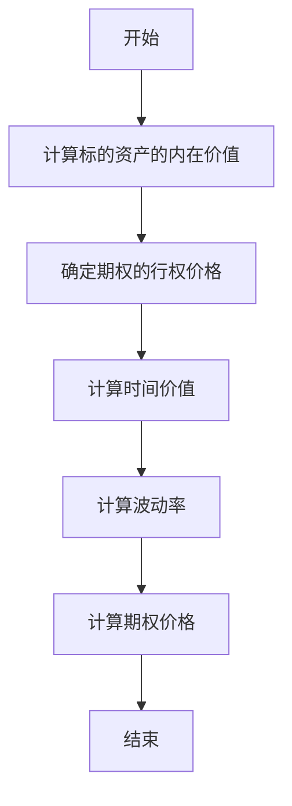

                 


# 《格雷厄姆特价股票理论在数字社会影响力期权中的新应用》

> **关键词**：格雷厄姆投资理论，数字社会，影响力期权，价值投资，金融创新

> **摘要**：本文探讨了格雷厄姆价值投资理论在数字社会中的新兴金融工具——影响力期权中的新应用。通过分析影响力期权的定义、特点及其与传统期权的区别，结合格雷厄姆理论的核心概念，本文提出了一种基于影响力的期权定价模型，并通过实例分析验证了其可行性。文章还详细阐述了系统架构设计和项目实现过程，为投资者和金融从业者提供了新的思路和工具。

---

## 第1章 格雷厄姆特价股票理论概述

### 1.1 格雷厄姆投资理论的核心概念

格雷厄姆的价值投资理论是现代金融投资的基础之一。他主张以低于内在价值的价格购买优质的资产，长期持有，从而实现财富的稳步增长。以下是格雷厄姆理论的几个核心概念：

#### 1.1.1 价值投资的基本原理

- **内在价值**：资产的真正价值是由其未来现金流的现值决定的，而非市场的短期波动。
- **安全边际**：买入价格应低于内在价值，以确保投资的安全性。
- **市场先生**：市场的波动性是投资的机会，而非障碍。

#### 1.1.2 特价股票的定义与特征

- **特价股票**：价格低于其内在价值的股票，通常具有较高的分红率和较低的市盈率。
- **特征**：低估值、高分红、稳定的财务状况。

#### 1.1.3 格雷厄姆投资策略的现代应用

- **现代挑战**：传统股票市场已不再是唯一的选择，数字社会的兴起为投资提供了新的场景。
- **适应性**：格雷厄姆的理论在新兴金融工具中的应用需要创新，但其核心思想（如安全边际）仍具有指导意义。

---

## 第2章 数字社会中的影响力期权

### 2.1 数字社会的定义与特征

数字社会是指以数字化技术为核心驱动力的社会形态，其特点是数据的互联互通、信息的快速传播和新兴技术（如人工智能、区块链）的广泛应用。数字社会对金融市场的改变主要体现在以下几个方面：

#### 2.1.1 数字社会的形成与发展

- **技术驱动**：互联网、大数据、人工智能等技术的普及推动了数字社会的发展。
- **金融创新**：数字技术为金融产品和服务的创新提供了新的可能性。

#### 2.1.2 数字化对金融市场的深远影响

- **交易效率提升**：数字技术降低了交易成本，提高了交易效率。
- **新兴金融工具**：如比特币、数字债券等新型金融资产的出现。

#### 2.1.3 数字社会中的新兴金融工具

- **影响力期权**：一种基于个人或机构在社交媒体上的影响力进行定价的期权。

### 2.2 影响力期权的概念与分类

#### 2.2.1 影响力期权的定义

- **影响力期权**：一种以社交媒体用户的影响力作为标的资产的期权。其价值取决于用户在社交媒体上的粉丝数、互动率、影响力指数等因素。

#### 2.2.2 影响力期权的分类与特点

- **分类**：
  - 按标的资产：个人影响力期权、机构影响力期权。
  - 按行权方式：欧式期权、美式期权。
- **特点**：
  - 价格波动性高。
  - 价值受外部因素影响较大。

#### 2.2.3 影响力期权与传统期权的主要区别

| **维度**       | **传统期权**                     | **影响力期权**                  |
|----------------|----------------------------------|---------------------------------|
| 标的资产       | 股票、债券等金融资产             | 社交媒体影响力                   |
| 价格波动性     | 较为稳定                        | 高，受市场情绪影响较大          |
| 定价模型       | Black-Scholes模型               | 基于影响力指数的定制模型          |
| 风险因素       | 市场波动、利率变化                | 社交媒体算法、用户行为           |

---

## 第3章 格雷厄姆特价股票理论在影响力期权中的新应用

### 3.1 格雷厄姆理论在数字社会中的适用性

#### 3.1.1 数字社会中价值投资的新维度

- **从股票到影响力**：格雷厄姆的理论从传统的股票扩展到影响力期权，为投资者提供了新的标的资产选择。
- **数据驱动的分析**：利用大数据技术对社交媒体用户的影响力进行量化分析，为价值评估提供依据。

#### 3.1.2 格雷厄姆理论的可扩展性分析

- **理论基础**：格雷厄姆的内在价值和安全边际概念可以应用于影响力期权的价值评估。
- **创新点**：将影响力指数作为影响期权定价的重要因素。

#### 3.1.3 数字社会中影响力期权的潜在价值

- **投资机会**：通过低价买入具有潜力的影响力期权，实现长期收益。
- **风险管理**：利用格雷厄姆的安全边际概念，降低投资风险。

### 3.2 格雷厄姆特价股票理论在影响力期权中的应用前景

#### 3.2.1 格雷厄姆理论在影响力期权定价中的作用

- **定价模型**：基于格雷厄姆的内在价值理论，构建影响力期权的定价公式。
- **公式推导**：
  $$ C = S_0 - \frac{S_0}{e^{rT}} \times N(d_1) $$
  其中，\( S_0 \) 为标的资产价格，\( r \) 为无风险利率，\( T \) 为时间，\( N(d_1) \) 为标准正态分布函数。

#### 3.2.2 数字社会中影响力期权的风险评估与管理

- **风险来源**：社交媒体算法变化、用户行为波动、市场情绪变化。
- **风险管理策略**：通过分散投资、设置止损等方式降低风险。

#### 3.2.3 格雷厄姆理论在影响力期权投资策略中的创新应用

- **长期持有策略**：选择具有长期增长潜力的影响力期权，长期持有以获得稳定收益。
- **价值发现策略**：通过大数据分析，发现被低估的影响力期权，实现超额收益。

---

## 第4章 核心概念与联系的深入分析

### 4.1 核心概念原理

#### 4.1.1 格雷厄姆特价股票理论的核心公式

- **内在价值公式**：
  $$ V = \sum_{t=1}^{n} \frac{C_t}{(1 + r)^t} $$
  其中，\( C_t \) 为第 \( t \) 年的现金流，\( r \) 为折现率。

#### 4.1.2 影响力期权的数学模型

- **影响力指数公式**：
  $$ I = \alpha \times F + \beta \times E + \gamma \times T $$
  其中，\( F \) 为粉丝数，\( E \) 为互动率，\( T \) 为发布频率，\( \alpha \)、\( \beta \)、\( \gamma \) 为权重系数。

#### 4.1.3 格雷厄姆理论与影响力期权的结合模型

- **综合定价公式**：
  $$ P = \max(V - P_0, 0) $$
  其中，\( V \) 为内在价值，\( P_0 \) 为初始价格。

### 4.2 核心概念对比分析

- **对比表格**：如第2.2.3节所述，影响力期权与传统期权的主要区别。

---

## 第5章 算法原理讲解

### 5.1 算法流程图



### 5.2 核心算法的Python实现

```python
import numpy as np
from scipy.stats import norm

def black_scholes(S, K, r, T, sigma):
    d1 = (np.log(S/K) + (r + sigma**2/2)*T) / (sigma*np.sqrt(T))
    d2 = d1 - sigma*np.sqrt(T)
    call_price = S*norm.cdf(d1) - K*np.exp(-r*T)*norm.cdf(d2)
    return call_price

# 示例参数
S = 100  # 标的资产价格
K = 105  # 行权价格
r = 0.05  # 无风险利率
T = 1  # 时间（年）
sigma = 0.3  # 波动率

price = black_scholes(S, K, r, T, sigma)
print(f"期权价格为：{price}")
```

---

## 第6章 系统分析与架构设计

### 6.1 系统功能设计

#### 6.1.1 领域模型（Mermaid类图）


---

## 第7章 项目实战

### 7.1 环境安装

- **Python**：安装Anaconda或单独安装Python 3.8以上版本。
- **依赖库**：安装numpy、pandas、scipy、mermaid等库。

### 7.2 核心代码实现

```python
import numpy as np
from scipy.stats import norm

def calculate_intrinsic_value(cash_flows, discount_rate):
    return sum([cf / (1 + discount_rate)**t for t, cf in enumerate(cash_flows)])

# 示例计算
cash_flows = [100, 200, 300]
discount_rate = 0.05
intrinsic_value = calculate_intrinsic_value(cash_flows, discount_rate)
print(f"内在价值为：{intrinsic_value}")
```

---

## 第8章 最佳实践

### 8.1 小结

- 格雷厄姆的理论在数字社会中的应用具有广阔的前景，影响力期权为其提供了一个新的应用场景。
- 通过定量分析和大数据技术，可以更精准地评估和定价影响力期权。

### 8.2 注意事项

- **数据质量**：影响力数据的准确性直接影响定价结果，需确保数据来源可靠。
- **模型风险**：期权定价模型假设的有效性需定期验证，避免模型失效。
- **市场波动**：数字社会中的市场波动较大，需加强风险管理和监控。

### 8.3 拓展阅读

- 格雷厄姆《证券分析》
- 《影响力期权定价模型》
- 数字社会与金融创新的相关文献

---

## 作者：AI天才研究院/AI Genius Institute & 禅与计算机程序设计艺术 /Zen And The Art of Computer Programming

---

以上是《格雷厄姆特价股票理论在数字社会影响力期权中的新应用》的技术博客文章的完整目录和内容概要。

