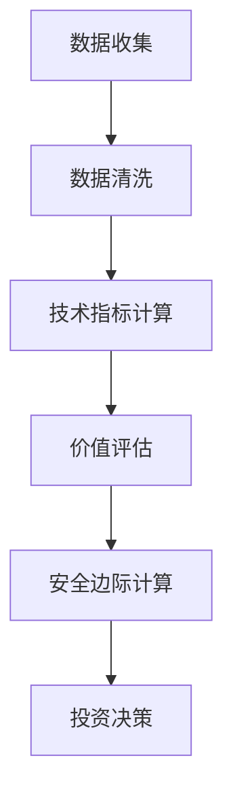
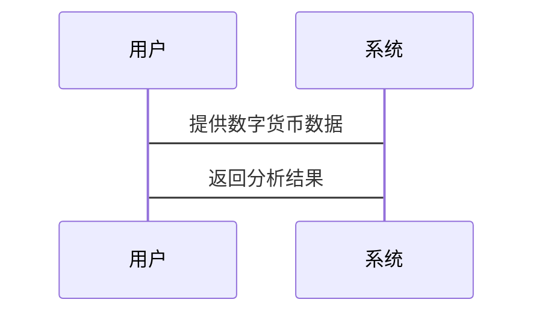

                 


# 格雷厄姆特价股票理论在数字货币时代的新思考

> **关键词**：格雷厄姆投资理论、数字货币、价值投资、安全边际、内在价值、技术分析、数学模型

> **摘要**：本文探讨了本杰明·格雷厄姆的价值投资理论在数字货币市场中的应用。通过分析传统股票与数字货币市场的异同，结合算法和数学模型，提出了一种适用于数字货币市场的投资策略，旨在为投资者提供新的视角和方法。

---

## 第1章: 背景介绍

### 1.1 格雷厄姆投资理论的核心概念

格雷厄姆的价值投资理论强调以低于内在价值的价格买入优质股票，长期持有，等待价格回归。其核心概念包括：

- **内在价值**：资产的合理价格，基于基本面分析计算得出。
- **安全边际**：买入价格与内在价值的差额，确保投资的安全性。
- **价值投资**：寻找被市场低估的资产，长期持有。

#### 核心概念对比表

| 概念               | 格雷厄姆理论定义                     | 数字货币市场的应用                     |
|--------------------|--------------------------------------|----------------------------------------|
| 内在价值           | 基于财务指标的企业价值               | 基于技术指标和市场因素的数字货币价值   |
| 安全边际           | 购买价格低于内在价值的部分           | 购买价格低于算法计算的公允价值部分     |
| 价值投资           | 长期持有优质股票                    | 长期持有优质数字货币或项目             |

### 1.2 数字货币市场的现状与挑战

数字货币市场的高波动性、去中心化和技术创新为投资者带来了新的机会和挑战。与传统股票市场相比，数字货币市场的参与者更关注技术指标和市场情绪，而非基本面分析。

---

## 第2章: 格雷厄姆理论的核心概念与数字货币的结合

### 2.1 格雷厄姆的安全边际在数字货币中的应用

安全边际是格雷厄姆理论的核心，用于降低投资风险。在数字货币市场中，由于价格波动剧烈，安全边际尤为重要。

#### 安全边际计算公式

$$ \text{安全边际} = \text{买入价格} - \text{内在价值} $$

例如，某数字货币的内在价值为100美元，若买入价格为80美元，安全边际为20美元。

### 2.2 数字货币的内在价值评估

与传统股票不同，数字货币的内在价值难以直接计算，需结合技术、市场和团队因素。

#### 内在价值计算公式

$$ V = \frac{E}{P} $$

其中，E是预期收益，P是资本成本。例如，若预期收益为1000万美元，资本成本为10%，则内在价值为1000万美元 / 0.1 = 1亿美元。

---

## 第3章: 格雷厄姆理论的算法实现

### 3.1 算法模型

格雷厄姆理论的算法模型包括数据收集、分析、决策三个步骤。

#### 算法流程图



### 3.2 数学模型与代码实现

以下是一个简单的Python代码示例：

```python
def calculate_intrinsic_value(revenue, growth_rate, discount_rate):
    return revenue * (1 + growth_rate) / discount_rate

def calculate_margin_of_safety(price, intrinsic_value):
    return price - intrinsic_value
```

---

## 第4章: 数学模型与公式

### 4.1 内在价值模型

$$ V = \frac{E}{P} $$

其中，E是企业的预期收益，P是资本成本。例如，若E为1000万美元，P为10%，则V为1亿美元。

### 4.2 安全边际模型

$$ M = P - V $$

其中，P是市场价格，V是内在价值。例如，若P为9000万美元，V为1亿美元，则M为1000万美元。

---

## 第5章: 系统分析与架构设计方案

### 5.1 需求分析

投资者需要一个能够实时分析数字货币内在价值和安全边际的系统。

### 5.2 系统架构设计


### 5.3 系统交互设计



---

## 第6章: 项目实战

### 6.1 案例分析

以比特币为例，计算其内在价值和安全边际。

### 6.2 投资策略

基于格雷厄姆理论，制定买入和卖出策略。

---

## 第7章: 总结与展望

### 7.1 总结

格雷厄姆理论在数字货币市场中的应用为投资者提供了新的视角和工具，但仍需结合市场特点进行调整。

### 7.2 展望

未来，随着市场的成熟和技术的进步，格雷厄姆理论的应用将更加广泛和深入。

---

## 结语

作者：AI天才研究院 & 禅与计算机程序设计艺术

---

**参考文献**：
1. 格雷厄姆《证券分析》
2. 比特币白皮书
3. 以太坊白皮书

---

**附加链接**：
1. [GitHub代码仓库](https://github.com/ai天才研究院/格雷厄姆理论在数字货币中的应用)
2. [作者博客](https://www.zenofprogramming.com)

---

通过以上结构，文章详细探讨了格雷厄姆理论在数字货币中的应用，结合算法和数学模型，为投资者提供了新的思路和工具。

