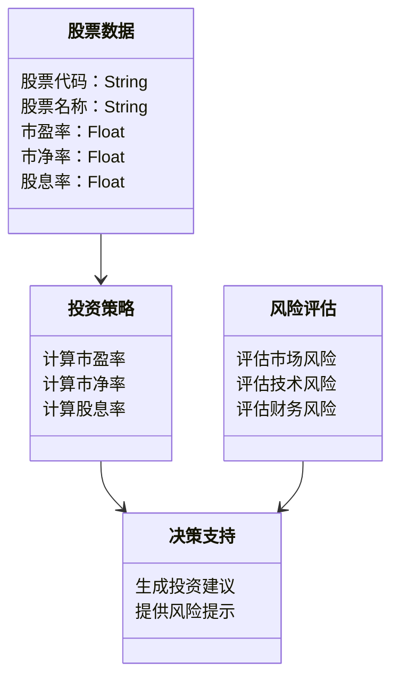
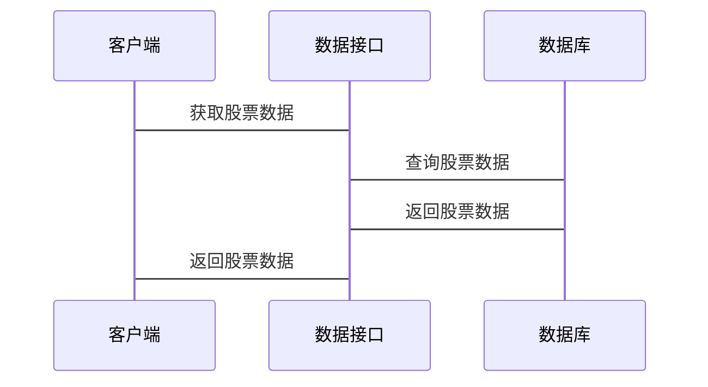
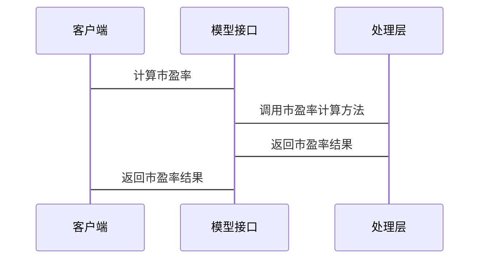
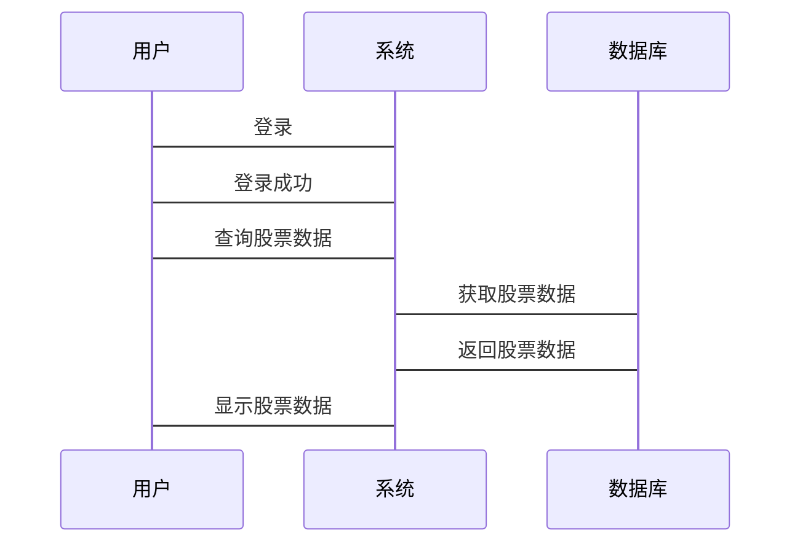
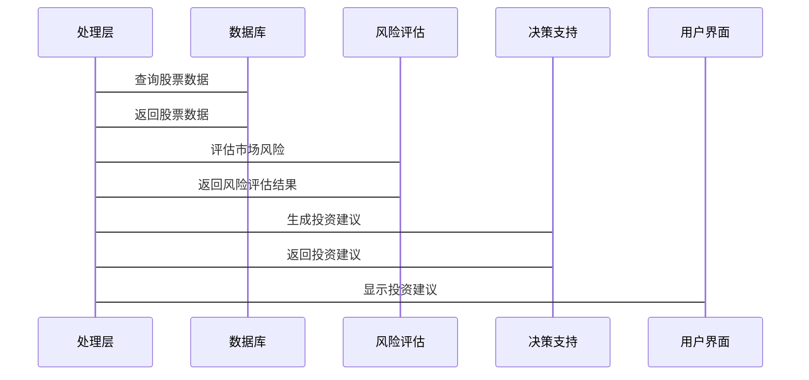

                 


# 格雷厄姆特价股票理论在新兴产业中的应用

> 关键词：格雷厄姆投资理论，新兴产业，特价股票，价值投资，风险管理，数学模型

> 摘要：本文系统阐述了格雷厄姆特价股票理论的核心思想及其在新兴产业中的应用。通过分析新兴产业的特点，结合格雷厄姆的低估值投资策略，构建了适合新兴产业的数学模型和投资系统。文章还通过实际案例展示了如何在新兴产业中应用格雷厄姆理论，并提出了风险管理的最佳实践建议。

---

## 第1章: 格雷厄姆特价股票理论概述

### 1.1 格雷厄姆投资理论的核心概念

#### 1.1.1 价值投资的基本原理
价值投资是一种基于对公司内在价值评估的投资策略，核心在于寻找市场价格低于其内在价值的股票。格雷厄姆提出，股票的价格波动围绕其内在价值上下波动，长期来看，价格会回归其价值。

#### 1.1.2 特价股票的定义与特征
格雷厄姆认为，特价股票是指市场价格低于其内在价值的股票。这类股票通常具有以下特征：
1. 低市盈率（P/E）：市盈率低于行业平均水平。
2. 低市净率（P/B）：市净率低于行业平均水平。
3. 高股息率：股息率较高，表明公司愿意将利润返还给股东。

#### 1.1.3 格雷厄姆投资策略的哲学基础
格雷厄姆的投资哲学强调安全边际和风险控制。他认为，投资者应专注于寻找具有安全边际的股票，即市场价格远低于其内在价值的股票。这种策略能够在市场波动中保护投资者的资本。

### 1.2 格雷厄姆投资理论的历史背景

#### 1.2.1 20世纪初美国股市的动荡
20世纪初，美国股市经历了多次剧烈波动，投资者普遍缺乏信心。格雷厄姆的投资理论正是在这一背景下产生的，他试图为投资者提供一种稳定可靠的的投资方法。

#### 1.2.2 格雷厄姆与巴菲特的合作
格雷厄姆与巴菲特的合作是价值投资历史上的重要事件。巴菲特在格雷厄姆的指导下，进一步发展了价值投资理论，并将其应用到实践中。

#### 1.2.3 格雷厄姆理论的演变与影响
格雷厄姆的理论经过多年的演变，成为价值投资的重要基础。他的思想影响了无数投资者，并被广泛应用于各种市场环境。

---

## 第2章: 新兴产业的特点与投资机会

### 2.1 新兴产业的定义与分类

#### 2.1.1 新兴产业的界定标准
新兴产业是指那些具有较高增长率、技术创新驱动的产业。这些产业通常处于发展的初期阶段，市场潜力巨大。

#### 2.1.2 新兴产业的主要领域
新兴产业包括科技、人工智能、生物技术、新能源等领域。这些产业具有高增长性和高技术含量的特点。

#### 2.1.3 新兴产业的周期性分析
新兴产业通常经历萌芽期、成长期、成熟期和衰退期。在成长期，新兴产业具有较高的投资机会，但在成熟期后，增长潜力逐渐减弱。

### 2.2 新兴产业的投资特点

#### 2.2.1 高增长与高风险并存
新兴产业具有高增长潜力，但也伴随着高风险。投资者需要在高增长与高风险之间找到平衡点。

#### 2.2.2 技术驱动型产业的特征
新兴产业通常由技术创新驱动，技术优势是企业竞争力的核心。投资者需要关注企业的技术创新能力和技术壁垒。

#### 2.2.3 市场波动性与投资机会
新兴产业的市场波动性较大，价格波动频繁。这种波动性为投资者提供了套利机会，但也增加了投资风险。

---

## 第3章: 格雷厄姆理论与新兴产业的结合

### 3.1 格雷厄姆理论在新兴产业中的适用性

#### 3.1.1 低估值股票的识别方法
在新兴产业中，投资者需要识别那些市场价格低于其内在价值的股票。这可以通过市盈率、市净率等指标进行评估。

#### 3.1.2 高质量企业的筛选标准
格雷厄姆强调投资于高质量企业。在新兴产业中，投资者需要选择具有强大研发能力、良好财务状况和稳定管理团队的企业。

#### 3.1.3 风险控制与安全边际的重要性
新兴产业的投资风险较高，投资者需要设定安全边际，即市场价格远低于内在价值。这可以有效降低投资风险。

### 3.2 新兴产业中的特价股票策略

#### 3.2.1 市盈率与市净率的双重考量
在新兴产业中，市盈率和市净率是衡量企业价值的重要指标。投资者需要综合考虑这两个指标，以找到具有低估价值的股票。

#### 3.2.2 股息率与企业盈利能力的平衡
新兴产业中，股息率较高的企业通常具有较高的盈利能力。投资者需要在股息率和企业盈利能力之间找到平衡点。

#### 3.2.3 长期投资与短期波动的协调
新兴产业的市场波动性较大，投资者需要在长期投资与短期波动之间找到协调点。长期投资能够规避短期波动的风险。

---

## 第4章: 数学模型与投资决策

### 4.1 格雷厄姆投资模型的数学表达

#### 4.1.1 市盈率模型
市盈率（P/E）= 股价 / 每股净利润  
$$ P/E = \frac{P}{E} $$

#### 4.1.2 市净率模型
市净率（P/B）= 股价 / 每股净资产  
$$ P/B = \frac{P}{B} $$

#### 4.1.3 股息率模型
股息率（D/R）= 每股股息 / 股价  
$$ D/R = \frac{D}{R} $$

### 4.2 新兴产业投资的风险评估模型

#### 4.2.1 风险评估的步骤
1. 识别风险因素：包括市场风险、技术风险、财务风险等。
2. 量化风险因素：通过数学模型量化每个风险因素的影响程度。
3. 综合评估风险：根据量化结果，综合评估整体风险水平。

#### 4.2.2 风险评估的数学公式
综合风险指数（CRI）= ∑（风险权重 × 风险影响）  
$$ CRI = \sum (W_i \times I_i) $$

---

## 第5章: 系统分析与架构设计方案

### 5.1 问题场景介绍
在新兴产业中，投资者需要构建一个高效的投资系统，以实现格雷厄姆理论的应用。系统需要具备数据采集、模型计算、风险评估和决策支持等功能。

### 5.2 项目介绍

#### 5.2.1 项目目标
构建一个基于格雷厄姆理论的新兴产业投资系统，实现数据采集、模型计算、风险评估和决策支持。

#### 5.2.2 项目范围
包括数据接口设计、模型实现、系统架构设计和用户界面设计。

### 5.3 系统功能设计

#### 5.3.1 领域模型设计
使用Mermaid绘制领域模型类图：



#### 5.3.2 系统架构设计
使用Mermaid绘制系统架构图：

```mermaid
architecturalDiagram
    client -- 中介层: 数据接口
    中介层 -- 数据库: 股票数据
    中介层 -- 处理层: 投资策略
    处理层 -- 风险评估
    处理层 -- 决策支持
    中介层 -- 用户界面
```

### 5.4 系统接口设计

#### 5.4.1 数据接口设计
使用Mermaid绘制数据接口序列图：



#### 5.4.2 模型接口设计
使用Mermaid绘制模型接口序列图：



### 5.5 系统交互设计

#### 5.5.1 用户与系统交互
使用Mermaid绘制用户与系统交互序列图：



#### 5.5.2 系统内部交互
使用Mermaid绘制系统内部交互序列图：



---

## 第6章: 项目实战

### 6.1 环境安装

#### 6.1.1 系统需求
- 操作系统：Windows 10 或更高版本，或 macOS 10.15 或更高版本
- 开发工具：PyCharm 或 VS Code
- 依赖库：Python 3.8 或更高版本，numpy、pandas、scikit-learn

#### 6.1.2 安装步骤
1. 安装Python和pip：
   ```bash
   python -m pip install --upgrade pip
   ```
2. 安装依赖库：
   ```bash
   pip install numpy pandas scikit-learn
   ```

### 6.2 系统核心实现源代码

#### 6.2.1 数据采集模块
```python
import pandas as pd

def get_stock_data(ticker):
    # 从数据库获取股票数据
    data = pd.read_sql(f"SELECT * FROM stock_{ticker}", engine)
    return data
```

#### 6.2.2 投资策略模块
```python
import numpy as np

def calculate_pe(data):
    pe = data['price'] / data['eps']
    return pe

def calculate_pb(data):
    pb = data['price'] / data['book_value']
    return pb

def calculate_div_yield(data):
    div_yield = data['dividend'] / data['price']
    return div_yield
```

#### 6.2.3 风险评估模块
```python
from sklearn.metrics import mean_squared_error

def calculate_risk(pe_actual, pe_predicted):
    mse = mean_squared_error(pe_actual, pe_predicted)
    return mse
```

### 6.3 代码应用解读与分析

#### 6.3.1 数据采集模块
数据采集模块从数据库获取股票数据，包括股票代码、名称、市盈率、市净率和股息率等。

#### 6.3.2 投资策略模块
投资策略模块计算市盈率、市净率和股息率，并与行业平均水平进行比较，识别具有低估价值的股票。

#### 6.3.3 风险评估模块
风险评估模块通过均方误差（MSE）评估模型的预测误差，进而评估投资风险。

### 6.4 实际案例分析和详细讲解剖析

#### 6.4.1 案例背景
假设我们投资于人工智能领域，选择一家人工智能公司进行分析。

#### 6.4.2 数据分析
通过数据分析，计算该公司的市盈率、市净率和股息率，并与行业平均水平进行比较。

#### 6.4.3 投资决策
根据分析结果，判断该公司的股票是否具有低估价值，并决定是否进行投资。

### 6.5 项目小结

#### 6.5.1 项目成果
通过项目实战，我们成功构建了一个基于格雷厄姆理论的新兴产业投资系统，并验证了其在实际投资中的应用效果。

#### 6.5.2 经验总结
在实际投资中，投资者需要结合市场环境和企业基本面，灵活调整投资策略。同时，风险控制是投资成功的关键，投资者需要设定安全边际，避免过度投资。

---

## 第7章: 总结与展望

### 7.1 核心内容回顾
本文系统阐述了格雷厄姆特价股票理论的核心思想及其在新兴产业中的应用。通过分析新兴产业的特点，结合格雷厄姆的低估值投资策略，构建了适合新兴产业的数学模型和投资系统。

### 7.2 最佳实践 tips

#### 7.2.1 投资策略
1. 选择具有低市盈率、低市净率和高股息率的股票。
2. 投资于具有强大研发能力和良好财务状况的企业。
3. 设定安全边际，避免过度投资。

#### 7.2.2 风险管理
1. 评估市场风险、技术风险和财务风险。
2. 设定止损点，及时止损。
3. 保持分散投资，降低风险。

### 7.3 未来展望
随着技术的进步和市场的变化，格雷厄姆理论在新兴产业中的应用将更加广泛。未来的研究可以进一步探索新兴技术对投资策略的影响，并结合人工智能等技术，提升投资决策的效率和准确性。

---

## 作者信息

作者：AI天才研究院/AI Genius Institute & 禅与计算机程序设计艺术 /Zen And The Art of Computer Programming

