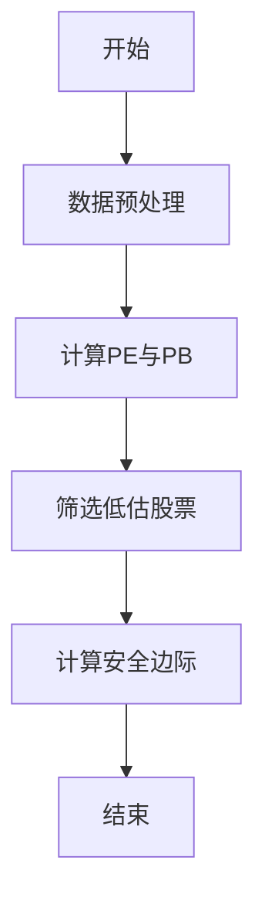

                 

# 格雷厄姆特价股票理论在新兴市场的适用性研究

## 关键词：格雷厄姆、特价股票理论、新兴市场、价值投资、投资策略

## 摘要：本文探讨格雷厄姆特价股票理论在新兴市场的适用性，分析新兴市场的特点与挑战，构建适用于新兴市场的投资模型，并通过实证研究和案例分析验证其有效性。文章结合数学模型、算法实现和系统设计，提出优化策略，为投资者提供理论支持和实践指导。

---

## 第1章: 引言

### 1.1 研究背景
- **价值投资**的核心理念是寻找被市场低估的股票，而格雷厄姆的特价股票理论是这一理念的典型代表。
- 格雷厄姆策略依赖于市盈率（PE）和市净率（PB）等指标，这些指标在成熟市场表现良好。
- 然而，新兴市场的复杂性（如高波动性、信息不透明）使得格雷厄姆策略的直接应用面临挑战。

### 1.2 研究目标
- 分析格雷厄姆策略在新兴市场的适用性。
- 构建适用于新兴市场的投资模型。
- 提出优化策略，解决新兴市场中的投资问题。

---

## 第2章: 格雷厄姆特价股票理论的核心原理

### 2.1 核心概念
- **价值投资**：寻找价格低于内在价值的股票。
- **安全边际**：价格与内在价值的差距，确保投资的安全性。

### 2.2 核心指标
- **市盈率（PE）**：衡量股价与盈利的关系。
- **市净率（PB）**：衡量股价与资产价值的关系。

### 2.3 格雷厄姆策略的系统架构

---

## 第3章: 新兴市场的特点与挑战

### 3.1 新兴市场的特点
- **高波动性**：市场容易受到外部因素影响。
- **信息不透明**：公司治理和财务数据可能存在瑕疵。
- **市场规模小**：流动性不足，价格容易被操纵。

### 3.2 格雷厄姆策略在新兴市场的挑战
- **指标失效**：PE和PB在新兴市场可能无法准确反映公司价值。
- **高波动性**：低估股票可能因市场波动被进一步低估或高估。

---

## 第4章: 格雷厄姆策略在新兴市场的适用性分析

### 4.1 适用性分析
- **市场效率**：新兴市场通常效率较低，存在低估股票的机会。
- **公司治理**：新兴市场公司治理问题较多，影响投资决策。

### 4.2 模型构建与优化
- **调整筛选标准**：引入流动性、行业风险等指标。
- **动态调整**：根据市场变化动态调整筛选标准。

### 4.3 数学模型
- **原始模型**：
  $$ \text{低估股票} = \{ stock | PE < 历史均值 \} $$
- **优化模型**：
  $$ \text{新兴市场低估股票} = \{ stock | PE < 历史均值 \land PB < 行业均值 \} $$

---

## 第5章: 实证研究与案例分析

### 5.1 实证研究
- **样本选择**：选取新兴市场中的若干公司。
- **回测结果**：验证优化模型的有效性。

### 5.2 案例分析
- **案例一**：某新兴市场公司的PE和PB分析。
- **案例二**：动态调整策略的应用效果。

---

## 第6章: 风险管理与策略调整

### 6.1 风险管理
- **分散投资**：降低市场波动带来的风险。
- **动态调整**：根据市场变化及时调整投资组合。

### 6.2 策略优化
- **动态PE/PB模型**：结合市场变化调整筛选标准。
- **多因素模型**：引入更多因素（如行业风险、流动性）。

---

## 第7章: 结论与建议

### 7.1 研究结论
- 格雷厄姆策略在新兴市场具有一定的适用性。
- 通过优化模型和动态调整策略，可以提高投资效果。

### 7.2 投资建议
- 采用多因素模型，提高筛选准确性。
- 结合市场变化，动态调整投资策略。

---

## 作者：AI天才研究院/AI Genius Institute & 禅与计算机程序设计艺术 /Zen And The Art of Computer Programming

