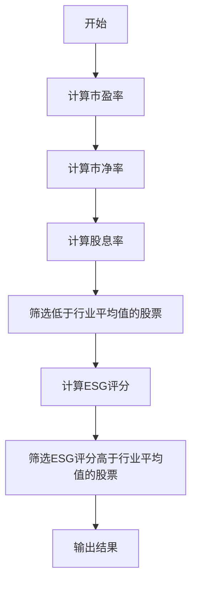
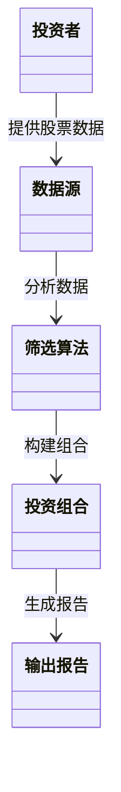

                 


# 格雷厄姆特价股票理论在社会企业投资中的应用

## 关键词：格雷厄姆、特价股票理论、社会企业、投资、ESG

## 摘要

本文探讨了格雷厄姆的价值投资理论在社会企业中的应用，特别是如何结合ESG指标筛选出具有投资价值的公司。通过分析社会企业的特点和格雷厄姆选股标准，结合算法和系统架构，本文提供了详细的理论和实践指导。

---

# 第一部分: 格雷厄姆特价股票理论与社会企业投资的背景

## 第1章: 格雷厄姆价值投资理论概述

### 1.1 格雷厄姆价值投资的起源

#### 1.1.1 价值投资的定义与核心理念

价值投资是一种以基本面分析为基础的投资策略，强调以低于内在价值的价格购买优质资产。其核心理念包括长期投资、注重安全边际和寻找市场低估的机会。

#### 1.1.2 格雷厄姆的贡献与影响

本杰明·格雷厄姆是价值投资之父，他提出的“捡烟蒂”策略强调购买市场低估的股票，注重安全边际和长期价值。

#### 1.1.3 格雷厄姆特价股票理论的形成

格雷厄姆通过分析市场波动性和投资者心理，提出寻找具有低市盈率、低市净率和高股息率的股票作为投资目标。

## 第2章: 社会企业的定义与特点

### 2.1 社会企业的基本概念

社会企业是以实现社会价值为目标，兼顾经济利益和可持续发展，关注环境、社会和治理因素的企业。

### 2.2 社会企业的投资价值

社会企业因其可持续发展和ESG表现良好，逐渐成为投资者关注的焦点，具备长期投资价值。

### 2.3 格雷厄姆理论与社会企业的契合点

社会企业的核心特征与格雷厄姆选股标准有天然契合，尤其是低市盈率、低市净率和高股息率。

---

# 第二部分: 格雷厄姆特价股票理论的核心概念与联系

## 第4章: 核心概念的详细解析

### 4.1 格雷厄姆特价股票的核心指标

#### 4.1.1 市盈率（P/E）的计算与应用

市盈率=股票价格/每股净利润，用于衡量股票的估值水平。

#### 4.1.2 市净率（P/B）的计算与应用

市净率=股票价格/每股净资产，用于判断股票是否被低估。

#### 4.1.3 股息率的计算与应用

股息率=每股股息/股票价格，高股息率意味着较高的分红回报。

### 4.2 社会企业投资的关键指标

#### 4.2.1 ESG评分的计算方法

ESG评分综合考虑环境、社会和治理因素，评估企业的可持续性。

#### 4.2.2 社会责任报告的核心内容

包括企业在环保、社会责任和公司治理方面的表现。

#### 4.2.3 可持续发展价值

社会企业的可持续发展价值不仅体现在经济上，还包括社会和环境效益。

---

# 第三部分: 格雷厄姆特价股票理论的算法原理与系统架构

## 第5章: 格雷厄姆特价股票筛选算法

### 5.1 算法原理

通过计算市盈率、市净率和股息率，筛选出低于行业平均水平的股票，同时结合ESG评分高的企业。

### 5.2 算法流程图



### 5.3 Python代码实现

```python
import yfinance as yf

def calculate_valuation Metrics(ticker):
    df = yf.download(ticker, ...)
    pe = df['Adj Close'] / df['净利润每股']
    pb = df['Adj Close'] / df['净资产每股']
    dividend_yield = df['股息率']
    return pe, pb, dividend_yield

def screen_undervalued_stocks(tickers):
    undervalued = []
    for ticker in tickers:
        pe, pb, dy = calculate_valuation_Metrics(ticker)
        if pe < industry_pe and pb < industry_pb and dy > industry_dy:
            undervalued.append(ticker)
    return undervalued

# 示例
tickers = ['MSFT', 'AAPL', 'GOOGL']
undervalued = screen_undervalued_stocks(tickers)
print(undervalued)
```

### 5.4 系统架构设计



---

# 第四部分: 项目实战与案例分析

## 第6章: 项目实战

### 6.1 环境安装

安装必要的库，如yfinance和pandas。

```bash
pip install yfinance pandas
```

### 6.2 核心代码实现

```python
import yfinance as yf
import pandas as pd

def fetch_data(tickers):
    data = {}
    for ticker in tickers:
        df = yf.download(ticker, period='max')
        data[ticker] = df
    return data

def calculate_esg(tickers):
    esg_scores = {}
    for ticker in tickers:
        # 示例：计算ESG得分，实际需要调用ESG数据API
        esg_scores[ticker] = get_esg_score(ticker)
    return esg_scores

# 示例
tickers = ['AAPL', 'MSFT', 'GOOGL']
data = fetch_data(tickers)
esg_scores = calculate_esg(tickers)

# 结合格雷厄姆筛选和ESG评分
undervalued = []
for ticker in tickers:
    pe = data[ticker]['Adj Close'] / data[ticker]['净利润每股']
    pb = data[ticker]['Adj Close'] / data[ticker]['净资产每股']
    dy = data[ticker]['股息率']
    if pe < industry_pe and pb < industry_pb and dy > industry_dy and esg_scores[ticker] > industry_esg:
        undervalued.append(ticker)
print(undervalued)
```

### 6.3 案例分析

以科技行业为例，筛选市盈率低于行业平均、市净率低于行业平均、股息率高于行业平均且ESG评分高的公司。

---

# 第五部分: 总结与展望

## 第7章: 总结与展望

### 7.1 核心内容回顾

格雷厄姆的选股标准与社会企业的ESG指标相结合，为投资者提供了一种新的价值投资策略。

### 7.2 应用中的挑战与未来趋势

尽管有诸多优势，但该方法仍面临数据获取、模型优化和动态调整等挑战。未来，随着ESG数据的完善和AI技术的发展，这一策略将更加精准有效。

### 7.3 投资建议与注意事项

投资者应结合市场环境和企业具体情况，灵活调整投资策略，并持续关注企业的ESG表现。

### 7.4 拓展阅读与学习资源

推荐阅读格雷厄姆的《 Intelligent Investor 》和现代ESG投资相关的书籍，深入了解价值投资与可持续发展的结合。

---

# 作者：AI天才研究院 & 禅与计算机程序设计艺术

感谢您的阅读！希望本文对您理解格雷厄姆价值投资理论在社会企业中的应用有所帮助。如需进一步探讨，欢迎随时联系。

