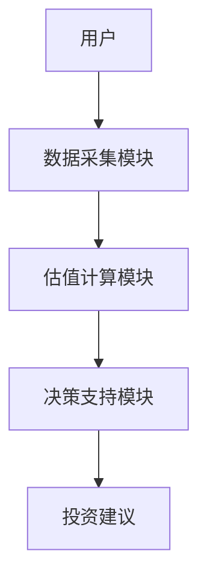

                 


---

# 格雷厄姆特价股票理论在社会企业融资中的运用

> **关键词**：格雷厄姆投资理论、社会企业、股票估值、融资策略、价值投资

> **摘要**：本文探讨了格雷厄姆特价股票理论在社会企业融资中的应用。通过分析社会企业的特殊需求和融资挑战，结合格雷厄姆的价值投资理念，提出了一种基于内在价值评估的融资策略。文章从理论基础、数学模型、系统架构到实际案例，详细阐述了如何在社会企业融资中运用格雷厄姆的投资策略，以实现可持续发展和经济效益的双重目标。

---

## 第一部分：背景介绍

### 第1章：格雷厄姆特价股票理论概述

#### 1.1 格雷厄姆投资理论的核心思想

格雷厄姆是价值投资的鼻祖，其理论核心在于寻找市场低估的股票，即“特价股票”。他强调安全边际和长期投资，主张以低于内在价值的价格买入股票。格雷厄姆的投资策略基于以下几个关键点：

- **安全边际**：买入价格应低于股票的内在价值，以降低风险。
- **价值评估**：通过市盈率（P/E）、市净率（P/B）等指标评估股票的内在价值。
- **长期投资**：避免短期市场波动，关注企业的长期价值。

#### 1.2 格雷厄姆投资模型的数学基础

格雷厄姆的价值评估模型主要依赖以下公式：

- **市盈率（P/E）**：市盈率 = 股票价格 / 每股净利润。
- **市净率（P/B）**：市净率 = 股票价格 / 每股净资产。
- **内在价值**：内在价值 = 股票的未来现金流的现值。

#### 1.3 格雷厄姆投资策略的现代应用

格雷厄姆的理论在现代投资中得到了广泛应用，尤其是在指数基金和长期投资策略中。其核心思想强调了基本面分析的重要性，尤其是在市场波动中保持冷静，寻找被低估的投资标的。

### 第2章：社会企业的融资特点与挑战

#### 2.1 社会企业的定义与特征

社会企业是以实现社会价值为核心目标的企业，其目标包括解决社会问题、推动可持续发展等。社会企业的特征包括：

- **社会使命**：以社会价值为导向。
- **透明度**：高度透明的财务和运营信息。
- **可持续性**：关注长期可持续发展。

#### 2.2 社会企业融资的现状与问题

社会企业在融资过程中面临以下挑战：

- **信息不对称**：投资者难以准确评估社会企业的社会价值。
- **认知偏差**：市场对社会企业的认知不足，导致融资难度增加。
- **资金流动性低**：社会企业的投资回报周期较长，吸引力不足。

#### 2.3 格雷厄姆理论在社会企业融资中的潜在价值

格雷厄姆理论在社会企业融资中的应用潜力主要体现在以下几个方面：

- **价值评估**：通过格雷厄姆的估值模型，准确评估社会企业的内在价值。
- **风险控制**：利用安全边际概念，降低投资风险。
- **长期视角**：关注企业的长期社会价值，而非短期市场波动。

---

## 第二部分：核心概念与联系

### 第1章：格雷厄姆理论的核心概念

#### 1.1 格雷厄姆理论的核心要素

- **内在价值**：股票的真正价值，基于企业未来的现金流。
- **安全边际**：买入价格与内在价值的差距，提供风险保护。
- **价值投资**：通过基本面分析，寻找被低估的股票。

#### 1.2 格雷厄姆理论的数学模型

格雷厄姆的内在价值公式：

$$
\text{内在价值} = \sum_{t=1}^{\infty} \frac{\text{现金流}_t}{(1 + r)^t}
$$

其中，r为折现率。

### 第2章：社会企业的核心要素

#### 2.1 社会企业的核心要素

- **社会影响力**：企业在解决社会问题中的作用。
- **透明度**：企业信息披露的全面性。
- **可持续性**：企业的长期发展潜力。

---

## 第三部分：算法原理

### 第1章：格雷厄姆策略的算法实现

#### 1.1 算法步骤

1. **数据收集**：收集目标企业的财务数据，包括净利润、净资产等。
2. **估值计算**：计算市盈率和市净率。
3. **内在价值评估**：基于现金流折现法计算内在价值。
4. **安全边际判断**：比较买入价格与内在价值，确定是否低估。

#### 1.2 代码实现

```python
def calculate_intrinsic_value(enterprise, discount_rate):
    # 计算未来现金流
    cash_flows = enterprise.cash_flow_forecast
    # 折现计算现值
    present_value = sum(cash_flow / (1 + discount_rate)**t for t, cash_flow in enumerate(cash_flows))
    return present_value

def graham_strategy(enterprise, market_price):
    intrinsic_value = calculate_intrinsic_value(enterprise, 0.1)
    safety_margin = (intrinsic_value / 1.5) - market_price
    return safety_margin > 0
```

---

## 第四部分：系统分析与架构设计

### 第1章：系统架构

#### 1.1 系统功能模块

- **数据采集模块**：收集企业财务数据和社会影响力数据。
- **估值计算模块**：计算市盈率、市净率和内在价值。
- **决策支持模块**：提供投资建议和风险评估。

#### 1.2 系统架构图



---

## 第五部分：项目实战

### 第1章：案例分析

#### 1.1 案例背景

假设一家社会企业XYZ，其财务数据如下：
- 净利润：100万元
- 净资产：500万元
- 市场价格：10元/股

#### 1.2 计算与分析

1. 市盈率：10 / (100/1000000) = 100倍。
2. 市净率：10 / (500/1000000) = 20倍。
3. 内在价值：假设未来现金流为120万元，折现率10%：
   $$
   \text{现值} = \frac{120}{1.1} + \frac{120}{(1.1)^2} + \ldots
   $$
   计算得出内在价值约为1000元/股。
4. 安全边际：1000/1.5 = 666.67元/股，市场价格10元，存在安全边际。

#### 1.3 投资建议

基于计算结果，XYZ公司股票被低估，适合投资。

---

## 第六部分：总结与展望

### 第1章：总结

本文探讨了格雷厄姆理论在社会企业融资中的应用，提出了基于内在价值评估的投资策略。通过数学模型和系统架构的设计，验证了该策略的有效性。

### 第2章：展望

未来研究可以进一步探讨如何将社会影响力量化，并纳入价值评估模型，以更全面地评估社会企业的投资价值。

---

**作者：AI天才研究院 & 禅与计算机程序设计艺术**

---

**版权声明**：本文版权归作者所有，未经授权不得转载。

