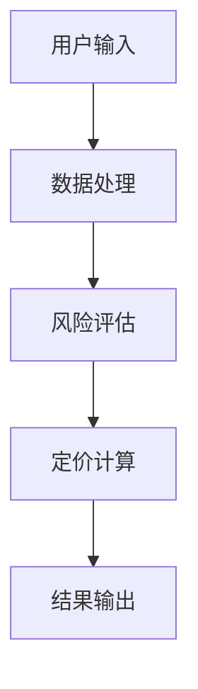

                 


# 格雷厄姆特价股票理论在社会影响力债券中的运用

> 关键词：格雷厄姆价值投资理论，社会影响力债券，投资策略，风险评估，价值评估模型

> 摘要：本文深入探讨了格雷厄姆价值投资理论在社会影响力债券（SIBs）中的应用。通过分析SIBs的核心机制和格雷厄姆理论的原理，构建了一个数学模型，将安全边际和内在价值的概念应用于SIBs的风险评估和定价。文章还通过实际案例，展示了如何利用格雷厄姆理论优化SIBs的投资策略，确保在实现社会目标的同时获得稳健的财务回报。

---

## 第一部分: 背景介绍与核心概念

### 第1章: 社会影响力债券的基本概念

#### 1.1 什么是社会影响力债券
- 社会影响力债券（SIBs）是一种创新型金融工具，其偿付与特定社会项目的成果挂钩。政府或非营利组织通过发行债券，吸引投资者资金用于教育、医疗、 homelessness 等社会问题的解决。
- SIBs 的特点：收益与成果挂钩，风险分担机制，透明度高。

#### 1.2 格雷厄姆价值投资理论概述
- 格雷厄姆是价值投资的鼻祖，强调以低于内在价值的价格买入股票，注重安全边际和长期持有。
- 核心理念：市场短期是投票器，长期是称重机；安全边际是投资的核心保护。

---

### 第2章: 核心概念与理论联系

#### 2.1 格雷厄姆理论与 SIBs 的联系
- **安全边际**：SIBs 的收益与社会项目成果挂钩，类似于股票的内在价值与市场价的差额。
- **内在价值**：通过社会项目的真实价值评估，确定 SIBs 的合理价格。
- **风险评估**：格雷厄姆的保守投资策略适用于 SIBs 的高风险特性。

#### 2.2 SIBs 的风险与回报分析
- **风险因素**：社会项目执行不确定性，债券流动性差，本金风险。
- **回报机制**：根据项目成果支付浮动利息，收益可能超过传统债券。

---

## 第二部分: 格雷厄姆理论在 SIBs 中的应用

### 第3章: 格雷厄姆价值投资理论的核心原理

#### 3.1 格雷厄姆的安全边际计算
- **公式**：安全边际 = 内在价值 - 市场价。
- **应用**：在 SIBs 中，安全边际用于评估债券价格的合理性。

#### 3.2 格雷厄姆的内在价值评估
- **公式**：内在价值 = ∑(未来现金流的现值)。
- **应用**：通过社会项目未来收益的现值评估 SIBs 的内在价值。

#### 3.3 格雷厄姆的市场周期理论
- **周期分析**：识别市场周期，把握 SIBs 的投资机会。

---

### 第4章: SIBs 的风险评估与定价模型

#### 4.1 SIBs 的风险评估框架
- **步骤**：
  1. 评估社会项目可行性。
  2. 分析债券发行方的信用风险。
  3. 量化流动性风险。
  4. 计算综合风险系数。

#### 4.2 格雷厄姆安全边际在 SIBs 中的应用
- **公式**：安全边际 = 内在价值 × (1 - 风险系数)。
- **案例**：假设 SIBs 的内在价值为 100，风险系数为 0.1，则安全边际为 90，市场价应低于 90。

---

## 第三部分: 数学模型与算法实现

### 第5章: 格雷厄姆理论与 SIBs 的数学模型

#### 5.1 内在价值评估模型
- **公式**：
  $$
  V = \frac{CF}{(1 + r)^n}
  $$
  其中，CF 是未来现金流，r 是折现率，n 是时间跨度。

#### 5.2 安全边际计算模型
- **公式**：
  $$
  \text{安全边际} = V - P
  $$
  其中，V 是内在价值，P 是市场价格。

#### 5.3 SIBs 的定价模型
- **公式**：
  $$
  P = \frac{V}{(1 + r)^n} \times (1 - \text{风险系数})
  $$

---

### 第6章: 算法实现与代码

#### 6.1 环境安装
- **工具**：Python 3.9+, Pandas, NumPy, Matplotlib。

#### 6.2 核心代码实现
```python
import pandas as pd
import numpy as np

def calculate_intrinsic_value(cash_flows, discount_rate, n):
    return sum(cash_flows / (1 + discount_rate) ** np.arange(1, n+1))

def calculate_margin_of_safety(intrinsic_value, market_price):
    return intrinsic_value - market_price

# 示例数据
cash_flows = [10, 15, 20, 25]
discount_rate = 0.05
n = 4

V = calculate_intrinsic_value(cash_flows, discount_rate, n)
P = 90  # 市场价格
 MOS = calculate_margin_of_safety(V, P)
print(f"内在价值: {V}, 市场价格: {P}, 安全边际: {MOS}")
```

---

## 第四部分: 系统分析与架构设计

### 第7章: 系统架构与功能设计

#### 7.1 系统功能模块
- **模块1**：社会项目数据输入。
- **模块2**：风险评估与定价计算。
- **模块3**：结果可视化与报告生成。

#### 7.2 系统架构图


---

## 第五部分: 项目实战与案例分析

### 第8章: 项目实战

#### 8.1 环境安装与数据准备
- **工具**：Jupyter Notebook。
- **数据**：社会项目的历史收益数据。

#### 8.2 核心代码实现
```python
import pandas as pd
import numpy as np

def calculate_intrinsic_value(cash_flows, discount_rate, n):
    return sum(cash_flows / (1 + discount_rate) ** np.arange(1, n+1))

# 示例数据
cash_flows = [100, 120, 150, 180]
discount_rate = 0.05
n = 4

V = calculate_intrinsic_value(cash_flows, discount_rate, n)
print(f"内在价值: {V}")
```

---

## 第六部分: 总结与展望

### 第9章: 总结

#### 9.1 核心发现
- 格雷厄姆理论为 SIBs 的投资提供了新的视角。
- 安全边际和内在价值的概念适用于 SIBs 的风险评估和定价。

#### 9.2 展望
- 进一步研究 SIBs 的流动性问题。
- 探索更多社会项目的评估方法。

---

## 附录

### 附录A: 进一步阅读
- 格雷厄姆《聪明的投资者》。
- SIBs 相关文献。

### 附录B: 工具与代码
- Python 代码示例。
- 数据处理工具。

---

作者：AI天才研究院/AI Genius Institute & 禅与计算机程序设计艺术 /Zen And The Art of Computer Programming

