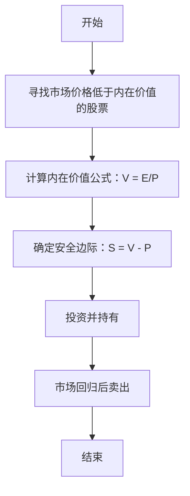
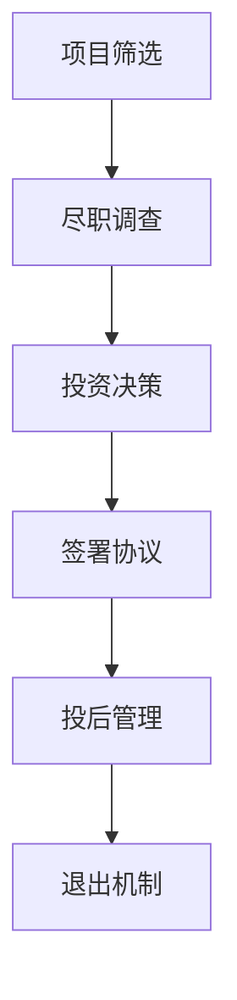
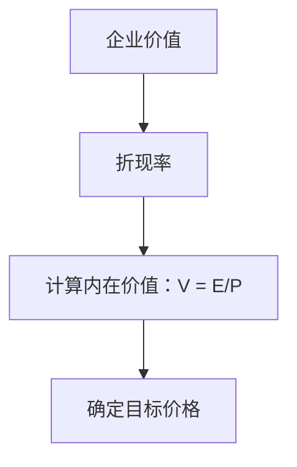

                 


# 《格雷厄姆特价股票理论在私募股权投资中的运用》

> **关键词**：格雷厄姆投资理论，私募股权投资，价值投资，安全边际，低市盈率，低市净率

> **摘要**：本文系统地探讨了格雷厄姆特价股票理论在私募股权投资中的应用。通过分析格雷厄姆的价值投资理念、数学模型和私募股权投资的基本运作机制，结合实际案例，详细阐述了如何将格雷厄姆的选股策略应用于私募股权的筛选和估值过程中。文章还提供了基于Python的数学模型实现和系统架构设计，最后通过项目实战验证了该理论的有效性。

---

## 第一部分: 格雷厄姆特价股票理论基础

### 第1章: 格雷厄姆特价股票理论概述

#### 1.1 格雷厄姆投资理论的背景与起源

**背景介绍**：格雷厄姆是价值投资的鼻祖，其理论在20世纪30年代经济大萧条期间形成。他强调安全边际和内在价值，认为市场恐慌是投资机会的来源。

**核心概念**：价值投资的核心在于寻找市场价格低于内在价值的股票。格雷厄姆提出了“安全边际”概念，即市场价格与内在价值之间的差距，以降低投资风险。

**问题描述**：传统股票投资中，市场波动可能导致短期亏损，但价值投资通过长期持有优质资产，最终实现收益。

**算法原理**：格雷厄姆的内在价值计算公式为：
$$ V = \frac{E}{P} $$
其中，\( V \) 是内在价值，\( E \) 是未来现金流的现值，\( P \) 是折现率。

**图表展示**：以下是格雷厄姆价值投资的流程图：



#### 1.2 格雷厄姆特价股票的核心概念

**低市盈率策略**：通过比较市盈率（PE）和行业平均水平，寻找被低估的股票。

**低市净率策略**：市净率（PB）同样用于判断股票是否被低估。

**高股息率策略**：优先考虑股息收益率高的股票，注重现金流稳定。

**数学模型**：格雷厄姆的多因子筛选模型：

$$ PE = \frac{P}{E} $$
$$ PB = \frac{P}{B} $$
$$ S = V - P $$

#### 1.3 本章小结

---

## 第二部分: 私募股权投资的运作机制

### 第2章: 私募股权投资的基本概念

#### 2.1 私募股权的定义与特点

**私募股权**：一种以非公开市场进行的股权投资，通常涉及杠杆收购和管理层收购。

**运作模式**：包括项目筛选、尽职调查、投资决策和投后管理。

**图表展示**：私募股权的运作流程图：



#### 2.2 私募股权投资的流程

**项目筛选**：通过财务指标、管理团队和市场前景筛选目标公司。

**尽职调查**：详细审查财务状况、法律风险和管理团队。

**投资决策**：基于尽职调查结果决定是否投资。

**退出机制**：通过IPO、并购或股权转让实现收益。

---

## 第三部分: 格雷厄姆理论在私募股权投资中的应用

### 第3章: 理论与实践的结合

#### 3.1 格雷厄姆选股指标的私募股权扩展

**扩展分析**：将低市盈率和低市净率的筛选标准应用于私募股权目标公司。

**案例分析**：假设某公司市盈率为10，低于行业平均值，且市净率为1.5，同样低于行业平均值，符合格雷厄姆的选股标准。

#### 3.2 安全边际在私募投资中的应用

**风险控制**：通过安全边际评估潜在投资的抗跌能力。

**案例分析**：某私募基金以低于内在价值的价格收购一家公司，安全边际为20%，有效降低投资风险。

#### 3.3 格雷厄姆理论的优缺点

**优点**：风险控制能力强，适合长期投资。

**缺点**：忽视市场趋势，可能导致错失短期收益。

---

## 第四部分: 数学模型与算法实现

### 第4章: 数学模型的建立与应用

#### 4.1 格雷厄姆价值评估模型的Python实现

```python
def calculate_intrinsic_value(enterprise_value, free_cash_flow, discount_rate):
    # 内在价值计算公式：V = E / P
    # 其中E为未来现金流的现值
    # P为折现率
    # 返回内在价值
    return enterprise_value / (1 + discount_rate)
```

**图表展示**：价值评估模型的系统架构图：



#### 4.2 低市盈率与低市净率的筛选算法

**Python代码实现**：

```python
def screen_low_pe_stocks(pe_ratio, pb_ratio):
    # 筛选低市盈率和低市净率的股票
    # pe_ratio和pb_ratio分别为市盈率和市净率
    # 返回符合条件的股票列表
    selected_stocks = []
    for stock in stocks:
        if stock.pe_ratio < pe_ratio and stock.pb_ratio < pb_ratio:
            selected_stocks.append(stock)
    return selected_stocks
```

---

## 第五部分: 项目实战与案例分析

### 第5章: 项目实战

#### 5.1 环境搭建

**工具安装**：安装Python、Pandas、NumPy等数据分析库。

**数据获取**：收集目标公司的财务数据和市场数据。

#### 5.2 核心代码实现

```python
import pandas as pd

# 假设data是一个包含公司财务数据的DataFrame
def calculate_margin_of_safety(data):
    data['Intrinsic_Value'] = data['Enterprise_Value'] / (1 + data['Discount_Rate'])
    data['Safety_Margin'] = data['Intrinsic_Value'] - data['Market_Price']
    return data

# 应用函数
data = calculate_margin_of_safety(data)
```

#### 5.3 案例分析

**案例1**：某制造业公司市盈率为12，市净率为1.8，低于行业平均值，具有投资价值。

**案例2**：某科技公司市盈率为25，高于行业平均值，不符合格雷厄姆标准。

#### 5.4 项目总结

---

## 第六部分: 最佳实践与总结

### 第6章: 最佳实践

#### 6.1 投资策略优化

**动态调整**：根据市场变化定期调整筛选标准。

**组合投资**：分散投资以降低风险。

#### 6.2 风险管理

**定期评估**：监控市场变化和公司财务状况。

**止损机制**：设定止损点以控制损失。

#### 6.3 小结

格雷厄姆的价值投资理论为私募股权投资提供了有效的筛选和估值工具，但需要结合市场环境灵活运用。

---

## 参考文献

1. 格雷厄姆，本杰明. 《证券分析》
2. 芒格，查理. 《Poor Charlie's Almanack》
3. 张五乖. 《投资中最简单的事》

---

**作者：AI天才研究院 & 禅与计算机程序设计艺术**

通过以上结构，文章详细探讨了格雷厄姆理论在私募股权投资中的应用，结合理论分析、算法实现和实际案例，为读者提供了全面的指导。

