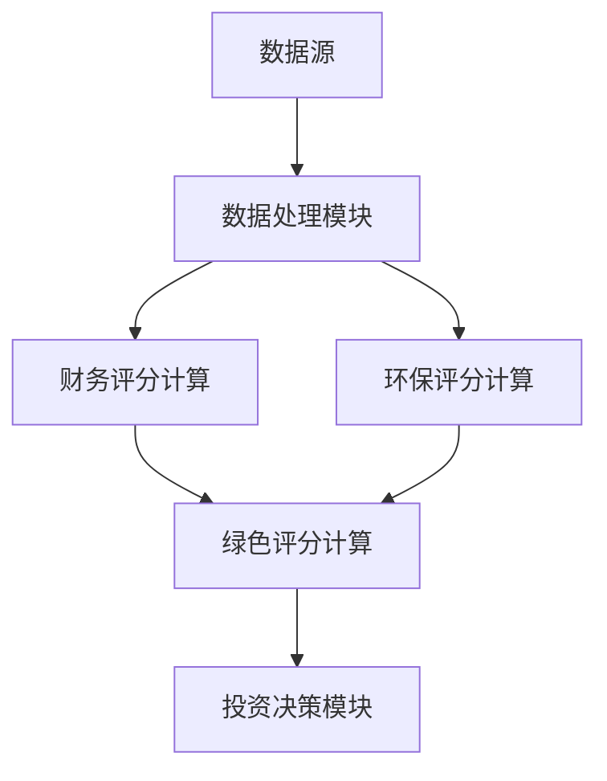

                 


# 格雷厄姆特价股票理论在绿色金融中的应用

> 关键词：格雷厄姆特价股票理论，绿色金融，价值投资，可持续发展，股票评估

> 摘要：本文探讨了如何将格雷厄姆的价值投资理论应用于绿色金融领域。通过分析绿色金融的核心概念、评估模型和实际案例，展示了如何在绿色投资中应用特价股票理论，以实现可持续的财务回报和社会价值。

---

## 第一部分：背景介绍

### 第1章：格雷厄姆特价股票理论概述

#### 1.1 格雷厄姆特价股票理论的定义与核心思想

格雷厄姆的价值投资理论强调以低于内在价值的价格购买股票，关注企业的基本面指标，如市盈率（P/E）、市净率（P/B）和股息率。他提出的核心观点是，市场短期可能非理性，但长期会回归企业的真实价值。这种理论特别适合用于寻找被市场低估的“特价股票”。

#### 1.2 绿色金融的定义与发展趋势

绿色金融是指支持环保和可持续发展的金融活动，包括绿色债券、绿色股票和绿色基金等。随着全球对环境保护的重视，绿色金融成为推动全球经济向可持续方向转型的重要工具。

#### 1.3 格雷厄姆特价股票理论在绿色金融中的应用价值

将格雷厄姆的理论应用于绿色金融，可以结合企业的环保表现和社会责任，筛选出具有长期投资价值的企业。这种方法不仅考虑了财务回报，还考虑了环境和社会效益，符合绿色金融的核心理念。

---

### 第2章：绿色金融的核心概念与评估体系

#### 2.1 绿色金融的核心概念

绿色金融的核心在于将环境因素纳入投资决策，关注企业的碳排放、能源使用效率和环保政策遵守情况。这些因素不仅影响企业的长期盈利能力，也决定了其社会价值。

#### 2.2 格雷厄姆理论与绿色金融的结合

通过引入绿色金融的评估指标，如碳排放强度和环保合规性，可以对企业的绿色表现进行评分。结合传统的财务指标，构建一个综合评估体系，帮助投资者在绿色金融领域找到真正的“特价股票”。

---

## 第二部分：算法原理与模型构建

### 第3章：绿色金融评估模型的构建

#### 3.1 内在价值的计算公式

$$
\text{内在价值} = \sum_{t=1}^{n} \frac{CF_t}{(1+r)^t}
$$

其中，$CF_t$ 是第 $t$ 年的现金流，$r$ 是折现率。该公式用于评估企业的未来现金流现值，作为内在价值的基准。

#### 3.2 绿色金融评分公式

$$
\text{绿色评分} = \alpha \cdot \text{财务评分} + \beta \cdot \text{环保评分}
$$

其中，$\alpha$ 和 $\beta$ 是权重系数，反映财务和环保因素的重要性。通过调整权重，可以实现对绿色企业的综合评估。

### 第4章：案例分析与实际应用

#### 4.1 案例分析：某绿色科技企业的评估

假设某绿色科技企业的财务评分为85，环保评分为90，权重分别为0.6和0.4。其绿色评分为：

$$
\text{绿色评分} = 0.6 \cdot 85 + 0.4 \cdot 90 = 79 + 36 = 115
$$

若该企业的当前股价为每股10元，而根据内在价值模型计算的内在价值为每股15元，且股价低于内在价值的20%（即12元），则该企业被视为具有投资价值的“特价股票”。

#### 4.2 投资策略的优化

通过建立绿色金融评分体系，投资者可以在众多绿色企业中筛选出具有长期增长潜力的企业。同时，结合市场的波动性和政策变化，优化投资组合的风险和收益平衡。

---

## 第三部分：系统架构与实际应用

### 第5章：系统架构设计

#### 5.1 系统功能设计

- 数据采集：收集企业的财务数据和环保数据。
- 指标计算：计算财务评分和环保评分。
- 综合评估：根据权重计算绿色评分。
- 投资决策：根据评分和股价与内在价值的差异，推荐投资标的。

#### 5.2 系统架构图



---

## 第四部分：项目实战与总结

### 第6章：项目实战

#### 6.1 环境与工具

- 数据来源：企业财务报表、环保报告。
- 工具：Python编程语言，Pandas数据处理库，Matplotlib可视化库。

#### 6.2 核心代码实现

```python
import pandas as pd

# 示例数据
data = {
    '企业名称': ['企业A', '企业B', '企业C'],
    '财务评分': [85, 70, 90],
    '环保评分': [90, 80, 75],
    '权重': [0.6, 0.5, 0.7]
}

df = pd.DataFrame(data)

# 计算绿色评分
df['绿色评分'] = df['权重'] * df['财务评分'] + (1 - df['权重']) * df['环保评分']

print(df)
```

#### 6.3 结果分析

根据计算结果，企业C的绿色评分为：

$$
0.7 \cdot 90 + 0.3 \cdot 75 = 63 + 22.5 = 85.5
$$

若该企业的股价远低于其内在价值，则可被视为投资标的。

---

## 第五部分：总结与展望

### 第7章：总结

通过将格雷厄姆的价值投资理论与绿色金融相结合，我们构建了一个综合评估模型，帮助投资者在绿色金融市场中发现具有长期投资价值的企业。这种方法不仅考虑了财务回报，还考虑了环境和社会效益，符合可持续发展的趋势。

### 第8章：最佳实践与小结

- **最佳实践**：投资者应定期更新评估模型，以反映最新的环保政策和市场变化。
- **小结**：绿色金融与价值投资的结合是未来投资的重要方向，值得进一步研究和实践。

---

## 参考文献

1. 格雷厄姆，本杰明. 《聪明的投资者》
2. 国际金融协会. 《绿色金融报告》

---

## 作者信息

作者：AI天才研究院/AI Genius Institute & 禅与计算机程序设计艺术/Zen And The Art of Computer Programming

---

以上是关于《格雷厄姆特价股票理论在绿色金融中的应用》的完整文章结构和内容。通过理论与实践的结合，本文为绿色金融领域提供了新的投资视角和方法，为实现可持续发展提供了有力支持。

