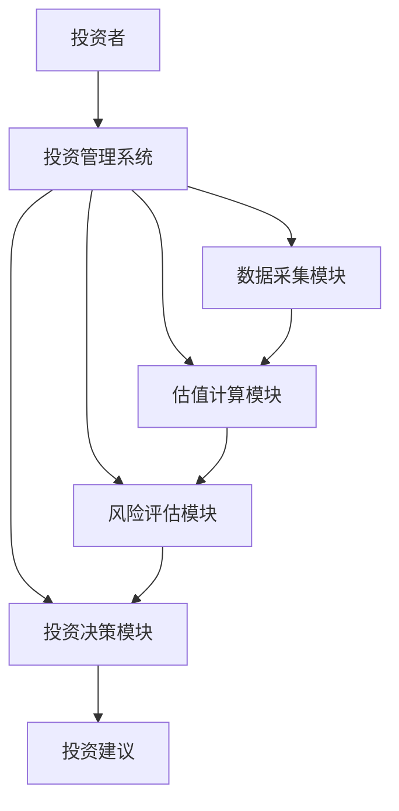

                 


# 格雷厄姆特价股票理论在风险投资中的运用

**关键词：格雷厄姆理论、风险投资、价值投资、数学模型、量化分析**

**摘要：**  
本文深入探讨了格雷厄姆的价值投资理论在风险投资中的应用，结合定量分析和系统设计，构建了基于格雷厄姆理论的风险投资模型。通过分析市场周期、安全边际和量化评估，提出了优化的风险投资策略，并设计了相应的系统架构和交互流程，为投资者提供了理论支持和实践指导。

---

## 第一部分：格雷厄姆特价股票理论与风险投资概述

### 第1章：格雷厄姆特价股票理论基础

#### 1.1 格雷厄姆投资理论的核心概念

**1.1.1 价值投资的定义与核心原则**

- **定义：** 价值投资是一种投资策略，旨在通过分析企业的内在价值，寻找市场价格低于其内在价值的股票。
- **核心原则：**
  - 安全边际：买入价格低于内在价值，确保安全空间。
  - 股票作为企业所有权的一部分，长期持有的投资理念。
  - 避免情绪化投资，注重基本面分析。

**1.1.2 格雷厄姆的安全边际理论**

- **安全边际的定义：** 安全边际 = 内在价值 - 市场价格。
- **作用：** 通过安全边际的大小，评估投资风险和潜在收益。
- **计算公式：** $$ \text{安全边际} = \text{内在价值} - \text{市场价格} $$

**1.1.3 贝塔系数与市场风险的量化**

- **贝塔系数（Beta）：** 衡量股票相对于市场的波动性。
  - $$ \beta > 1 $$：股票波动性高于市场。
  - $$ \beta < 1 $$：股票波动性低于市场。
  - $$ \beta = 1 $$：与市场同步波动。

**核心概念对比表格：**

| 概念         | 定义                                                                 | 作用                                                                 |
|--------------|--------------------------------------------------------------------|-----------------------------------------------------------------------|
| 内在价值     | 股票基于基本面分析的理论价值                                       | 确定投资标的的合理价格范围                                         |
| 安全边际     | 内在价值与市场价格的差额                                           | 评估投资的安全性，差额越大，投资风险越低                         |
| 贝塔系数     | 衡量股票相对于市场的波动性                                       | 评估投资的风险水平，指导资产配置                                   |

**ER实体关系图：**

```mermaid
erDiagram
  投资者--(拥有)-->投资组合
  投资组合--(包含)-->股票
  股票--(具有)-->内在价值
  股票--(具有)-->市场价格
  投资组合--(计算)-->安全边际
```

---

#### 1.2 风险投资的基本概念与现状

**1.2.1 风险投资的定义与特点**

- **定义：** 风险投资是一种高风险、高回报的投资方式，主要投资于高成长潜力的企业，尤其是初创公司。
- **特点：**
  - 高风险：失败率较高，但成功案例回报丰厚。
  - 高回报：通过创新和技术突破实现快速成长。
  - 长期性：注重企业的长期价值创造。

**1.2.2 风险投资的现状与趋势**

- **现状：**
  - 市场规模扩大，机构化程度提高。
  - 技术驱动型投资增加，尤其在人工智能、大数据等领域。
- **趋势：**
  - 量化分析和数据驱动的投资决策越来越重要。
  - ESG（环境、社会、治理）因素逐渐成为投资考量的重要部分。

---

## 第二部分：格雷厄姆特价股票理论在风险投资中的应用

### 第3章：格雷厄姆理论在风险投资中的策略分析

#### 3.1 格雷厄姆理论与风险投资的结合点

**3.1.1 风险投资中的价值评估方法**

- **基于内在价值的评估：** 使用DCF（现金流贴现法）评估企业的未来现金流。
  - $$ \text{DCF} = \sum_{t=1}^{n} \frac{\text{CF}_t}{(1 + r)^t} + \frac{FV}{(1 + r)^n} $$
  - 其中，CF为自由现金流，r为折现率，FV为终值。

**3.1.2 安全边际在风险投资中的应用**

- **应用步骤：**
  1. 评估目标企业的内在价值。
  2. 确定市场价格。
  3. 计算安全边际，指导买入决策。
  4. 定期复核，调整投资组合。

**3.1.3 风险投资中的市场周期分析**

- **市场周期阶段：**
  - 衰退期：低估值，寻找特价股票。
  - 上升期：逐步建仓，捕捉上升趋势。
  - 高点期：减少投资，规避风险。

---

### 第4章：风险投资中的量化模型构建

#### 4.1 量化模型的构建原理

**4.1.1 数据收集与处理**

- 数据来源：历史价格、财务报表、行业数据、市场指数等。
- 数据清洗：处理缺失值、异常值，确保数据质量。

**4.1.2 模型构建与验证**

- **模型选择：** 使用回归分析、时间序列分析等方法。
- **模型验证：** 通过回测检验模型的有效性。
  - 回测步骤：
    1. 确定回测区间。
    2. 执行交易策略。
    3. 计算收益和风险指标（如夏普比率）。

**4.1.3 模型的应用与优化**

- **策略优化：** 调整参数，如风险承受度、交易频率等。
- **持续监控：** 定期更新数据，重新评估模型性能。

---

### 第5章：风险投资中的风险管理与控制

#### 5.1 风险管理的核心原则

**5.1.1 风险识别与评估**

- **风险来源：** 市场风险、流动性风险、信用风险等。
- **风险评估：** 使用VaR（在险价值）模型量化潜在损失。

**5.1.2 风险控制策略**

- **分散投资：** 通过多元化降低非系统性风险。
- **风险对冲：** 使用衍生品（如期货、期权）对冲市场风险。

**5.1.3 风险分散与对冲**

- **分散投资示例：** 将资金分配到不同行业、不同阶段的企业。
- **对冲策略：** 利用指数期货对冲市场下跌风险。

---

## 第三部分：格雷厄姆特价股票理论的数学模型与算法实现

### 第6章：格雷厄姆理论的数学模型

#### 6.1 价值评估模型的构建

**6.1.1 格雷厄姆的内在价值计算公式**

- **公式：**
  $$ \text{内在价值} = \frac{\text{年收益} \times (5 + 市盈率)}{增长率} $$
  - 市盈率：市盈率低于15时，认为股票被低估。
  - 增长率：基于历史和预期的收益增长率。

**6.1.2 市场价格与内在价值的比较**

- **比较方法：**
  - 计算价格与价值比率（P/Value）。
  - 判断是否低估：P/Value < 1 时，认为股票被低估。

---

### 第7章：风险投资中的算法实现

#### 7.1 基于格雷厄姆理论的算法实现

**7.1.1 数据预处理与特征提取**

- **数据预处理：** 标准化、归一化处理。
- **特征提取：** 选取关键财务指标（如市盈率、市净率、ROE等）。

**7.1.2 算法选择与实现**

- **算法选择：** 使用K-最近邻（KNN）算法进行分类。
- **实现步骤：**
  1. 数据分割：训练集、测试集。
  2. 特征工程：提取关键指标。
  3. 模型训练：基于KNN算法进行分类。
  4. 模型评估：计算准确率、召回率。

**7.1.3 结果分析与优化**

- **结果分析：** 通过混淆矩阵分析模型性能。
- **优化策略：** 调整K值，选择合适的特征。

---

## 第四部分：系统架构与项目实战

### 第8章：系统架构设计

#### 8.1 系统功能模块划分

- **功能模块：**
  - 数据采集模块：收集股票数据。
  - 估值计算模块：计算内在价值和安全边际。
  - 风险评估模块：评估投资风险。
  - 投资决策模块：基于模型生成投资建议。

**系统架构图：**



---

## 第五部分：总结与展望

### 第9章：总结与展望

#### 9.1 总结

- 本文结合格雷厄姆的价值投资理论和风险投资实践，构建了数学模型和量化分析框架。
- 提出了基于安全边际和市场周期分析的投资策略，为投资者提供了理论指导和实践参考。

#### 9.2 展望

- **未来研究方向：** 结合人工智能技术，优化投资模型。
- **发展方向：** 推动量化投资在风险投资中的应用，提高投资效率和准确性。

---

**作者：AI天才研究院 & 禅与计算机程序设计艺术**

