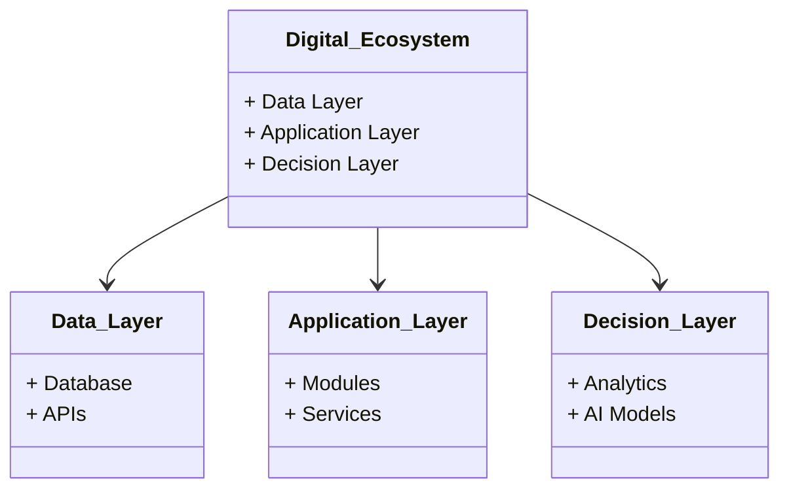
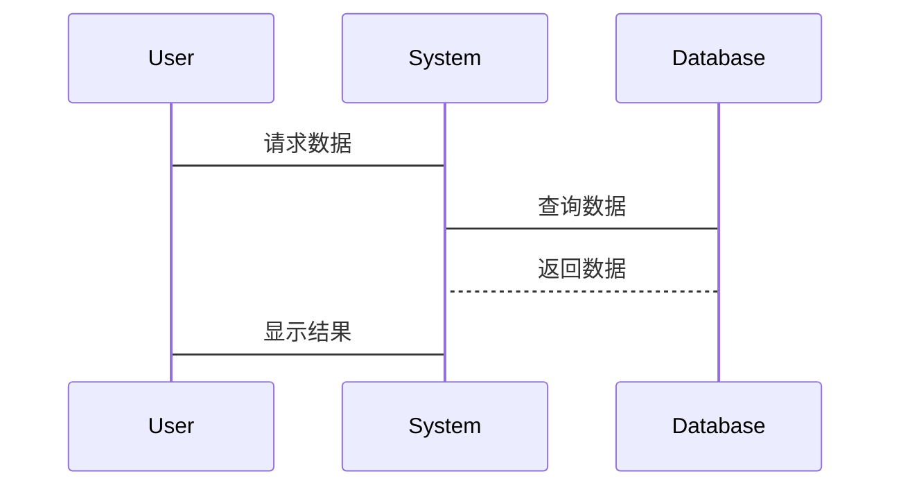

                 


# 格雷厄姆特价股票理论对公司数字化生态战略的影响

## 关键词：格雷厄姆、特价股票、数字化生态、投资策略、公司战略、价值评估

## 摘要：本文探讨了格雷厄姆的特价股票理论如何影响公司的数字化生态战略。通过分析投资理论与数字化战略的联系，结合算法实现、系统架构设计和项目实战，展示了如何将格雷厄姆的理论应用于现代企业的数字化转型中，以实现稳健的投资和战略规划。

---

## 第一部分：背景介绍

### 第1章：格雷厄姆特价股票理论概述

#### 1.1 格雷厄姆投资理论的核心概念

- **问题背景**：20世纪的投资市场的波动性和不确定性，投资者需要稳健的投资策略。
- **问题描述**：传统投资方法的局限性，如短期波动对长期投资的影响。
- **问题解决**：格雷厄姆提出价值投资，寻找被低估的股票。
- **边界与外延**：仅适用于长期投资，需考虑市场波动和公司基本面。
- **核心要素**：内在价值、市场价格、安全边际。

#### 1.2 公司数字化生态战略的内涵

- **问题场景**：企业在数字化转型中的挑战，如技术选择、数据管理等。
- **核心要素**：数据驱动决策、技术应用、生态系统构建。
- **数字化转型**：利用数字技术优化业务流程，提升竞争力。

---

## 第二部分：核心概念与联系

### 第2章：格雷厄姆特价股票理论与数字化生态战略的联系

#### 2.1 格雷厄姆投资理论的原理分析

- **价值投资**：购买被低估的股票，长期持有。
- **安全边际**：买入价格远低于内在价值，降低风险。
- **投资组合**：分散投资，降低风险。

#### 2.2 数字化生态战略的核心要素

- **数据驱动**：利用大数据分析优化决策。
- **技术应用**：采用人工智能、云计算等技术。
- **生态系统构建**：与合作伙伴协同，形成合力。

#### 2.3 两者的关联性分析

- **投资视角**：数字化项目的选择需考虑其长期价值和市场低估。
- **战略视角**：数字化转型需稳健投资，避免短期波动影响。

---

## 第三部分：算法原理讲解

### 第3章：格雷厄姆投资策略的算法实现

#### 3.1 格雷厄姆投资策略的筛选标准

- **市盈率（P/E）**：股价除以每股收益。
- **市净率（P/B）**：股价除以每股净资产。
- **股息率**：股息与股价的比率。

#### 3.2 基于Python的投资策略实现

```python
import pandas as pd
import yfinance as yf

# 下载数据
data = yf.download('AAPL', start='2020-01-01', end='2023-12-31')

# 计算市盈率和市净率
data['PE'] = data['Close'] / data['EPS']
data['PB'] = data['Close'] / data['Book Value Per Share']
data['Div Yield'] = (data['Dividends'] / data['Close']) * 100

# 筛选条件：PE < 15，PB < 2，Div Yield > 2%
filtered = data[(data['PE'] < 15) & (data['PB'] < 2) & (data['Div Yield'] > 2)]
```

#### 3.3 数学模型与公式

- 市盈率公式：
  $$ PE = \frac{P}{EPS} $$
- 市净率公式：
  $$ PB = \frac{P}{BPS} $$
- 股息率公式：
  $$ Div Yield = \frac{Div}{P} \times 100\% $$

---

## 第四部分：系统分析与架构设计方案

### 第4章：数字化生态战略的系统架构

#### 4.1 问题场景介绍

- **数字化转型挑战**：技术选择、数据管理、合作伙伴选择。
- **格雷厄姆理论应用**：评估数字化项目的长期价值。

#### 4.2 系统功能设计

- **领域模型类图**：展示数字化生态系统的组成部分。



#### 4.3 系统架构设计

```mermaid
architecturalDiagram
    container Digital_Strategy {
        Data Layer
        Application Layer
        Decision Layer
    }
    container Infrastructure {
        Database
        Servers
        Networks
    }
    Digital_Strategy --> Infrastructure
```

#### 4.4 系统交互设计



---

## 第五部分：项目实战

### 第5章：基于格雷厄姆理论的数字化生态战略实践

#### 5.1 环境安装与配置

- **工具安装**：Python、Pandas、yfinance。
- **数据源**：Yahoo Finance API。

#### 5.2 核心代码实现

```python
# 计算并筛选股票
def calculate_pe_ticker(ticker):
    data = yf.download(ticker, start='2020-01-01', end='2023-12-31')
    pe = data['Close'] / data['EPS']
    return pe.mean()

# 筛选符合条件的股票
selected_stocks = []
for stock in ['AAPL', 'GOOGL', 'MSFT']:
    pe = calculate_pe_ticker(stock)
    if pe < 15:
        selected_stocks.append(stock)
```

#### 5.3 代码应用解读与分析

- **代码功能分析**：计算每只股票的市盈率，筛选出市盈率低于15的股票。
- **案例分析**：以苹果、谷歌为例，分析其市盈率和市净率，判断是否符合投资条件。

---

## 第六部分：数学模型与公式

### 第6章：数学模型与公式解析

#### 6.1 格雷厄姆投资模型

- **内在价值公式**：
  $$ V = \frac{E}{4.4} $$
  其中，E为企业的年收益，4.4为安全边际系数。

---

## 结论

格雷厄姆的特价股票理论为公司数字化生态战略提供了稳健的投资框架，通过价值评估和风险控制，帮助企业选择具有长期潜力的数字化项目，实现可持续发展。

---

## 作者

作者：AI天才研究院 & 禅与计算机程序设计艺术

--- 

这篇文章详细探讨了格雷厄姆投资理论与公司数字化战略的结合，通过理论分析、算法实现、系统设计和项目实战，为读者提供了全面的指导。

