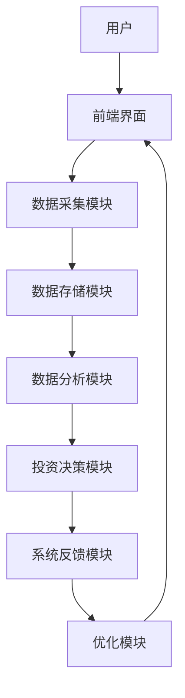

                 


# 《格雷厄姆特价股票理论对公司数字化生态系统协同进化的影响》

---

## 关键词：

- 格雷厄姆投资理论
- 特价股票
- 数字化生态系统
- 协同进化
- 价值投资
- 数字化转型
- 系统优化

---

## 摘要：

本文探讨了格雷厄姆的特价股票理论如何影响公司的数字化生态系统，并分析了两者的协同进化关系。通过结合价值投资的核心原则和数字化技术的应用，文章揭示了如何利用数字化工具优化投资决策，提升企业竞争力。本文还详细介绍了算法模型、系统架构和实际案例，为读者提供了从理论到实践的全面指导。

---

## 正文：

---

### 第一部分: 格雷厄姆特价股票理论与数字化生态系统的背景与基础

#### 第1章: 格雷厄姆特价股票理论概述

##### 1.1 格雷厄姆投资理论的核心思想

 Benjamin Graham 是价值投资理论的奠基人，他的投资理念强调以低于内在价值的价格买入优质股票。Graham 的核心思想包括：

1. **安全边际**：购买股票时，价格应远低于其内在价值，以降低风险。
2. **基本面分析**：通过分析公司的财务数据、行业地位和竞争优势来评估其价值。
3. **长期投资**：价值投资强调长期持有，而非短期波动。

Graham 的理论为现代投资学奠定了基础，尤其是其“安全边际”概念在风险管理中具有重要意义。

##### 1.2 特价股票的定义与特征

 特价股票是指市场价格低于其内在价值的股票。其主要特征包括：

1. **低市盈率（P/E）**：市盈率低于行业平均水平。
2. **低市净率（P/B）**：市净率低于行业平均水平。
3. **高股息率**：股息收益率高于行业平均水平。

Graham 的选股标准是寻找那些具有上述特征的股票，尤其是那些被市场低估的公司。

##### 1.3 格雷厄姆投资理论的现代应用

 随着技术的发展，Graham 的理论在现代投资中得到了新的应用，尤其是在数字化工具的支持下，投资者可以更高效地筛选和分析股票。例如，通过大数据分析和机器学习算法，投资者可以更精准地识别被低估的股票。

---

#### 第2章: 数字化生态系统概述

##### 2.1 数字化生态系统的定义与特征

 数字化生态系统是指由数字技术构建的，包含多个参与者（如企业、客户、供应商）的复杂系统。其主要特征包括：

1. **模块化设计**：系统由多个独立模块组成，模块之间通过接口进行交互。
2. **数据驱动**：系统通过数据分析优化决策。
3. **智能化**：利用人工智能技术实现自动化和智能化。

##### 2.2 数字化生态系统的构建逻辑

 数字化生态系统的构建逻辑包括以下几个步骤：

1. **需求分析**：明确系统的目标和功能需求。
2. **模块设计**：将系统分解为多个模块，设计模块之间的交互。
3. **技术选型**：选择合适的技术和工具实现模块。
4. **系统集成**：将各个模块集成到一个统一的系统中。
5. **测试与优化**：通过测试发现并修复系统中的问题，优化系统性能。

##### 2.3 数字化生态系统的核心技术

 数字化生态系统的核心技术包括：

1. **大数据技术**：用于数据的采集、存储和分析。
2. **人工智能技术**：用于模式识别、预测和自动化决策。
3. **区块链技术**：用于数据的安全存储和传输。

---

#### 第3章: 格雷厄姆特价股票理论与数字化生态系统的协同

##### 3.1 协同进化的概念

 协同进化是指不同系统在相互作用中共同发展和优化。在本文中，协同进化指格雷厄姆的特价股票理论与数字化生态系统在相互作用中共同优化投资决策和企业运营。

##### 3.2 协同进化的实现机制

 协同进化的实现机制包括：

1. **数据共享**：通过数字化生态系统共享投资数据，提高决策的准确性。
2. **算法优化**：利用机器学习算法优化股票筛选和投资策略。
3. **系统集成**：将投资理论与数字化系统集成，实现自动化投资决策。

##### 3.3 协同进化的影响

 协同进化的影响包括：

1. **提高投资效率**：通过数字化工具快速筛选和分析股票，提高投资效率。
2. **降低投资风险**：通过数据驱动的决策降低投资风险。
3. **提升企业竞争力**：通过优化企业运营提升竞争力。

---

### 第二部分: 格雷厄姆特价股票理论与数字化生态系统的协同算法

#### 第4章: 格雷厄姆特价股票筛选算法

##### 4.1 算法原理

 格雷厄姆特价股票筛选算法基于以下指标：

1. **低市盈率（P/E）**：市盈率低于行业平均水平。
2. **低市净率（P/B）**：市净率低于行业平均水平。
3. **高股息率**：股息收益率高于行业平均水平。

##### 4.2 算法实现

 下面是一个简单的Python代码示例，用于筛选符合条件的股票：

```python
import pandas as pd

# 假设data是包含股票数据的DataFrame
# 包含'PE', 'PB', 'Dividend_Yield'三列

# 筛选条件：PE < 行业平均PE，PB < 行业平均PB，Dividend_Yield > 行业平均Dividend_Yield
filtered_stocks = data[
    (data['PE'] < data['PE'].mean()) &
    (data['PB'] < data['PB'].mean()) &
    (data['Dividend_Yield'] > data['Dividend_Yield'].mean())
]

print(filtered_stocks)
```

##### 4.3 算法优化

 为了进一步优化算法，可以引入机器学习技术，如随机森林，来提高筛选的准确性。

---

#### 第5章: 数字化生态系统中的协同进化算法

##### 5.1 算法原理

 协同进化算法通过以下步骤实现：

1. **数据采集**：采集股票数据和市场数据。
2. **模型训练**：利用机器学习模型训练投资策略。
3. **系统优化**：通过反馈优化系统性能。

##### 5.2 算法实现

 下面是一个协同进化算法的Python代码示例：

```python
import numpy as np
import pandas as pd
from sklearn.ensemble import RandomForestClassifier

# 假设data是包含股票数据和标签（1表示符合筛选条件，0表示不符合）
# 包含'PE', 'PB', 'Dividend_Yield'三列

# 训练随机森林模型
model = RandomForestClassifier()
model.fit(data[['PE', 'PB', 'Dividend_Yield']], data['Label'])

# 预测新的股票数据
new_data = pd.DataFrame({
    'PE': [15],
    'PB': [2],
    'Dividend_Yield': [5]
})

prediction = model.predict(new_data)
print(prediction)
```

---

### 第三部分: 数字化生态系统中的协同进化系统设计

#### 第6章: 系统设计与实现

##### 6.1 系统功能设计

 系统功能包括：

1. **数据采集**：采集股票数据和市场数据。
2. **数据分析**：分析股票数据，筛选符合条件的股票。
3. **投资决策**：基于分析结果生成投资策略。
4. **系统反馈**：根据市场变化优化系统性能。

##### 6.2 系统架构设计

 系统架构设计如下：



##### 6.3 系统接口设计

 系统接口包括：

1. **数据接口**：用于数据的采集和存储。
2. **分析接口**：用于数据分析和筛选。
3. **决策接口**：用于生成投资策略。

---

#### 第7章: 项目实战与案例分析

##### 7.1 项目实战

 下面是一个简单的项目实战示例：

```python
import pandas as pd
import numpy as np

# 数据加载
data = pd.read_csv('stocks.csv')

# 数据预处理
data = data.dropna()

# 筛选条件
mean_pe = data['PE'].mean()
mean_pb = data['PB'].mean()
mean_dividend = data['Dividend_Yield'].mean()

filtered_stocks = data[
    (data['PE'] < mean_pe) &
    (data['PB'] < mean_pb) &
    (data['Dividend_Yield'] > mean_dividend)
]

print(filtered_stocks)
```

##### 7.2 案例分析

 以某公司为例，假设其市盈率为15，市净率为2，股息率为5%，均低于行业平均水平。根据Graham的筛选标准，该股票符合特价股票的条件，值得进一步关注。

---

### 第四部分: 最佳实践与总结

#### 第8章: 最佳实践

 ##### 8.1 投资策略

 - 定期更新股票筛选标准。
 - 结合市场变化调整投资策略。
 - 利用数字化工具优化投资决策。

 ##### 8.2 数字化系统优化

 - 定期更新系统数据。
 - 优化算法模型。
 - 提高系统安全性。

#### 第9章: 总结与展望

 本文探讨了格雷厄姆的特价股票理论与数字化生态系统的协同进化关系。通过结合价值投资理论和数字化技术，投资者可以更高效地筛选和分析股票，降低投资风险，提高投资收益。未来，随着技术的进一步发展，协同进化将更加深入，为投资领域带来更多的创新。

---

## 作者：AI天才研究院（AI Genius Institute） & 禅与计算机程序设计艺术（Zen And The Art of Computer Programming）

--- 

**注意**：以上内容为示例性文章结构，实际撰写时需根据具体需求和数据调整内容。

