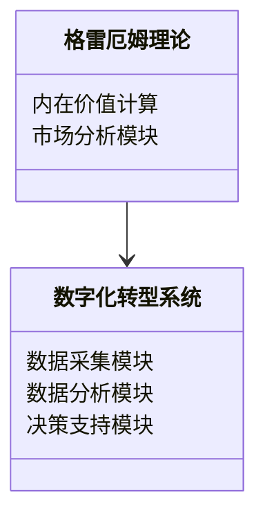

                 


# 格雷厄姆特价股票理论对公司数字化转型策略的影响

## 关键词：格雷厄姆特价股票理论, 数字化转型, 价值投资, 数据驱动, 数字化策略

## 摘要：  
格雷厄姆特价股票理论作为一种经典的价值投资方法，其核心在于寻找市场低估的股票并长期持有。本文探讨了这一理论对公司数字化转型策略的影响，分析了其在企业价值评估、数据驱动决策以及数字化工具应用中的实际意义，并通过具体案例展示了如何将格雷厄姆理论的理念融入现代数字化转型实践中。通过理论与实践的结合，本文为企业的数字化转型提供了新的视角和方法论。

---

## 第一部分: 格雷厄姆特价股票理论的背景与基础

### 第1章: 格雷厄姆特价股票理论概述

#### 1.1 格雷厄姆特价股票理论的起源与发展

- **1.1.1 价值投资理论的起源**  
  价值投资的理念起源于20世纪初，本杰明·格雷厄姆是这一理论的奠基人。他强调通过深入分析企业的财务状况和市场估值，寻找被市场低估的投资标的。

- **1.1.2 格雷厄姆投资理念的核心思想**  
  格雷厄姆提出了“安全边际”的概念，认为投资者应该以低于内在价值的价格买入股票，并长期持有。这种理念强调了对市场情绪的独立判断和对基本面的深入分析。

- **1.1.3 特价股票理论的历史演变**  
  格雷厄姆的理论经过数十年的发展，逐步从单纯的股票分析扩展到企业估值、风险管理等领域，并成为现代投资学的重要组成部分。

#### 1.2 格雷厄姆特价股票理论的核心观点

- **1.2.1 市场先生与投资者的关系**  
  格雷厄姆将市场比作“市场先生”，认为市场的波动性是投资者的机会，而非障碍。投资者应以独立的判断，避免被市场的短期波动所左右。

- **1.2.2 安全边际的概念与应用**  
  安全边际是指股票的市场价格与其内在价值之间的差额。通过计算安全边际，投资者可以识别出具有投资价值的股票。

- **1.2.3 价值投资与成长投资的对比**  
  格雷厄姆的价值投资强调低估值和安全边际，而成长投资则更关注企业的增长潜力。本文将重点分析价值投资与数字化转型的结合。

### 第2章: 数字化转型的背景与挑战

#### 2.1 数字化转型的定义与内涵

- **2.1.1 数字化转型的定义**  
  数字化转型是指企业利用数字技术（如大数据、人工智能、云计算等）改变其商业模式、业务流程和文化，以提高效率、创造新价值。

- **2.1.2 数字化转型的核心特征**  
  数字化转型的核心特征包括数据驱动、技术创新、组织变革和客户体验优化。

- **2.1.3 数字化转型与企业创新的关系**  
  数字化转型不仅是技术的更新，更是商业模式和组织文化的创新。它要求企业从传统模式向数字化模式转变。

#### 2.2 企业数字化转型的现状与趋势

- **2.2.1 数字化转型的全球趋势**  
  全球范围内，企业都在加速数字化转型，以应对市场竞争和技术变革。

- **2.2.2 中国企业数字化转型的现状**  
  中国企业数字化转型已进入快车道，但在不同行业和企业规模之间存在差异。

- **2.2.3 数字化转型的关键成功因素**  
  成功的数字化转型需要技术、组织、文化和数据的综合驱动。

#### 2.3 数字化转型中的挑战与对策

- **2.3.1 技术挑战**  
  技术选型、系统集成和数据安全是数字化转型中的主要技术挑战。

- **2.3.2 组织文化挑战**  
  数字化转型需要组织文化的转变，从传统模式向更加灵活和创新的模式转变。

- **2.3.3 数据隐私与安全挑战**  
  数据作为数字化转型的核心资产，其隐私和安全问题日益重要。

---

## 第三部分: 核心概念与联系

### 第3章: 格雷厄姆特价股票理论与数字化转型的关系

#### 3.1 格雷厄姆理论与数字化转型的理论联系

- **3.1.1 价值投资与数字化转型的共同点**  
  两者都强调长期价值创造和数据驱动的决策。价值投资寻找被低估的股票，数字化转型则寻找被低估的数字化机会。

- **3.1.2 格雷厄姆理论对数字化转型的启示**  
  格雷厄姆的“安全边际”理念启示企业在数字化转型中应注重风险控制和长期价值。

#### 3.2 格雷厄姆理论在数字化转型中的实际应用

- **3.2.1 企业价值评估的数字化方法**  
  通过数字化技术，企业可以更准确地评估其内在价值，识别市场低估的机会。

- **3.2.2 数据驱动的投资决策**  
  格雷厄姆的理论强调数据的重要性，数字化转型则通过大数据分析进一步强化了这一理念。

- **3.2.3 数字化工具在股票分析中的应用**  
  现代技术如人工智能和机器学习可以辅助投资者更高效地执行格雷厄姆的分析方法。

---

### 第4章: 格雷厄姆特价股票理论与数字化转型的算法与数学模型

#### 4.1 格雷厄姆理论的数学模型

- **4.1.1 内在价值计算公式**  
  格雷厄姆的内在价值公式为：  
  $$ \text{内在价值} = \frac{\text{收益} \times (5 + \text{市盈率})}{\text{股息率}} $$  
  该公式用于评估股票的内在价值，为投资决策提供依据。

- **4.1.2 市盈率与市净率的分析**  
  $$ \text{市盈率} = \frac{\text{股价}}{\text{每股收益}} $$  
  $$ \text{市净率} = \frac{\text{股价}}{\text{每股净资产}} $$  
  通过这两个指标，投资者可以更全面地评估企业的价值。

#### 4.2 数字化工具的应用

- **4.2.1 数据驱动的投资决策流程**  
  通过大数据分析和机器学习算法，投资者可以更高效地筛选出符合格雷厄姆标准的股票。

- **4.2.2 算法实现与代码示例**  
  使用Python代码实现格雷厄姆的内在价值计算：  
  ```python
  def calculate_intrinsic_value(revenue, pe_ratio, dividend_yield):
      return (revenue * (5 + pe_ratio)) / dividend_yield
  ```

---

### 第5章: 系统分析与架构设计方案

#### 5.1 系统功能设计

- **5.1.1 领域模型设计**  
  使用Mermaid类图展示数字化转型系统中的主要实体及其关系。



- **5.1.2 系统架构设计**  
  使用Mermaid架构图展示系统的主要组件及其交互。


---

### 第6章: 项目实战

#### 6.1 项目环境与安装

- **6.1.1 环境配置**  
  需要安装Python、Pandas、NumPy等工具。

#### 6.2 核心代码实现

- **6.2.1 格雷厄姆算法实现**  
  ```python
  def calculate_pe_ratio(price, earnings):
      return price / earnings
  ```

- **6.2.2 数据分析与可视化**  
  ```python
  import pandas as pd
  import matplotlib.pyplot as plt

  data = pd.read_csv('stock_data.csv')
  plt.plot(data['日期'], data['股价'])
  plt.show()
  ```

#### 6.3 案例分析

- **6.3.1 某公司数字化转型案例**  
  分析某公司如何通过格雷厄姆理论指导数字化转型，实现价值提升。

---

## 第七部分: 总结与展望

### 第7章: 总结与展望

#### 7.1 全文总结

- 格雷厄姆特价股票理论为数字化转型提供了重要的价值评估方法和数据驱动的决策支持。

#### 7.2 未来展望

- 随着人工智能和大数据技术的不断发展，格雷厄姆理论的应用将更加广泛和深入。

#### 7.3 最佳实践 Tips

- 在数字化转型中，企业应注重数据的准确性和分析的深度，结合格雷厄姆理论进行长期价值投资。

---

## 作者：AI天才研究院/AI Genius Institute & 禅与计算机程序设计艺术 /Zen And The Art of Computer Programming

---

通过以上结构，您可以逐步撰写一篇详细的技术博客文章，涵盖格雷厄姆特价股票理论对公司数字化转型策略的各个方面的影响。

