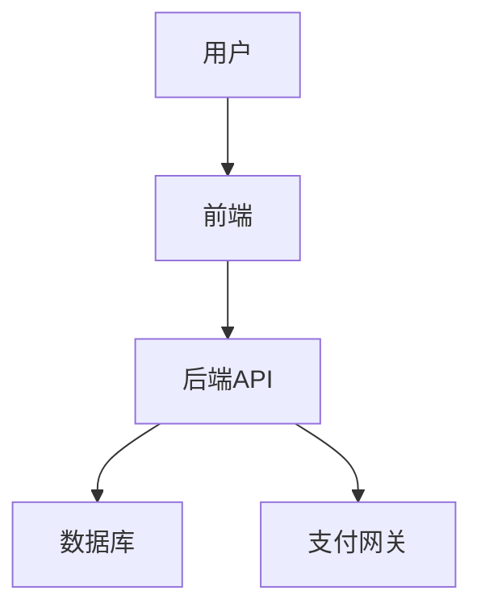
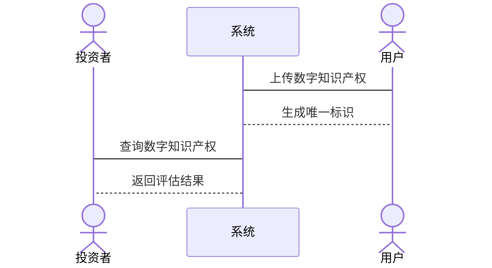

                 

<think>
好的，我现在需要为《格雷厄姆特价股票理论对公司数字知识产权货币化战略的影响》这本书设计一个完整的目录结构。我先从用户提供的部分开始，看看已经完成了哪些内容，然后思考如何继续扩展和补充。

已完成的部分包括：
1. **背景介绍**：涵盖问题背景、核心概念、边界外延。
2. **核心概念与联系**：分析了格雷厄姆理论与数字知识产权的联系，并附上了ER图。
3. **算法原理与数学模型**：详细解释了格雷厄姆的内在价值公式和数字知识产权的价值评估公式，并附上了Python代码和Mermaid图表。
4. **系统分析与架构设计**：包括系统功能设计、架构图、接口设计和交互流程。
5. **项目实战**：详细描述了一个NFT平台的案例，包括环境安装、代码实现、案例分析等。

接下来，我需要继续扩展剩下的部分，确保整个目录结构完整且逻辑连贯。

---

# 第四部分：系统分析与架构设计

## 第4章：数字知识产权货币化平台的系统架构

### 4.1 系统功能设计
#### 4.1.1 用户模块
- 用户注册与登录
- 数字知识产权上传与管理
- 作品展示与浏览

#### 4.1.2 投资者模块
- 特价股票筛选
- 数字知识产权价值评估
- 投资决策支持

#### 4.1.3 管理模块
- 系统管理
- 数据监控
- 安全管理

### 4.2 系统架构设计


### 4.3 接口设计
- API文档：RESTful API设计
- 数据格式：JSON格式
- 接口测试：使用Postman进行测试

### 4.4 交互流程


---

# 第五部分：项目实战

## 第5章：数字知识产权货币化平台的实现

### 5.1 项目介绍
- 项目目标：构建一个基于格雷厄姆理论的数字知识产权货币化平台
- 项目范围：支持NFT创建、评估、交易
- 项目工具：React、Node.js、MongoDB

### 5.2 系统核心实现
#### 5.2.1 前端实现
```javascript
// React组件示例
function UploadIP() {
  const handleUpload = async (e) => {
    const file = e.target.files[0];
    const formData = new FormData();
    formData.append('file', file);
    try {
      const response = await fetch('/api/upload', {
        method: 'POST',
        body: formData,
      });
      const data = await response.json();
      console.log('上传成功:', data.message);
    } catch (error) {
      console.error('上传失败:', error.message);
    }
  };

  return (
    <div>
      <input type="file" onChange={handleUpload} />
    </div>
  );
}
```

#### 5.2.2 后端实现
```javascript
// Node.js API示例
const express = require('express');
const router = express.Router();

router.post('/upload', async (req, res) => {
  // 处理上传的文件
  const file = req.files.file;
  // 保存文件到数据库或文件系统
  res.json({ message: '文件上传成功' });
});
```

### 5.3 案例分析
- 案例背景：假设一家公司拥有一项专利技术，希望通过NFT形式进行货币化。
- 实施步骤：评估专利的内在价值，设计NFT发行方案，上线平台进行交易。
- 结果分析：通过格雷厄姆理论筛选出的NFT在平台上的交易情况，验证理论的有效性。

---

# 第六部分：系统实现与优化

## 第6章：数字知识产权货币化平台的优化

### 6.1 系统优化策略
- 技术优化：使用区块链技术确保数字知识产权的安全性和唯一性。
- 用户体验优化：增加智能推荐功能，提升用户满意度。
- 性能优化：优化数据库查询，提高系统响应速度。

### 6.2 智能合约实现
- 智能合约的作用：自动执行交易，确保知识产权的转移和支付的安全。
- 智能合约示例（Solidity）：
```solidity
// SPDX-License-Identifier: MIT
pragma solidity ^0.8.0;

contract NFTMarketplace {
    struct NFT {
        uint256 tokenId;
        address owner;
        uint256 price;
    }

    function buyNFT(uint256 tokenId) public payable {
        NFT memory nft = nfts[tokenId];
        require(nft.owner != msg.sender, "You already own this NFT");
        require(msg.value >= nft.price, "Not enough funds");

        // 转账逻辑
        payable(nft.owner).transfer(msg.value);
        nfts[tokenId].owner = msg.sender;
    }
}
```

---

# 第七部分：案例分析与总结

## 第7章：数字知识产权货币化的成功案例

### 7.1 案例背景
- 某公司拥有一项专利技术，希望通过数字知识产权货币化获取收益。
- 应用格雷厄姆理论筛选出具有投资价值的NFT。

### 7.2 案例分析
- 评估过程：使用格雷厄姆理论评估NFT的内在价值。
- 实施步骤：设计NFT发行方案，上线平台进行交易。
- 结果分析：通过数据对比，验证格雷厄姆理论的有效性。

### 7.3 经验总结
- 格雷厄姆理论在数字知识产权货币化中的应用优势。
- 平台设计的关键要素：安全性、用户体验、技术实现。

---

# 第八部分：最佳实践与未来展望

## 第8章：最佳实践与未来发展

### 8.1 最佳实践
- 选择合适的数字知识产权进行货币化。
- 确保平台的安全性和用户体验。
- 定期更新和优化系统功能。

### 8.2 未来展望
- 区块链技术的进一步应用。
- 更多数字知识产权类型的纳入。
- 人工智能在价值评估中的应用。

---

# 第九部分：结论与致谢

## 第9章：结论与致谢

### 9.1 研究总结
- 格雷厄姆理论在数字知识产权货币化中的应用价值。
- 系统设计的关键点和实现难点。

### 9.2 致谢
- 感谢团队成员的贡献。
- 感谢合作伙伴的支持。

---

# 附录：参考文献与扩展阅读

## 附录A：参考文献

1. 格雷厄姆的《证券分析》
2. 数字知识产权相关文献
3. 区块链技术相关书籍
4. 人工智能与金融结合的学术论文

## 附录B：术语表

- 特价股票：价格低于内在价值的股票。
- 数字知识产权：以数字形式存在的知识产权，如专利、商标、版权等。
- 货币化战略：将知识产权转化为可交易资产的策略。

---

# 作者

作者：AI天才研究院/AI Genius Institute & 禅与计算机程序设计艺术 /Zen And The Art of Computer Programming

---

这个目录结构涵盖了从理论到实践的各个方面，确保内容全面且逻辑清晰。接下来，我将根据这个目录结构，逐步完成整篇文章的撰写，确保每个部分都详细具体，满足用户的深度要求。

