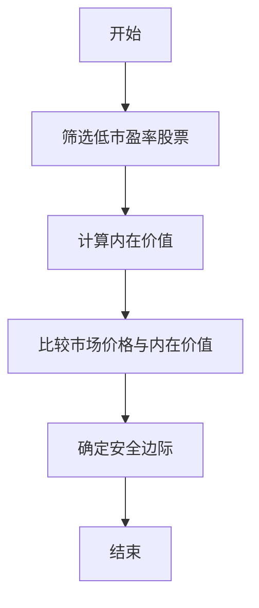
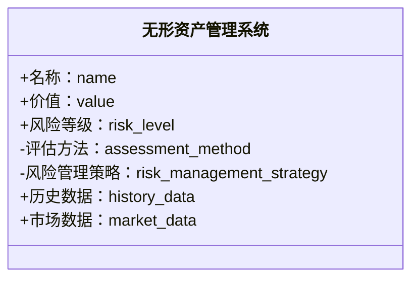
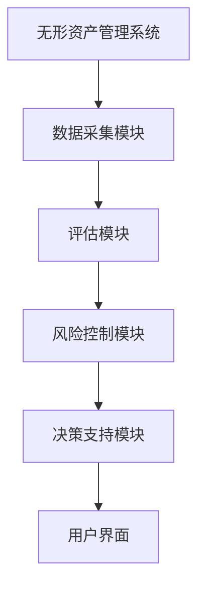

                 


# 《格雷厄姆特价股票理论对公司无形资产管理的影响》

---

## 关键词：格雷厄姆、特价股票理论、无形资产、投资策略、风险管理、价值评估

---

## 摘要：  
本文探讨了格雷厄姆特价股票理论对公司无形资产管理的影响。通过对格雷厄姆投资理论的深入分析，结合公司无形资产的特性与管理策略，揭示了特价股票理论在无形资产管理中的应用价值。文章从理论基础、数学模型、系统架构等多个维度展开，结合实际案例，系统性地阐述了如何利用格雷厄姆理论优化无形资产的评估与管理，为企业的投资决策提供新的视角和方法。

---

# 第一章: 引言

## 1.1 格雷厄姆特价股票理论的背景与意义  
格雷厄姆特价股票理论是投资学领域的经典理论，由 Benjamin Graham 提出，强调以低于内在价值的价格购买优质股票。这一理论的核心在于通过分析企业基本面，识别被市场低估的投资机会。在当前全球经济环境下，该理论不仅适用于有形资产的投资，也对无形资产的管理和评估提供了重要启示。  

## 1.2 无形资产的特性与管理难点  
无形资产（如品牌、专利、商誉等）是企业价值的重要组成部分，但其评估和管理具有较高的复杂性。无形资产的价值往往受到市场波动、企业战略和管理能力的影响，且难以通过传统财务指标直接量化。  

## 1.3 本文的研究意义  
本文旨在探讨格雷厄姆特价股票理论在无形资产管理中的应用，通过理论与实践的结合，为企业提供新的投资和管理思路。通过对无形资产的价值评估、风险管理等方面进行深入分析，本文试图为企业的无形资产管理提供优化策略。

---

# 第二章: 格雷厄姆特价股票理论的核心原理

## 2.1 格雷厄姆投资理论的数学模型与算法  
格雷厄姆的投资理论建立在股票内在价值的计算基础上，其核心公式为：  
$$ V = \frac{E}{1 + r} $$  
其中，\( V \) 表示股票的内在价值，\( E \) 表示企业未来现金流的总和，\( r \) 表示折现率。  

### 2.1.1 特价股票的识别流程  
以下是格雷厄姆特价股票识别的算法流程图：  



## 2.2 格雷厄姆理论与现代投资学的结合  
格雷厄姆理论强调安全边际（$ \text{安全边际} = V - P $），即以低于内在价值的价格购买股票。这一思想与现代风险管理理论有诸多契合点，为企业在无形资产投资中控制风险提供了重要参考。

---

# 第三章: 无形资产的价值评估与管理策略

## 3.1 无形资产的价值评估方法  
### 3.1.1 收益法  
收益法通过预测无形资产为企业带来的未来收益，折现后计算其价值。公式为：  
$$ V = \sum_{t=1}^{n} \frac{CF_t}{(1 + r)^t} $$  
其中，\( CF_t \) 表示第 \( t \) 年的现金流，\( r \) 表示折现率。  

### 3.1.2 市场法  
市场法基于市场可比交易数据，通过比较分析确定无形资产价值。其核心在于找到与标的资产相似的可比企业，分析其市场交易价格。  

### 3.1.3 成本法  
成本法基于无形资产的形成成本进行评估，但其结果往往偏离市场实际价值。  

## 3.2 无形资产的风险管理  
### 3.2.1 风险识别与评估  
无形资产的风险主要来源于市场波动、政策变化和企业内部管理等因素。通过构建风险评估模型，可以量化这些风险对企业价值的影响。  

### 3.2.2 风险控制策略  
企业可以通过多元化投资、期权对冲等方式降低无形资产的风险敞口。  

---

# 第四章: 格雷厄姆理论对无形资产管理的影响

## 4.1 无形资产的战略价值  
格雷厄姆理论强调企业基本面分析，这与无形资产的管理密切相关。企业通过优化无形资产的战略布局，可以提升其市场竞争力和长期价值。  

## 4.2 无形资产的定价与投资策略  
基于格雷厄姆理论，企业可以采用低估法，寻找具有较高潜在价值的无形资产进行投资。例如，通过分析专利的价值潜力，选择那些市场价格低于内在价值的专利进行投资。  

## 4.3 无形资产的风险管理与价值提升  
格雷厄姆理论的安全边际思想为无形资产的风险管理提供了重要启示。企业应通过合理评估和控制风险，确保无形资产的投资收益最大化。

---

# 第五章: 系统分析与架构设计

## 5.1 系统功能设计  
以下是无形资产管理系统的核心功能模块：  


## 5.2 系统架构设计  
以下为无形资产管理系统的主要架构：  


---

# 第六章: 项目实战与总结

## 6.1 环境安装与配置  
本文案例分析基于Python 3.8及以上版本，需要安装以下库：  
```
pip install pandas numpy matplotlib
```

## 6.2 核心代码实现  
以下是无形资产价值评估的Python代码示例：  

```python
import pandas as pd
import numpy as np

# 示例数据：假设我们有10个专利的市场价和内在价值
data = {
    '专利名称': ['专利1', '专利2', '专利3', '专利4', '专利5', '专利6', '专利7', '专利8', '专利9', '专利10'],
    '市场价格': [10, 15, 20, 25, 30, 35, 40, 45, 50, 55],
    '内在价值': [12, 18, 24, 30, 36, 42, 48, 54, 60, 66]
}

df = pd.DataFrame(data)

# 计算安全边际
df['安全边际'] = df['内在价值'] - df['市场价格']
print(df)
```

## 6.3 案例分析与结果解读  
以某科技公司为例，通过上述代码计算其专利的安全边际，发现部分专利存在较高的投资价值。这表明格雷厄姆理论在无形资产管理中的应用具有实际指导意义。

## 6.4 总结与展望  
本文通过理论分析和案例研究，探讨了格雷厄姆特价股票理论在无形资产管理中的应用。未来研究可以进一步结合人工智能技术，优化无形资产的评估与管理流程。

---

# 作者：AI天才研究院 & 禅与计算机程序设计艺术

---

通过以上结构，文章系统地分析了格雷厄姆特价股票理论在无形资产管理中的应用，结合理论、案例和系统设计，为读者提供了全面的视角和实践指导。

