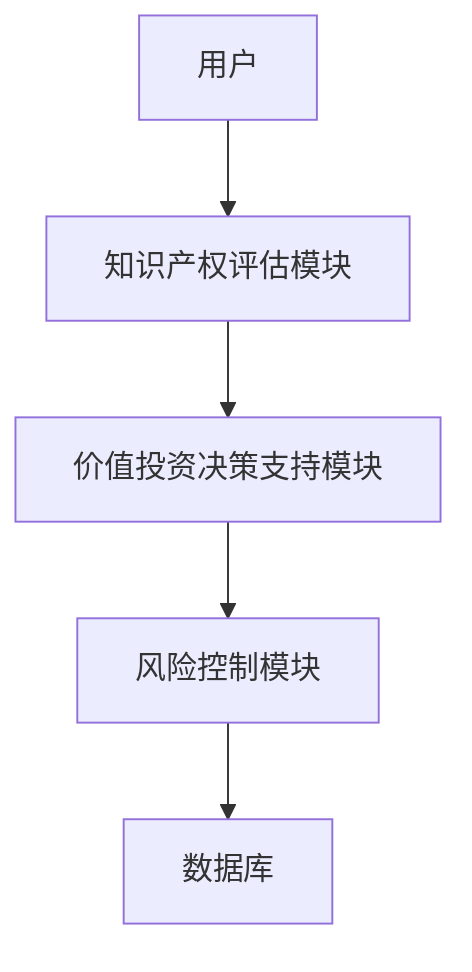

                 


# 格雷厄姆特价股票理论对公司知识产权战略的影响

> 关键词：格雷厄姆投资理论、知识产权战略、价值投资、企业估值、知识产权保护

> 摘要：本文探讨了格雷厄姆的特价股票理论如何影响公司的知识产权战略。通过分析价值投资的核心理念、知识产权的经济价值评估方法，以及两者在企业估值和战略规划中的协同作用，本文为公司制定知识产权战略提供了新的视角和方法。文章从理论背景、算法模型、系统设计到实际案例进行了全面分析，旨在帮助企业更好地将价值投资理念融入知识产权管理中。

---

## 第一部分: 格雷厄姆特价股票理论与知识产权战略概述

### 第1章: 格雷厄姆特价股票理论的核心概念

#### 1.1 格雷厄姆特价股票理论的定义与背景

格雷厄姆特价股票理论是由 Benjamin Graham 提出的一种价值投资方法，其核心在于寻找市场价格低于其内在价值的股票。这种理论强调从长期视角出发，通过分析企业的基本面（如盈利能力、财务状况、行业地位等）来评估其潜在价值，从而发现被市场低估的投资机会。

格雷厄姆的价值投资理念在金融领域具有深远影响，其核心思想包括：
1. **安全边际**：买入价格低于内在价值的股票，以确保投资的安全性。
2. **长期视角**：关注企业的长期盈利能力，而非短期市场波动。
3. **基本面分析**：通过对企业财务数据的深入分析来评估其价值。

#### 1.2 知识产权战略的基本概念

知识产权（Intellectual Property, IP）是指通过法律保护的智力成果，包括专利、商标、版权、商业秘密等。知识产权战略是企业在知识产权获取、保护、运用和管理方面的一系列策略，旨在通过知识产权最大化企业价值、降低风险并获得竞争优势。

知识产权战略的核心要素包括：
1. **知识产权获取**：通过研发、收购等方式获取知识产权。
2. **知识产权保护**：通过法律手段保护知识产权，防止侵权。
3. **知识产权运用**：通过许可、转让等方式实现知识产权的商业价值。
4. **知识产权管理**：对知识产权进行分类、评估和监控，确保其有效利用。

#### 1.3 格雷厄姆理论与知识产权战略的联系

格雷厄姆的特价股票理论与知识产权战略的联系主要体现在企业估值和投资决策方面。知识产权作为企业的一项重要资产，其价值直接影响企业的整体估值。通过格雷厄姆的价值投资理念，企业可以更好地评估知识产权的内在价值，从而制定更科学的知识产权战略。

---

### 第2章: 格雷厄姆特价股票理论的核心算法与数学模型

格雷厄姆的价值投资理论依赖于一系列数学模型和算法来评估企业的内在价值。以下是一些核心的模型和公式：

#### 2.1 现金流量折现法（DCF模型）

现金流量折现法是一种常用的估值方法，通过将未来现金流折现到当前时点来评估企业的内在价值。公式如下：

$$ V = \frac{CF}{(1 + r)^n} $$

其中：
- \( V \) 是企业的内在价值
- \( CF \) 是未来现金流
- \( r \) 是折现率
- \( n \) 是现金流的时间跨度

#### 2.2 市盈率与市净率分析

市盈率（P/E）和市净率（P/B）是常用的估值指标，分别表示股票价格与每股收益（EPS）和每股净资产（BPS）的比率。公式如下：

$$ P/E = \frac{Stock Price}{EPS} $$

$$ P/B = \frac{Stock Price}{BPS} $$

#### 2.3 内在价值计算公式

格雷厄姆提出的内在价值计算公式如下：

$$ V = \frac{Earnings}{Discount Rate} $$

其中：
- \( V \) 是企业的内在价值
- \( Earnings \) 是企业的净利润
- \( Discount Rate \) 是折现率

---

### 第3章: 知识产权战略的系统分析与架构设计

#### 3.1 系统功能设计

为了将格雷厄姆的价值投资理念应用于知识产权战略，我们需要设计一个综合性的系统，包括以下几个功能模块：

1. **知识产权评估模块**：对企业的知识产权资产进行分类和评估，计算其内在价值。
2. **价值投资决策支持模块**：基于格雷厄姆理论，为企业制定知识产权投资策略。
3. **风险控制模块**：评估知识产权相关的风险，并制定相应的风险管理策略。

#### 3.2 系统架构设计

以下是系统的整体架构设计：



---

### 第4章: 项目实战与案例分析

#### 4.1 环境安装与工具准备

为了实现格雷厄姆理论在知识产权战略中的应用，我们需要以下工具和环境：

1. 数据分析工具：Python（用于数据处理和建模）
2. 知识产权数据库：如专利数据库、商标数据库等
3. 企业财务数据：包括企业的收入、利润、现金流等

#### 4.2 核心代码实现

以下是实现格雷厄姆价值评估模型的Python代码示例：

```python
def calculate_intrinsic_value(earnings, discount_rate):
    return earnings / discount_rate

# 示例数据
earnings = 1000000  # 净利润（美元）
discount_rate = 0.1  # 折现率（10%）

# 计算内在价值
intrinsic_value = calculate_intrinsic_value(earnings, discount_rate)
print(f"企业的内在价值为：{intrinsic_value} 美元")
```

#### 4.3 案例分析与解读

以某科技公司为例，假设该公司拥有一项核心专利技术，年收入为1000万美元，净利润为200万美元，折现率为10%。根据格雷厄姆的价值评估模型，该公司的内在价值为：

$$ V = \frac{2000000}{0.1} = 20000000 \text{美元} $$

这意味着，如果该公司的市场估值低于2000万美元，就可以考虑投资。

---

## 第五部分: 总结与展望

### 5.1 最佳实践 tips

1. 在制定知识产权战略时，企业应结合格雷厄姆的价值投资理念，科学评估知识产权的内在价值。
2. 通过数据分析和模型计算，优化知识产权布局，降低投资风险。
3. 定期更新和调整知识产权战略，以适应市场变化和技术进步。

### 5.2 小结

本文探讨了格雷厄姆特价股票理论对公司知识产权战略的影响，从理论背景、算法模型到系统设计和项目实战进行了全面分析。通过将价值投资理念融入知识产权管理，企业可以更好地评估知识产权的经济价值，制定更科学的投资决策。

### 5.3 注意事项

1. 在实际应用中，企业需要结合自身特点和市场环境，灵活调整知识产权战略。
2. 数据分析和模型计算需要基于真实可靠的数据，确保评估结果的准确性。
3. 知识产权保护是长期过程，企业需要建立完善的保护机制，防止侵权行为。

### 5.4 拓展阅读

1. 《The Intelligent Investor》 - Benjamin Graham
2. 《知识产权管理》 - 王晓辉
3. 《价值投资与企业估值》 - 李迅

---

## 作者

作者：AI天才研究院/AI Genius Institute & 禅与计算机程序设计艺术 /Zen And The Art of Computer Programming

---

本文通过系统分析和案例研究，深入探讨了格雷厄姆特价股票理论对公司知识产权战略的影响。通过将价值投资理念与知识产权管理相结合，企业可以更好地优化知识产权布局，提升核心竞争力。

