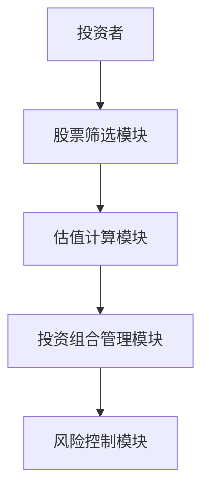

                 


# 格雷厄姆特价股票理论对投资者教育的启示

> 关键词：投资者教育，价值投资，格雷厄姆理论，安全边际，股票估值

> 摘要：本文通过分析格雷厄姆特价股票理论的核心概念、数学模型和系统架构，探讨其对投资者教育的重要启示。文章从价值投资的起源、安全边际与内在价值的计算、投资者教育系统的构建等多个维度展开，结合实际案例和系统设计，为投资者提供理论支持和实践指导。

---

# 第一部分: 格雷厄姆特价股票理论的背景与核心概念

## 第1章: 价值投资的起源与发展

### 1.1 价值投资的起源

价值投资是一种长期投资策略，起源于20世纪初。1924年，本杰明·格雷厄姆（Benjamin Graham）和戴维·多德（David Dodd）合著的《证券分析》（Security Analysis）一书，首次系统地提出了价值投资的理念。本书被认为是投资领域的经典之作，为现代价值投资奠定了理论基础。

#### 1.1.1 投资学的起源与发展

投资学作为一门学科，其历史可以追溯到18世纪的英国工业革命时期。随着资本主义经济的发展，股票市场的兴起催生了对股票估值方法的研究。早期的投资理论主要集中在技术分析和市场预测上，但这些方法往往缺乏科学性，难以经受市场波动的考验。

#### 1.1.2 格雷厄姆与价值投资的诞生

格雷厄姆是20世纪最具影响力的投资思想家之一。他在《证券分析》中提出，股票的价值不应仅仅基于市场的波动，而应基于其内在价值。这种价值可以通过对公司基本面的深入分析来确定。格雷厄姆的理论强调安全边际和长期投资，为投资者提供了一种更为稳健的投资方式。

#### 1.1.3 价值投资与现代投资理论的对比

现代投资理论（Modern Portfolio Theory，MPT）由哈里·马科维茨（Harry Markowitz）提出，强调通过分散投资来降低风险。而价值投资则更注重个股的内在价值和市场定价的偏差。两者的区别在于，MPT注重资产配置和风险分散，而价值投资注重个股的精选和长期持有。

---

### 1.2 格雷厄姆特价股票理论的核心概念

格雷厄姆的理论以“安全边际”为核心，强调在市场价格低于内在价值时买入股票。这种策略旨在通过降低风险来实现长期稳定的收益。

#### 1.2.1 安全边际的定义与计算

安全边际是指市场价格与内在价值之间的差额。格雷厄姆认为，只有当市场价格低于内在价值时，投资才是安全的。安全边际的计算公式为：

$$\text{安全边际} = \text{内在价值} - \text{市场价格}$$

例如，假设某股票的内在价值为50元，市场价格为40元，其安全边际为10元。

#### 1.2.2 内在价值的计算方法

内在价值是基于公司财务数据和行业状况计算出来的理论价值。常用的计算方法包括现金流折现法（DCF）和市盈率法。DCF模型通过将未来现金流折现到现值来计算内在价值。

$$V = \sum_{t=1}^n \frac{CF_t}{(1+r)^t}$$

其中，$CF_t$ 是第$t$年的现金流，$r$是折现率，$n$是预测的年数。

#### 1.2.3 市场先生与投资者心理

格雷厄姆提出了“市场先生”的概念，认为市场波动是投资者的机会。市场先生每天都会以不同的价格买卖股票，投资者的任务是识别市场先生的错误定价，并在价格低估时买入，高估时卖出。

---

## 第2章: 格雷厄姆特价股票理论的数学模型与公式

### 2.1 内在价值的计算公式

#### 2.1.1 现金流折现法的数学模型

现金流折现法是计算内在价值的核心方法之一。公式如下：

$$V = \sum_{t=1}^n \frac{CF_t}{(1+r)^t}$$

其中，$CF_t$ 是第$t$年的现金流，$r$是折现率，$n$是预测的年数。

#### 2.1.2 安全边际的计算公式

$$\text{安全边际} = \text{内在价值} - \text{市场价格}$$

---

## 第3章: 格雷厄姆特价股票理论的系统分析与架构设计

### 3.1 投资者教育系统的功能模块

投资者教育系统需要具备以下功能模块：

#### 3.1.1 股票筛选模块

股票筛选模块用于识别市场价格低于内在价值的股票。通过输入公司财务数据和行业信息，系统可以计算内在价值并筛选出符合条件的股票。

#### 3.1.2 估值计算模块

估值计算模块基于现金流折现法计算股票的内在价值。用户可以输入公司未来几年的预期现金流和折现率，系统将计算出股票的理论价值。

#### 3.1.3 投资组合管理模块

投资组合管理模块帮助投资者构建和优化投资组合。系统可以根据股票的内在价值和市场价格，推荐最优的持股比例和组合配置。

---

### 3.2 系统架构设计

#### 3.2.1 系统架构图（Mermaid）



---

## 第4章: 项目实战——格雷厄姆策略的实现

### 4.1 环境配置与工具安装

#### 4.1.1 Python环境的安装与配置

为了实现格雷厄姆策略，我们需要安装Python编程环境，并安装必要的库，如Pandas和NumPy。

```bash
pip install pandas numpy
```

#### 4.1.2 数据分析工具的安装（如Pandas、NumPy）

Pandas和NumPy是数据处理和分析的核心库。安装命令如下：

```bash
pip install pandas numpy
```

### 4.2 核心代码实现

#### 4.2.1 股票估值代码

以下是一个简单的股票估值代码示例：

```python
import pandas as pd
import numpy as np

def calculate_intrinsic_value(cash_flows, discount_r):
    return np.npv(discount_r, cash_flows) / (1 + discount_r)
```

#### 4.2.2 安全边际计算代码

```python
def calculate_margin_of_safety(intrinsic_value, market_price):
    return intrinsic_value - market_price
```

---

## 第5章: 总结与启示

### 5.1 格雷厄姆理论的核心要点

格雷厄姆的理论强调安全边际和内在价值的重要性。投资者应基于公司基本面分析，选择市场价格低于内在价值的股票。

### 5.2 对投资者教育的启示

投资者教育应注重以下几点：
1. 理解价值投资的基本原理和方法。
2. 掌握股票估值的数学模型和工具。
3. 培养长期投资和风险管理的能力。

### 5.3 最佳实践 tips

1. 在实际投资中，结合市场环境和公司基本面进行综合判断。
2. 定期回顾投资组合的表现，及时调整投资策略。

---

作者：AI天才研究院/AI Genius Institute & 禅与计算机程序设计艺术 /Zen And The Art of Computer Programming

