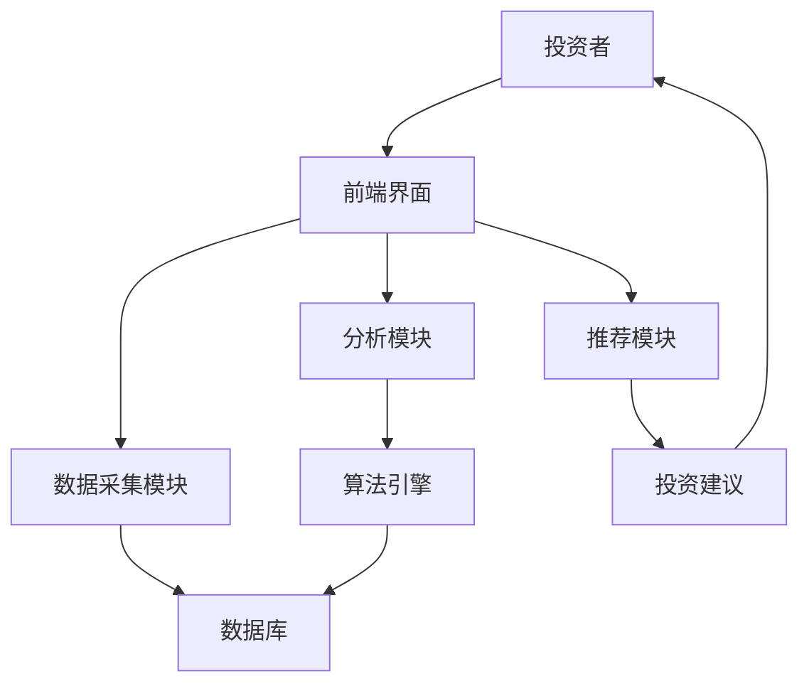

                 


# 《格雷厄姆特价股票理论对数字普惠金融可持续性的启示》

## 关键词：格雷厄姆投资理论，数字普惠金融，价值投资，可持续性，金融创新

## 摘要：  
本文探讨了格雷厄姆的价值投资理论如何为数字普惠金融的可持续性提供启示。通过分析格雷厄姆的特价股票理论与数字普惠金融的结合，揭示了如何利用价值投资理念和技术手段解决普惠金融中的信息不对称和风险问题。文章详细阐述了格雷厄姆理论的核心原理、数字普惠金融的现状与挑战，并通过实际案例和算法实现，展示了如何将价值投资应用于数字普惠金融中，以实现长期可持续发展。

---

## 第一部分: 格雷厄姆特价股票理论与数字普惠金融的背景介绍

### 第1章: 格雷厄姆特价股票理论概述

#### 1.1 格雷厄姆特价股票理论的核心概念

##### 1.1.1 价值投资的基本原理  
价值投资是一种以企业内在价值为核心的投资策略，强调以低于内在价值的价格购买优质企业。格雷厄姆在《聪明的投资者》中提出，投资者应关注企业的基本面，如盈利能力、财务状况和市场地位，而不是短期市场波动。

##### 1.1.2 特价股票的定义与特征  
特价股票是指市场价格低于其内在价值的股票。这类股票通常具有低市盈率（P/E）、低市净率（P/B）和高股息率，表明市场对其价值存在低估。

##### 1.1.3 格雷厄姆投资策略的核心要素  
格雷厄姆的投资策略包括：  
1. 以合理价格购买优质企业。  
2. 通过分散投资降低风险。  
3. 长期持有，避免频繁交易。  

#### 1.2 格雷厄姆的价值投资策略  
格雷厄姆的策略强调安全边际，即买入价格与内在价值之间的差距。他通过分析企业的财务报表，计算其盈利能力、偿债能力和发展潜力，筛选出具有长期竞争优势的企业。

---

### 第2章: 数字普惠金融的现状与挑战

#### 2.1 数字普惠金融的定义与目标  
数字普惠金融利用数字技术，将金融服务扩展至传统金融机构难以覆盖的群体，如中小企业和个人客户。其目标是实现金融包容性增长，促进经济可持续发展。

#### 2.2 数字普惠金融的主要挑战  
1. **信息不对称**：普惠金融客户缺乏信用记录，金融机构难以评估风险。  
2. **金融排斥**：部分群体因缺乏技术或资源无法获得金融服务。  
3. **技术局限性**：数字技术的应用需要较高的成本和专业技能。

#### 2.3 数字普惠金融与传统金融的区别  
数字普惠金融通过大数据和人工智能技术，提高了金融服务的效率和覆盖面，但同时也面临技术风险和数据隐私问题。

---

### 第3章: 格雷厄姆特价股票理论与数字普惠金融的联系

#### 3.1 格雷厄姆理论在金融投资中的应用  
格雷厄姆的理论为投资者提供了寻找优质企业的标准，这与普惠金融的目标不谋而合。通过筛选具有长期竞争优势的企业，投资者可以支持普惠金融的发展。

#### 3.2 数字普惠金融中的投资机会  
数字技术的应用为价值投资提供了新场景。例如，大数据分析可以帮助投资者识别被低估的优质企业，尤其是在普惠金融领域。

---

## 第二部分: 格雷厄姆特价股票理论与数字普惠金融的核心概念

### 第4章: 格雷厄姆特价股票理论的核心原理

#### 4.1 价值投资理念在普惠金融中的应用  
价值投资强调长期收益和风险管理，这与普惠金融的目标一致。通过筛选具有长期竞争优势的企业，投资者可以支持普惠金融的可持续发展。

#### 4.2 数字技术如何赋能价值投资  
大数据和人工智能技术可以提高选股效率，帮助投资者快速识别被低估的股票。例如，通过分析企业的财务数据和市场表现，算法可以自动筛选出符合格雷厄姆选股标准的股票。

---

## 第三部分: 格雷厄姆特价股票理论的数学模型

### 第5章: 格雷厄姆特价股票理论的数学模型

#### 5.1 市盈率和市净率的计算  
市盈率（P/E）= 股价 / 每股净利润  
市净率（P/B）= 股价 / 每股净资产  

例如，若某公司股价为10元，每股净利润为2元，市盈率为5倍。若每股净资产为5元，市净率为2倍。

#### 5.2 内在价值计算  
内在价值是企业未来现金流的现值。使用现金流折现模型（DCF）计算：  
$$ \text{内在价值} = \frac{\text{现金流}}{(1 + r)^n} $$  
其中，\( r \) 是折现率，\( n \) 是时间周期。

---

### 第6章: 数字普惠金融中的算法实现

#### 6.1 基于Python的选股算法  
以下是基于格雷厄姆选股标准的Python代码示例：

```python
import pandas as pd

# 假设df是包含股票数据的DataFrame
def screen_stocks(df):
    # 格雷厄姆选股标准：低市盈率、低市净率、高股息率
    df = df[df['P/E'] < 15]
    df = df[df['P/B'] < 2]
    df = df[df['Dividend Yield'] > 2]
    return df

# 应用筛选
selected_stocks = screen_stocks(df)
print(selected_stocks)
```

---

## 第四部分: 系统分析与架构设计

### 第7章: 数字普惠金融系统架构

#### 7.1 系统功能设计  
系统功能模块包括：  
1. 数据采集：收集企业财务数据和市场数据。  
2. 数据分析：应用算法筛选优质股票。  
3. 投资推荐：向投资者推荐符合标准的股票。  
4. 风险监控：实时监控市场变化和企业动态。

#### 7.2 系统架构设计  
使用Mermaid图展示系统架构：



---

## 第五部分: 项目实战

### 第8章: 基于格雷厄姆理论的选股系统开发

#### 8.1 环境搭建  
安装必要的Python库：  
- `pandas`：数据处理  
- `numpy`：数值计算  
- `scikit-learn`：机器学习  

#### 8.2 核心代码实现  
以下是选股系统的核心代码：

```python
import pandas as pd

def calculate_intrinsic_value(financials):
    # 简单的现金流折现模型
    cash_flow = financials['现金流']
    discount_rate = 0.1  # 假设折现率为10%
    value = cash_flow / (1 + discount_rate)
    return value

# 应用案例
data = {
    '公司': ['A', 'B', 'C'],
    '现金流': [100, 200, 150],
    'P/E': [10, 15, 20],
    'P/B': [1, 2, 1.5]
}

df = pd.DataFrame(data)
selected = df[df['P/E'] < 15]
print(selected)
```

#### 8.3 案例分析  
通过分析具体案例，展示如何利用该系统筛选出符合格雷厄姆选股标准的股票，并评估其长期投资价值。

---

## 第六部分: 总结与展望

### 第9章: 总结  
本文探讨了格雷厄姆的价值投资理论如何为数字普惠金融的可持续性提供启示。通过结合技术手段和投资理念，可以有效解决普惠金融中的信息不对称和风险问题。

### 第10章: 展望  
未来，随着技术的进步，价值投资与数字普惠金融的结合将更加紧密。通过大数据和人工智能技术，投资者可以更精准地识别优质企业，推动普惠金融的可持续发展。

---

## 作者：AI天才研究院 & 禅与计算机程序设计艺术

