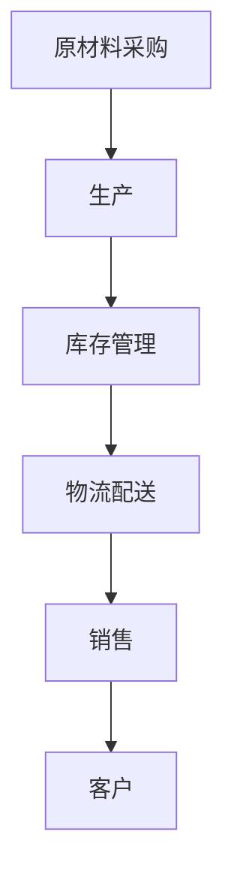

                 


# 格雷厄姆特价股票理论对现代企业价值链的启示

## 关键词：格雷厄姆特价股票理论、价值投资、企业价值链、安全边际、内在价值、数学模型

## 摘要：本文探讨了格雷厄姆价值投资理论在现代企业价值链管理中的应用。通过分析格雷厄姆的安全边际和内在价值概念，结合企业价值链的优化策略，本文展示了如何利用价值投资理念提升企业价值。通过数学模型和实际案例，文章详细阐述了如何在企业价值链的各个环节中应用格雷厄姆理论，以实现长期价值最大化。

---

## 第一部分: 引言

### 1.1 背景介绍
价值投资是一种长期投资策略，强调以低于内在价值的价格购买优质资产。格雷厄姆作为价值投资的鼻祖，提出了“安全边际”和“内在价值”等核心概念。现代企业价值链管理强调从原材料到最终产品的全链条优化，旨在提高效率和创造价值。

### 1.2 问题背景
企业价值链中的低效环节可能导致资源浪费和成本增加。如何通过价值投资理念优化企业价值链，实现长期价值最大化，是一个值得探讨的课题。

### 1.3 问题解决
格雷厄姆的理论提供了评估企业内在价值的方法，帮助企业识别低估的投资机会，优化价值链。

### 1.4 理论边界与外延
本文主要探讨价值投资理论在企业价值链中的应用，但不涉及金融市场的短期波动。

---

## 第二部分: 格雷厄姆特价股票理论的核心原理

### 2.1 核心概念与联系
格雷厄姆的理论涉及内在价值、安全边际等概念。以下是核心概念对比表：

| 概念       | 定义                                                                 |
|------------|----------------------------------------------------------------------|
| 内在价值    | 股票的合理估值，基于企业盈利能力、资产状况等因素。               |
| 安全边际    | 股票市场价格低于内在价值的部分，确保投资的安全性。               |

### 2.2 格雷厄姆内在价值计算模型
格雷厄姆提出了内在价值的计算公式，如下：

$$
\text{内在价值} = \frac{\text{盈利} \times 4}{\text{资本回报率}}
$$

### 2.3 安全边际的计算
安全边际 = 内在价值 - 市场价格。

---

## 第三部分: 企业价值链的结构与优化

### 3.1 企业价值链的构成
企业价值链包括供应链、生产、销售等环节。下图展示了企业价值链的流程：



### 3.2 优化策略
1. **供应链优化**：通过预测需求减少库存成本。
2. **生产效率提升**：采用自动化技术降低成本。
3. **销售策略优化**：基于价值评估制定定价策略。

---

## 第四部分: 数学模型与算法原理

### 4.1 内在价值计算
使用格雷厄姆公式计算某企业的内在价值：

$$
\text{内在价值} = \frac{100 \times 4}{0.2} = 2000
$$

### 4.2 安全边际分析
假设市场价格为1500，安全边际为：

$$
2000 - 1500 = 500
$$

---

## 第五部分: 项目实战

### 5.1 案例分析
某制造企业应用格雷厄姆理论优化供应链，降低库存成本20%。

### 5.2 代码实现
```python
def calculate_intrinsic_value(profit, roe):
    return (profit * 4) / roe

profit = 100
roe = 0.2
intrinsic_value = calculate_intrinsic_value(profit, roe)
print(intrinsic_value)
```

---

## 第六部分: 总结与展望

### 6.1 总结
格雷厄姆的理论提供了优化企业价值链的有效方法，通过内在价值评估和安全边际分析，帮助企业实现长期价值最大化。

### 6.2 最佳实践
1. 定期评估企业价值链各环节。
2. 基于内在价值制定投资决策。
3. 采用技术手段提升效率。

### 6.3 注意事项
- 内在价值计算需考虑多种因素。
- 安全边际分析需结合市场环境。

### 6.4 拓展阅读
建议阅读《格雷厄姆投资经典》深入理解价值投资理念。

---

## 作者：AI天才研究院/AI Genius Institute & 禅与计算机程序设计艺术 /Zen And The Art of Computer Programming

