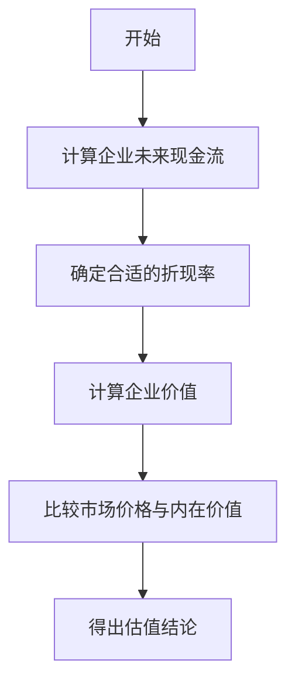

                 


# {{此处是文章标题}}

> 关键词：{{此处列出文章的5-7个核心关键词}}

> 摘要：{{此处给出文章的核心内容和主题思想}}

                 

# {{此处是文章标题}}

> 关键词：格雷厄姆投资理论，特价股票，现代公司估值，价值投资，股票分析，投资策略

> 摘要：本文探讨了格雷厄姆特价股票理论的核心概念及其在现代公司估值中的应用。通过分析其数学模型和算法，结合实际案例，展示了如何在Python中实现格雷厄姆的估值方法，并提出最佳投资策略。

---

# 格雷厄姆特价股票理论对现代公司估值的启示

## 第1章: 格雷厄姆特价股票理论的背景与核心概念

### 1.1 格雷厄姆投资理论的起源与发展
- 1.1.1 价值投资的起源与发展
- 1.1.2 格雷厄姆的学术背景与贡献
- 1.1.3 特价股票理论的核心思想

### 1.2 格雷厄姆特价股票理论的核心要素
- 1.2.1 市盈率与市净率的基本概念
- 1.2.2 企业内在价值的计算方法
- 1.2.3 安全边际的重要性

## 第2章: 格雷厄姆特价股票理论的核心概念与联系

### 2.1 核心概念原理
- 2.1.1 企业内在价值的公式推导
- 2.1.2 安全边际的计算方法
- 2.1.3 市场情绪对企业估值的影响

### 2.2 核心概念属性对比表格
- 2.2.1 格雷厄姆理论与现代估值方法对比
- 2.2.2 不同估值方法的优缺点分析

### 2.3 ER实体关系图
- 2.3.1 企业估值的实体关系架构
- 2.3.2 格雷厄姆理论与现代估值方法的实体关系对比

## 第3章: 现代公司估值的数学模型与算法原理

### 3.1 格雷厄姆特价股票理论的数学模型
- 3.1.1 企业内在价值公式
  $$ V = \frac{E}{P} $$
  其中，\( E \) 表示企业未来现金流的现值，\( P \) 表示折现率。

### 3.2 现代公司估值的算法流程图


## 第4章: 系统分析与架构设计方案

### 4.1 问题场景介绍
- 4.1.1 系统目标：基于格雷厄姆理论构建公司估值系统
- 4.1.2 系统范围：涵盖数据收集、分析、估值和报告生成
- 4.1.3 系统边界：数据源包括财务报表、市场数据等

### 4.2 系统功能设计
- 4.2.1 领域模型设计
  ```mermaid
  classDiagram
    class 格雷厄姆估值系统 {
        输入数据：公司财务报表、市场数据
        计算模块：内在价值、安全边际
        输出结果：估值报告
    }
  ```

### 4.3 系统架构设计
- 4.3.1 系统架构图
  ```mermaid
  rectangle 格雷厄姆估值系统 {
      class 数据层 {
          数据库：存储公司数据
      }
      class 业务逻辑层 {
          估值计算：计算内在价值、安全边际
      }
      class 界面层 {
          用户界面：输入数据、显示结果
      }
  }
  ```

### 4.4 系统接口设计
- 4.4.1 接口描述：系统通过API获取市场数据
- 4.4.2 接口实现：使用REST API进行数据交互

### 4.5 系统交互设计
- 4.5.1 交互流程图
  ```mermaid
  sequenceDiagram
    用户 -> 界面层: 输入公司名称
    界面层 -> 业务逻辑层: 请求公司数据
    业务逻辑层 -> 数据层: 查询财务报表
    数据层 --> 业务逻辑层: 返回数据
    业务逻辑层 -> 计算模块: 计算内在价值
    计算模块 --> 业务逻辑层: 返回估值结果
    业务逻辑层 -> 界面层: 更新显示结果
    界面层 -> 用户: 显示估值报告
  ```

## 第5章: 项目实战——格雷厄姆估值系统的实现

### 5.1 环境安装与配置
- 5.1.1 安装Python环境
- 5.1.2 安装必要的库：pandas, numpy, matplotlib

### 5.2 核心功能实现
- 5.2.1 数据获取模块：从CSV文件读取公司数据
- 5.2.2 估值计算模块：计算内在价值和安全边际
- 5.2.3 结果展示模块：生成可视化报告

### 5.3 核心代码实现
```python
import pandas as pd
import numpy as np

def calculate_intrinsic_value(eps, growth_rate, required_return):
    # 计算未来现金流现值
    terminal_value = eps * (1 + growth_rate) / (required_return - growth_rate)
    # 内在价值公式
    intrinsic_value = terminal_value / (1 + required_return)
    return intrinsic_value

# 示例数据
data = {
    '公司': ['公司A', '公司B', '公司C'],
    'EPS': [1.5, 2.0, 1.8],
    '增长率': [0.05, 0.07, 0.06],
    '要求回报率': [0.10, 0.12, 0.11]
}

df = pd.DataFrame(data)

# 计算内在价值
df['内在价值'] = df.apply(lambda x: calculate_intrinsic_value(x['EPS'], x['增长率'], x['要求回报率']), axis=1)

print(df)
```

### 5.4 实际案例分析
- 5.4.1 案例选择：分析公司A、B、C的估值
- 5.4.2 结果解读：哪些公司被低估，哪些被高估

### 5.5 系统小结
- 5.5.1 项目实现的关键点
- 5.5.2 可能遇到的问题及解决方案

## 第6章: 总结与展望

### 6.1 核心内容回顾
- 6.1.1 格雷厄姆理论的核心要点
- 6.1.2 现代估值方法的发展与挑战

### 6.2 未来展望
- 6.2.1 结合人工智能技术的潜力
- 6.2.2 全球化市场中的应用前景

### 6.3 最佳实践 tips
- 6.3.1 风险管理的重要性
- 6.3.2 长期投资与价值发现

## 作者：AI天才研究院/AI Genius Institute & 禅与计算机程序设计艺术 /Zen And The Art of Computer Programming

