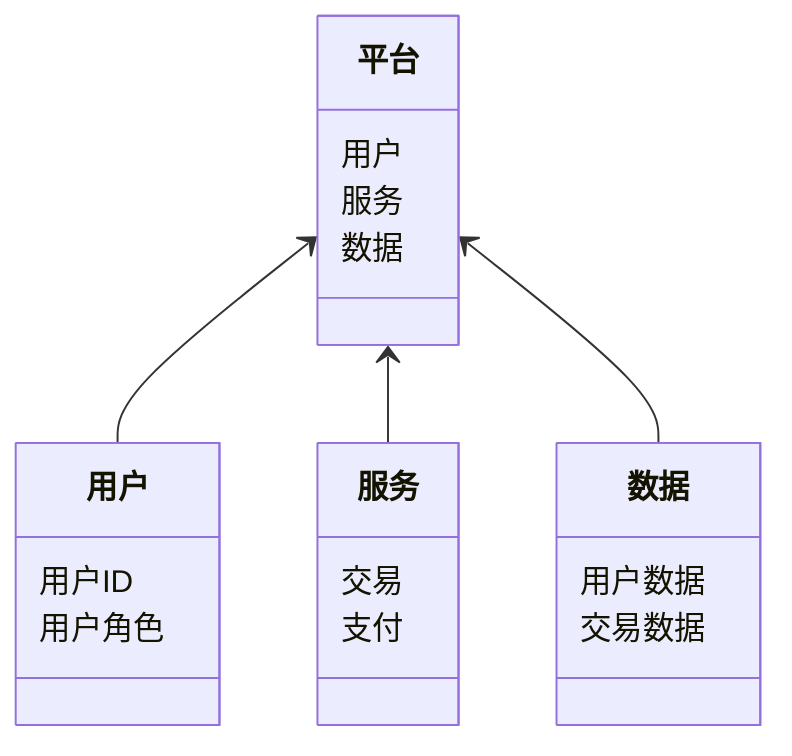
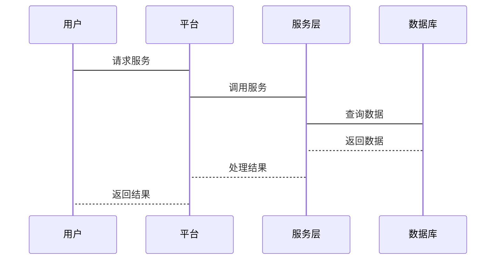

                 


# 《格雷厄姆特价股票理论对现代平台经济的启示》

> 关键词：格雷厄姆特价股票理论、平台经济、价值投资、安全边际、投资策略、商业模式

> 摘要：本文通过分析格雷厄姆的价值投资理论，探讨其在现代平台经济中的应用。从理论基础到实践案例，本文详细阐述了如何将格雷厄姆的安全边际、内在价值等核心概念应用于平台经济的估值和投资决策中。通过系统化的分析和数学模型的构建，本文为投资者提供了新的视角和方法。

---

# 第1章: 引言

## 1.1 本书背景与意义

### 1.1.1 格雷厄姆特价股票理论的提出背景

格雷厄姆（Benjamin Graham）被誉为“价值投资之父”，他在20世纪30年代提出的特价股票理论奠定了现代价值投资的基础。格雷厄姆的核心思想是：股票不仅仅是一个交易工具，更是一个具有内在价值的资产。投资者应该以低于其内在价值的价格买入股票，并长期持有，以获得超额收益。

### 1.1.2 现代平台经济的发展现状

平台经济是互联网技术发展带来的新兴经济模式。典型的平台包括电子商务平台（如亚马逊）、社交媒体平台（如Facebook）、出行平台（如滴滴）等。平台经济的特点是通过双边市场连接供需两端，利用网络效应和数据驱动的商业模式，实现高效资源匹配和价值创造。

### 1.1.3 理论与实践结合的重要性

随着平台经济的快速发展，传统的投资理论在面对新兴经济模式时显得力不从力。如何将格雷厄姆的价值投资理念与现代平台经济的特点相结合，是当前投资者和研究者面临的重大挑战。本文将尝试回答这一问题。

---

## 1.2 格雷厄姆特价股票理论的核心概念

### 1.2.1 价值投资的基本原则

价值投资的核心是寻找市场价格低于内在价值的股票。格雷厄姆提出，股票的内在价值可以通过对公司基本面的分析得出，而市场价格则受到市场情绪和短期波动的影响。因此，投资者应该关注企业的内在价值，而不是市场的短期波动。

### 1.2.2 安全边际的定义与作用

安全边际是格雷厄姆理论中的一个重要概念。它是指股票的市场价格与内在价值之间的差距。通过购买具有足够安全边际的股票，投资者可以在市场波动中降低风险，同时确保长期收益。

### 1.2.3 投资者心理与市场行为

格雷厄姆深刻认识到投资者心理对市场的影响。他指出，市场情绪往往会导致股票价格偏离其内在价值。因此，投资者需要克服贪婪和恐惧的心理，保持理性决策。

---

## 1.3 平台经济的定义与特点

### 1.3.1 平台经济的基本概念

平台经济是一种通过互联网技术构建的双边市场模式，连接供需两端，提供撮合服务。平台的核心价值在于通过数据和技术实现资源的高效匹配，降低交易成本，创造新的价值。

### 1.3.2 平台经济的核心特征

- **双边市场效应**：平台连接供需两端，形成网络效应，用户越多，平台价值越高。
- **数据驱动**：平台通过收集和分析数据，优化匹配算法，提升用户体验。
- **轻资产模式**：平台本身不拥有实体资产，而是通过技术和服务创造价值。

### 1.3.3 平台经济与传统经济的对比

与传统经济相比，平台经济具有以下特点：
- **去中介化**：平台直接连接供需两端，减少中间环节。
- **数据化**：平台通过数据和技术实现精准匹配。
- **全球化**：平台可以快速扩展到全球市场。

---

## 1.4 本书的研究目标与方法

### 1.4.1 研究目标

本文旨在探讨格雷厄姆的价值投资理论在平台经济中的应用，通过分析平台经济的商业模式和估值方法，提出一套适合平台经济的价值投资策略。

### 1.4.2 研究方法

- **文献研究**：分析格雷厄姆的理论著作和平台经济的相关研究。
- **案例分析**：结合具体平台案例，分析其商业模式和估值方法。
- **数学建模**：构建平台经济的估值模型，验证格雷厄姆理论的适用性。

---

# 第2章: 格雷厄姆特价股票理论的核心原理

## 2.1 价值投资的核心理念

### 2.1.1 价值投资的基本原则

价值投资的核心是寻找市场价格低于内在价值的股票。格雷厄姆提出，股票的内在价值可以通过对公司基本面的分析得出，而市场价格则受到市场情绪和短期波动的影响。因此，投资者应该关注企业的内在价值，而不是市场的短期波动。

### 2.1.2 内在价值的计算公式

格雷厄姆提出了股票内在价值的计算公式：
$$ V = \frac{E}{P} $$
其中，\( E \) 是企业的预期收益，\( P \) 是资本成本。

### 2.1.3 安全边际的数学模型

安全边际的计算公式为：
$$ S = V - P $$
其中，\( S \) 是安全边际，\( V \) 是内在价值，\( P \) 是市场价格。

---

## 2.2 格雷厄姆的投资策略

### 2.2.1 低市盈率策略

格雷厄姆建议投资者选择市盈率低于行业平均水平的股票，以降低投资风险。

### 2.2.2 高质量资产的选择

高质量资产是指具有稳定收益、良好财务状况和强大竞争优势的公司。

### 2.2.3 分散投资的风险控制

通过分散投资，投资者可以降低单一资产的风险，同时提高整体投资组合的稳定性。

---

## 2.3 格雷厄姆理论的数学模型

### 2.3.1 内在价值公式

$$ V = \frac{E}{P} $$

### 2.3.2 安全边际计算

$$ S = V - P $$

---

## 2.4 格雷厄姆理论的案例分析

### 2.4.1 经典案例1：某公司投资分析

通过分析某公司的财务数据，计算其内在价值和安全边际，验证格雷厄姆理论的适用性。

### 2.4.2 经典案例2：某行业周期分析

分析某行业周期性波动对股票价格的影响，探讨格雷厄姆理论在周期性行业中的应用。

---

# 第3章: 平台经济的商业模式与价值评估

## 3.1 平台经济的商业模式

### 3.1.1 双边市场模型

平台通过连接供需两端，形成双边市场效应，创造价值。

### 3.1.2 平台的网络效应

平台的网络效应是指随着用户数量的增加，平台的价值呈指数级增长。

### 3.1.3 平台的收入来源

平台的收入来源包括佣金、广告费、订阅费等。

---

## 3.2 平台经济的价值评估指标

### 3.2.1 用户增长指标

- 用户活跃度
- 用户留存率
- 用户增长率

### 3.2.2 收入与利润指标

- 收入增长率
- 净利润率
- 毛利率

### 3.2.3 市场占有率分析

通过分析平台在市场中的占有率，评估其竞争优势。

---

## 3.3 平台经济的估值方法

### 3.3.1 市盈率法

$$ P/E = \frac{P}{E} $$

### 3.3.2 市净率法

$$ P/B = \frac{P}{B} $$

### 3.3.3 现金流折现法

$$ V = \sum_{t=1}^{n} \frac{CF_t}{(1+r)^t} $$

---

## 3.4 平台经济的数学模型

### 3.4.1 用户价值公式

$$ U = \frac{R}{N} $$

### 3.4.2 平台估值公式

$$ P = \frac{E}{V} $$

---

# 第4章: 格雷厄姆理论在平台经济中的应用

## 4.1 平台经济中的价值投资策略

### 4.1.1 选择具有竞争优势的平台

分析平台的核心竞争力，包括技术优势、网络效应等。

### 4.1.2 评估平台的可持续性

通过分析平台的商业模式和财务状况，评估其长期发展的潜力。

### 4.1.3 平台的财务健康状况

关注平台的盈利能力、现金流和债务情况，确保其财务健康。

---

## 4.2 平台经济中的安全边际

### 4.2.1 平台风险的识别

识别平台面临的市场风险、竞争风险和技术风险。

### 4.2.2 安全边际的计算

通过比较平台的市场价格与内在价值，计算安全边际。

### 4.2.3 风险控制策略

通过分散投资、设定止损点等方式，降低投资风险。

---

## 4.3 平台经济中的投资组合管理

### 4.3.1 投资组合的构建

根据平台的内在价值和安全边际，构建多元化投资组合。

### 4.3.2 投资组合的调整

定期评估投资组合的表现，及时调整以应对市场变化。

### 4.3.3 投资组合的风险管理

通过监控市场波动和公司基本面，优化投资组合的风险管理。

---

# 第5章: 平台经济中的系统分析与架构设计

## 5.1 系统分析

### 5.1.1 问题场景介绍

分析平台经济中的典型问题，如用户增长、收入模式等。

### 5.1.2 领域模型设计

使用Mermaid类图展示平台经济的核心要素和关系。



---

## 5.2 系统架构设计

### 5.2.1 系统架构图

使用Mermaid架构图展示平台经济的系统架构。


---

## 5.3 系统接口设计

### 5.3.1 API接口设计

定义平台经济中的核心API接口，如用户认证、交易支付等。

### 5.3.2 接口文档

详细描述每个API接口的功能、参数和返回值。

---

## 5.4 系统交互设计

### 5.4.1 交互流程图

使用Mermaid序列图展示平台经济中的典型交互流程。



---

# 第6章: 平台经济中的项目实战

## 6.1 环境安装

### 6.1.1 开发环境配置

安装必要的开发工具和依赖库，如Python、Django等。

### 6.1.2 数据库配置

选择合适的数据库，如MySQL、MongoDB等，并配置连接信息。

---

## 6.2 系统核心实现

### 6.2.1 价值评估算法实现

实现格雷厄姆理论中的内在价值计算和安全边际计算。

### 6.2.2 代码实现

以下是价值评估算法的Python代码示例：

```python
def calculate_intrinsic_value(enterprise_value, expected_profit):
    return enterprise_value / expected_profit

def calculate_margin_of_safety(current_price, intrinsic_value):
    return intrinsic_value - current_price
```

### 6.2.3 代码解读与分析

详细解读上述代码的功能和实现逻辑，分析其在平台经济中的应用。

---

## 6.3 案例分析

### 6.3.1 案例选择

选择一个典型平台，如某电商平台，进行详细分析。

### 6.3.2 价值评估

根据格雷厄姆理论，计算该平台的内在价值和安全边际。

### 6.3.3 投资策略

基于评估结果，制定相应的投资策略。

---

## 6.4 项目小结

总结项目实现的关键点和成果，分析存在的问题和改进方向。

---

# 第7章: 总结与启示

## 7.1 核心观点总结

总结本文的核心观点，重申格雷厄姆理论在平台经济中的重要性。

## 7.2 投资策略的启示

从平台经济的特点出发，提出适合平台经济的价值投资策略。

## 7.3 未来研究方向

展望未来的研究方向，如人工智能在平台经济中的应用、区块链技术对平台经济的影响等。

---

# 作者

作者：AI天才研究院/AI Genius Institute & 禅与计算机程序设计艺术 /Zen And The Art of Computer Programming

