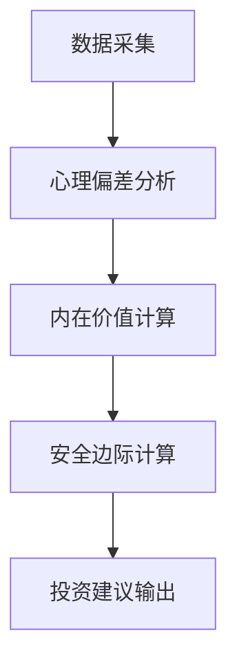
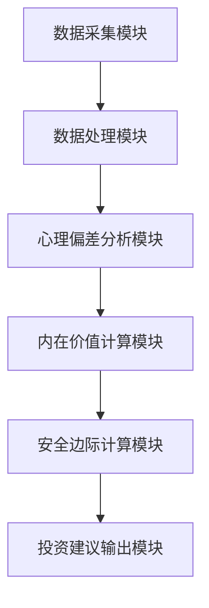

                 


# 《格雷厄姆特价股票理论对行为经济学的数字化补充》

> **关键词**：格雷厄姆投资理论、行为经济学、特价股票、心理偏差、数学模型、数字化补充、股票估值

> **摘要**：本文从格雷厄姆特价股票理论出发，结合行为经济学的核心观点，提出了一种基于数字化方法的理论补充。通过分析投资者心理偏差对股票估值的影响，构建了数学模型和算法流程，最终提出了一套数字化的投资评估系统，为投资者提供科学的决策支持。

---

# 第1章：引言

## 1.1 格雷厄姆特价股票理论概述

### 1.1.1 格雷厄姆投资理论的核心思想
格雷厄姆是价值投资的鼻祖，他提出的核心思想是“安全边际”。他认为，股票的内在价值可以通过对企业基本面的分析来确定，而市场价格会围绕内在价值波动。投资者应该在市场价低于内在价值时买入，并在市场价高于内在价值时卖出。

### 1.1.2 特价股票的定义与特征
特价股票是指市场价格远低于其内在价值的股票。这种股票通常被市场低估，具有较高的投资潜力。格雷厄姆认为，寻找这样的股票是实现长期稳健投资回报的关键。

### 1.1.3 格雷厄姆理论在现代投资中的意义
尽管格雷厄姆的理论提出已久，但其核心思想在现代投资中依然具有重要的指导意义。尤其是在市场波动加剧、投资者情绪多变的今天，格雷厄姆的安全边际概念可以帮助投资者避免过度投机。

## 1.2 行为经济学的基本概念

### 1.2.1 行为经济学的起源与发展
行为经济学是研究人类决策行为的学科，它结合了心理学和经济学的理论。与传统经济学假设人类是理性的不同，行为经济学认为人类决策往往受到心理偏差的影响。

### 1.2.2 投资者心理偏差与行为模式
投资者的心理偏差是行为经济学的核心研究对象。常见的心理偏差包括过度自信、损失厌恶、从众心理等。这些偏差会导致投资者做出非理性的决策。

### 1.2.3 行为经济学在金融领域的应用
行为经济学在金融领域的应用广泛，从风险评估到投资决策，再到市场预测，行为经济学都提供了新的视角和方法。

## 1.3 数字化补充的必要性

### 1.3.1 传统投资理论的局限性
传统投资理论往往忽视了投资者心理因素的影响，这使得理论在实际应用中存在一定的局限性。

### 1.3.2 数字化技术在投资分析中的作用
随着技术的发展，数字化工具可以帮助我们更精确地分析市场数据，量化心理偏差对投资决策的影响。

### 1.3.3 格雷厄姆理论与行为经济学结合的创新点
通过将格雷厄姆的理论与行为经济学相结合，我们可以更全面地分析股票的价值，同时考虑投资者的心理因素，从而做出更科学的投资决策。

---

# 第2章：格雷厄姆特价股票理论的核心原理

## 2.1 格雷厄姆投资理论的数学模型

### 2.1.1 内在价值的计算公式
股票的内在价值可以通过以下公式计算：
$$ V = \frac{E}{k} $$
其中，\( V \) 是内在价值，\( E \) 是预期收益，\( k \) 是折现率。

### 2.1.2 安全边际的计算
安全边际可以通过以下公式计算：
$$ \text{安全边际} = V - P $$
其中，\( V \) 是内在价值，\( P \) 是市场价格。

## 2.2 行为经济学中的心理偏差分析

### 2.2.1 心理偏差对投资决策的影响
心理偏差会影响投资者的决策，例如过度自信会导致投资者高估自己的判断能力，从而做出冒险性投资。

### 2.2.2 常见心理偏差的分类与特征对比
以下是一个心理偏差的对比表格：

| 偏差类型       | 描述                                   | 示例                         |
|----------------|--------------------------------------|------------------------------|
| 过度自信       | 投资者认为自己能够准确预测市场       | 盲目追涨杀跌                 |
| 损失厌恶       | 对损失的恐惧超过对收益的追求         | 投资者倾向于卖出盈利股票而持有亏损股票 |
| 从众心理       | 投资者跟随大众决策                   | 随市场趋势盲目买入或卖出股票 |

## 2.3 格雷厄姆理论与行为经济学的联系

### 2.3.1 格雷厄姆理论中的人性因素
格雷厄姆理论强调了安全边际的重要性，这实际上考虑了投资者的心理因素。他认为，市场价格波动往往反映了投资者情绪的变化。

### 2.3.2 行为经济学对格雷厄姆理论的补充
行为经济学为我们提供了一种分析投资者心理偏差的工具，这可以帮助我们更好地理解市场价格波动的原因。

---

# 第3章：心理偏差对价值评估的影响

## 3.1 心理偏差对股票估值的影响

### 3.1.1 过度自信对股票估值的影响
过度自信的投资者可能会高估自己对市场的判断能力，从而做出错误的估值。

### 3.1.2 损失厌恶对股票估值的影响
损失厌恶会导致投资者在面对亏损时过于保守，从而影响其对股票估值的判断。

## 3.2 心理偏差的数学模型

### 3.2.1 心理偏差对估值偏差的数学表达
我们可以用以下公式表示心理偏差对估值偏差的影响：
$$ \text{估值偏差} = \sum_{i=1}^{n} \text{偏差}_i \times \text{权重}_i $$

---

# 第4章：算法原理

## 4.1 算法流程

### 4.1.1 数据输入
输入包括股票的基本面数据和市场数据。

### 4.1.2 心理偏差分析
通过数学模型分析投资者的心理偏差对股票估值的影响。

### 4.1.3 内在价值计算
根据基本面数据计算股票的内在价值。

### 4.1.4 安全边际计算
计算安全边际，确定是否值得投资。

### 4.1.5 输出结果
输出投资建议。

## 4.2 算法实现

### 4.2.1 Python代码实现
```python
def calculate_intrinsic_value(enterprise_value, net_debt):
    return enterprise_value - net_debt

def calculate_margin_of_safety(intrinsic_value, market_price):
    return intrinsic_value - market_price

# 示例数据
enterprise_value = 1000000
net_debt = 200000
market_price = 500

intrinsic_value = calculate_intrinsic_value(enterprise_value, net_debt)
margin_of_safety = calculate_margin_of_safety(intrinsic_value, market_price)

print(f"内在价值: {intrinsic_value}")
print(f"安全边际: {margin_of_safety}")
```

---

# 第5章：系统架构设计

## 5.1 系统功能设计

### 5.1.1 系统模块划分
系统模块包括数据采集、心理偏差分析、内在价值计算、安全边际计算和投资建议输出。

### 5.1.2 系统功能流程图


## 5.2 系统架构设计

### 5.2.1 系统架构图


---

# 第6章：项目实战

## 6.1 项目背景

### 6.1.1 项目目标
本项目旨在通过数字化方法补充格雷厄姆特价股票理论，帮助投资者做出科学的投资决策。

### 6.1.2 项目需求
项目需求包括数据采集、心理偏差分析、内在价值计算、安全边际计算和投资建议输出。

## 6.2 项目实现

### 6.2.1 数据采集
我们从公开的股票数据源采集股票的基本面数据和市场数据。

### 6.2.2 数据处理
我们对采集到的数据进行清洗和预处理，确保数据的准确性和完整性。

### 6.2.3 心理偏差分析
我们通过数学模型分析投资者的心理偏差对股票估值的影响。

### 6.2.4 内在价值计算
我们根据基本面数据计算股票的内在价值。

### 6.2.5 安全边际计算
我们计算安全边际，确定是否值得投资。

### 6.2.6 投资建议输出
我们根据计算结果输出投资建议。

## 6.3 项目总结

### 6.3.1 项目成果
我们成功构建了一个数字化的投资评估系统，帮助投资者做出科学的投资决策。

### 6.3.2 项目经验
通过本项目，我们深刻体会到数字化技术在投资分析中的重要作用。

---

# 第7章：结论

## 7.1 研究总结

### 7.1.1 核心发现
我们发现，通过将格雷厄姆特价股票理论与行为经济学结合，可以更全面地分析股票的价值。

### 7.1.2 研究意义
本研究为投资者提供了一种新的投资分析方法，帮助他们做出更科学的投资决策。

## 7.2 未来研究方向

### 7.2.1 进一步优化数学模型
我们需要进一步优化数学模型，提高投资分析的准确性。

### 7.2.2 拓展应用场景
我们需要拓展应用场景，将本研究的方法应用于更多金融领域。

---

# 作者：AI天才研究院/AI Genius Institute & 禅与计算机程序设计艺术 /Zen And The Art of Computer Programming

