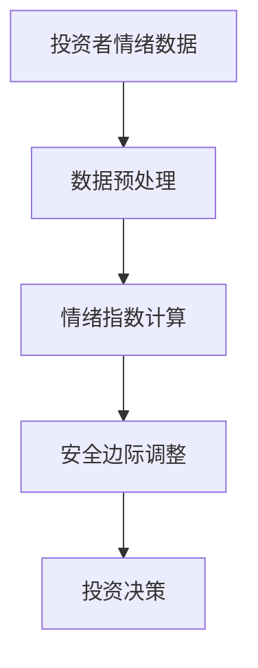

                 


# 格雷厄姆特价股票理论对行为金融学的补充

> 关键词：格雷厄姆，特价股票，行为金融学，价值投资，安全边际，心理偏差，投资策略

> 摘要：本文探讨了格雷厄姆特价股票理论在行为金融学中的应用，分析了心理偏差对投资决策的影响，并提出了一种结合行为因素优化投资策略的方法。

---

## 第一章：引言

### 1.1 背景介绍

格雷厄姆的价值投资理论强调安全边际和内在价值，而行为金融学研究投资者心理偏差对市场的影响。本文将探讨两者的结合，以优化投资策略。

### 1.2 核心概念

- **安全边际**：指股票的市场价格低于其内在价值，提供保护空间。
- **行为偏差**：投资者的非理性决策影响市场定价。

### 1.3 研究意义

通过结合两者的理论，提升投资决策的科学性和实际效果。

---

## 第二章：格雷厄姆特价股票理论的核心原理

### 2.1 安全边际的定义与计算

#### 2.1.1 计算公式
$$ 安全边际 = 内在价值 - 市场价格 $$

#### 2.1.2 计算步骤
1. 计算内在价值。
2. 比较市场价格与内在价值。

### 2.2 价值评估方法

#### 2.2.1 现金流折现法
$$ 内在价值 = \sum_{t=1}^{n} \frac{CF_t}{(1 + r)^t} $$

#### 2.2.2 市盈率与市净率分析
$$ 市盈率 = \frac{股价}{每股收益} $$
$$ 市净率 = \frac{股价}{每股净资产} $$

---

## 第三章：行为金融学中的投资者心理偏差

### 3.1 心理偏差对投资决策的影响

#### 3.1.1 过度自信偏差
投资者过度自信导致错误决策。

#### 3.1.2 从众心理偏差
跟随市场趋势而非独立判断。

#### 3.1.3 损失厌恶偏差
对损失的厌恶影响投资决策。

### 3.2 行为偏差与市场定价效率

#### 3.2.1 市场的有效性
市场定价受心理偏差影响，可能偏离实际价值。

#### 3.2.2 投资者情绪与市场波动
情绪波动引发市场波动。

---

## 第四章：格雷厄姆理论与行为金融学的结合

### 4.1 行为因素对特价股票投资的影响

#### 4.1.1 心理偏差对安全边际的影响
投资者情绪影响安全边际的计算。

#### 4.1.2 市场情绪对价值评估的干扰
情绪波动影响价值评估的准确性。

### 4.2 行为金融学视角下的投资策略优化

#### 4.2.1 结合心理偏差的投资机会识别
识别市场情绪中的低估机会。

#### 4.2.2 调整安全边际的心理因素
考虑心理因素调整安全边际。

---

## 第五章：数学模型与算法实现

### 5.1 安全边际的数学模型

#### 5.1.1 计算步骤
1. 计算内在价值。
2. 比较市场价格与内在价值。

#### 5.1.2 代码实现
```python
def calculate_margin_of_safety(intrinsic_value, market_price):
    return intrinsic_value - market_price
```

### 5.2 投资者情绪指数模型

#### 5.2.1 情绪指数计算
$$ 情绪指数 = \frac{\text{成交量}}{\text{市场资本额}} $$

---

## 第六章：系统架构与实现

### 6.1 系统功能设计

#### 6.1.1 模块划分
- 数据采集模块
- 情绪分析模块
- 安全边际计算模块

### 6.2 系统架构设计



---

## 第七章：总结与展望

### 7.1 最佳实践

- 定期评估安全边际。
- 监测市场情绪变化。

### 7.2 注意事项

- 考虑市场环境变化。
- 结合多种指标进行分析。

### 7.3 拓展阅读

推荐阅读格雷厄姆的《证券分析》和行为金融学相关书籍。

---

作者：AI天才研究院/AI Genius Institute & 禅与计算机程序设计艺术/Zen And The Art of Computer Programming

