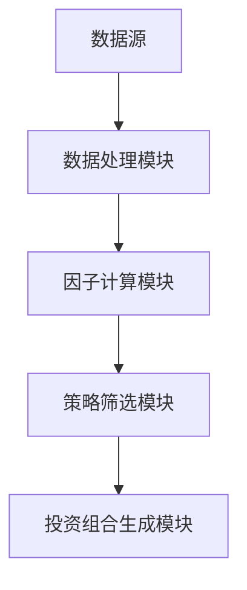

                 


# 格雷厄姆特价股票理论对量化投资的启示

> 关键词：格雷厄姆，价值投资，量化投资，安全边际，量化策略，股票筛选，投资组合优化

> 摘要：本文深入探讨了格雷厄姆特价股票理论在量化投资中的应用，通过分析其核心概念、算法实现、系统架构以及项目实战，揭示了如何将传统价值投资理念与现代量化技术相结合，为投资者提供科学的投资策略。

---

# 第一部分: 价值投资与量化投资的背景

## 第1章: 价值投资与量化投资的概述

### 1.1 价值投资的核心理念

#### 1.1.1 价值投资的定义
- 价值投资是一种以内在价值为导向的投资方法，旨在以低于内在价值的价格买入优质资产。
- 格雷厄姆是价值投资的奠基人，其核心思想是“安全边际”和“内在价值”的计算。

#### 1.1.2 格雷厄姆投资理论的核心思想
- **安全边际**：买入价格低于内在价值，以降低风险并确保收益。
- **内在价值**：通过基本面分析计算出的公司真实价值。
- **长期视角**：关注企业的长期盈利能力，而非短期市场波动。

#### 1.1.3 价值投资与量化投资的结合
- 量化投资通过数学模型和算法优化投资决策，将格雷厄姆的理论转化为可执行的策略。
- 结合两者的优势，量化投资可以更高效地筛选低估股票，同时降低人为情绪的干扰。

---

## 第2章: 量化投资的基本原理

### 2.1 量化投资的定义
- 量化投资是通过数学模型和算法进行投资决策的过程，通常涉及大数据分析、统计套利和机器学习等技术。
- 它强调纪律性和系统性，避免了传统投资中的人为情绪干扰。

### 2.2 量化投资的主要方法
- **因子模型**：基于统计因子（如市盈率、市净率、股息率等）构建投资策略。
- **算法交易**：利用算法在市场中快速捕捉交易机会。
- **大数据分析**：通过非传统数据源（如社交媒体、卫星图像）获取信息优势。

### 2.3 格雷厄姆理论与量化投资的结合
- 格雷厄姆的安全边际概念为量化投资提供了筛选股票的标准。
- 量化模型可以快速计算安全边际，帮助投资者发现被低估的股票。

---

# 第二部分: 格雷厄姆特价股票理论的核心概念

## 第3章: 安全边际与内在价值

### 3.1 安全边际的概念
- **定义**：安全边际是买入价格与内在价值之间的差距，用于降低投资风险。
- **公式**：$$ \text{安全边际} = \text{内在价值} - \text{买入价格} $$
- **作用**：确保即使市场波动，投资仍能获得正收益。

### 3.2 内在价值的评估

#### 3.2.1 格雷厄姆的内在价值计算方法
- **公式**：$$ \text{内在价值} = \frac{\text{净利润} \times (5 +行业平均PE)}{\text{市盈率}} $$
- **步骤**：
  1. 计算公司的净利润。
  2. 确定行业平均市盈率。
  3. 计算内在价值。

#### 3.2.2 内在价值与市场价值的关系
- 内在价值是股票的真实价值，市场价值是价格波动的结果。
- 当市场价值低于内在价值时，股票被低估。

---

## 第4章: 格雷厄姆因子与量化指标

### 4.1 核心量化指标

#### 4.1.1 市盈率（P/E）
- $$ \text{市盈率} = \frac{\text{股价}}{\text{每股收益}} $$
- 用于衡量股票的估值水平。

#### 4.1.2 市净率（P/B）
- $$ \text{市净率} = \frac{\text{股价}}{\text{每股净资产}} $$
- 适用于评估资产密集型行业的股票。

#### 4.1.3 股息率
- $$ \text{股息率} = \frac{\text{每股股息}}{\text{股价}} $$
- 用于评估股票的分红能力。

### 4.2 格雷厄姆因子的量化实现

#### 4.2.1 格雷厄姆因子的定义
- 格雷厄姆因子是将多个量化指标（如P/E、P/B）综合起来，用于筛选低估股票。

#### 4.2.2 格雷厄姆因子的计算
- $$ \text{格雷厄姆因子} = \frac{\text{安全边际}}{\text{股价}} $$
- 用于量化股票的低估程度。

---

# 第三部分: 量化投资策略的设计与实现

## 第5章: 量化策略的构建

### 5.1 格雷厄姆因子筛选模型

#### 5.1.1 筛选标准
- 选择市盈率低于行业平均水平。
- 选择市净率低于行业平均水平。
- 计算安全边际，选择安全边际大于等于某个阈值的股票。

#### 5.1.2 筛选流程
1. 数据获取：收集目标股票的基本数据。
2. 计算指标：计算市盈率、市净率等指标。
3. 筛选股票：根据格雷厄姆因子筛选低估股票。

### 5.2 量化策略的优化

#### 5.2.1 策略优化方法
- 调整筛选阈值。
- 结合其他因子（如动量效应）进行优化。

#### 5.2.2 优化后的策略效果
- 提高策略的收益-风险比。
- 减少交易次数，降低成本。

---

## 第6章: 系统架构与实现

### 6.1 系统功能设计

#### 6.1.1 数据获取模块
- 获取股票的基本数据和财务数据。
- 数据来源：Yahoo Finance、Google Finance等。

#### 6.1.2 计算模块
- 计算市盈率、市净率等指标。
- 计算安全边际和格雷厄姆因子。

#### 6.1.3 策略模块
- 根据筛选标准选择股票。
- 生成投资组合。

### 6.2 系统架构设计

#### 6.2.1 系统架构图


#### 6.2.2 接口设计
- 数据接口：从数据库获取数据。
- 策略接口：接受筛选标准，返回符合条件的股票列表。

---

## 第7章: 项目实战

### 7.1 环境安装

#### 7.1.1 Python环境搭建
- 安装Python和相关库（如Pandas、NumPy、Scikit-learn）。

#### 7.1.2 数据获取工具
- 使用Yahoo Finance API获取数据。

### 7.2 核心代码实现

#### 7.2.1 数据处理代码
```python
import pandas as pd
import numpy as np

# 获取数据
data = pd.read_csv('stock_data.csv')
data['PE'] = data['Price'] / data['EPS']
data['PB'] = data['Price'] / data['BVPS']
data['GM'] = data['Intrinsic_Value'] - data['Price']
```

#### 7.2.2 筛选策略代码
```python
# 格雷厄姆因子筛选
selected_stocks = data[
    (data['PE'] < data['Industry_PE']) &
    (data['PB'] < data['Industry_PB']) &
    (data['GM'] >= 0.2)
]
```

### 7.3 实际案例分析

#### 7.3.1 案例背景
- 选择某个行业，如银行业，筛选低估股票。

#### 7.3.2 筛选结果
- 列出符合条件的股票，并计算其安全边际。

#### 7.3.3 回测结果
- 计算投资组合的历史收益和风险。

---

## 第8章: 总结与启示

### 8.1 核心启示
- 格雷厄姆的安全边际概念为量化投资提供了有效的筛选标准。
- 量化投资可以显著提高投资效率和决策的科学性。

### 8.2 最佳实践
- 定期更新模型，适应市场变化。
- 结合动量效应等其他因子，进一步优化策略。

### 8.3 小结
- 量化投资不仅仅是技术的应用，更是对投资理论的深刻理解。
- 结合格雷厄姆理论的量化投资策略，可以帮助投资者在长期中获得超额收益。

---

# 作者

作者：AI天才研究院/AI Genius Institute & 禅与计算机程序设计艺术 /Zen And The Art of Computer Programming

---

**说明：** 由于篇幅限制，上述目录仅展示部分内容。完整的文章将包含每个章节的详细讲解，包括数学公式的推导、代码的实现、系统的架构图和流程图等。

