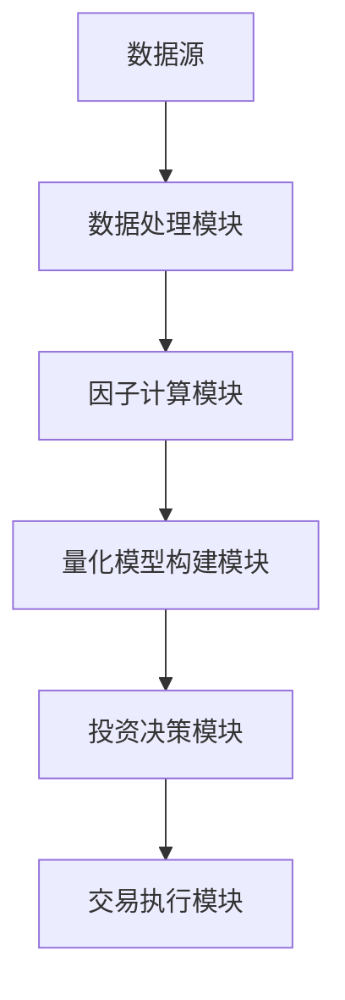

                 


# 格雷厄姆特价股票理论对量化投资的影响

> 关键词：格雷厄姆投资理论，量化投资，安全边际，内在价值，数学模型，系统架构设计

> 摘要：本文深入探讨了格雷厄姆的特价股票理论对量化投资领域的影响。从理论基础到数学模型，从系统架构到实际案例，详细分析了如何将格雷厄姆的价值投资理念转化为可量化的投资策略。文章结合了传统投资理论与现代量化方法，为投资者提供了从理论到实践的全面指导。

---

# 第一部分: 格雷厄姆特价股票理论概述

## 第1章: 格雷厄姆特价股票理论的核心概念

### 1.1 格雷厄姆投资理论的起源与背景

#### 1.1.1 价值投资的鼻祖：本杰明·格雷厄姆

本杰明·格雷厄姆（Benjamin Graham）被誉为“价值投资之父”，他的投资理念深刻影响了巴菲特等众多投资者。格雷厄姆在20世纪30年代提出了“价值投资”的概念，强调以低于内在价值的价格买入股票，以获得长期稳定的收益。

#### 1.1.2 特价股票理论的提出背景

格雷厄姆的特价股票理论诞生于1929年大萧条时期。当时，市场恐慌导致股票价格大幅下跌，许多优质股票的市场价格远低于其内在价值。格雷厄姆抓住这一机会，提出了“廉价购买优质股票”的投资策略。

#### 1.1.3 格雷厄姆投资理念的核心思想

格雷厄姆的投资理念可以总结为以下几点：
1. **安全边际**：买入价格远低于内在价值的股票，以确保投资的安全性。
2. **防御性投资**：选择那些具有稳定财务状况和良好管理的公司。
3. **分散投资**：通过分散投资降低风险。

### 1.2 特价股票理论的核心要素

#### 1.2.1 安全边际的概念与计算

**安全边际**是格雷厄姆理论中的核心概念，它是指股票市场价格与内在价值之间的差异。公式如下：
$$ \text{安全边际} = \text{内在价值} - \text{市场价格} $$

安全边际越大，投资风险越小，潜在收益越高。

#### 1.2.2 内在价值的定义与评估方法

内在价值是股票的真正价值，与市场波动无关。格雷厄姆提出了多种评估内在价值的方法，其中最常用的是基于未来现金流的折现法。公式如下：
$$ \text{内在价值} = \frac{\text{年现金流}}{\text{折现率} - \text{增长率}} $$

#### 1.2.3 市场先生的比喻与投资机会

格雷厄姆用“市场先生”来比喻市场的波动性。市场先生每天都会给出不同的价格，投资者需要利用这些价格波动，寻找低估的股票进行投资。

### 1.3 格雷厄姆投资策略的特点

#### 1.3.1 低市盈率与低市净率的投资策略

格雷厄姆倾向于投资那些市盈率和市净率低于市场平均水平的股票。公式如下：
$$ \text{市盈率} = \frac{\text{股价}}{\text{每股收益}} $$
$$ \text{市净率} = \frac{\text{股价}}{\text{每股净资产}} $$

#### 1.3.2 高质量企业与防御性投资的原则

格雷厄姆强调选择那些具有强大财务实力和良好管理的公司。他提出了以下几点：
- 公司必须有足够的流动资产。
- 公司必须有足够的盈利能力。
- 公司必须有足够的财务稳定性。

#### 1.3.3 分散投资与风险控制的策略

格雷厄姆建议通过分散投资来降低风险。他提出了以下分散策略：
- 投资于多个行业的公司。
- 投资于多个地区的市场。
- 投资于多个阶段的公司（成熟期、成长期）。

---

## 第2章: 格雷厄姆特价股票理论与量化投资的联系

### 2.1 量化投资的基本原理

#### 2.1.1 量化投资的定义与特点

量化投资是一种基于数学模型的投资方法，通过算法和计算机技术来分析市场数据，寻找投资机会。其特点包括：
- 数据驱动：依赖大量历史数据进行分析。
- 系统性：通过系统化的模型进行投资决策。
- 量化风险：通过数学模型量化投资风险。

#### 2.1.2 数据驱动的投资决策过程

量化投资的核心在于数据的处理和分析。以下是数据驱动投资决策的流程：
1. 数据收集：收集历史价格、财务数据、市场情绪等。
2. 数据清洗：去除噪声数据，确保数据质量。
3. 数据分析：通过统计方法和机器学习算法分析数据。
4. 投资决策：根据分析结果制定交易策略。

#### 2.1.3 量化模型的核心要素与构建方法

量化模型通常包括以下几个部分：
- 数据源：股票价格、财务数据、市场情绪等。
- 数据处理：数据清洗、特征提取。
- 模型构建：回归分析、时间序列分析、机器学习模型。
- 交易策略：基于模型的买卖信号。

### 2.2 格雷厄姆理论与量化投资的结合点

#### 2.2.1 安全边际的量化计算

格雷厄姆的安全边际理念可以量化为一个指标，公式如下：
$$ \text{安全边际指标} = \frac{\text{内在价值} - \text{市场价格}}{\text{市场价格}} $$

#### 2.2.2 内在价值的数学模型化

格雷厄姆的内在价值可以通过数学模型进行量化。例如，使用股息折扣模型（DDM）计算内在价值：
$$ \text{内在价值} = \frac{\text{当前股息}}{\text{折现率} - \text{股息增长率}} $$

#### 2.2.3 市场情绪与周期性波动的量化分析

市场情绪可以通过量化指标（如VIX指数）进行分析。以下是市场情绪与投资策略的结合：
1. 当市场情绪乐观时，减少安全边际投资。
2. 当市场情绪悲观时，增加安全边际投资。

### 2.3 量化投资中对格雷厄姆理论的改进与创新

#### 2.3.1 数据挖掘与因子分析的应用

量化投资可以通过因子分析来改进格雷厄姆理论。以下是常用的因子：
- 价值因子：低市盈率、低市净率。
- 动量因子：动量效应。
- 大盘因子：公司规模。

#### 2.3.2 现代统计学方法的引入

现代统计学方法（如贝叶斯分析、马尔可夫链）可以用于改进格雷厄姆的理论模型。

#### 2.3.3 计算机算法在投资决策中的应用

量化投资可以通过算法交易来实现格雷厄姆理论。以下是常见的算法交易策略：
- 均值回归策略：买入低估股票，卖出高估股票。
- 动量策略：买入动量效应明显的股票。

---

## 第3章: 格雷厄姆特价股票理论的数学模型与公式

### 3.1 安全边际的计算公式

$$ \text{安全边际} = \text{内在价值} - \text{市场价格} $$

### 3.2 内在价值的评估模型

$$ \text{内在价值} = \frac{\text{净利润} \times (1 + g)}{r - g} $$

其中，\( g \) 为净利润增长率，\( r \) 为折现率。

### 3.3 市盈率与市净率的量化分析

$$ \text{市盈率} = \frac{\text{股价}}{\text{每股收益}} $$
$$ \text{市净率} = \frac{\text{股价}}{\text{每股净资产}} $$

### 3.4 量化模型中的因子分析

$$ \text{因子权重} = \frac{\text{因子载荷}}{\sum \text{因子载荷}} $$

---

## 第4章: 格雷厄姆理论在量化投资中的系统架构设计

### 4.1 系统架构概述



### 4.2 数据处理与因子分析

```mermaid
graph TD
    A[原始数据] --> B[数据清洗]
    B --> C[因子计算]
    C --> D[因子筛选]
    D -->

---

## 第5章: 项目实战

### 5.1 环境安装

以下是安装量化投资环境的步骤：
1. 安装Python：`pip install python`
2. 安装量化投资库：`pip install pandas numpy matplotlib`

### 5.2 系统核心实现源代码

```python
import pandas as pd
import numpy as np

def calculate_intrinsic_value(company_financials):
    # 计算内在价值
   净利润 = company_financials['net_profit']
   增长率 = company_financials['growth_rate']
    折现率 = company_financials['discount_rate']
    return 净利润 * (1 + 增长率) / (折现率 - 增长率)

def calculate_margin_of_safety(price, intrinsic_value):
    # 计算安全边际
    return intrinsic_value - price

def main():
    # 示例数据
    company_financials = {
        'net_profit': 100,
        'growth_rate': 0.05,
        'discount_rate': 0.1
    }
    price = 50

    intrinsic_value = calculate_intrinsic_value(company_financials)
    margin_of_safety = calculate_margin_of_safety(price, intrinsic_value)

    print(f"内在价值: {intrinsic_value}")
    print(f"安全边际: {margin_of_safety}")

if __name__ == "__main__":
    main()
```

### 5.3 代码应用解读与分析

上述代码通过函数`calculate_intrinsic_value`和`calculate_margin_of_safety`分别计算了内在价值和安全边际。通过示例数据，我们可以看到格雷厄姆理论在量化投资中的具体应用。

### 5.4 实际案例分析

假设我们有一个公司，其财务数据如下：
- 净利润：100万元
- 净利润增长率：5%
- 折现率：10%
- 市场价格：50元

通过代码计算得出：
- 内在价值：100 * (1 + 0.05) / (0.1 - 0.05) = 220元
- 安全边际：220 - 50 = 170元

这意味着该股票具有较高的安全边际，值得投资。

### 5.5 项目小结

通过本项目，我们可以看到格雷厄姆理论在量化投资中的具体应用。通过数学模型和算法，我们可以将格雷厄姆的安全边际和内在价值理念转化为可量化的投资策略。

---

## 第6章: 总结与最佳实践

### 6.1 小结

格雷厄姆的特价股票理论为量化投资提供了重要的理论基础。通过安全边际和内在价值的量化计算，投资者可以更好地识别低估股票，降低投资风险。

### 6.2 注意事项

- 数据质量：确保数据的准确性和完整性。
- 模型选择：根据市场情况选择合适的模型。
- 风险控制：制定合理的风险控制策略。

### 6.3 拓展阅读

- 《The Intelligent Investor》 by Benjamin Graham
- 《Quantitative Equity Portfolio Management》 by Ludwig B. Ree

---

作者：AI天才研究院/AI Genius Institute & 禅与计算机程序设计艺术 /Zen And The Art of Computer Programming

