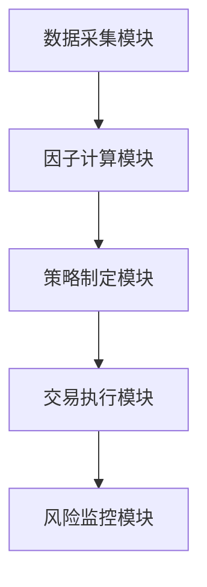

                 


# 格雷厄姆特价股票理论对量化投资策略的影响

> 关键词：量化投资，格雷厄姆，价值投资，安全边际，内在价值，多因子模型，算法交易

> 摘要：本文探讨了格雷厄姆的特价股票理论如何影响现代量化投资策略。通过分析价值投资的核心理念、量化投资的数学基础，以及两者结合的系统设计，本文详细阐述了如何将格雷厄姆的理论转化为可执行的量化策略，并通过实际案例展示了其在投资实践中的应用与优化。

---

## 第1章: 价值投资的起源与发展

### 1.1 价值投资的起源

价值投资是一种以基本面分析为核心的股票投资策略，其核心思想是寻找市场中被低估的股票进行投资。这种策略起源于20世纪初，由 Benjamin Graham 和 David Dodd 等人提出。

#### 1.1.1 格雷厄姆的学术背景与思想体系

Benjamin Graham 是价值投资的鼻祖，他的思想体系奠定了现代价值投资的基础。他强调股票的价值应基于其内在价值，而非市场情绪或短期波动。他的著作《The Intelligent Investor》是投资领域的经典之作。

#### 1.1.2 格雷厄姆的"特价股票"理论

格雷厄姆提出，"特价股票"是指市场价格显著低于其内在价值的股票。这种股票通常被市场忽视或低估，但具有长期增值的潜力。他提出了安全边际的概念，即市场价格与内在价值之间的差距，以降低投资风险。

### 1.2 格雷厄姆价值投资的核心理念

格雷厄姆的价值投资理论强调以下几点：

1. **内在价值**：股票的内在价值是其未来现金流的现值，可以通过基本面分析计算得出。
2. **安全边际**：购买价格应低于内在价值，以确保投资的安全性。
3. **长期视角**：价值投资是一种长期策略，市场短期波动不应影响投资决策。

---

## 第2章: 量化投资的定义与特点

### 2.1 量化投资的定义

量化投资是一种基于数学模型和算法的投资策略，通过分析大量数据来寻找投资机会。量化投资的核心在于系统化和自动化，避免人为情绪的干扰。

### 2.2 量化投资的特点

1. **数据驱动**：量化投资依赖于大量历史数据，利用统计学和机器学习等技术进行分析。
2. **系统化交易**：通过算法自动执行交易策略，减少人为错误。
3. **高频交易**：量化投资常采用高频交易策略，利用短暂的价格波动获利。

---

## 第3章: 格雷厄姆理论的量化分析

### 3.1 格雷厄姆理论的数学模型

为了将格雷厄姆的理论转化为量化策略，我们需要将其核心概念转化为数学公式。

#### 内在价值的计算

股票的内在价值（V）可以通过以下公式计算：

$$
V = \sum_{t=1}^{n} \frac{CF_t}{(1 + r)^t}
$$

其中，$CF_t$ 是第 $t$ 年的现金流，$r$ 是折现率。

#### 安全边际的计算

安全边际（Margin of Safety）是指市场价格与内在价值之间的差值：

$$
\text{安全边际} = V - P
$$

其中，$P$ 是市场价格。

### 3.2 多因子模型的构建

为了将格雷厄姆的多因子模型应用于量化投资，我们需要构建一个包含多个因子的投资组合。常用的因子包括：

1. 低市盈率（P/E）。
2. 低市净率（P/B）。
3. 高股息率。

#### 多因子模型的优化

我们可以使用优化算法（如均值-方差优化）来构建最优投资组合。目标是最小化投资组合的风险，同时最大化预期收益。

---

## 第4章: 量化策略实现

### 4.1 数据获取与预处理

在量化投资中，数据是核心。我们需要获取股票的历史价格、财务数据等，并进行清洗和预处理。

#### 数据清洗

数据清洗步骤如下：

1. 去除缺失值。
2. 处理异常值。
3. 标准化数据。

### 4.2 因子计算与筛选

根据格雷厄姆的理论，我们需要计算多个因子，并筛选出符合条件的股票。

#### 因子计算

以市盈率（P/E）为例，计算公式为：

$$
\text{P/E} = \frac{\text{股价}}{\text{每股收益}}
$$

#### 股票筛选

筛选条件：

1. P/E < 市场平均P/E。
2. P/B < 市场平均P/B。
3. 股息率 > 市场平均股息率。

### 4.3 策略回测

通过回测可以验证策略的有效性。我们可以使用回测平台（如Python中的Backtrader）进行模拟交易。

#### 回测指标

常用的回测指标包括：

1. 净值增长率（Return）。
2. 最大回撤（Max Drawdown）。
3. Sharpe比率。

---

## 第5章: 系统设计与实现

### 5.1 系统架构设计

量化投资系统通常包括以下几个模块：

1. 数据采集模块。
2. 因子计算模块。
3. 策略制定模块。
4. 交易执行模块。
5. 风险监控模块。

#### 系统架构图



### 5.2 系统实现

#### 数据采集模块

使用Python的pandas库获取股票数据。

```python
import pandas as pd
import yfinance as yf

data = yf.download(tickers='AAPL', start='2020-01-01', end='2023-01-01')
```

#### 因子计算模块

计算市盈率和市净率。

```python
data['PE'] = data['Close'] / data['EPS']
data['PB'] = data['Close'] / data['BVPS']
```

#### 策略制定模块

根据筛选条件选择股票。

```python
selected_stocks = data[data['PE'] < data['PE'].mean() & data['PB'] < data['PB'].mean()]
```

#### 交易执行模块

使用交易API执行交易指令。

```python
import ibapi

def execute_trade(symbol, quantity):
    ibapi.place_order(symbol, quantity)
```

---

## 第6章: 实战分析与优化

### 6.1 实战案例分析

通过具体案例分析，验证策略的有效性。

#### 案例分析

假设我们选择苹果公司（AAPL）作为投资标的，计算其内在价值和市场价格。

```python
CF = [10, 12, 15, 20]  # 未来四年的现金流
r = 0.08  # 折现率
V = sum(CF_t / (1 + r)**t for t, CF_t in enumerate(CF, 1))
```

### 6.2 策略优化

根据回测结果，优化策略参数。

#### 参数优化

调整筛选条件，提高策略的收益与风险比。

```python
selected_stocks = data[data['PE'] < data['PE'].quantile(0.2) & data['PB'] < data['PB'].quantile(0.2)]
```

---

## 第7章: 总结与展望

### 7.1 总结

本文探讨了格雷厄姆的特价股票理论如何影响量化投资策略。通过系统化的分析和实战案例，我们验证了格雷厄姆理论在量化投资中的有效性。

### 7.2 展望

未来，随着人工智能和大数据技术的发展，量化投资将更加精准和高效。结合格雷厄姆理论的多因子模型，量化投资将具有更广阔的应用前景。

---

## 参考文献

1. Graham, Benjamin. *The Intelligent Investor*.
2. Fama, Eugene. *Portfolio Theory and Investment Management*.
3. Sharpe, William. *The Sharpe Ratio*.

---

## 作者信息

作者：AI天才研究院 & 禅与计算机程序设计艺术

本文由AI天才研究院与禅与计算机程序设计艺术联合撰写，转载请注明出处。

---

