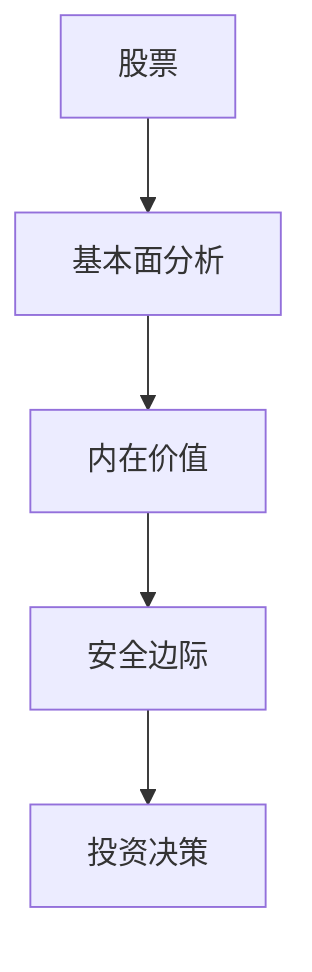
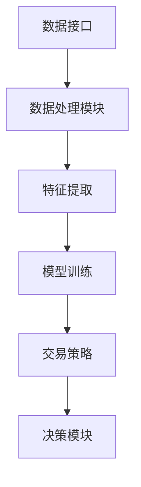

                 


# 格雷厄姆特价股票理论对金融科技的启示

> 关键词：格雷厄姆投资理论，金融科技，量化投资，大数据分析，人工智能，股票定价模型

> 摘要：本文深入探讨了格雷厄姆的价值投资理论如何为金融科技领域提供启示，特别是在量化投资、大数据分析和人工智能的应用中。通过结合传统投资理论与现代技术手段，本文提出了一种基于格雷厄姆理论的量化投资策略，利用数学模型和算法优化投资组合，降低风险并提高收益。文章还通过实际案例分析了这种策略的有效性，并展望了未来金融科技在投资领域的潜在应用。

---

## 第一部分: 格雷厄姆特价股票理论基础

### 第1章: 格雷厄姆投资理论的核心概念

#### 1.1 价值投资的基本原理
- **价值投资**：寻找市场低估的股票，以低于其内在价值的价格买入并长期持有。
- **安全边际**：买入价格与内在价值的差异，确保投资的安全性。
- **内在价值**：通过基本面分析得出的股票真实价值，与市场情绪无关。



#### 1.2 格雷厄姆投资策略的核心要素
- **低市盈率和低市净率**：寻找市场价格低于内在价值的股票。
- **高股息率**：关注高分红的公司，作为价值发现的指标。
- **分散投资**：避免过度集中，降低风险。

#### 1.3 格雷厄姆投资理论的数学模型
股票内在价值的计算公式：
$$ V = \frac{E}{k} $$
其中，$E$ 是企业的盈利能力，$k$ 是折现率。

### 第2章: 格雷厄姆投资理论的现代应用

#### 2.1 格雷厄姆理论与现代金融学的结合
- **CAPM模型**：资本资产定价模型将风险因素纳入定价体系。
$$ E(r_i) = r_f + \beta_i (E(r_m) - r_f) $$
- **现代投资组合理论**：通过分散投资降低风险，提高收益。

#### 2.2 数据驱动的格雷厄姆投资策略
- **大数据分析**：利用海量数据筛选潜在的低估股票。
- **机器学习**：通过算法优化股票筛选标准。

---

## 第二部分: 金融科技的理论基础

### 第3章: 金融科技的核心技术

#### 3.1 大数据在金融领域的应用
- **数据挖掘**：从历史数据中发现投资模式。
- **分布式计算**：处理海量金融数据。
- **数据可视化**：辅助投资决策。

#### 3.2 人工智能在金融中的应用
- **机器学习**：预测股票价格和市场趋势。
- **自然语言处理**：分析财经新闻和社交媒体情绪。

### 第4章: 量化投资的基本原理

#### 4.1 量化投资的定义与特点
- **量化投资**：基于数学模型的投资策略。
- **系统性**：通过算法自动执行交易。
- **数据驱动**：依赖大量历史数据进行预测。

#### 4.2 量化投资的数学模型
- **时间序列分析模型**：预测股票价格的变化趋势。
- **风险中性定价模型**：评估资产的公允价值。

---

## 第三部分: 格雷厄姆理论与金融科技的结合

### 第5章: 格雷厄姆理论在金融科技中的应用

#### 5.1 基于大数据的股票筛选
- **数据源**：收集历史价格、财务数据、新闻等。
- **特征提取**：筛选低市盈率、低市净率的股票。
- **机器学习算法**：训练模型识别潜在的价值股。

#### 5.2 基于人工智能的量化策略
- **算法流程**：
  1. 数据清洗与预处理。
  2. 特征工程：提取与价值投资相关的特征。
  3. 模型训练：使用回归或分类算法预测股票价值。
  4. 交易策略：基于模型输出制定买卖决策。

---

## 第四部分: 系统架构与技术实现

### 第6章: 系统架构设计

#### 6.1 量化投资系统的组成
- **数据接口**：连接金融数据源。
- **算法引擎**：执行交易策略。
- **决策模块**：基于模型输出做出决策。



#### 6.2 系统交互流程
- **数据获取**：从金融数据库获取实时数据。
- **特征计算**：计算市盈率、市净率等指标。
- **模型预测**：预测股票价值。
- **交易执行**：根据预测结果执行买卖操作。

---

## 第五部分: 项目实战

### 第7章: 基于格雷厄姆理论的量化投资系统实现

#### 7.1 环境搭建
- **工具**：Python、Pandas、NumPy、Scikit-learn。
- **数据源**：获取历史股票数据。

#### 7.2 核心代码实现
```python
import pandas as pd
import numpy as np
from sklearn.linear_model import LinearRegression

# 数据预处理
data = pd.read_csv('stock_data.csv')
data['price_ratio'] = data['price'] / data['book_value']

# 特征提取
X = data[['pe', 'pb', 'dividend']]
y = data['price']

# 模型训练
model = LinearRegression()
model.fit(X, y)

# 预测股票价值
new_data = pd.DataFrame({
    'pe': [10],
    'pb': [2],
    'dividend': [0.5]
})
predicted_value = model.predict(new_data)
print(predicted_value)
```

#### 7.3 实际案例分析
- **案例背景**：某股票历史数据。
- **数据分析**：计算市盈率、市净率。
- **模型预测**：预测股票价值。
- **交易决策**：基于预测结果制定买卖策略。

---

## 第六部分: 总结与展望

### 第8章: 总结与展望

#### 8.1 核心观点总结
- 格雷厄姆的价值投资理论为金融科技提供了理论基础。
- 通过大数据和人工智能技术，可以实现量化投资策略的优化。
- 结合两者的投资策略能够有效降低风险并提高收益。

#### 8.2 未来展望
- 更多的金融数据类型（如文本数据）会被利用。
- 人工智能技术在投资决策中的应用将更加深入。
- 自动化交易系统将更加智能化和高效。

---

## 作者：AI天才研究院/AI Genius Institute & 禅与计算机程序设计艺术 /Zen And The Art of Computer Programming

